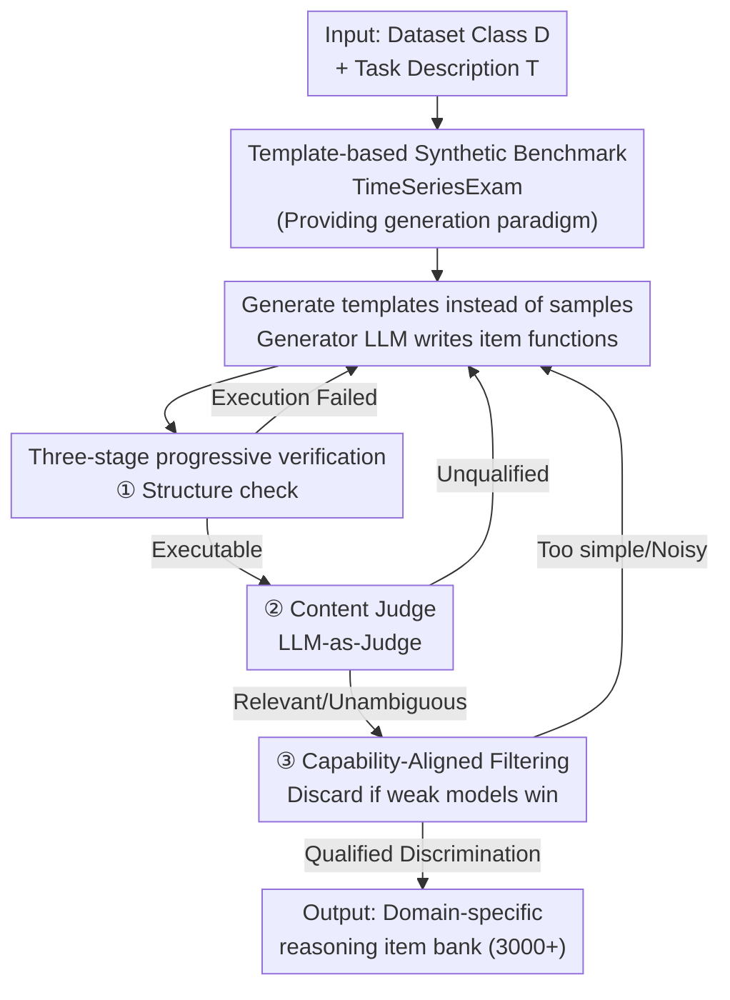

# TimeSeriesExamAgent: Creating Time Series Reasoning Benchmarks at Scale

**Conference**: ICLR 2026  
**OpenReview**: [https://openreview.net/forum?id=DewXWSvQPH](https://openreview.net/forum?id=DewXWSvQPH)  
**Code**: https://github.com/magwiazda/TimeSeriesExamAgent  
**Area**: Time Series / Benchmarking / LLM Reasoning / Agent  
**Keywords**: Time series reasoning, automated item generation, multi-agent, LLM-as-Judge, domain benchmark

## TL;DR
This paper proposes a "scalable benchmark creation" methodology: first, a domain-agnostic TimeSeriesExam multiple-choice benchmark is constructed using manual templates and synthetic time series. Then, the TimeSeriesExamAgent multi-agent framework extends this paradigm to any real-world dataset. By having a generator LLM write "item templates" (Python functions) and passing them through three-stage verification, the framework automatically generates domain-specific reasoning questions with diversity comparable to manual benchmarks. Experiments reveal that even the strongest VLMs achieve an average accuracy of only 51.5% on these tasks.

## Background & Motivation
**Background**: LLMs/VLMs have been widely applied to tasks such as time series forecasting, anomaly detection, and classification, achieving significant results. A fundamental question arises: do these models truly "understand" abstract concepts behind time series (trends, signal-to-noise, causality), or do they merely rely on domain shortcuts? To answer this, the community has proposed various time series reasoning benchmarks.

**Limitations of Prior Work**: Existing benchmarks are almost entirely **manually curated**, suffering from three major issues: (1) high construction cost and poor scalability; (2) coverage of narrow domains or single skills (e.g., ECG-QA focuses only on electrocardiograms, EngineMT-QA only on industrial scenarios); (3) creating benchmarks for new datasets requires domain experts to annotate question by question, which is time-prohibitive. Researchers seeking to comprehensively evaluate their models are left without adequate tools.

**Key Challenge**: While automated question generation (using LLMs to directly generate QA pairs) seems like a scalable solution, **quality and diversity cannot be guaranteed**. LLM-generated questions often require heavy manual revision, negating the benefits of automation. Furthermore, most existing agentic frameworks are not designed for time series and struggle to generate questions "conditioned on numerical data." A conflict exists between **scalability** and **high quality/domain relevance**.

**Goal**: This study decomposes the problem into two steps—first proving that "template-based generation" is viable on controlled synthetic data (domain-agnostic and controllable), then automatically extending this paradigm to real-world domain datasets with minimal expert input.

**Key Insight**: The authors observe that templates decouple "question structure" from "specific instances." With a small set of well-designed templates, diverse questions can be mass-produced by varying parameters and contexts. Thus, the difficult task of "expert item generation" is transformed into "LLM template generation followed by automated verification," minimizing human workload.

**Core Idea**: **Replace "direct sample generation + manual revision" with "template generation + three-stage verification."** Generator LLMs write item functions that can be sampled parametrically. These templates pass through structure checks, content judges, and capability-alignment filters to discard poor templates, enabling the large-scale creation of reliable time series reasoning questions for any dataset.

## Method

### Overall Architecture
The paper presents two progressive outputs. The first is **TimeSeriesExam**: a manually curated, configurable **synthetic** multiple-choice benchmark serving as a "proof of concept" to demonstrate that template-based generation in controlled environments can produce diverse, controllable items that distinguish model capabilities. The second is **TimeSeriesExamAgent**: a multi-agent framework that extends the template paradigm to **real-world domain datasets**. It utilizes a Generation Agent and a Verification Agent in a collaborative iteration: the generator writes item templates, the verifier performs three-stage checks, and rejected templates are refined with feedback or discarded.

The mechanism for TimeSeriesExam involves a **synthetic time series generator** that samples components from a base pattern pool (periodic/aperiodic/stochastic) and combines them using additive, multiplicative, or sequential operators to create series with known properties. Each question corresponds to a **template** (including the question, options, ICL examples, optional hints, and definitions). Every option is linked to a synthetic generator that "assumes the option is true," allowing for the mass production of "randomized but precisely answered" items. Item Response Theory (IRT) is then used to optimize question parameters to maximize the discriminative power between candidate models.

The TimeSeriesExamAgent follows a "generation → verification → feedback/refinement" pipeline as follows:

### Key Designs

**1. Template-based Synthetic Benchmark TimeSeriesExam: Hardcoding Correctness into the Generation Process**

The biggest risk in letting LLMs generate time series reasoning questions is "inconsistency between question and answer"—the generated curve might not possess the attributes claimed. This work addresses this via a **synthetic time series composition model**: patterns are categorized into aperiodic (linear, exponential), periodic (sine, sawtooth, square), and stochastic (AR, MA). These are assembled using three operators: addition (trend + seasonality), multiplication (trend-amplified seasonality), and sequential concatenation (simulating regime shifts).

The key innovation is **binding each option to a generator that "assumes the option is true"**: for example, if the question asks "Is this series stationary?", option (A) Yes is linked to a stationary random process generator, while (B) No is linked to a non-stationary one. This ensures the "correct answer" and the "generated data" are naturally consistent, allowing for the **scalable production of randomized but accurate items**. The benchmark covers five reasoning categories—pattern recognition, noise understanding, similarity comparison, anomaly detection, and causality (Granger causality)—with 100+ templates verified by experts. Parameters are further optimized via **IRT** to maximize model differentiation.

**2. Generating Templates instead of Samples: LLM Output as "Item Functions" for Scalability**

When extending to real datasets, let's say the Generator Agent produces templates rather than samples. Specifically, the generator LLM outputs a Python function `question(num_samples) -> List[QAPair]`. This function defines question/option formats and encapsulates the logic for "which records to pull and how to calculate the answer" (via interfaces like `getDataframe()` or `query(id)` provided by a user-defined `Dataset Handler`).

The advantages are twofold: a single template can parametrically sample any number of instances (4–5 were sampled per template in experiments), amortizing the cost of generating one item into writing one piece of logic. Furthermore, the generator uses the **dataset structure + domain concepts** as conditions to produce diverse templates with broader coverage. Users only need to provide a dataset class $D$ with minimal loading code and a natural language task description $T$, minimizing expert effort.

**3. Three-stage Progressive Verification: Structure, Content, and Capability Filters**

Since LLM generation often produces errors or irrelevant outputs, the Verification Agent employs a **multi-level filtering** chain. If a template fails at any step, it is returned for regeneration with feedback. There is a maximum iteration limit to avoid cost overflows. The three stages are:

① **Structure check**: Verifies if the template executes successfully (syntax, output format), separating technical failures from content failures. ② **Content verification**: Uses an **LLM-as-a-judge** to assess template quality—checking for relevance, ambiguity, and whether the time series data is truly required to answer. To mitigate single-model bias, the authors use G-Eval and panel-based evaluation (aggregating multiple models). ③ **Capability-Aligned Filtering**: Candidate templates are sent to a pool of "student LLMs" with varying capabilities. Based on the **expertise reversal effect**, if **weak models achieve higher average accuracy than strong models**, the item is judged as flawed or noisy and discarded. If accuracy scales monotonically with model capability (or all models perform poorly), the template is retained.

### A Complete Example
Using the PTB-XL ECG dataset: the user provides the dataset class and a task description "generate questions for ECG reasoning." The Generator LLM produces a template function that asks, for example, "Which type of AV conduction abnormality exists in this record? (A)...(B)...(C)...(D)..." The function logic pulls matching ECG records and calculates the correct option based on labels. The template passes ① Structure check, then ② Content judge (is the waveform necessary? is it unambiguous?), and finally ③ Capability-Aligned Filtering (tested with GPT-4o, etc.). A qualified template costs approximately \$0.09 per API call and contributes multiple instances to a bank that spanned 3000+ items across five real-world datasets (PTB-XL 151, MIT-BIH 197, MIMIC-IV W 205, YFinance 209, WeatherBench2 95).

## Key Experimental Results

### Main Results: SOTA models collective failure on automated tasks
Testing six VLMs across five real datasets (MIT-BIH, PTB-XL, MIMIC-IV W, YFinance, WeatherBench2), where random guess baseline is 0.25:

| Model | MIT-BIH | PTB-XL | MIMIC-IV W | YFinance | WeatherBench2 | Avg |
|------|---------|--------|-----------|----------|---------------|------|
| random guess | 0.25 | 0.25 | 0.25 | 0.25 | 0.25 | 0.25 |
| gpt-4o | 0.416 | 0.424 | 0.385 | 0.586 | 0.389 | 0.440 |
| o3-mini | 0.442 | 0.477 | 0.356 | 0.555 | 0.379 | 0.442 |
| Qwen2.5-VL-Instruct | 0.411 | 0.490 | 0.439 | 0.572 | 0.368 | 0.456 |
| Gemma-3-27b-it | 0.497 | 0.517 | 0.370 | 0.534 | 0.232 | 0.430 |
| **GPT-5** | 0.533 | 0.450 | 0.424 | 0.617 | **0.547** | **0.515** |
| Gemini-2.5-Pro | 0.614 | 0.457 | 0.400 | 0.624 | 0.453 | 0.510 |

Even the strongest GPT-5 average only 51.5%, and all models averaged below 55%. GPT-5 performed well on weather data but significantly worse on medical data, suggesting that general reasoning **does not necessarily transfer across domains**, particularly when domain expertise and fine-grained signal interpretation are required. Notably, GPT-5 consistently outperformed GPT-4o, validating the benchmark's discriminative power.

### Diversity and Quality Evaluation
**Diversity** (Embed distance of 50 samples / Normalized Levenshtein distance):

| Benchmark | Embed Distance | Norm. Levenshtein |
|------|---------|-------------------|
| ECG-QA (Manual) | 0.207 ± 0.079 | 0.519 ± 0.157 |
| TimeSeriesExamAgent (Ours) | 0.301 ± 0.070 | 0.542 ± 0.039 |

**Quality** (G-Eval panel score 1–10):

| Domain | Benchmark | Specificity | Unambiguous | Relevant | Solvable |
|----|------|--------|--------|---------|--------|
| Finance | TimeSeriesExamAgent | 8.29 | 7.24 | 8.89 | 8.57 |
| Medical | ECG-QA | 5.60 | 5.77 | 8.17 | 8.47 |
| Medical | TimeSeriesExamAgent | 8.43 | 8.40 | 9.00 | 9.10 |

Automated questions achieve higher diversity and superior quality scores across all dimensions compared to the manual ECG-QA benchmark.

### Transfer Learning via Fine-Tuning
Fine-tuning Qwen2.5-VL-3B-Instruct with 2000 generated PTB-XL samples and testing on the MIMIC-IV QA test set (12,000 items, strict data isolation):

| Method | General | Parsable |
|------|---------|----------|
| Random Guess | 34.9% | 34.9% |
| Base (No FT) | 21.8% | 34.6% |
| Fine-tuned-confounded (Finance/Weather data) | 39.7% | 42.3% |
| Fine-tuned (ECG data) | 47.0% | 49.7% |

Using in-domain ECG items generated by Ours improved accuracy from 21.8% to 47.0%, significantly higher than the improvement from out-of-domain data, indicating that models **truly learned transferable reasoning skills** rather than just response formats.

### Key Findings
- Iterative refinement is efficient: Most accepted templates pass within 1–2 rounds; failed templates are discarded early to avoid feedback loops.
- Two primary failure modes: **Perception** (DPI resolution and modality choice affect performance) and **Compositional Reasoning** (models fail on multi-step reasoning rather than simple identification).
- Failure patterns are **systematic rather than random**, making them diagnosable and correctable.

## Highlights & Insights
- **"Option-binding" is the core trick for precision**: Encoding the correct answer into the data generation process ensures synthetic items are naturally consistent, avoiding the "QA mismatch" common in direct LLM generation.
- **Generating templates, not samples**: Abstracting the task into writing a parametric function amortizes costs and provides scalability while resisting technical errors.
- **Leveraging "Expertise Reversal":** Using the performance gap between weak and strong models to identify flawed templates is an elegant application of psychometrics as a quality filter.
- Applying IRT-based selection at the single template level ensures discriminative utility is baked into the pipeline.

## Limitations & Future Work
- TimeSeriesExam is limited to **domain-agnostic skills on synthetic data**; while the Agent version addresses this, a gap remains between synthetic and real data.
- Verification relies heavily on **LLM-as-a-judge**; despite mitigations, observer bias/preferences may still result in false positives or negatives.
- The "weak model outperforming strong model" heuristic might conflate truly difficult items with flawed ones, requiring more granular differentiation.
- The transfer experiments were limited in scope (single domain, small model); cross-domain and large-scale transferability require further evidence.

## Related Work & Insights
- **vs. ECG-QA / EngineMT-QA**: These are manual/template-curated single-domain sets with limited scalability; Ours automates this with higher diversity and quality.
- **vs. Time-MQA / Time-MMD**: These are large-scale but rely on direct LLM generation without rigorous verification; Ours incorporates quality control into the generation pipeline.
- **vs. General Agent Frameworks**: Generic frameworks lack the specialized handling required for time series numerical data; this work fills that gap.

## Rating
- Novelty: ⭐⭐⭐⭐ Combines template synthesis, function generation, and capability-aligned verification into a cohesive pipeline.
- Experimental Thoroughness: ⭐⭐⭐⭐ Covers 5 datasets and 6 models with diversity and transfer evidence, though transfer scale is modest.
- Writing Quality: ⭐⭐⭐⭐ Logical two-stage narrative with clear diagrams, though some details are relegated to appendices.
- Value: ⭐⭐⭐⭐ Provides a scalable tool for researchers to build reasoning benchmarks for their own datasets with low expert overhead.

<!-- RELATED:START -->

## Related Papers

- [\[ICLR 2026\] pyrregular: A Unified Framework for Irregular Time Series, with Classification Benchmarks](pyrregular_a_unified_framework_for_irregular_time_series_with_classification_ben.md)
- [\[ICLR 2026\] TimeOmni-1: Incentivizing Complex Reasoning with Time Series in Large Language Models](timeomni-1_incentivizing_complex_reasoning_with_time_series_in_large_language_mo.md)
- [\[ICLR 2026\] Reasoning on Time-Series for Financial Technical Analysis](reasoning_on_time-series_for_financial_technical_analysis.md)
- [\[ICLR 2026\] Time-Gated Multi-Scale Flow Matching for Time-Series Imputation](time-gated_multi-scale_flow_matching_for_time-series_imputation.md)
- [\[ICML 2026\] Adaptive Time Series Reasoning via Segment Selection](../../ICML2026/time_series/adaptive_time_series_reasoning_via_segment_selection.md)

<!-- RELATED:END -->
