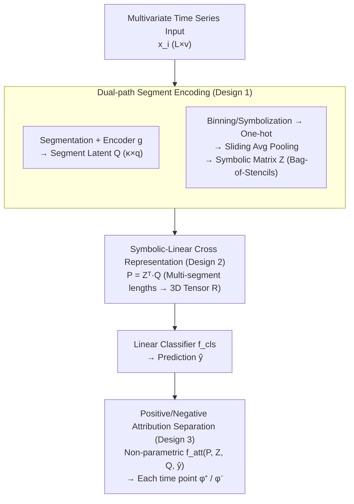

# TimeSliver: Symbolic-Linear Decomposition for Explainable Time Series Classification

**Conference**: ICLR 2026  
**arXiv**: [2601.21289](https://arxiv.org/abs/2601.21289)  
**Code**: [GitHub](https://github.com/pandeyakash23/TimeSliver)  
**Area**: Time Series / Explainability  
**Keywords**: Temporal Attribution, Symbolic Abstraction, Linear Combination, Explainable Classification, Positive/Negative Attribution

## TL;DR
The authors propose TimeSliver, an interpretability-driven deep learning framework that jointly utilizes raw time series data and symbolic abstractions (binning) to construct representations aligned with the original temporal structure. Each element linearly encodes the contribution of the corresponding time interval to the final prediction, enabling the derivation of positive/negative attribution scores for each time point. The method exceeds other approaches by 11% in temporal attribution accuracy across 7 datasets while matching SOTA prediction performance on 26 UEA benchmarks.

## Background & Motivation

**Background**: Deep learning models (CNN/LSTM/Transformer) demonstrate strong performance in time series classification but are inherently uninterpretable. In high-risk applications such as healthcare, finance, and law, understanding "why a decision was made" is as critical as the accuracy of the decision itself.

**Limitations of Prior Work**: (1) Post-hoc explanation methods (DeepLift, Integrated Gradients, SHAP) are sensitive to baseline states, assume feature independence, and often treat time points as isolated units, ignoring temporal dependencies and struggling with cross-dataset generalization. (2) Using Transformer attention weights as attribution is often unfaithful; recent studies suggest attention does not reliably reflect temporal importance. (3) Multiple Instance Learning (MIL) based attribution methods have not been effectively extended to multivariate time series and have limited comparative validation. (4) Most methods provide only a single scalar for importance, failing to distinguish whether a segment "pushed toward" or "pulled away from" the predicted class.

**Key Insight**: Rather than applying approximation tools over a black-box model, it is better to design an **intrinsically explainable** architecture. By employing linear combinations in the representation layer, the contribution of each time interval to the prediction can be calculated directly in closed-form, avoiding reliance on post-hoc methods and enabling the distinction between positive/negative attribution.

## Method

### Overall Architecture

TimeSliver integrates explainability into the architecture itself rather than approximating it post-hoc. Given a multivariate time series $\mathbf{x}_i \in \mathbb{R}^{L \times v}$, the sequence is segmented into chunks aligned with the original temporal positions. These are processed through two parallel paths: one uses an encoder $g(\cdot; \theta_q)$ to obtain **segment-level latent representations** $\bm{Q}$, preserving continuous numerical features; the other converts the sequence into **symbolic bins** followed by sliding window average pooling to generate a **symbolic combination matrix** $\bm{Z}$ (referred to as a Bag-of-Stencils). Subsequently, a **linear cross-product** $\bm{P} = \bm{Z}^{\top}\bm{Q}$ is performed to obtain a length-invariant representation aggregating global discriminative information, which is fed to a linear classifier $f_{cls}$ to produce prediction $\hat{y}$. Since the path from $\bm{P}$ to $\hat{y}$ is entirely linear, the contribution of each segment can be decomposed in closed-form. A non-parametric function $f_{att}(\bm{P}, \bm{Z}, \bm{Q}, \hat{y})$ then derives signed positive/negative attribution scores $\{\phi_k^{+}, \phi_k^{-}\}$ for every time point without post-hoc approximations.

### Key Designs

**1. Dual-path Segment Encoding: Complementarity of $\bm{Q}$ and $\bm{Z}$**

Relying solely on raw signals may treat high-frequency noise as signal, while relying solely on symbolic abstraction loses fine-grained numerical structures. TimeSliver assigns distinct roles to two paths, both aligned to the same temporal segments. Path 1 divides the sequence into segments of length $m$, yielding latent representations $\bm{Q} \in \mathbb{R}^{\kappa \times q}$ via encoder $g$, maintaining the mapping to specific time points. Path 2 independently bins each variable into $n$ symbols, performs one-hot encoding, and concatenates them to form $\bm{\mathcal{O}} \in \mathbb{R}^{L \times (n \cdot v)}$. Sliding average pooling then produces the symbolic combination matrix $\bm{Z} \in \mathbb{R}^{\kappa \times (n \cdot v)}$, where each row represents the normalized frequency of symbols within a segment. Binning acts as lossy compression to filter out irrelevant fluctuations and provide an inductive bias for structural patterns.

**2. Symbolic-Linear Cross Representation: Architecture-Guaranteed Interpretability via $\bm{P} = \bm{Z}^{\top}\bm{Q}$**

Post-hoc explanations are often unfaithful because deep models are highly non-linear, making gradients or perturbations only local approximations. TimeSliver performs a **matrix cross-product** instead of element-wise multiplication:

$$\bm{P}=\bm{Z}^{\top}\bm{Q}\in\mathbb{R}^{(n\cdot v)\times q},\qquad P_{ij}=\sum_{k}Z_{ki}\,Q_{kj}$$

Each $P_{ij}$ is a sum of latent features weighted by symbolic frequency—segments where symbols do not appear are suppressed, while frequent ones are amplified. This captures global interactions while keeping dimensions dependent only on $(n \cdot v) \times q$, independent of length $L$. Passing $\bm{P}$ to a linear classifier ensures that "segment contribution" is mathematically exact. This naturally avoids the baseline sensitivity issues of DeepLift/IntGrad and the feature independence assumptions of SHAP.

**3. Positive/Negative Attribution Separation: "Towards" vs. "Away from" Classes**

Most methods provide only a scalar importance score, failing to indicate whether a segment supports or opposes a decision. Since the $\bm{P} \to \hat{y}$ path is linear, TimeSliver uses a **non-parametric** function to extract signed contributions:

$$\{\phi_k^{+}, \phi_k^{-}\}_{k=1}^{L}=f_{att}(\bm{P},\bm{Z},\bm{Q},\hat{y})$$

$\phi_k^{+}$ quantifies the degree to which a time point pushes the prediction **towards** the predicted class, while $\phi_k^{-}$ quantifies the degree to which it pushes it **away**. $f_{att}$ reuses the trained $\bm{P}, \bm{Z}, \bm{Q}$ and logits without added parameters. This provides a more complete decision landscape for high-stakes scenarios like medical diagnosis.

The table below contrasts TimeSliver with post-hoc mechanisms:

| Feature | Post-hoc Methods | **TimeSliver** |
|------|---------|---------------|
| Attribution Source | Gradient/Perturbation | Internal Architecture |
| Baseline Dependent | Yes | **No** |
| Signed Attribution | No | **Yes** |
| Faithfulness | Questionable | **Guaranteed (Linear)** |

## Key Experimental Results

### Temporal Attribution Quality (7 Datasets, 12 Baselines)

| Method | Attribution Accuracy | Note |
|------|----------|------|
| DeepLift | Baseline | Post-hoc |
| IntGrad | Medium | Post-hoc |
| Grad-CAM | Low | Unsuitable for TS |
| SHAP | Medium | Slow |
| Attention | Low (Unfaithful) | Intrinsic |
| **TimeSliver** | **+11%** | Endogenous Linear |

Across 4 synthetic and 3 real-world applications (Audio, Sleep Staging, Machine Fault Diagnosis), TimeSliver consistently leads in identifying influential temporal segments, scoring approximately 11% higher than the runner-up. Attribution quality remained stable regardless of binning strategies (SAX / ABBA / SFA), confirming that the interpretability of symbolic-linear combinations is localized in the architecture, not the discretization choice.

### Main Results (26 UEA Benchmarks)

| Method | Mean Accuracy | Interpretability |
|------|----------|---------|
| Various SOTA | Best | None |
| **TimeSliver** | **-2% (Equal)** | **Strong** |

On 26 multivariate UEA tasks, TimeSliver's accuracy falls within 2% of SOTA models, proving that integrating interpretability into a linear architecture does not necessarily sacrifice classification capability.

### Key Findings
- Linear combinations do not sacrifice predictive power $\to$ Interpretability and performance are not mutually exclusive.
- Positive/negative attribution $\to$ Reveals "supporting" vs. "opposing" segments $\to$ Richer than single attribution.
- Symbolic abstraction $\to$ Ignores irrelevant fluctuations $\to$ Focuses on structural patterns.
- Cross-domain consistency $\to$ Effective for audio, sleep, and fault diagnosis.

## Highlights & Insights
- **"Linearity as a Guarantee"**: Instead of approximating attribution with complex methods, the linear architecture ensures precise attribution by design.
- **Informativeness of Signed Attribution**: Knowing "where is important" is insufficient; knowing "where supports and where opposes" provides a holistic decision map.
- **Elegance of Symbolic Abstraction**: Binning simplifies numerical noise, allowing the model to focus on structural shapes, mirroring human-like temporal understanding.
- **Pareto Frontier of Prediction-Interpretability**: TimeSliver performs well on both axes rather than trading one for the other.

## Rating
- Novelty: ⭐⭐⭐⭐ Innovation in symbolic-linear decomposition architecture.
- Experimental Thoroughness: ⭐⭐⭐⭐⭐ 7 attribution datasets + 26 UEA benchmarks + 12 baselines.
- Writing Quality: ⭐⭐⭐⭐ Clear conceptualization of interpretability.
- Value: ⭐⭐⭐⭐ Significant contribution to explainable time series analysis.

<!-- RELATED:START -->

## Related Papers

- [\[AAAI 2026\] Counterfactual Explainable AI (XAI) Method for Deep Learning-Based Multivariate Time Series Classification](../../AAAI2026/time_series/counterfactual_explainable_ai_xai_method_for_deep_learning-based_multivariate_ti.md)
- [\[ICLR 2026\] Routing Channel-Patch Dependencies in Time Series Forecasting with Graph Spectral Decomposition](routing_channel-patch_dependencies_in_time_series_forecasting_with_graph_spectra.md)
- [\[ICLR 2026\] pyrregular: A Unified Framework for Irregular Time Series, with Classification Benchmarks](pyrregular_a_unified_framework_for_irregular_time_series_with_classification_ben.md)
- [\[ICLR 2026\] MambaSL: Exploring Single-Layer Mamba for Time Series Classification](mambasl_exploring_single-layer_mamba_for_time_series_classification.md)
- [\[ICLR 2026\] Repurposing Foundation Model for Generalizable Medical Time Series Classification](repurposing_foundation_model_for_generalizable_medical_time_series_classificatio.md)

<!-- RELATED:END -->
