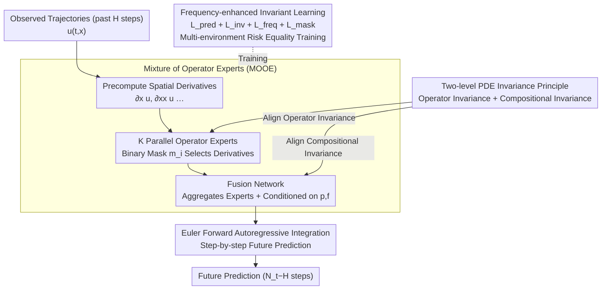

# Towards Generalizable PDE Dynamics Forecasting via Physics-Guided Invariant Learning

**Conference**: ICLR 2026  
**arXiv**: [2509.24332](https://arxiv.org/abs/2509.24332)  
**Code**: [GitHub](https://github.com/LSY-Cython/iMOOE)  
**Area**: Time Series / PDE Dynamics Forecasting  
**Keywords**: PDE Invariance Learning, Zero-shot OOD Generalization, Mixture of Operator Experts, Frequency Enhancement, Neural Operator

## TL;DR

The iMOOE framework is proposed, which explicitly defines the two-level physical invariance principle of "operator invariance + compositional invariance" in PDE systems. By designing an aligned Mixture of Operator Experts (MOOE) network and a frequency-enhanced risk equality objective, the method achieves SOTA zero-shot PDE dynamics forecasting under various OOD scenarios without requiring any test-time adaptation.

## Background & Motivation

**Background**: Deep learning-based PDE dynamics forecasting is widely applied in fields such as meteorology, battery design, and chemical synthesis. Neural Operators (NOs) like FNO and DeepONet can learn unknown PDE laws from observed trajectories but perform poorly under OOD generalization. Existing methods for OOD mainly fall into three categories: (1) meta-learning-based domain-aware methods like CoDA and GEPS, which split parameters into domain-invariant and domain-specific parts; (2) parameter-conditioned methods like CAPE, which encode PDE parameters into the model; (3) large-scale pre-training methods like DPOT, which enhance transferability through pre-training on diverse PDE data.

**Limitations of Prior Work**: The zero-shot OOD generalization capability of these methods remains insufficient. Meta-learning methods require few-shot adaptation at test time, parameter-conditioning methods depend on known parameter ranges, and pre-training methods require massive amounts of diverse data. **The root cause** is that they do not explicitly reveal and utilize the fundamental physical invariance principles within PDE systems.

**Key Challenge**: Real-world physical environments (e.g., PDE system parameters) are constantly changing, but traditional methods focus only on learning domain-generalized representations without addressing the truly invariant essential structures of PDE systems—the operators and their compositional relationships. This leads to failure in unseen OOD scenarios even if performance is good on limited training environments.

**Goal**: How to achieve zero-shot (without access to test-time data) OOD-generalized PDE dynamics forecasting under the condition of having only limited training trajectories? Specifically, two sub-problems need to be solved: (1) How to define the fundamental invariance principles in PDE systems? (2) How to design network architectures and training objectives to capture this invariance?

**Key Insight**: Inspiration is drawn from the operator splitting method—complex PDEs can be decomposed into a combination of several simple operators. For example, a reaction-diffusion equation consists of a diffusion process by the Laplacian operator and a nonlinear reaction function. No matter how system parameters change, these basic operators and their compositional relationships remain invariant. Combining Invariant Risk Minimization (IRM/REx) theories, invariant correlations are discovered by equalizing risks across different training domains.

**Core Idea**: The physical symmetry of PDE systems is formalized as a two-level principle: "operator invariance + compositional invariance." This invariance is captured through an aligned Mixture of Operator Experts architecture and a frequency-enhanced risk equality objective to achieve zero-shot OOD generalization.

## Method

### Overall Architecture

The overall pipeline of iMOOE takes past $H$ steps of observed trajectories $\mathbf{I}^e = \{\mathbf{u}^e(t,\mathbf{x})\}_{t=0}^{H-1}$ as input and outputs predicted trajectories for the future $N_t - H$ steps. The method establishes a **two-level PDE invariance principle** as the theoretical foundation, aligning the network structure and training objective with it. The network part is the **Mixture of Operator Experts (MOOE)**—a set of parallel neural operator experts capturing different physical processes (aligned with operator invariance), plus a fusion network that aggregates expert outputs and conditions them on physical parameters (aligned with compositional invariance). The objective part is the **frequency-enhanced invariant learning objective**, which combines maximum prediction loss, risk equality loss, and frequency enhancement loss to estimate PDE invariance from multiple training domains. Autoregressive inference uses the Euler forward method for step-by-step integration: $\hat{\mathbf{u}}_{t+1} = \int_t^{t+1} h(\{\sigma_i\}_{i=1}^K, \mathbf{p}, \mathbf{f}) dt + \mathbf{u}_t$.

### Key Designs

**1. Two-level PDE Invariance Principle: Identifying what remains invariant across domains**

Traditional methods fail in zero-shot generalization because they learn domain representations rather than the truly invariant components of PDE systems. This is formalized into two levels. The first is **operator invariance**—PDE dynamics are governed by a combination of spatial operators $\{\sigma_i(\mathbf{x}, \mathbf{u}, \partial_\mathbf{x}\mathbf{u}, \ldots)\}_{i=1}^K$; each basic operator corresponds to a physical process (diffusion, convection, reaction) that remains invariant across different domains and system evolutions. The second is **compositional invariance**—the aggregation method $F = h(\sigma_1, \ldots, \sigma_K, \mathbf{p}, \mathbf{f})$ of operators with external conditions (physical parameters $\mathbf{p}$, forcing terms $\mathbf{f}$) is fixed for a specific PDE system. This division is inspired by classical operator splitting methods. The authors further use Structural Causal Models (SCM) to demonstrate that regardless of initial conditions, physical parameters, or forcing terms, the operators and their compositional relationships remain invariant.

**2. Mixture of Operator Experts (MOOE): Implementing levels of invariance via experts and fusion**

The network architecture is built according to the invariance principle. For operator invariance, $K$ parallel neural operator experts are designed, where each expert $\sigma_i = \text{NO}_i(\mathbf{x}, \mathbf{u}_{t-W+1:t}, \mathbf{m}_i \odot [\partial_\mathbf{x}\mathbf{u}_t, \partial_{\mathbf{xx}}\mathbf{u}_t, \ldots]^\mathbb{T})$. A binary mask $\mathbf{m}_i \in \{0,1\}^S$ allows each expert to adaptively select useful spatial derivatives. To prevent experts from collapsing into the same representation, a mask diversity loss $\mathcal{L}_{mask} = \frac{1}{K^2}\sum_{i,j}\exp(-\|\mathbf{m}_i - \mathbf{m}_j\|_2^2)$ is added. For compositional invariance, the fusion network aggregates expert outputs: a separate network learns the combination for strongly nonlinear PDEs, while additive relationships are directly summed. Unlike sequential operator splitting, this parallel structure avoids computational bottlenecks and allows any existing neural operator (FNO/DeepONet/OFormer/VCNeF) to serve as a backbone, making the framework plug-and-play.

**3. Frequency-enhanced Invariant Learning: Estimating invariance and addressing spectral bias**

The architecture alignment is reinforced by the loss function to extract invariance from limited training domains. The total loss is:

$$\mathcal{L}_{total} = \lambda_{pred}\mathcal{L}_{pred} + \lambda_{inv}\mathcal{L}_{inv} + \lambda_{freq}\mathcal{L}_{freq} + \lambda_{mask}\mathcal{L}_{mask}$$

The maximum prediction loss $\mathcal{L}_{pred}$ ensures sufficiency via the domain-averaged autoregressive prediction error. The risk equality loss $\mathcal{L}_{inv} = \text{Var}(\{\mathcal{R}_{pred}^e\}_{e \in \mathcal{E}_{tr}})$ ensures invariance by minimizing the variance of risks across different training domains, adopting modern invariant learning ideas. Finally, the frequency-enhanced loss $\mathcal{L}_{freq}$ uses wavenumber weighting $\|\xi\|_2^2$ to amplify supervision of high-frequency modes. This addresses the inherent spectral bias of neural operators towards low frequencies, which otherwise leads to error propagation in autoregressive prediction. Environments are partitioned not only by physical parameters but also by autoregressive steps, as the input distribution $p(\mathbf{I}^e)$ drifts over time steps.

### Loss & Training

The total training loss is $\mathcal{L}_{total} = \lambda_{pred}\mathcal{L}_{pred} + \lambda_{inv}\mathcal{L}_{inv} + \lambda_{freq}\mathcal{L}_{freq} + \lambda_{mask}\mathcal{L}_{mask}$, with $\lambda_{pred}=1, \lambda_{freq}=0.1, \lambda_{mask}=0.001$. $\lambda_{inv}$ uses a linear scheduling strategy (upper limit $0.001$), maintaining an initial Empirical Risk Minimization phase to learn rich predictive representations. Training lasts 500 epochs using the Adam optimizer with an initial learning rate of $0.001$ on an A100 GPU. $K=2$ experts with FNO (4 layers, width 64) are used as the default backbone.

## Key Experimental Results

### Main Results: Zero-shot OOD Generalization across Five PDE Systems (nMSE)

| PDE System | CoDA | CAPE | DPOT | VCNeF | GEPS | **iMOOE** | Gain |
|----------|------|------|------|-------|------|-----------|------|
| DR (OOD) | 6.05e-1 | 7.16e-2 | 5.67e-2 | 7.84e-2 | 7.94e-2 | **4.23e-2** | ↓25% vs DPOT |
| NS (OOD) | 9.14e-1 | 3.56e-1 | 5.08e-1 | 3.81e-1 | 4.13e-1 | **3.12e-1** | ↓12% vs CAPE |
| BG (OOD) | 9.22e-1 | 3.04e-2 | 8.41e-2 | 4.68e-2 | 7.56e-2 | **1.08e-2** | ↓64% vs CAPE |
| SW (OOD) | n.a. | 6.18e-5 | 4.85e-4 | 6.12e-4 | 2.76e-4 | **3.02e-5** | ↓51% vs CAPE |
| HC (OOD) | 2.37e+0 | 3.65e+0 | 2.12e+0 | 1.42e+0 | 1.35e+0 | **1.22e+0** | ↓10% vs GEPS |

Average OOD Improvement: nMSE 40.21%, fRMSE 30.78%.

### Ablation Study: Compatibility with Different Neural Operators (DR-OOD Avg. nMSE)

| Operator Backbone | Naive | +MOOE | +iMOOE | Gain |
|--------------|-------|-------|--------|------|
| FNO | 7.94e-2 | 5.16e-2 | **4.23e-2** | ↓47% |
| DeepONet | 6.15e-1 | 6.10e-1 | **5.49e-1** | ↓11% |
| VCNeF | 7.84e-2 | 5.73e-2 | **5.52e-2** | ↓30% |
| OFormer | 5.75e-2 | 4.96e-2 | **4.34e-2** | ↓25% |

### Key Findings

- **iMOOE improvement is universal**: Regardless of the underlying neural operator (Fourier/Branch-Trunk/Neural Field/Transformer), iMOOE consistently reduces both the mean and variance of OOD errors.
- **Frequency enhancement is critical**: The transition from +MOOE to +iMOOE (adding frequency-enhanced training) brings significant extra gains, showing that architectural alignment alone is insufficient without addressing spectral bias.
- **Sensitivity of expert count $K$**: $K=3$ is optimal; $K=1$ fails to capture operator invariance, while $K=4$ introduces redundancy and linear increases in computational cost.
- **Effectiveness on real-world data**: iMOOE achieves the lowest mean and variance on SST (Sea Surface Temperature) and SSE (Sea Surface Height) datasets, indicating it captures noisy real-world physics laws.
- **Outstanding temporal extrapolation**: In scenarios trained on $[0, N_t]$ and tested on $[0, 2N_t]$, iMOOE improves nMSE by 32.51% on average, validating the learned operator invariance over longer time horizons.

## Highlights & Insights

- **Formalization of Physical Invariance**: Elevating the operator splitting property of PDE systems to a machine-learnable invariance principle provides a sophisticated bridge between PDE theory and OOD generalization theory.
- **Expert Specialization via Mask Diversity**: Using learnable binary masks to let experts select different derivative orders as inputs is more physically interpretable than traditional MoE routers—convection naturally requires $\partial_\mathbf{x}\mathbf{u}$, while diffusion requires $\partial_{\mathbf{xx}}\mathbf{u}$.
- **Frequency-weighted OOD Regularization**: Using $\|\xi\|_2^2$ to weight frequency-domain loss compensates for the spectral bias of neural operators, a simple yet effective strategy transferable to any spatiotemporal forecasting task.
- **Environment Partitioning by Steps**: Partitioning environments based on autoregressive steps to apply risk equality constraints is a novel and appropriate approach given the distribution drift of $p(\mathbf{I}^e)$ during forecasting.

## Limitations & Future Work

- **Validated on limited PDE diversity**: Testing was conducted on 5 simulated systems and 2 real datasets; applicability to irregular grids, non-periodic boundaries, or higher-dimensional PDEs (3D+) remains to be verified.
- **Correspondence between $K$ and actual operators**: The number of experts $K$ is fixed (2 or 3), but different PDE systems have different actual counts of operators; an automated mechanism for determining $K$ is lacking.
- **Requirement for known physical parameters**: The fusion network requires $\mathbf{p}$ and $\mathbf{f}$ as inputs, which may not be observable in all real-world scenarios.
- **Computational overhead**: Memory and time costs grow linearly with $K$, which may be a bottleneck in resource-constrained environments. Sparse activation mechanisms could improve efficiency.
- **Invariance in chaotic systems**: Whether the operator invariance hypothesis holds for strongly chaotic PDEs (e.g., high Reynolds number turbulence) requires further study.

## Related Work & Insights

- **vs CoDA/GEPS (Meta-learning)**: These split parameters into invariant/specific parts but require test-time adaptation. iMOOE defines invariance based on physical structure, is entirely zero-shot, and leads significantly in OOD performance.
- **vs CAPE (Parameter Conditioning)**: CAPE injects parameters into channel attention. iMOOE adds operator splitting structures and invariant learning objectives, outperforming CAPE significantly on BG and SW systems (+64% and +51% gain).
- **vs DPOT (Pre-training)**: DPOT uses Transformers and denoising pre-training. iMOOE achieves better OOD generalization without massive diverse pre-training data, suggesting physical priors are more important than data volume.
- **vs REx/IRM (Invariant Learning)**: While traditional invariant learning is validated on vision/graph tasks, this work extends it to PDE dynamics forecasting by defining specific two-level physical invariance principles.

## Rating

- Novelty: ⭐⭐⭐⭐
- Experimental Thoroughness: ⭐⭐⭐⭐⭐
- Writing Quality: ⭐⭐⭐⭐
- Value: ⭐⭐⭐⭐

<!-- RELATED:START -->

## Related Papers

- [\[ICML 2025\] A Generalizable Physics-Enhanced State Space Model for Long-Term Dynamics Forecasting in Complex Environments](../../ICML2025/time_series/a_generalizable_physics-enhanced_state_space_model_for_long-term_dynamics_foreca.md)
- [\[ICLR 2026\] Enabling Arbitrary Inference in Spatio-Temporal Dynamic Systems: A Physics-Inspired Perspective](enabling_arbitrary_inference_in_spatio-temporal_dynamic_systems_a_physics-inspir.md)
- [\[ICLR 2026\] CPiRi: Channel Permutation-Invariant Relational Interaction for Multivariate Time Series Forecasting](cpiri_channel_permutation-invariant_relational_interaction_for_multivariate_time_se.md)
- [\[ICLR 2026\] Repurposing Foundation Model for Generalizable Medical Time Series Classification](repurposing_foundation_model_for_generalizable_medical_time_series_classificatio.md)
- [\[ICLR 2026\] Panda: A Pretrained Forecast Model for Chaotic Dynamics](panda_a_pretrained_forecast_model_for_chaotic_dynamics.md)

<!-- RELATED:END -->
