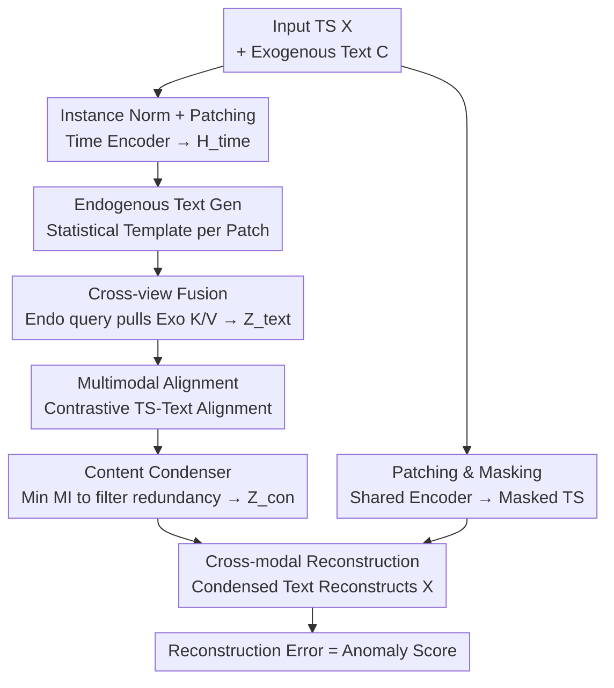

# Towards Multimodal Time Series Anomaly Detection with Semantic Alignment and Condensed Interaction

**Conference**: ICLR 2026  
**OpenReview**: [https://openreview.net/forum?id=fNFbGqu6Rg](https://openreview.net/forum?id=fNFbGqu6Rg)  
**Code**: https://github.com/decisionintelligence/MindTS  
**Area**: Time Series / Multimodal / Anomaly Detection  
**Keywords**: Time Series Anomaly Detection, Multimodal Alignment, Contrastive Learning, Information Bottleneck, Endogenous/Exogenous Text

## TL;DR
MindTS advances time series anomaly detection from unimodal numerical data to "Time Series + Text" multimodality. It aligns endogenous text (statistical descriptions generated from the sequence itself) and exogenous text (external background knowledge) with time series representations via cross-view fusion. A content condenser based on the Information Bottleneck (IB) filters redundant text and utilizes the condensed information to reconstruct masked time series. The method outperforms 17 unimodal and multimodal baselines across 6 real-world datasets.

## Background & Motivation

**Background**: Time series anomaly detection (in healthcare, financial fraud, network intrusion, etc.) has long been dominated by unimodal numerical methods. Reconstruction-based (Anomaly Transformer, DADA), prediction-based (GDN), and contrastive (DCdetector) approaches focus solely on numerical sequences, defining anomalies as high reconstruction errors or weak correlations with other points.

**Limitations of Prior Work**: Real-world data is inherently multimodal. Textual modalities are particularly accessible and information-rich (e.g., financial experts combine trading data with policy reports). However, integrating text into time series faces two problematic paths: (1) **Endogenous text via LLMs**—generating natural language descriptions directly from sequences. This is naturally aligned but semantically sparse, only describing internal statistical patterns without external knowledge. (2) **Retrieving exogenous text**—scrapping background knowledge from the web. This is information-rich but fragmented and weakly correlated with specific time segments, leading to misalignment when simply synchronized by time steps.

**Key Challenge**: Endogenous text is "aligned but shallow," while exogenous text is "rich but unaligned." They are complementary rather than mutually exclusive. Furthermore, both types of text contain high redundancy. Existing multimodal methods (Time-MMD, LLM-Mixer) use direct fusion, assuming "all text is useful," which dilutes discriminative information. NLP-based random masking or rewriting for filtering ignores the correlation between text and time series, potentially removing high-value information.

**Goal**: To solve two sub-problems: (1) achieve **semantically consistent** alignment across heterogeneous modalities; (2) **filter redundant text** to enhance cross-modal interaction.

**Key Insight**: Treat text as two complementary signals—"exogenous view" and "endogenous view." Use cross-view attention to "anchor" exogenous background knowledge to specific time segments, then apply the Information Bottleneck principle to compress redundancy, retaining only text useful for time series reconstruction.

**Core Idea**: Use "endogenous queries to retrieve exogenous keys/values" for fine-grained time-text alignment. A content condenser then minimizes mutual information and performs cross-modal reconstruction to compress the aligned text into an essential representation for reconstructing masked time series. The reconstruction error serves as the anomaly score.

## Method

### Overall Architecture

MindTS addresses multimodal anomaly detection mapping "Time Series $X$ + Exogenous Text $C \rightarrow$ step-wise anomaly labels." The pipeline consists of two stages: Fine-grained Time-text Semantic Alignment, followed by Content Condenser Reconstruction. The reconstruction error (MSE) between the original and reconstructed series is the anomaly score—anomalies are harder to reconstruct from cross-modal cues.

Specifically, input series are processed via instance normalization and patching, then encoded into patch representations $H_{time}\in\mathbb{R}^{N\times d}$ by a time encoder. Simultaneously, endogenous text $O$ is generated for each patch using templates. A masked version $\tilde H_{time}$ is obtained via a shared time encoder. Endogenous text $O$ and exogenous text $C$ are encoded and combined via cross-view fusion into $Z_{text}$, which is then aligned with $H_{time}$. Finally, the content condenser filters $Z_{text}$ into condensed text $Z_{con}$ to reconstruct the masked input $\hat X$.

### Key Designs

**1. Endogenous Text Generation: Translating sequences into local statistical descriptions**

Directly using LLMs to translate entire sequences introduces semantic drift and uncertainty. MindTS generates patch-level endogenous text $o_i$ using fixed templates (mean, extrema, trends), then encodes them into local textual representations $H^O_{text}\in\mathbb{R}^{N\times d}$ using an open-source LLM. This ensures endogenous text is naturally aligned with time segments, capturing sequence dynamics.

**2. Cross-view Fusion + Contrastive Alignment: Anchoring external knowledge to time segments**

MindTS integrates both text views using cross-view attention: **Endogenous text $H^O_{text}$ acts as the Query, while exogenous text $H^C_{text}$ provides Key/Value**. This allows the model to selectively extract background information relevant to the current patch:

$$\hat Z_{text} = \mathrm{LayerNorm}\big(H^O_{text} + \mathrm{CrossAttn}(H^O_{text}, H^C_{text}, H^C_{text})\big),\quad Z_{text} = \mathrm{LayerNorm}\big(\hat Z_{text} + \mathrm{FFN}(\hat Z_{text})\big)$$

The exogenous text is treated as a shared background ($H^C_{text}\in\mathbb{R}^{1\times d}$). After fusion, **contrastive learning** explicitly aligns segments. In the similarity matrix $K_{TT}\in\mathbb{R}^{N\times N}$, the diagonal (TS and text of the same segment) represents positive pairs. The symmetric InfoNCE loss is used:

$$L_{MA} = -\frac{1}{2N}\Big(\sum_j \log\frac{\exp(k(h^j_{time}, z^j_{text})/\tau)}{\sum_g \exp(k(h^j_{time}, z^g_{text})/\tau)} + \sum_g \log\frac{\exp(k(h^g_{time}, z^g_{text})/\tau)}{\sum_j \exp(k(h^g_{time}, z^j_{text})/\tau)}\Big)$$

**3. Content Condenser: Compressing text via Information Bottleneck**

Even aligned text contains redundancy. MindTS adopts the **Information Bottleneck (IB)** principle to minimize the mutual information (MI) between aligned text $Z_{text}$ and condensed text $Z_{con}$, while preserving information needed for reconstruction:

$$Z^*_{con} = \arg\min_{P(Z_{con}|Z_{text})} I(Z_{text}; Z_{con}) + R(\hat X, Z_{con})$$

Implementation involves calculating a probability matrix $\Psi=[\psi_i]$ via MLP and sampling binary masks $F\sim\mathrm{Bernoulli}(\Psi)$, where $Z_{con}=Z_{text}\odot F$. An upper bound for MI is optimized: $I(Z_{text};Z_{con})\le \mathbb{E}_{Z_{text}}[\mathrm{KL}(P(Z_{con}|Z_{text})\,\|\,G(Z_{con}))]$, where the prior $G(Z_{con})$ is controlled by hyperparameter $\mu\in(0,1)$ to dictate compression intensity:

$$L_{CC} = \sum_i \psi_i\log\frac{\psi_i}{\mu} + (1-\psi_i)\log\frac{1-\psi_i}{1-\mu}$$

**4. Cross-modal Reconstruction: Forced dependency on condensed text**

To prevent the model from ignoring the text, MindTS masks the original time series $X$ to get $\tilde H_{time}$. The compressed text $Z_{con}$ is then forced to complete the missing parts:

$$\hat X = \mathrm{Projection}(U_{TT}),\quad U_{TT} = \mathrm{FFN}\big(\tilde H_{time} + \mathrm{CrossAttn}(\tilde H_{time}, Z'_{con}, Z'_{con})\big)$$

The reconstruction loss is $L_{Rec}=\|X-\hat X\|_F^2$. Masking forces the model to rely on cross-modal cues, ensuring the condensed text retains sufficient TS-relevant information.

### Loss & Training

The total loss is a joint optimization of the three components:

$$L = L_{MA} + L_{CL} + L_{Rec}$$

During inference, the anomaly score at time $t$ is the MSE between input $X$ and reconstruction $\hat X$. Key hyperparameters include patch size $p \approx 6$, masking ratio $m \approx 50\%$, and compression strength $\mu \in (0.1, 0.9)$.

## Key Experimental Results

### Main Results

Evaluated on 6 multimodal datasets (Weather, Energy, KR, etc.) against 17 baselines using Affiliated-F1 (Aff-F), VUS-PR (V-PR), and VUS-ROC (V-ROC).

| Dataset | Metric | MindTS | Best Baseline | Gain |
|--------|------|--------|----------|------|
| Weather | Aff-F | **82.66** | 81.06 (G4TS) | +1.6 |
| Weather | V-PR | **57.48** | 55.03 (LODA) | +2.45 |
| Energy | V-ROC | **74.44** | 65.05 (Modern) | +9.4 |
| MDT | V-PR | **65.44** | 52.18 (Modern) | +13.3 |
| MDT | Aff-F | **89.19** | 80.81 (Modern) | +8.4 |

MindTS achieves SOTA across all datasets. It even outperforms competitive models (Table 2, marked with ∗) implemented with multimodal frameworks, proving that gains stem from fine-grained alignment and condensation, not just the inclusion of text.

### Ablation Study

Performance drops across configurations on MDT and Energy:

| Configuration | Effect | Description |
|------|------|------|
| Full (Ours) | Optimal | Complete model |
| (a) w/o Exogenous | Decrease | Loss of external background knowledge |
| (b) w/o Endogenous | Decrease | Loss of local statistical descriptions |
| (c) w/o Alignment | Decrease | Modal alignment is crucial for reliability |
| (d) w/o Condenser | **Significant Drop** | Redundant text causes substantial interference |
| (e) w/o Reconstruction| Decrease | Impaired cross-modal interaction |
| (f) Order Swap | Decrease | Compressing before alignment discards TS-relevant info |

### Key Findings
- **The Content Condenser is the most critical component** (config d). This confirms that redundancy is a primary bottleneck in multimodal TS anomaly detection; filtering is more vital than simply adding more text.
- **Processing order is vital** (config f): Alignment must precede compression. Pre-compression discards potentially useful information before it can be aligned with the time series.
- **Hyperparameter Robustness**: Performance remains high for $\mu \in [0.1, 0.9]$, indicating the condenser adaptively balances semantics and redundancy.

## Highlights & Insights
- **"Endo-Query, Exo-K/V" Fusion**: This mechanism "anchors" unaligned background knowledge using aligned local statistics, resolving the conflict between data richness and alignment.
- **IB for Content Cleaning**: Using Bernoulli masks and KL divergence to a prior provides a differentiable and controllable paradigm for task-aware textual filtering.
- **Strategic Masking**: Forcing the model to fill in time series gaps using text cues converts cross-modal interaction from an optional feature into a necessity for low reconstruction error.

## Limitations & Future Work
- The scope is limited to Bimodal (TS + Text); it is not a general multimodal framework for vision/video.
- Reliance on exogenous text quality—performance in scenarios with extremely noisy or scarce text remains to be fully explored.
- The reconstruction-based anomaly score might be less sensitive to "adversarial anomalies" that are easy to reconstruct but still anomalous.

## Related Work & Insights
- **vs. DCdetector / Anomaly Transformer**: These rely on internal correlations of numerical sequences. MindTS adds semantic context, making it more robust in complex real-world scenarios at the cost of requiring textual data.
- **vs. Time-MMD / LLM-Mixer**: These use direct concatenation or simple time-step synchronization. MindTS introduces semantic alignment and IB-based de-noising to handle "misalignment" and "redundancy" issues they ignore.

## Rating
- Novelty: ⭐⭐⭐⭐⭐ 
- Experimental Thoroughness: ⭐⭐⭐⭐ 
- Writing Quality: ⭐⭐⭐⭐ 
- Value: ⭐⭐⭐⭐

<!-- RELATED:START -->

<!-- RELATED:END -->

## Related Papers

- [\[ICLR 2026\] ICDiffAD: Implicit Conditioning Diffusion Model for Time Series Anomaly Detection](icdiffad_implicit_conditioning_diffusion_model_for_time_series_anomaly_detection.md)
- [\[ICML 2026\] AnomSeer: Reinforcing Multimodal LLMs to Reason for Time-Series Anomaly Detection](../../ICML2026/time_series/anomseer_reinforcing_multimodal_llms_to_reason_for_time-series_anomaly_detection.md)
- [\[ICLR 2026\] Point-wise Anomaly Detection via Fold-bifurcation ODE](point-wise_anomaly_detection_via_fold-bifurcation_ode.md)
- [\[ICLR 2026\] Enhancing Sparse Event Detection in Healthcare Time-Series via Adaptive Gate of Context–Detail Interaction](enhancing_sparse_event_detection_in_healthcare_time-series_via_adaptive_gate_of_.md)
- [\[ICLR 2026\] When Foundation Models Are One-Liners: Limitations and Future Directions for Time Series Anomaly Detection](when_foundation_models_are_one-liners_limitations_and_future_directions_for_time.md)

<!-- RELATED:END -->
