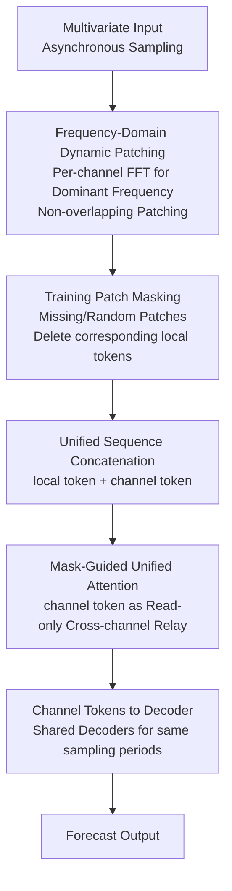

# Towards Robust Real-World Multivariate Time Series Forecasting: A Unified Framework

**Conference**: ICLR 2026  
**arXiv**: [2506.08660](https://arxiv.org/abs/2506.08660)  
**Code**: Available  
**Area**: Time Series / Robust Forecasting  
**Keywords**: multivariate time series, asynchronous sampling, block-wise missingness, channel dependency, ChannelTokenFormer

## TL;DR

ChannelTokenFormer (CTF) is proposed as a unified Transformer framework to simultaneously address three major challenges in real-world multivariate time series forecasting: (1) complex cross-channel dependencies—addressed via inter-channel cross-attention with channel tokens; (2) asynchronous sampling—addressed via frequency-domain dynamic patching to maintain original resolution; and (3) block-wise missingness during testing—addressed by patch masking during training and direct removal of missing patches during inference. The framework achieves State-of-The-Art (SOTA) performance across six datasets, including ETT, SolarWind, Weather, EPA, and CHS.

## Background & Motivation

**Background**: Multivariate time series forecasting is a core task in industrial monitoring, energy systems, and healthcare. Most existing models assume synchronous sampling and complete observations, which significantly deviate from real-world data characteristics.

**Limitations of Prior Work**:
    - **Channel Dependency vs. Independence**: Channel-independent (CI) designs (e.g., PatchTST) are robust but lose cross-channel information; channel-dependent (CD) designs (e.g., CrossGNN) utilize correlations but are sensitive to distribution shifts—creating a trade-off.
    - **Ubiquity of Asynchronous Sampling**: Different sensors have distinct physical properties, leading to varying sampling periods (e.g., temperature every hour, pressure every 15 minutes). Most methods assume alignment, introducing signal distortion through interpolation.
    - **Block-wise Missingness**: Sensor failures or communication interruptions cause long-duration continuous missingness. Naive interpolation is unreliable for dynamic signals, necessitating cross-channel inference.
    - **Lack of Unified Solutions**: CD methods ignore asynchrony and missingness, CI methods lose dependencies, and irregular methods do not handle block-wise missingness.

**Key Challenge**: The three challenges co-exist and are coupled in real scenarios; methods solving individual challenges perform poorly when combined.

**Goal**: Design a unified architecture to handle dependencies, asynchronous sampling, and block-wise missingness simultaneously without requiring interpolation pre-processing.

**Key Insight**: Channel tokens, as compact channel-level representations, can naturally aggregate local token sequences of varying lengths (handling asynchrony), interact between channels (capturing dependencies), and skip missing patches (handling missingness)—a single design solving three problems.

**Core Idea**: Redefine the channel token from a simple summary token to a unified global attention anchor for asynchrony, missingness, and dependency.

## Method

### Overall Architecture

CTF is designed to handle asynchronous sampling, block-wise missingness, and cross-channel dependencies within a single Transformer. The core approach compresses each channel into a channel token that serves as an "information anchor" between channels. The pipeline operates as follows: First, Fast Fourier Transform (FFT) is applied to each channel to identify its dominant frequency, determining the patch length for non-overlapping segmentation. Consequently, channels with higher sampling density yield more local tokens. During training, patches are randomly masked, and during testing, fully missing patches are removed, allowing attention to skip these vacancies. Each channel is assigned a set of learnable channel tokens, which are concatenated with local tokens into a unified sequence. A mask-guided self-attention mechanism performs both intra-channel temporal modeling and inter-channel dependency capture. Finally, only channel tokens are passed to the decoder. Channels with the same patch length share projection layers, and those with the same sampling period share decoders.

### Key Designs

**1. Frequency-Domain Dynamic Patching: Patching via Dominant Frequency without Interpolation**

Asynchronous sampling is common in real data. CTF avoids interpolation by performing FFT on each channel to estimate its dominant period $T_i$, using this as the non-overlapping patch length. For an input window $L$, a channel with sampling period $s_i$ contains $L_i = \lfloor L/s_i \rfloor$ valid points, resulting in a variable number of local tokens per channel. This preserves original resolution without upsampling or downsampling.

**2. Training Patch Masking: Rehearsing Block-wise Missingness**

To handle long-duration sensor failures, CTF randomly removes patches during training (inspired by PatchDropout). Local tokens corresponding to all-zero patches are deleted, forcing the attention mechanism to skip these positions. This trains the model to infer missing information from other channels. During inference, missing blocks are handled similarly, relying on available channel tokens without feeding "fake" interpolated values into the network.

**3. Mask-Guided Unified Attention: Channel Tokens as Read-only Relays**

CTF integrates temporal and cross-channel modeling into one step using a specific attention mask. Local and channel tokens are concatenated into a unified sequence:

$$\mathbf{X} = [\mathbf{T}^{(1)};\mathbf{C}^{(1)};\dots;\mathbf{T}^{(N)};\mathbf{C}^{(N)}] \in \mathbb{R}^{\mathcal{T} \times d}$$

Masked self-attention is then applied:

$$\mathbf{X}_\text{out} = \mathbf{X} + \text{softmax}\!\left(\frac{QK^\top}{\sqrt{d}} + \mathbf{M}\right)V$$

The mask $\mathbf{M}$ enforces three rules: local tokens only attend to local tokens in the same channel; channel tokens attend to local tokens of their own channel and channel tokens of other channels; channel tokens do not attend to themselves. This creates a "read-only" aggregation where channel tokens act as the sole information relays between channels.

### Loss & Training

A Channel-aggregated MSE is used for training and evaluation. Errors are calculated only at valid sampling points and averaged across channels:

$$\mathcal{L}_\text{total} = \frac{1}{N}\sum_{i=1}^{N}\frac{1}{H_i}\sum_{j=1}^{H_i}\left(y_j^{(i)} - \hat{y}_j^{(i)}\right)^2$$

where $H_i = \lfloor H/s_i \rfloor$ is the number of prediction points for channel $i$. The number of channel tokens is tuned per dataset: 1 for high correlation (Weather/CHS), 2 for medium heterogeneity (ETT1/SolarWind), and 3 for strong heterogeneity (EPA).

## Key Experimental Results

### Main Results: Asynchronous Channel Forecasting (Case 1, CMSE↓)

| Dataset | **CTF** | TimeFilter | DUET | TimeXer | iTransformer | PatchTST | DLinear | Hi-Patch |
|---------|---------|------------|------|---------|--------------|----------|---------|----------|
| ETT1 | **0.399** | 0.412 | 0.424 | 0.422 | 0.435 | 0.411 | 0.425 | 0.448 |
| ETT2 | **0.377** | 0.383 | 0.388 | 0.380 | 0.396 | 0.390 | 0.455 | 0.397 |
| SolarWind | **0.403** | 0.404 | 0.438 | 0.424 | 0.470 | 0.417 | 0.421 | 0.431 |
| Weather | 0.275 | **0.273** | 0.309 | 0.300 | 0.313 | 0.275 | 0.287 | 0.301 |
| EPA | **0.776** | 0.863 | 0.782 | 0.886 | 0.882 | 0.854 | 1.047 | 0.808 |
| CHS | **0.285** | 0.304 | 0.307 | 0.298 | 0.305 | 0.315 | 0.351 | 0.301 |

### Ablation Study: Block-wise Missingness (SolarWind, Async + Missing, CMSE↓)

| Missing Ratio | **CTF** | TimeFilter | TimeXer | iTransformer | PatchTST | BiTGraph |
|---------------|---------|------------|---------|--------------|----------|----------|
| m=0.125 | **0.409** | 0.430 | 0.427 | 0.475 | 0.426 | 0.426 |
| m=0.250 | **0.429** | 0.444 | 0.442 | 0.496 | 0.456 | 0.444 |
| m=0.375 | **0.452** | 0.471 | 0.462 | 0.539 | 0.515 | 0.467 |
| m=0.500 | **0.475** | 0.522 | 0.514 | 0.606 | 0.593 | 0.495 |

### Component Ablation (SolarWind, m=0.375)

| Configuration | CMSE | CMAE | Description |
|---------------|------|------|-------------|
| Full CTF | **0.452** | **0.508** | Complete model |
| w/o Channel Dependence | 0.474 | 0.521 | Remove cross-channel attention (+4.9%) |
| w/o Dynamic patching | 0.494 | 0.536 | Fixed patching (+9.3%) |
| w/o Patch masking | 0.458 | 0.508 | Remove training-time masking (+1.3%) |

### Key Findings

- **Necessity of Unified Components**: Removing any component degrades performance, with dynamic patching having the greatest impact (+9.3%).
- **Scaling Advantage with Missingness**: At $m=0.5$, CTF vs. iTransformer achieves 0.475 vs. 0.606 (21.6% Gain), showing the superiority of mask-guided inference over zero-filling.
- **Validity of No-Interpolation**: CTF's raw resolution modeling outperforms interpolation-based methods by 10-35% on the EPA dataset.
- **Tuning Channel Tokens**: The optimal number of channel tokens correlates with the heterogeneity of the dataset.

## Highlights & Insights

- **Multiple Identities of Channel Tokens**: They serve as relays for dependencies, normalizers for asynchrony, and anchors for missing information.
- **Honest Methodology**: Avoiding interpolation prevents the injection of "fake" data into dynamic signals.
- **Industrial Deployability**: Success on real LNG industrial data (CHS) demonstrates practical potential.
- **Elegant Mask-Guided Attention**: Controls complex token interactions without modifying the standard Transformer architecture.

## Limitations & Future Work

- Computational complexity of unified attention is $O(\mathcal{T}^2)$, which may be expensive for thousands of sensors.
- The number of channel tokens requires manual per-dataset tuning.
- Frequency-domain patching depends on FFT, which may be less effective for non-stationary signals.
- Robustness to concept drift and truly irregular (event-driven) sampling remains to be explored.

## Related Work & Insights

- **vs. iTransformer (Liu et al., 2024c)**: Both use channel tokens, but CTF extends to asynchronous and missing scenarios.
- **vs. TimeXer (Wang et al., 2024e)**: CTF explicitly handles missingness via mask-guided attention rather than zero-filling.
- **vs. PatchTST (Nie et al., 2023)**: CTF combines the flexibility of CI designs with the richness of CD dependencies.
- **vs. BiTGraph (Chen et al., 2024b)**: CTF simultaneously addresses asynchrony while BiTGraph focuses on missingness in synchronous settings.
- **vs. Hi-Patch (Luo et al., 2025)**: CTF targets structured multi-source asynchronous scenarios rather than highly sparse irregular settings.

## Rating

- Novelty: ⭐⭐⭐⭐⭐ 
- Experimental Thoroughness: ⭐⭐⭐⭐⭐ 
- Writing Quality: ⭐⭐⭐⭐ 
- Value: ⭐⭐⭐⭐⭐

<!-- RELATED:START -->

## Related Papers

- [\[ICLR 2026\] pyrregular: A Unified Framework for Irregular Time Series, with Classification Benchmarks](pyrregular_a_unified_framework_for_irregular_time_series_with_classification_ben.md)
- [\[ICLR 2026\] Delta-XAI: A Unified Framework for Explaining Prediction Changes in Online Time Series Monitoring](delta-xai_a_unified_framework_for_explaining_prediction_changes_in_online_time_s.md)
- [\[ICLR 2026\] A Unified Federated Framework for Trajectory Data Preparation via LLMs](a_unified_federated_framework_for_trajectory_data_preparation_via_llms.md)
- [\[ICLR 2026\] PHAT: Modeling Period Heterogeneity for Multivariate Time Series Forecasting](phat_modeling_period_heterogeneity_for_multivariate_time_series_forecasting.md)
- [\[NeurIPS 2025\] MIRA: Medical Time Series Foundation Model for Real-World Health Data](../../NeurIPS2025/time_series/mira_medical_time_series_foundation_model_for_real-world_health_data.md)

<!-- RELATED:END -->
