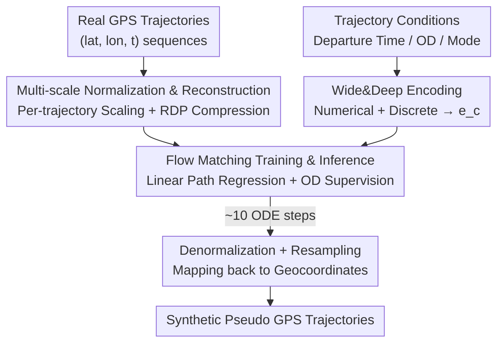

# TrajFlow: Nationwide Pseudo GPS Trajectory Generation with Flow Matching Models

**Conference**: ICLR 2026  
**OpenReview**: [https://openreview.net/forum?id=BDOldEjwCE](https://openreview.net/forum?id=BDOldEjwCE)  
**Code**: https://github.com/ZeroCSIS/TrajFlow  
**Area**: Time Series / Spatiotemporal Data / Trajectory Generation / Flow Matching Generative Models  
**Keywords**: Pseudo GPS Trajectory Generation, Flow Matching, Multi-scale, Trajectory Normalization, OD Condition

## TL;DR
TrajFlow introduces Flow Matching to GPS trajectory generation for the first time. Combined with a "per-trajectory normalization + RDP compression + OD condition normalization" strategy, it stably generates pseudo GPS trajectories across city, metropolitan, and national scales using approximately 10 ODE integration steps. It outperforms diffusion and other deep generative baselines on a dataset covering millions of real trajectories in Japan, showing significant advantages at the national scale.

## Background & Motivation
**Background**: Mobile GPS trajectory data is crucial for urban research, pandemic control, and transportation planning. However, real data sharing is restricted by privacy, accessibility, and collection costs, making the generation of pseudo GPS trajectories that mimic real distributions a prominent research direction. Recently, diffusion models (e.g., DiffTraj) have achieved high fidelity in city-scale taxi trajectory generation.

**Limitations of Prior Work**: The authors identify three unavoidable gaps in SOTA methods. First, **poor multi-scale capability**: existing models are mostly effective at the city scale; metrics degrade sharply when expanding to metropolitan or national scales (Fig. 2a shows a cliff-like drop in DiffTraj precision as scale increases). Second, **limited transport modes**: most methods are trained only on taxi trajectories, failing to cover trains, cars, bicycles, and walking. Third, **efficiency and robustness**: diffusion frameworks rely on step-by-step denoising, requiring expensive multi-step iterations even with DDIM acceleration.

**Key Challenge**: The authors attribute the failure at multiple scales to two mechanism flaws in the diffusion paradigm. One is **Signal-to-Noise Ratio (SNR) imbalance**: as geographic range expands, fine-grained local trajectories occupy a negligible portion of the overall space, and the MSE objective magnifies scale imbalances. The other is **fixed-magnitude noise addition**: the forward process injects similar noise levels regardless of whether a trajectory is micro-short or macro-long, which is incompatible with data ranges spanning several orders of magnitude.

**Goal / Key Insight**: Instead of patching the diffusion framework, the authors switch to a new generative paradigm. Flow Matching directly regresses the target vector field along a predefined conditional probability path, bypassing the fixed-step denoising chain for more stable training and efficient sampling. This is combined with data-side "normalization-reconstruction" to explicitly compensate for scale imbalance.

**Core Idea**: Replace diffusion denoising with Flow Matching, overlaid with per-trajectory normalization, RDP compression, and OD condition prediction to address scalability, diversity, and efficiency in a unified framework.

## Method

### Overall Architecture
The input to TrajFlow is a set of "trajectory conditions" (departure time, regional OD, transport mode), and the output is a synthetic GPS trajectory. The pipeline consists of three stages: **normalization and reconstruction** (per-trajectory normalization to a bounded coordinate space + RDP geometric compression), transforming messy, multi-scale coordinates into a stable representation; **Wide&Deep conditional encoding** to fuse numerical and discrete features into a condition vector $e_c$ for the backbone network; and **Flow Matching training/inference** in the normalized space—regressing the vector field on a linear path during training and performing ODE integration from Gaussian noise during inference.

### Key Designs

**1. Flow Matching over Diffusion: Avoiding Scale Mismatch with Deterministic Vector Fields**

This paradigm innovation addresses the "fixed-magnitude noise" and "error accumulation" issues in diffusion. Flow Matching learns a time-dependent vector field $v_\theta(x,t)$ to transport a simple prior $p_0$ (Standard Gaussian) to the real distribution $p_1$. Generation simply requires solving the ODE $\frac{dx_t}{dt}=v_\theta(x_t,t)$. The authors use Conditional Flow Matching (CFM) with linear paths, where the target vector field is $u_t(x\mid x_1)=x_1-x_0$:

$$\mathcal{L}_{FM}=\mathbb{E}_{t,\,p(x_1),\,p(x_0)}\Big[\big\|v_\theta\big((1-t)x_0+tx_1,\,t\big)-(x_1-x_0)\big\|^2\Big]$$

where $t\sim\mathcal{U}[0,1]$. Compared to diffusion's multi-step denoising, CFM regresses the vector field directly per sample, leading to more stable training and 10-step inference. Flow Matching is more robust across heterogeneous regions because it avoids the fundamental mismatch caused by diffusion's scale-agnostic noise.

**2. Multi-scale Trajectory Normalization & Reconstruction: Compressing Coordinates into Stable Representations**

To address SNR imbalance, trajectories are independently normalized to a shared bounded coordinate space. The model predicts fine-grained points within this normalized space, which are then mapped back. This prevents micro-scale movements from being overwhelmed by large-scale changes and stabilizes gradients.

**Geometric compression** is applied via the Ramer–Douglas–Peucker (RDP) algorithm, which recursively removes redundant points within an $\epsilon$ tolerance while preserving turns and high-curvature areas. This reduces trajectory length from $L$ to $D$ ($D \ll L$), lowering computational overhead and improving training stability.

**3. Wide&Deep Conditioning + Fine OD Prediction: Context Injection and Endpoint Anchoring**

Conditions are encoded using a Wide&Deep module: numerical features $Z_n$ (speed, distance, etc.) produce $e_{wide}$ via linear projection; discrete features $Z_d$ (time, mode, regional OD) produce $e_{deep}$ via embeddings and MLPs. They are fused as:

$$e_c=\text{LayerNorm}(e_{wide}+e_{deep})$$

The vector field is controlled by $\tilde{e}=e_c+e_t$, injected via a learnable additive bias: $h^{(\ell)}\leftarrow f^{(\ell)}(h^{(\ell)}+A^{(\ell)}\tilde{e})$. An auxiliary supervision loss for precise OD positions is introduced to enhance spatial and semantic awareness, contributing significantly to shape fidelity at large scales.

### Loss & Training
The total loss comprises a masked regression loss on valid tokens (Flow Matching objective) and an auxiliary loss for fine-grained OD positions. During inference, the learned ODE is numerically integrated over $[0,1]$ starting from Gaussian noise $x_0$, followed by resampling and denormalization to generate final trajectories.

## Key Experimental Results

### Main Results
Testing on the 2023 Blogwatcher dataset (millions of trajectories in Japan). Baselines include DiffTraj (Diffusion), TrajVAE (VAE), and TrajGAN (GAN). Evaluation includes spatial density (JS divergence) and trajectory similarity (DTW, Fréchet distance).

| Scale | Method | Density JS ↓ | DTW_med ↓ | Fr_med ↓ |
|------|------|------|------|------|
| Central Tokyo (City) | TrajFlow | 0.0674 | 20.350 | 0.304 |
| Central Tokyo | TrajFlow-w/o RDP&OD | **0.0323** | **8.179** | **0.184** |
| Central Tokyo | DiffTraj | 0.1340 | 44.321 | 0.651 |
| Tokyo Metro | TrajFlow | 0.1239 | 18.167 | 0.335 |
| Tokyo Metro | TrajFlow-w/o RDP&OD | **0.0800** | **14.416** | 0.303 |
| Tokyo Metro | DiffTraj | 0.2918 | 88.559 | 1.220 |
| Entire Japan (National) | TrajFlow | **0.2270** | **10.977** | **0.192** |
| Entire Japan | DiffTraj | 0.6727 | 451.042 | 5.329 |
| Entire Japan | TrajVAE | 0.5228 | 135.377 | 2.216 |

Observations: At the city scale, the Flow Matching backbone (w/o RDP&OD) is sufficient. As the scale grows, the full TrajFlow (with OD/RDP) becomes dominant, while diffusion and other baselines degrade significantly.

### Ablation Study

| Configuration | Change | Description |
|------|------|------|
| Full TrajFlow | — | Most stable at national scale |
| w/o-FM | Replaced with DDPM denoising | Performance consistently inferior to FM, confirming FM as the primary driver |
| w/o-RDP | Removed RDP compression | Increases in Fr/DTW medians and tails; worse density JS at national scale |
| w/o-OD | Removed OD prediction | Consistent degradation in DTW/Fr; worse shape fidelity at national scale |
| w/o-RDP&OD | Removed both | Most severe degradation, highlighting importance at national scale |

### Key Findings
- **Flow Matching is the primary performance driver**: CFM outperforms DDPM even with high step budgets, proving the paradigm shift is key to multi-scale fidelity.
- **Efficiency advantage**: TrajFlow requires only ~10 ODE steps; DDPM fails to match TrajFlow's accuracy even at 300 steps.
- **Scale robustness**: Diffusion's SNR issues aggregate in mixed-scale national data, whereas Flow Matching handles heterogeneous regions effectively.
- **Mode diversity**: TrajFlow successfully matches the distribution of travel distances across four transportation modes.

## Highlights & Insights
- **Paradigm shift over patching**: Addressing diffusion's multi-scale failure by switching to Flow Matching simplifies the framework and removes long-chain error accumulation.
- **Complementary data and model strategies**: RDP/Normalization fixes SNR imbalance while Flow Matching ensures efficient probabilistic transport.
- **Scale-adaptive component usage**: The observation that certain components (RDP/OD) are essential only at larger scales suggests that normalization/reconstruction needs to be "scale-configured" in spatiotemporal tasks.

## Limitations & Future Work
- **Lack of individual preferences**: The model does not use user attributes (age, gender, home-work IDs) due to privacy, generating only group-level consistent trajectories.
- **Private/Single-country dataset**: Generalization across different countries or data sources remains unverified.
- **Future directions**: Extending TrajFlow to generalized human mobility modeling and developing adaptive methods for hyperparameters like RDP tolerance $\epsilon$ and ODE steps.

## Related Work & Insights
- **vs. DiffTraj**: DiffTraj suffers at metropolitan/national scales due to SNR and scale mismatch; TrajFlow reduces DTW/Fr/density JS by an order of magnitude with fewer steps.
- **vs. TrajVAE/TrajGAN**: These methods struggle with stability and yield larger median errors on large-scale heterogeneous trajectories.
- **vs. Diffusion Acceleration**: Unlike DDIM, which still requires iterative denoising, TrajFlow regresses the vector field directly, benefiting both efficiency and stability.

## Rating
- Novelty: ⭐⭐⭐⭐⭐ First use of Flow Matching for GPS trajectory generation; first to achieve nationwide multi-scale generation.
- Experimental Thoroughness: ⭐⭐⭐⭐ Covers three scales, four baselines, and complete ablation; however, limited to a single private dataset.
- Writing Quality: ⭐⭐⭐⭐ Clear logic from motivation to mechanism.
- Value: ⭐⭐⭐⭐⭐ High utility for privacy-preserving nationwide movement modeling in urban planning and disaster response.

<!-- RELATED:START -->

## Related Papers

- [\[ICLR 2026\] Time-Gated Multi-Scale Flow Matching for Time-Series Imputation](time-gated_multi-scale_flow_matching_for_time-series_imputation.md)
- [\[ICML 2026\] Spatiotemporal Imputation with Graph-Informed Flow Matching](../../ICML2026/time_series/spatiotemporal_imputation_with_graph-informed_flow_matching.md)
- [\[ICLR 2026\] Latent-to-Data Cascaded Diffusion Models for Unconditional Time Series Generation](latent-to-data_cascaded_diffusion_models_for_unconditional_time_series_generatio.md)
- [\[ICLR 2026\] A Unified Federated Framework for Trajectory Data Preparation via LLMs](a_unified_federated_framework_for_trajectory_data_preparation_via_llms.md)
- [\[ICLR 2026\] Flow-based Conformal Prediction for Multi-dimensional Time Series](flow-based_conformal_prediction_for_multi-dimensional_time_series.md)

<!-- RELATED:END -->
