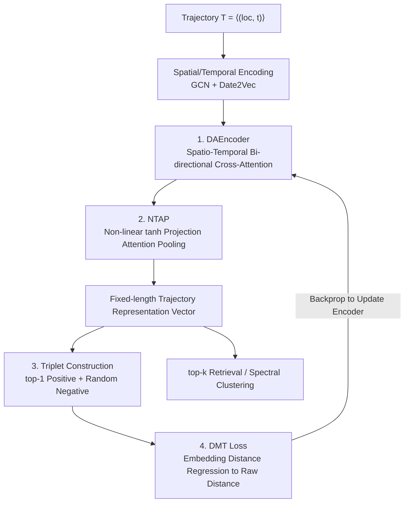

# TRIDENT: Cross-Domain Trajectory Spatio-Temporal Representation via Distance-Preserving Triplet Learning

**Conference**: ICLR 2026  
**OpenReview**: [https://openreview.net/forum?id=gOk3o4lMRD](https://openreview.net/forum?id=gOk3o4lMRD)  
**Area**: Spatio-Temporal Sequences / Trajectory Representation Learning / Self-Supervised Metric Learning  
**Keywords**: Trajectory Similarity, Spatio-Temporal Representation, Triplet Learning, Distance Preservation, Cross-Domain Generalization

## TL;DR
TRIDENT utilizes a unified architecture (GCN spatial embedding + Date2Vec temporal embedding + Bi-directional Cross-Attention Encoder + non-linear tanh projection pooling) to simultaneously model continuous GPS trajectories and discrete badminton hit-point trajectories. It introduces a "Distance-Preserving Multi-kernel Triplet Loss" to align distances in the embedding space with the original trajectory space, consistently outperforming strong baselines in retrieval accuracy, training efficiency, and cross-domain generalization.

## Background & Motivation

**Background**: Trajectory clustering and similarity retrieval are core tasks in spatio-temporal data mining. Mainstream approaches are divided into two categories: hand-crafted distances (EDR, Hausdorff, TP, etc.) that calculate similarity directly on raw coordinates, and deep methods (NeuTraj, ST2Vec, TrajCL, etc.) that learn task-related trajectory representations from data for nearest neighbor retrieval in the embedding space.

**Limitations of Prior Work**: Most existing methods assume trajectories are smooth, continuous, and densely sampled movements (typical of taxi GPS trajectories), thus failing in three areas. First, poor generalization—datasets with different sampling rates, lengths, or movement styles require redesigning distances and model components. Second, weak spatio-temporal fusion—point-level methods focus on local spatial dependencies while shape-level methods focus on global outlines, making it difficult to encode "temporal order" and "spatial sequence structure" simultaneously. Third, vulnerability to noise—GPS drift in urban canyons, irregular sampling, and inter-annotator differences in video labeling (left/right foot, forefoot/heel) distort trajectories and derived features.

**Key Challenge**: Discrete event-driven trajectories (e.g., badminton: recorded stroke-by-stroke, returning to the center after hits, turn-based temporal structure) and continuous GPS trajectories follow completely different movement mechanisms, with non-overlapping spatio-temporal dynamics. However, existing SOTA methods favor continuous smooth trajectories and almost fail on badminton data (HR@10 typically ranges from 0.01 to 0.08). Furthermore, classic contrastive/triplet losses only constrain relative ranking (positives closer than negatives) rather than absolute distances, which can collapse local neighborhoods or exaggerate far distances, leading to dimensional collapse and geometric distortion.

**Goal**: To use **a unified architecture + a unified loss** capable of learning both continuous movement trajectories and discrete action sequence trajectories, while maintaining the original spatio-temporal geometry and removing sensitive dependencies on hyperparameters (margin, temperature, positive-negative ratio, hard negative mining).

**Key Insight**: The authors argue that geometric distortion in metric learning stems from losses focusing on ranking rather than distance magnitude. They categorize taxi trajectories (low curvature, continuous) and badminton trajectories (high curvature, discrete) as extremes of the trajectory spectrum, assuming that if an architecture can handle both, intermediate forms (basketball, football) are naturally covered. The solution is to replace "ranking loss" with "distance regression."

**Core Idea**: Use "Distance-Preserving Triplet Learning" instead of "Ranking-only Triplet Learning"—regressing the anchor-positive/negative distances in the embedding space directly to the ground truth distances in the raw trajectory space, balanced across multiple scales using multi-kernel Gaussian weighting.

## Method

### Overall Architecture
TRIDENT solves the challenge of "one model for both continuous and discrete trajectories while preserving geometry." The pipeline consists of two synergistic paths: the **Representation Path** decomposes a trajectory $T=\langle s_1,\dots,s_n\rangle$ (where $s_i=(loc_i,t_i)$) into spatial embeddings (GCN, projecting coordinates to grid vertices) and temporal embeddings (Date2Vec), feeds them into the **Bi-directional Cross-Attention Encoder (DAEncoder)** for spatio-temporal interaction, and uses **NTAP Non-linear Pooling** to compress variable-length sequences into fixed-length vectors. The **Training Path** uses the similarity measure TP to self-supervise the construction of triplets for each anchor and uses the **DMT Loss** to regress embedding distances to ground truth distances. The learned embeddings are used for top-k retrieval and spectral clustering (badminton tactical analysis).

### Key Designs

**1. DAEncoder: Bi-directional cross-attention between space and time, rather than simple concatenation or gating**

Existing methods either encode only space with occasional temporal attributes or use average pooling/linear attention to crudely mix features, losing cross-segment dependencies and frequency structures. DAEncoder adopts a classic parallel two-way cross-attention with post-scheduling: in each layer, spatial embeddings attend to temporal ones, and temporal embeddings then attend to the updated spatial ones, using independent parameters for each direction. Variable lengths and missing steps are handled by learning a CLS token for each representation, generating padding masks based on real lengths, and zeroing out padding positions after positional encoding. The authors deliberately **avoid gating or additive fusion**, opting to concatenate the pooled results of both paths to let spatial and temporal information contribute equally—preserving individual semantics while remaining extensible to new attribute branches.

**2. NTAP: Attention pooling with non-linear tanh projection + learnable context vector for discrete event structures**

Discrete trajectories like badminton are characterized by players frequently returning to the center, slicing trajectories into fragments. Ordinary average pooling or linear attention misses cross-segment dependencies. Unlike traditional masked attention pooling that uses a single linear projection for scoring, NTAP adds a non-linear transformation: each feature vector is projected by a learnable matrix and passed through tanh, $u_i=\tanh(W_\omega^\top z_i)$, capturing high-order non-linear interactions between feature dimensions. This highlights sharp turns and high-curvature event points in discrete trajectories while preserving smooth curves in continuous ones. A learnable context vector $u_\omega$ then determines the "perspective for summarizing the sequence," combined with a mask for variable lengths (padding positions set to $-\infty$), resulting in weights $\alpha_i=\mathrm{softmax}(u_\omega^\top u_i+\mathrm{mask}_i)$ and the final weighted sum $r=\sum_i \alpha_i z_i$.

**3. Hyperparameter-free Triplet Construction: top-1 Positive + Random Negative**

Classic triplet/contrastive losses depend heavily on sensitive hyperparameters like margin, temperature, and hard negative mining, which are unstable and distort geometry. TRIDENT constructs triplets via self-supervision using the TP similarity measure: for each anchor trajectory, the single most similar trajectory is taken as the positive sample (capturing the strongest local structural relationship and avoiding over-smoothing from multiple positives). Negative samples are **randomly drawn** from trajectories that are neither the anchor nor its top-1 positive. This "top-1 positive + random negative" approach relies on two motivations: local identity is defined by the nearest neighbor, and the mutual top-1 relationship is a strong inherent constraint. Global geometry is learned through the diversity of random negatives, eliminating the need for user-specified negative-to-positive ratios.

**4. DMT Loss: Regressing embedding distance to real distance with multi-scale Gaussian weighting**

This is the core of the paper. Unlike classic triplet losses that only enforce relative order $d'_{ap}<d'_{an}$ and ignore distance magnitude—damaging retrieval precision and generalization—DMT changes "ranking" to "distance alignment." Let $d'_{ap}=\|A'-P'\|_2$ and $d'_{an}=\|A'-N'\|_2$ be embedding distances, and $d_{ap}, d_{an}$ be ground truth distances. The goal is to minimize the squared error $E^2=(d'-d)^2$. To prevent large distance deviations from dominating, the authors introduce **multi-kernel Gaussian reweighting**. Using the median distance within a batch as the base bandwidth $\sigma_\mathrm{base}=\mathrm{median}(d)$, they multiply it by fixed factors $m=[0.5,1.0,2.0]$ to obtain $\kappa$ scales of $\sigma$. Each kernel provides a weight:

$$W=\exp\!\left(-\frac{d^2}{2\sigma^2+\epsilon}\right)\in\mathbb{R}^{2b\times\kappa}.$$

Small $\sigma_k$ emphasizes precise matching for small distances (local neighborhood), while large $\sigma_k$ distributes attention to large distances (global structure). The loss for each scale is normalized: $\ell_k=\frac{\mathbf{1}^\top(W\odot E^2)_{:,k}}{\mathbf{1}^\top W_{:,k}+\epsilon}$, and the final average is taken over $\kappa$ scales: $L_\mathrm{dmt}=\frac{1}{\kappa}\sum_k \ell_k$. This prevents smaller kernels from being drowned out by large distances while keeping global kernels from being distracted by local noise.

### Loss & Training
The final training objective is the DMT loss $L_\mathrm{dmt}$, which requires no margin, temperature, or hard negative mining. The Trajectory Pattern (TP) distance is chosen as the "ground truth distance" for triplet construction and regression because it is less dependent on sequence order and naturally fits nearest neighbor matching. Multi-kernel multipliers are fixed at $[0.5, 1.0, 2.0]$, making the design virtually parameter-free.

## Key Experimental Results

### Main Results
Tested on three datasets (Badminton, T-Drive, Rome) using HR@10, HR@50, and R10@50.

| Dataset | Metric | TRIDENT | Prev. SOTA | Note |
|--------|------|---------|----------|------|
| Badminton | HR@10 | **0.190** | 0.084 (TrajCL) | Discrete trajectories, largest gain |
| Badminton | R10@50 | **0.484** | 0.212 (ST2Vec) | More than double |
| T-Drive | HR@10 | **0.564** | 0.496 (ST2Vec) | Continuous GPS |
| T-Drive | R10@50 | **0.916** | 0.844 (ST2Vec) | — |
| Rome | HR@10 | **0.535** | 0.479 (ST2Vec) | Cross-city continuous GPS |
| Rome | R10@50 | **0.913** | 0.830 (ST2Vec) | — |

On average, TRIDENT outperforms baseline means by 271% / 96% / 127% on Badminton / T-Drive / Rome, respectively. Training time was reduced by 34.8% and 72.4% compared to SOTA on Badminton and T-Drive, with 8.3% lower average query latency.

### Ablation Study

| Configuration | T-Drive HR@10 | Description |
|------|---------------|------|
| DMT + DAEncoder (Full) | **0.5643** | Full model |
| DMT + Transformer | 0.5038 | High capacity, unstable on small data |
| DMT + BiLSTM | 0.5168 | Insufficient for complex patterns |
| DMT + GRU | 0.4044 | Most apparent underfitting |
| Pairwise Logistic CL + DAE | 0.5481 | Performance drop with loss change |
| Siamese Contrastive + DAE | 0.2201 | Contrastive loss fails significantly |
| RBF-Triplet + DAE | 0.5094 | Standard kernel triplet inferior to DMT |

| Pooling Method | Badminton HR@10 | T-Drive HR@10 |
|----------|-----------------|---------------|
| None | 0.1477 | 0.5540 |
| Std-AP (Standard Attention Pooling) | 0.1444 | 0.5506 |
| **NTAP** | **0.1978** | **0.5643** |

### Key Findings
- **DMT loss is the primary contributor**: Changing DMT to Siamese Contrastive caused T-Drive HR@10 to plummet from 0.5643 to 0.2201, proving that "distance preservation" is more critical than simple ranking.
- **NTAP provides significant gain for discrete trajectories**: On Badminton, NTAP (0.1978) improved HR@10 by ~34% compared to Std-AP (0.1444), validating its design for discrete event structures.
- **Robustness to data variety**: HR@10 on T-Drive only slightly dropped from 0.5643 to 0.5195 when training data was reduced to 50%.
- **Competitive cross-domain transfer**: TRIDENT retains ~31% performance in T-Drive↔Rome tests, whereas ST2Vec almost drops to zero (HR@10=0.0019).

## Highlights & Insights
- **Shifting metric learning from ranking to distance regression**: Replacing margin-tuning with absolute distance regression preserves geometry and removes numerous hyperparameters—a strategy transferable to other retrieval tasks (e.g., molecules, user behavior).
- **Multi-kernel weighting solves scale inequality**: Adaptive bandwidth based on batch medians allows local and global structures to be handled independently within a unified loss.
- **Unified architecture for extreme trajectory types**: Proving generalization using continuous taxi and discrete badminton data is logical; NTAP specifically addresses the needs of discrete high-curvature events.
- **Downstream tactical utility**: Applying spectral clustering to learned embeddings revealed interpretable badminton tactics (e.g., "net-lift-smash cycle"), providing a "discovery-to-validation" loop that outperforms clustering on raw coordinates.

## Limitations & Future Work
- **Significant performance drop in zero-shot cross-city transfer**: T-Drive↔Rome performance drop indicates that while the architecture is unified, the models are still dataset-specific due to intrinsic distribution differences in road networks.
- **Dependency on TP distance**: TRIDENT's representation quality is bound to the accuracy of the TP distance used as ground truth.
- **Limited dataset variety**: Evaluations are mostly limited to single-player badminton and taxis; generalizations to pedestrian trajectories or basketball remain to be validated.
- **Absolute retrieval accuracy is still low**: An HR@10 of 0.190 for Badminton highlights the inherent difficulty of discrete high-curvature trajectory modeling.

## Related Work & Insights
- **vs ST2Vec / TrajCL (Contrastive Learning)**: These rely on positive/negative sampling. TrajCL lacks anchor constraints, leading to blurred cluster boundaries in t-SNE. TRIDENT's top-1 positive anchor + distance regression produces significantly clearer boundaries.
- **vs NeuTraj / ConDTC**: These methods almost fail on discrete badminton data (HR@10 only 0.009), exposing their bias toward smooth continuous trajectories.
- **vs Traditional Distances (EDR / Hausdorff / TP)**: Hand-crafted distances force a choice between local detail and global shape; TRIDENT distills TP's spatio-temporal balance into a learnable embedding, gaining generalization and search efficiency.

## Rating
- Novelty: ⭐⭐⭐⭐ Shifting triplet loss to multi-kernel distance regression is a novel approach to preserving geometry.
- Experimental Thoroughness: ⭐⭐⭐⭐ Extensive ablations and cross-domain tests, though more discrete trajectory types could be added.
- Writing Quality: ⭐⭐⭐ Formulas and frameworks are clear, though some notation (e.g., $\tau$) is inconsistently defined.
- Value: ⭐⭐⭐⭐ Unified architecture + zero-parameter loss + high efficiency makes it highly practical for spatio-temporal retrieval and sports analytics.

<!-- RELATED:START -->

## Related Papers

- [\[ICLR 2026\] STORM: Synergistic Cross-Scale Spatio-Temporal Modeling for Weather Forecasting](storm_synergistic_cross-scale_spatio-temporal_modeling_for_weather_forecasting.md)
- [\[ICLR 2026\] ST-HHOL: Spatio-Temporal Hierarchical Hypergraph Online Learning for Crime Prediction](st-hhol_spatio-temporal_hierarchical_hypergraph_online_learning_for_crime_predic.md)
- [\[ICLR 2026\] GTM: A General Time-series Model for Enhanced Representation Learning](gtm_a_general_time-series_model_for_enhanced_representation_learning_of_time-series.md)
- [\[ICLR 2026\] TEN-DM: Topology-Enhanced Diffusion Model for Spatio-Temporal Event Prediction](ten-dm_topology-enhanced_diffusion_model_for_spatio-temporal_event_prediction.md)
- [\[ICLR 2026\] Uni-NTFM: A Unified Foundation Model for EEG Signal Representation Learning](uni-ntfm_a_unified_foundation_model_for_eeg_signal_representation_learning.md)

<!-- RELATED:END -->
