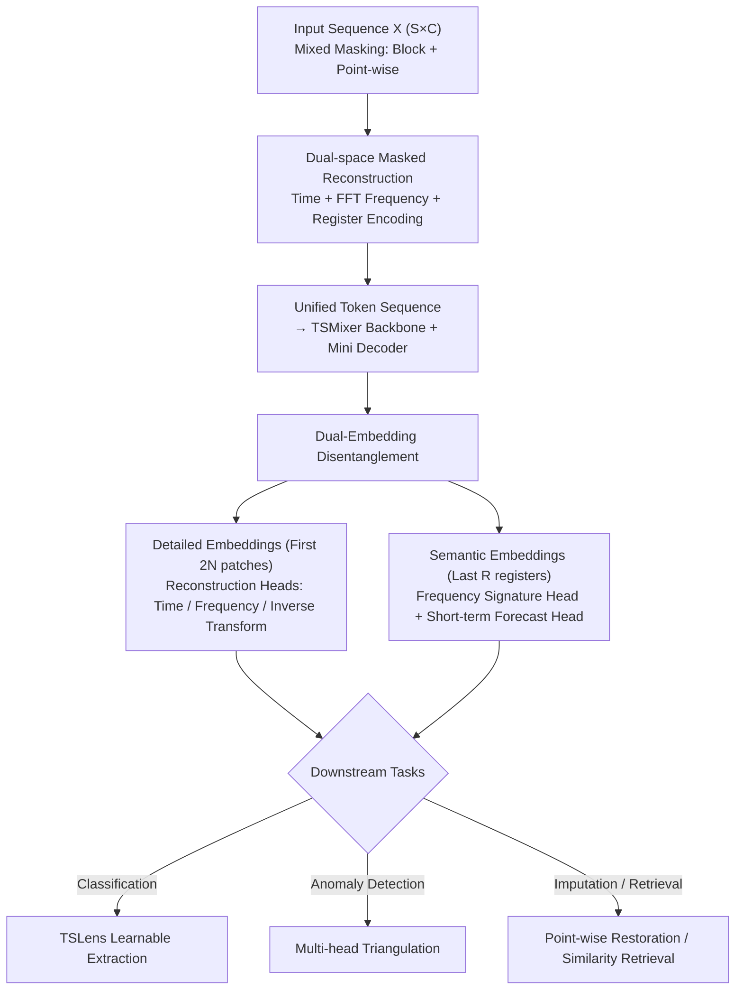

# TSPulse: Tiny Pre-Trained Models with Disentangled Representations for Rapid Time Series

**Conference**: ICLR 2026  
**arXiv**: [2505.13033](https://arxiv.org/abs/2505.13033)  
**Code**: [https://huggingface.co/ibm-granite/granite-timeseries-tspulse-r1](https://huggingface.co/ibm-granite/granite-timeseries-tspulse-r1)  
**Area**: Time Series  
**Keywords**: Time Series Pre-trained Model, Disentangled Representations, Dual-Space Reconstruction, Anomaly Detection, Tiny Model

## TL;DR

Ours proposes TSPulse, an ultra-lightweight time series pre-trained model with only 1M parameters. Through dual-space masked reconstruction and dual-embedding disentanglement strategies, it outperforms models 10-100 times larger in four major tasks: classification (+5-16%), anomaly detection (+20%), imputation (+50%), and similarity retrieval (+25%).

## Background & Motivation

Time series analysis encompasses various downstream tasks such as forecasting, anomaly detection, imputation, classification, and retrieval. Recently, drawing inspiration from success in NLP and CV, the time series community has explored large-scale pre-trained models:

**Specialized Models**: TimesFM, Chronos, and Moirai focus on forecasting tasks.

**General-purpose Models**: Moment and UniTS extend to classification, anomaly detection, and imputation.

**Cross-domain Models**: Time-LLM and GPT4TS attempt to adapt LLMs to time series.

**Key Challenge**: **Existing pre-trained models have massive parameter counts** (hundreds of millions to billions), leading to high deployment and fine-tuning costs. While TTM proved that compact models with 1-5M parameters can provide competitive performance in forecasting, they are limited to that specific task.

**Goal**: **Can a pre-trained model with ~1M parameters be constructed to achieve SOTA across various non-forecasting diagnostic tasks?**

## Method

### Overall Architecture

TSPulse aims to excel in four types of "diagnostic" tasks—classification, anomaly detection, imputation, and similarity retrieval—using 1M-level parameters instead of serving only forecasting. It is built on TSMixer, an all-MLP lightweight backbone. An input segment $\mathbf{X} \in \mathbb{R}^{S \times C}$ is first processed with mixed masking, then encoded through three paths: time domain, frequency domain, and registers. These are concatenated into a unified token sequence, passed through the TSMixer backbone and a mini-decoder. The tokens are then explicitly split into two groups: the leading part preserves fine-grained details, while the trailing part encodes global semantics. During pre-training, these two embedding sets are forced by reconstruction heads and high-level task heads to become complementary and disentangled representations. For downstream tasks, classification uses a learnable extractor called TSLens to replace pooling, and anomaly detection utilizes multi-head triangulation by reusing multiple pre-trained reconstruction heads, neither of which requires re-training the backbone. The **Key Insight** is to make representations complementary in different spaces (time/frequency) and disentangled at different granularities (detail/semantics), allowing downstream tasks to select what they need.

### Key Designs

**1. Dual-space Masked Reconstruction: Complementary blind-spot filling between domains with mixed masking for realistic corruption**

In time series, some patterns are naturally observed in the time domain (spikes, glitches), while others are prominent in the frequency domain (periodicity, overall rhythm). Reconstructing in a single space systematically misses one type of signal. TSPulse reconstructs masked inputs in both time and frequency domains simultaneously. The time-domain masked signal $\mathbf{X}_m$ is passed through FFT to obtain the frequency-domain representation $\mathbf{X}^f_m$. A clever design choice is that **masking is not explicitly performed in the frequency domain**; instead, time-domain masking naturally propagates to the frequency domain via FFT, avoiding the difficulty of defining "local loss" on the spectrum. The time, frequency, and register paths are encoded and concatenated into a unified sequence $\mathbf{Input}_E = [\mathbf{Time}_E; \mathbf{FFT}_E; \mathbf{Reg}_E] \in \mathbb{R}^{C \times K \times D}$. The backbone sees both perspectives in one sequence, allowing reconstruction in either space to leverage information from the other.

The masking form is also critical. Traditional block masking assumes continuous missing segments, but real-world missing data is often scattered, point-wise, and irregular. TSPulse uses **mixed masking**, masking both entire patches and scattered point-wise positions. Masking tokens $\mathbf{M} \in \mathbb{R}^{1 \times pl}$ are defined at the original patch level rather than the embedding space, supporting flexible partial masking. Ablations show that without mixed pre-training, performance drops by 79% under mixed-masking evaluation.

**2. Dual-Embedding Disentanglement: Separating details from semantics**

Downstream tasks have different requirements for information granularity: imputation requires point-wise fine-grained restoration, while classification only cares about global semantics. TSPulse splits tokens into two groups and uses different objectives to force disentanglement: the first $2N$ patch embeddings serve as **detailed embeddings**, responsible for full reconstruction and preserving fine-grained patterns; the last $R$ register embeddings are **semantic embeddings**, specifically encoding global features. Semantic embeddings are supervised not by point-wise reconstruction but by two high-level tasks: frequency signature prediction $\mathcal{L}_{prob} = \text{CE}(\mathbf{X}^f_{prob}, \mathbf{Y}^f_{prob})$ (softmax distribution of the log-amplitude spectrum) and short-term forecasting $\mathcal{L}_{future} = \text{MSE}(\mathbf{X}_{future}, \mathbf{Y}_{future})$. Sensitivity analysis confirms that semantic embeddings are robust to noise, amplitude changes, and time shifts, while remaining sensitive to frequency and shape.

**3. TSLens: A learnable alternative to classification pooling**

Standard practice uses average or max pooling on tokens before the classification head, which treats all features equally and loses information about discriminative patches. TSLens is a learnable extractor inserted during fine-tuning: dual embeddings ($\mathbf{Backbone}_E \in \mathbb{R}^{C \times (2N+R) \times D}$) pass through a mini-decoder initialized with pre-trained weights (with channel-mixing enabled), followed by dimension reduction, flattening, and a linear head. It dynamically focuses on the most informative parts of the representations. Replacing it with avg-pool or max-pool results in an 11% and 16% performance drop, respectively.

**4. Multi-head Triangulation Anomaly Detection: Cross-locating anomalies from three perspectives**

Different types of anomalies appear in different reconstruction targets—spikes show large time-domain deviation, periodicity breaks in the frequency domain, and trend shifts in short-term forecast deviation. TSPulse reuses three pre-trained heads for scoring: $\text{Head}_{time}$ captures spikes, $\text{Head}_{fft}$ captures periodic anomalies, and $\text{Head}_{future}$ captures trend anomalies. Fusion is achieved via $\text{Head}_{ensemble}$ (taking the maximum) or $\text{Head}_{triang.}$ (selecting the best head on a small validation set).

### Loss & Training

Pre-training minimizes a multi-objective weighted loss: time reconstruction $\mathcal{L}_{time1} = \text{MSE}(\mathbf{X}, \mathbf{Y})$ (masked positions only), time reconstruction via inverse FFT $\mathcal{L}_{time2} = \text{MSE}(\mathbf{X}, \mathbf{Y}')$, frequency reconstruction $\mathcal{L}_{fft} = \text{MSE}(\mathbf{X}^f, \mathbf{Y}^f)$, frequency signature $\mathcal{L}_{prob} = \text{CE}(\mathbf{X}^f_{prob}, \mathbf{Y}^f_{prob})$, and short-term forecasting $\mathcal{L}_{future} = \text{MSE}(\mathbf{X}_{future}, \mathbf{Y}_{future})$.

For training, pre-training uses a channel-independent mode to ensure generality, but fine-tuning often requires channel-mixing. To prevent gradient instability when adding new mixing layers, TSPulse starts these layers with **identity weights** (initially an identity mapping, causing zero perturbation to pre-trained representations). Omitting this identity initialization leads to a 9% drop in classification. Pre-training on ~1B samples takes one day using 8×A100 GPUs.

## Key Experimental Results

### Anomaly Detection (TSB-AD Benchmark, Figure 4)

| Method | Univariate VUS-PR | Multivariate VUS-PR |
|------|-------------|-------------|
| Sub-PCA (Prev. SOTA) | 0.42 | - |
| CNN (Prev. SOTA) | - | 0.31* |
| MOMENT (ZS) | 0.38 | - |
| **TSPulse (ZS)** | **0.48** (+Gain 14%) | **0.36** (+Gain 16%) |
| **TSPulse (FT)** | **0.52** (+Gain 24%) | **0.36** (+Gain 26%*) |

### Classification (UEA 29 Datasets, Figure 5)

| Method | Parameters | Avg. Accuracy |
|------|--------|----------|
| VQShape | ~37M | 0.701 |
| MOMENT | ~110M | 0.675 |
| UniTS | ~10M | 0.634 |
| **TSPulse** | **~1M** | **0.733** (+Gain 5-16%) |

### Imputation (6 LTSF Benchmarks, Figure 6 - Mixed Masking)

| Method | Setting | Avg. MSE↓ |
|------|------|----------|
| MOMENT | ZS | 0.276 |
| UniTS (PMT) | PMT | 0.170 |
| **TSPulse** | **ZS** | **0.074** (+Gain 56-73%) |
| TimesNet | FT | 0.080 |
| **TSPulse** | **FT** | **0.039** (+Gain 49-51%) |

### Ablation Study (Table 1)

**Classification Ablation**:

| Variant | Accuracy | Drop |
|------|--------|------|
| TSPulse (Full) | 0.747 | - |
| w/o Short Embedding | 0.689 | -8% |
| w/o Long Embedding | 0.681 | -10% |
| w/o Masking | 0.691 | -8% |
| w/o CM Identity Init | 0.685 | -9% |
| w/o TSLens (Avg-Pool) | 0.675 | -11% |
| w/o TSLens (Max-Pool) | 0.645 | -16% |
| w/o Dual-space | 0.696 | -7% |

### Efficiency (Table 23)

| Model | Params (M) | GPU Inference (ms) | CPU Inference (s) | Memory (GB) |
|------|---------|------------|-----------|---------|
| **TSPulse** | **1.06** | **7.16** | **0.06** | **0.39** |
| MOMENT (small) | 35.34 (33×) | 32.57 (5×) | 2.74 (46×) | 0.56 |
| MOMENT (large) | 341.24 (322×) | 405.42 (57×) | 21.98 (366×) | 2.30 |
| Chronos (tiny) | 8.39 (8×) | 39.81 (6×) | 66.15 (1103×) | 2.91 |

### Key Findings

1. **1M parameters beats models 10-100x larger**: Model size is not the sole determinant; architectural design is equally important.
2. **Dual-space learning is essential**: Removing the frequency branch drops classification by 7% and imputation by 8%.
3. **Mixed masking is key for imputation**: Pure block masking results in a 79% performance crash under mixed-masking evaluation.
4. **TSLens significantly outperforms standard pooling**: Drops of 11-16% prove the value of learned attention.
5. **Semantic embeddings in Register tokens are robust to distortion**: They are insensitive to noise and amplitude changes but sensitive to frequency and shape.

## Highlights & Insights

- **"Small is beautiful" philosophy**: 1M parameters is sufficient with sophisticated architecture (dual-space, dual-embedding, multi-head triangulation).
- **Value of disentangled representations**: Separating fine-grained and semantic embeddings allows tasks to select optimal representations.
- **Triangulation for anomaly detection**: Different heads naturally specialize in different anomalies; fusion outperforms single perspectives.
- **Zero-shot superiority**: TSPulse zero-shot anomaly detection exceeds models trained on target data.
- **CPU-Friendly**: A 0.06s CPU inference time enables GPU-free deployment.
- **IBM Granite Series**: Open-sourced on HuggingFace for high practicality.

## Limitations & Future Work

1. Currently does not cover forecasting, although TTM has validated compact model capabilities there.
2. Pre-training data covers specific domains (energy, traffic); transferability to other domains needs further validation.
3. Univariate pre-training + multivariate fine-tuning may not be optimal.
4. Lacks incremental learning: Cannot update continuously without forgetting.
5. Few-shot classification remains to be explored.

## Related Work & Insights

- **TTM (Tiny Time Mixers)**: Pioneer in compact pre-trained models, but limited to forecasting.
- **MOMENT**: General-purpose foundation model, T5-encoder based, 35-341M parameters.
- **Chronos**: T5-style encoder-decoder for forecasting.
- **TSMixer**: The backbone for TSPulse, an MLP-Mixer alternative to Transformer.
- **Insight**: Compact models + task-specialized pre-training + refined post-processing = efficient yet powerful foundation model paradigm.

## Rating

- Novelty: ⭐⭐⭐⭐⭐ (Combination of dual-space disentanglement, multi-head triangulation, and mixed masking)
- Experimental Thoroughness: ⭐⭐⭐⭐⭐ (75+ datasets, 4 major tasks, comprehensive ablation, efficiency analysis)
- Writing Quality: ⭐⭐⭐⭐ (Detailed content, clear logic, extensive appendix)
- Value: ⭐⭐⭐⭐⭐ (1M parameters beating massive models, open-source, deployment-friendly)

<!-- RELATED:START -->

## Related Papers

- [\[ICLR 2026\] SwiftTS: A Swift Selection Framework for Time Series Pre-trained Models via Multi-task Meta-Learning](swiftts_a_swift_selection_framework_for_time_series_pre-trained_models_via_multi.md)
- [\[ICLR 2026\] SRT: Super-Resolution for Time Series via Disentangled Rectified Flow](srt_super-resolution_for_time_series_via_disentangled_rectified_flow.md)
- [\[ICLR 2026\] Learning Recursive Multi-Scale Representations for Irregular Multivariate Time Series Forecasting](learning_recursive_multi-scale_representations_for_irregular_multivariate_time_s.md)
- [\[ICLR 2026\] When Foundation Models Are One-Liners: Limitations and Future Directions for Time Series Anomaly Detection](when_foundation_models_are_one-liners_limitations_and_future_directions_for_time.md)
- [\[ICLR 2026\] Learning Koopman Representations with Controllability Guarantees](learning_koopman_representations_with_controllability_guarantees.md)

<!-- RELATED:END -->
