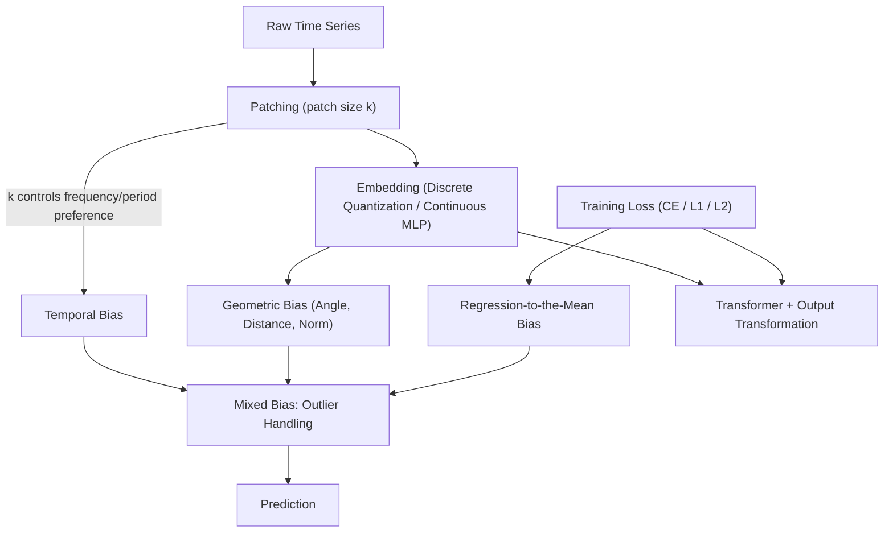

# Understanding the Implicit Biases of Design Choices for Time Series Foundation Models

**Conference**: ICLR 2026  
**OpenReview**: [https://openreview.net/forum?id=5jkzTzV5Ao](https://openreview.net/forum?id=5jkzTzV5Ao)  
**Code**: https://github.com/amazon-science/TSFM-Biases (Available)  
**Area**: Time Series Foundation Models  
**Keywords**: Time Series Foundation Models, Inductive Bias, patch size, Quantized Embedding, Loss Function

## TL;DR
This paper does not propose a new model or chase SOTA. Instead, it systematically maps three common design knobs of Time Series Foundation Models (TSFM)—patch size, embedding method (discrete quantization vs. continuous), and training loss (CE vs. L1/L2)—to three types of "implicit biases" (temporal, geometric, and regression-to-the-mean). Through theory and controlled experiments, it illustrates how each knob shapes the model's preference for frequency/periodicity, geometric structure, and predictive form under uncertainty, showing how these biases intertwine in scenarios like outlier handling.

## Background & Motivation
**Background**: TSFMs (e.g., Chronos, Chronos-Bolt, Moirai, TimesFM, Time-MoE) are becoming general-purpose tools for forecasting. The standard practice involves patching time series, embedding them into a Transformer latent space, and decoding predictions. Researchers tune knobs (patch size, embedding strategy, loss function) based on naive intuition: adjacent points should be mapped closely, low frequencies are more stable/informative than high frequencies, and regression algorithms should regress to the mean.

**Limitations of Prior Work**: This tuning process revolves around trial and error on mature benchmarks like M4, ETT, Electricity, and Traffic to obtain a "better" model. However, these improvements often fail over time—when data volume or compute scales up, or when data properties differ from the training benchmarks (e.g., chaotic systems, quasi-periodic signals), the same knob settings can yield completely different or even harmful effects.

**Key Challenge**: Design choices encode "implicit biases" into the model, and the utility of these biases is **data-dependent**. Intuitive biases beneficial on standard benchmarks (large patches, continuous embeddings, continuous loss) may be detrimental on data with different properties, where the opposite settings might be superior. The community lacks clarity on what biases each knob introduces, especially on data that deviates from standard benchmarks.

**Goal**: Rather than inventing "yet another" model, this work aims to clarify the effects (implicit biases) encoded by design decisions regarding patch size, embedding, and loss, and how these effects vary with data and model properties.

**Key Insight**: Each type of design knob is mapped to a fundamental model property (temporal behavior, geometric structure, and aggressiveness of regression-to-the-mean). This is supported by theoretical characterization and controlled experiments. For comparability, the authors primarily contrast Chronos and Chronos-Bolt—they share the same T5 backbone size and similar training corpora but represent opposite poles in major design choices (Chronos: no patches, 4096-bin quantized embedding, CE loss; Chronos-Bolt: patch=16, MLP continuous embedding, L1 quantile regression loss).

**Core Idea**: An analytical framework using three sets of correspondences (patch size $\to$ temporal bias, embedding $\to$ geometric bias, loss $\to$ regression-to-the-mean bias) is used to decompose model behavior into interpretable, tunable biases, pointing out that no single knob setting is universally optimal for all forecasting scenarios.

## Method

### Overall Architecture
The TSFM inference pipeline follows a fixed flow: the raw series is **patched** into length $k$ segments, **embedded** into the Transformer latent space, modeled by the **Transformer**, and finally decoded via **output transformation**. The core argument is that three knobs inject biases at specific stages: patch size injects **temporal bias** during patching, embedding method injects **geometric bias** during embedding, and the loss function injects **regression-to-the-mean bias** during output/training. The "Key Designs" section deconstructs these biases, while the fourth part examines how they **overlap and intertwine** in outlier handling.

### Key Designs

**1. Temporal Bias: Patch size determines spectral preference and periodic alignment.**

This bias concerns how TSFMs learn temporal patterns, split into frequency and periodic perspectives. Frequency bias refers to whether a model favors low or high frequencies. The key insight is that frequency bias is injected the moment the sequence is **embedded**. For an embedding function $\phi:\mathbb{R}^k\to\mathbb{R}^d$ mapping a patch of length $k$, Theorem 1 characterizes the "dimension" of the column space using $\varepsilon$-rank and stable rank $\text{stab-rank}(\phi(V))=\|\phi(V)\|_F/\|\phi(V)\|_2$: **patches with similar frequencies are embedded into the same low-dimensional subspace** ($\text{stab-rank}=O(\omega)$ where $\omega$ is bandwidth), while **patches with vastly different frequencies are embedded into near-orthogonal subspaces** ($\text{stab-rank}=\Omega(n)$).

Patch size $k$ acts as a switch: when $k$ is small, all patches must have $\omega\le k$, keeping the bandwidth narrow and maintaining high-frequency information. When $k$ is large (e.g., 16 in Chronos-Bolt), low and high frequencies are split into orthogonal subspaces; during training, $W_Q, W_K, W_V$ align more with the low-frequency subspace, causing the model to miss high-frequency or chaotic signals. Experiments (Fig. 3) show $k=16$ models have significantly higher spectral loss on high-frequency modes compared to $k=1$. Periodic bias is controlled by whether patch size divides the motif period, the architecture (bidirectional encoder vs. unidirectional decoder), and the presence of unmasked `[REG]` tokens. Mismatched patch sizes introduce aliasing, while `[REG]` tokens can pollute periodic channels via self-attention.

**2. Geometric Bias: Discrete vs. continuous embedding determines fidelity of angle, distance, and norm.**

This bias concerns how embeddings twist the inner-product geometry of the input domain. Continuous embeddings $\phi_C$ (MLP) preserve the topology of $\mathbb{R}$ by nature. Quantized embeddings $\phi_Q$ split the real axis into bins with initial random vectors; the order relationship must be relearned during training. The authors measure this via:

- **Angle (Locality)**: $\theta(x,y)=\arccos\!\big(\tfrac{|\phi(x)\cdot\phi(y)|}{\|\phi(x)\|_2\|\phi(y)\|_2}\big)$. For quantized embeddings, $\theta_Q$ increases significantly more with $|x-y|$ than $\theta_C$, making inputs appear "more different" from neighbors. Consequently, Chronos' self-attention is bimodal (focusing strongly on neighbors), excelling at "parrot-like" copying of chaotic systems but weakening global context mixing.
- **Distance (Scale)**: $d(x,y)=\tfrac{\|\phi(x)-\phi(y)\|_2}{\|\phi(x)\|_2+\|\phi(y)\|_2}$. Continuous embeddings induce a distance bias that makes fine-scale patterns harder to learn. Quantization instead amplifies small scales, making adjacent values more separable in latent space. In multi-scale experiments, only Chronos handles small-scale components well as the scale ratio increases.
- **Norm (Offset)**: Due to ReLU's positive homogeneity, $\phi_C$ maps large values to large-norm vectors, allowing high-magnitude motifs to "suppress" low-magnitude ones. Quantized embeddings, initialized identically per bin, show no norm preference, treating inputs more uniformly. This is beneficial for sparse signals (identifying non-zero values) but disadvantageous for standard multi-offset signals.

**3. Regression-to-the-Mean Bias: Loss functions determine whether to compromise or bet on a mode.**

When the future is stochastic, this bias determines if a model converges to a central prediction or maintains a sharp/multimodal result. Mechanisms are driven by training loss: **L2 loss favors the mean** (averaging results), **L1 loss favors the median** (splitting probability mass), and **Cross-Entropy models the full distribution**, allowing predictions to land on a specific **"mode"**. This avoids "averaging out" results, faithfully representing high-variance, heterogeneous distributions.

Bridge experiments (Fig. 8) quantify this: for a periodic walk with diffusion probability $p$, a "regression score" $\min(|\hat y|,|1-\hat y|)$ measures predictive shrinkage. As uncertainty increases, TimesFM (L2 $\to$ mean) and Chronos-Bolt (L1 $\to$ median) regress more aggressively, while Chronos (CE) regresses the least, even copying individual branches in chaotic (Lorentz) systems. This suggests that while low MAE/MSE is usually prioritized, "regression-to-the-mode" reflects sharp high-probability outcomes rather than smoothed trends.

**4. Mixed Bias: Outlier handling as a real-world case of bias entanglement.**

Using sine waves with injected outliers, the authors observe three biases active simultaneously: ① **Temporal Bias**—comparing $k=1$ vs. $k=16$ Chronos-Bolt, $k=1$ is better without outliers, but large patches excel at denoising high-frequency disturbances by averaging over wider windows. ② **Geometric (Distance) Bias**—under light pollution, Chronos uses quantization to squash extremes into adjacent bins, preventing isolated spikes from dominating local distances. **Geometric (Norm) Bias**—continuous embeddings in Chronos-Bolt make outlier vectors too large, pulling attention toward outlier steps. ③ **Regression-to-the-Mean Bias**—Chronos performs well on average but with higher variance, as its "mode-seeking" tendency occasionally predicts an outlier itself.

## Key Experimental Results

### Main Results: Distance Bias—Relative error of small-scale components in multi-scale signals

| Scale Ratio | Chronos (Small) | Bolt (Small) | TimesFM (Small) | Moirai (Small) |
|-------------|-----------------|--------------|-----------------|----------------|
| 1           | 1.000           | 1.000        | 1.000           | 1.000          |
| 4           | 1.076           | 1.221        | 1.380           | 1.192          |
| 8           | 1.188           | 1.369        | 1.512           | 1.319          |
| 20          | 1.360           | 1.726        | 2.018           | 1.771          |
| 40          | **1.556**       | 2.679        | 3.201           | 2.482          |

> Chronos (quantized) shows the slowest error growth on small scales (1.556 at ratio 40), while continuous embedding models worsen faster, confirming that continuous embedding induces distance bias detrimental to fine scales.

### Ablation Study: Norm Bias—Relative error of low-offset components in multi-offset signals

| Offset Gap | Chronos (Low) | Bolt (Low) | TimesFM (Low) | Moirai (Low) |
|------------|---------------|------------|---------------|--------------|
| 1          | 1.000         | 1.000      | 1.000         | 1.000        |
| 4          | 1.069         | 1.219      | 1.381         | 1.423        |
| 8          | 1.108         | 1.357      | 1.478         | 1.552        |
| 20         | 1.342         | 2.185      | 2.688         | 2.826        |
| 40         | **1.622**     | 3.162      | 3.417         | 3.615        |

> Continuous embeddings with ReLU map small values to small-norm vectors, which are easily obscured by large-magnitude contexts; hence, errors for Bolt/TimesFM/Moirai rise sharply with offset. Quantized Chronos remains much more stable.

### Key Findings
- **No universally optimal knob**: Design choices that work for standard benchmarks (large patches, continuous embedding/loss) can be harmful for chaotic, multi-scale, or outlier-heavy data.
- **Biases injected at the source**: Frequency bias is determined by patch size at the moment of embedding (Theorem 1), rather than emerging deep within the Transformer.
- **The "Parrot" advantage in Chaos**: The combination of quantization and CE allows Chronos to focus on local neighbors and bet on specific modes, explaining its superiority in chaotic systems.
- **Outliers as a litmus test**: Patch size (denoising), distance bias (scaling), norm bias (spike amplification), and regression-to-the-mean (outlier prediction) exert conflicting forces in outlier scenarios.

## Highlights & Insights
- **Shift from SOTA-chasing to Analysis**: The work translates vague "tuning intuition" into a provable, quantifiable map of design knobs to implicit biases.
- **Clever Comparability**: Using Chronos and Chronos-Bolt as a primary contrast provides a "control group" where major knobs are flipped while backbones remain identical.
- **Geometrization of Frequency Bias**: Theorem 1 provides a mathematical explanation for why large patches favor low frequencies using subspace orthogonality.
- **Transferable Diagnostic Tools**: The angle/distance/norm metrics and the regression score probe can be used to diagnose any new TSFM.

## Limitations & Future Work
- **Reliance on the Chronos/Bolt pair**: While other TSFMs are ablated, the deep attribution is centered on this pair; results may vary for more distinct architectures like SSMs or pure decoders.
- **Synthetic signals as primary evidence**: Scenarios like multi-scale or outlier-injected sine waves are designed to isolate specific biases; real-world data might trigger multiple conflicting biases simultaneously.
- **Diagnosis without Prescription**: The paper identifies biases but does not provide a system for dynamic bias adjustment, suggesting in-context learning or RL as potential future directions.

## Related Work & Insights
- **Frequency/Spectral Bias (Rahaman et al., Yu et al.)**: Prior work shows NNs learn low frequencies first; this paper specifies that in TSFMs, patch size is the control knob for this effect.
- **TSFM Empirical Studies (Liang et al., Zhao et al.)**: Unlike cross-benchmark rankings, this work explains *why* different models excel in different settings based on design-induced biases.
- **Tokenization and Architecture Studies (PatchTST, Moirai, etc.)**: While prior works analyze single design points, this paper unifies patch size, embedding, and loss into a single "bias" framework.

## Rating
- Novelty: ⭐⭐⭐⭐⭐ 
- Experimental Thoroughness: ⭐⭐⭐⭐ 
- Writing Quality: ⭐⭐⭐⭐⭐ 
- Value: ⭐⭐⭐⭐⭐ 

<!-- RELATED:START -->

## Related Papers

- [\[ICLR 2026\] Beyond Accuracy: Are Time Series Foundation Models Well-Calibrated?](beyond_accuracy_are_time_series_foundation_models_well-calibrated.md)
- [\[ICLR 2026\] Understanding Transformers for Time Series: Rank Structure, Flow-of-ranks, and Compressibility](understanding_transformers_for_time_series_rank_structure_flow-of-ranks_and_comp.md)
- [\[ICLR 2026\] ICDiffAD: Implicit Conditioning Diffusion Model for Time Series Anomaly Detection](icdiffad_implicit_conditioning_diffusion_model_for_time_series_anomaly_detection.md)
- [\[ICLR 2026\] Adapt Data to Model: Adaptive Transformation Optimization for Domain-shared Time Series Foundation Models](adapt_data_to_model_adaptive_transformation_optimization_for_domain-shared_time_.md)
- [\[ICLR 2026\] FeDaL: Federated Dataset Learning for General Time Series Foundation Models](fedal_federated_dataset_learning_for_general_time_series_foundation_models.md)

<!-- RELATED:END -->
