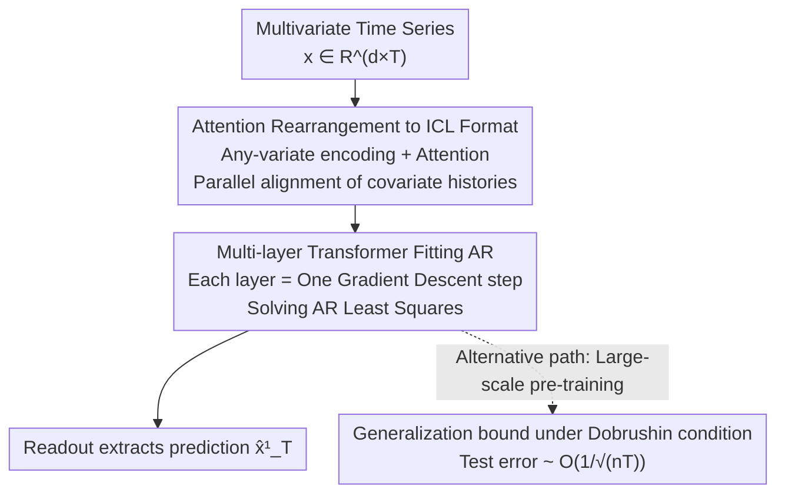

# Understanding Transformers in Time Series Forecasting: A Case Study on MOIRAI

**Conference**: ICLR 2026  
**OpenReview**: [https://openreview.net/forum?id=iAPSx90gwJ](https://openreview.net/forum?id=iAPSx90gwJ)  
**Code**: None  
**Area**: Time Series  
**Keywords**: Time Series Forecasting, Transformer Theory, In-context Learning, Autoregressive, Generalization Bound

## TL;DR
This paper theoretically answers "why Transformers (especially MOIRAI) are so powerful in time series forecasting" by proving that a Transformer can fit an autoregressive (AR) model on input sequences via gradient descent through in-context learning. It further demonstrates how MOIRAI's any-variate encoding and attention mechanism automatically parallelize AR regressions of arbitrary numbers of covariates into a single set of weights, providing a pre-training generalization bound of $O(1/\sqrt{nT})$ under Dobrushin conditions.

## Background & Motivation
**Background**: Transformers have been widely deployed in time series forecasting. "Time series foundation models" such as Chronos, TimesFM, and MOIRAI have achieved remarkable zero-shot forecasting capabilities by pre-training on massive heterogeneous time series data. Research focus has mostly concentrated on architectural modifications (CrossFormer, iTransformer, Autoformer) or data processing (patch embedding, RevIN).

**Limitations of Prior Work**: These works are almost entirely heuristic. While it is known that Transformers are effective, there is no clear explanation of "what specific computations they perform on time series data." Even in the simplest settings, the community lacks rigorous theoretical explanations, and no one has clarified why MOIRAI's "unconventional designs" (flattening multivariate data into a long sequence and adding bias terms to attention) are effective.

**Key Challenge**: The original Transformer by Vaswani was designed for fixed vocabularies, whereas the fundamental difficulty in time series forecasting is handling an **arbitrary number of covariates**. MOIRAI bypasses this via any-variate encoding (flattening + time/variable IDs) and any-variate attention (with learnable biases), but why this mechanism works and its relationship with classical statistical models remains a black box.

**Goal**: To decompose the problem into two parts: (1) Approximation capability: Does a Transformer exist that can "calculate" an AR model on a given time series? Do MOIRAI's specific designs support this? (2) Generalization capability: Can the test error be controlled when pre-training on non-i.i.d. time series?

**Key Insight**: The authors start from the most classical algorithm in time series regression—autoregressive (AR) regression. Proving that the forward pass of a Transformer is equivalent to "performing gradient descent in-context to solve AR least squares" provides a first-principles explanation for its strong performance.

**Core Idea**: By reducing MOIRAI's forward computation to "solving AR regression via in-context learning," and using ICL approximation theory combined with dependent data generalization theory under Dobrushin conditions, the authors provide a complete characterization of approximation and generalization for time series Transformers.

## Method

### Overall Architecture
This is a purely theoretical analysis paper. Instead of proposing a new model, it deconstructs the MOIRAI "black box" to prove its forward pass performs an interpretable task: **fitting an autoregressive model using gradient descent in-context, then reading out the prediction**. The analysis chain is as follows: given multivariate time series data, it is first flattened into a long sequence with time and variable IDs using any-variate encoding. A layer of any-variate attention then reshapes the history of each covariate into a standard ICL "feature-label" aligned format in parallel. Subsequently, each layer of a multi-layer Transformer is equivalent to one step of gradient descent on the AR least squares loss $L_{\mathrm{reg}}$. Finally, a readout operator extracts the prediction for the target variable $x^1_T$ from the last column. Additionally, the authors analyze pre-training generalization using Dobrushin conditions (a dependency regularity weaker than stationarity/mixing).

### Key Designs

**1. Attention reshapes raw time series into standard ICL format: The cornerstone of multivariate alignment**

Classical in-context learning theories (Bai et al. 2024, etc.) assume inputs are neatly arranged as $[x_1,\dots,x_N; y_1,\dots,y_N]$. However, time series data are not naturally in this form—each value at time $t$ serves as both a label for the current step and a feature for the future, and the lag order $q$ is unknown. The first cornerstone (Lemma 3.2) proves: for a univariate $\mathrm{AR}_1(q)$, there exists a **single-layer, $q_{\max}$-head attention layer** that can rearrange the raw input $H$ such that each column carries a lag window $[x_i, x_{i-1}, \dots, x_{i-q}]$, thereby connecting "time series with unknown $q$" back to standard ICL theory.

The multivariate case is where this design truly shines. MOIRAI's any-variate encoding **flattens $x\in\mathbb{R}^{d\times T}$ into a single sequence of length $Td$**, appending time index $p_i$ and one-hot variable index $e_i$ to each position. The corresponding any-variate attention adds two learnable biases to the standard attention score:

$$\mathrm{Attn}_{\theta_1}(H) := H + \frac{1}{N}\sum_{m=1}^{M}(V_m H)\,\sigma\!\big((Q_m H)^\top(K_m H) + u^1_m * U + u^2_m * \bar U\big),$$

where $U$ is a block-diagonal matrix of ones with block size $T$, and $\bar U = I - U$, marking "intra-variable" and "cross-variable" attention respectively. Lemma 3.4 proves: with these biases, **a single any-variate attention layer can parallelly rearrange the history matrix $A_i(q)$ of each covariate** without interference. This is the root cause of why MOIRAI's engineering designs are effective—they allow the Transformer to organize history by variable in parallel, before stacking another attention layer to build a unified ICL format.

**2. Multi-layer Transformer performs layer-wise gradient descent to solve the AR model in-context**

Once the data is aligned to the ICL format, ICL approximation theory takes over: each layer of a multi-layer Transformer can simulate **one step of gradient descent** on the least squares loss. The authors provide two existence theorems based on this. For univariate (Proposition 3.3): for any $\mathrm{AR}_1(q)$ ($q\le q_{\max}$), there exists a MOIRAI Transformer with $L=L_1+L_2$ layers and at most 3 heads per layer, whose readout prediction error relative to the least squares estimate $\hat w_{\mathrm{ERM}}$ is $\le \epsilon$, where $L_1=\lceil 2\kappa\log(B_xB_w/2\epsilon)\rceil$ and $\kappa=\beta/\alpha$ is the condition number. For multivariate (Theorem 3.6), this is extended to $\mathrm{AR}_d(q)$: provided the number of covariates $d\le d_{\max}$ and lag order $q\le q_{\max}$, a MOIRAI Transformer exists that automatically adjusts the AR dimensionality and produces a prediction with error $\le\epsilon$.

There are two key trade-offs. First, $q_{\max}\cdot d_{\max}$ is constrained by the hidden dimension $D$—the capacity for "lag order × number of variables" is limited. Exceeding $d_{\max}$ does not result in total failure, but the model will only use the first $d_{\max}$ covariates, leading to predictable performance degradation. Second, the approximation error is approximately $O(e^{-L})$, **converging exponentially with the number of layers**—because each layer is equivalent to an iteration step. This provides a mechanistic explanation for MOIRAI's zero-shot generalization: it is not merely memorizing patterns but "inferring the underlying AR model on the fly" during the forward pass.

**3. Generalization bound under Dobrushin conditions: Achieving $O(1/\sqrt{nT})$ convergence for non-i.i.d. time series**

Approximation capability proves that "good models exist," while generalization capability proves they can be "trained from data." However, time series are inherently non-i.i.d., rendering classical learning theories inapplicable. The authors employ the **Dobrushin uniqueness condition**, measuring interaction between variables using the Dobrushin coefficient $\alpha(X)=\max_i\sum_{j\neq i} I_{j\to i}(X)$. Condition $\alpha<1$ implies regularity, while $\alpha=0$ reduces to the i.i.d. case. Unlike mixing, it **does not require the data to be stationary**, a property easily violated in real-world time series.

Under this condition, Theorem 4.4 provides the generalization bound for the pre-trained ERM $\hat\theta$:

$$L(\hat\theta) \le \inf_{\theta} L(\theta) + O\!\left(\frac{B_x^2}{1-\alpha^n(P^{(T)})}\sqrt{\frac{L(MD^2+DD')\zeta + \log(1/\varepsilon)}{nT}}\right),$$

where $n$ is the number of time series and $T$ is the length of each. This reveals two things: increasing $n$ tightens the bound by $1/\sqrt n$ and exponentially mitigates the dependency penalty from $1/(1-\alpha)$. When data is generated by $\mathrm{AR}_d(q)$, Proposition 4.5 incorporates the approximation error $O(B_xB_w e^{-L/\kappa})$, showing that the total bound can be optimized to $\lesssim (nT)^{-1/2}$ with appropriate $L$. Corollary 4.6 gives a concrete instance on AR(1) with an explicitly verifiable Dobrushin coefficient. This result provides the first formal statistical guarantee for large-scale time series pre-training in MOIRAI.

### Mechanism Example
Consider a multivariate $\mathrm{AR}_d(q)$ prediction task: Input $x\in\mathbb{R}^{d\times T}$ aims to predict $x^1_T$ (which is zero-filled in the input). First, any-variate encoding flattens the $d\times T$ matrix and appends time IDs $p_i$ and variable IDs $e_i$. Second, a single any-variate attention layer uses biases $u^1, u^2$ to organize the lag values of the $i$-th covariate into a history matrix $A_i(q)$, performed in parallel for all $d$ covariates. Another attention layer then stacks all $A_i(q)$ into the same columns to form the ICL "feature-label" format. Third, the subsequent $L_2$ layers perform one gradient descent step each, exponentially approaching the AR least squares solution $\hat w$. Finally, the readout extracts $\hat x^1_T = \langle \hat w, [x^1_{T-1:T-q};\dots;x^d_{T-1:T-q}]\rangle$ from the $T$-th column. This explains why longer inputs make MOIRAI more accurate: longer sequence length equals more samples available for fitting the AR model.

## Key Experimental Results
The experiment aims to **verify the theory** rather than achieve SOTA. MOIRAI-base (12 layers) was pre-trained on synthetic AR data (patch size set to 1 to exclude patch embedding interference, using MSE loss) to check if the behavior aligns with Least Squares Regression (LSR) and to test extrapolation to unseen $d, q$.

### Main Results

| Setting | Comparison | Key Observation | Theoretical Basis |
|------|---------|---------|---------|
| Varying input length ($d\in\{3,4,5\}, q=5, \sigma^2=1$) | LSR (known $q$) | As input increases, MOIRAI error decreases like LSR, converging to noise variance 1 | Theorem 3.6 (Length = sample count) |
| Softmax → ReLU (MOIRAI-relu) | MOIRAI-base | Negligible performance gap | Approximation doesn't rely on specific activation |
| Standard Attention (with any-variate encoding) | Any-variate attention | Standard attention error is significantly higher | Validates the benefit of any-variate attention |

### Ablation Study

| Configuration | Setting | Description |
|------|------|------|
| In-distribution | Pre-trained $d\in\{4,5\}, q\in\{4,5\}$ | Baseline, matches LSR performance |
| High-dim extrapolation | Tested on $d=10$ (unseen) | MOIRAI performs effective AR regression; sample complexity better than LSR |
| Low-dim extrapolation | Tested on $d=2$ (unseen) | All models perform well, validating theory |
| Out-of-dist $d, q$ | Tested on $d=3, q=7$ | Predictions remain accurate despite unseen dimension and order |

### Key Findings
- **Input length ↔ fitting sample size** is the core evidence: extending the input sequence provides more samples for in-context gradient descent, causing error to converge to the noise lower bound, aligning with Theorem 3.6's $O(e^{-L})$ convergence.
- **Any-variate attention provides substantial gains**: Replacing it with standard attention leads to higher errors, corroborating the result in the original MOIRAI paper and providing a theoretical explanation via Lemma 3.4.
- **Softmax is not critical**: Switching to ReLU results in almost no performance drop, suggesting performance stems from the structural fact that "attention rearranges history and multiple layers simulate GD."
- **Graceful degradation under capacity limits**: When covariates exceed $d_{\max}$, it only fits the first $d_{\max}$ variables. However, if true weights fall on lags $>q_{\max}$, prediction quality may fail.

## Highlights & Insights
- Formulated the heuristic question of "why Transformers are good for time series" into the rigorous problem of "performing gradient descent in-context to solve AR regression," providing a first-principles explanation.
- The "Aha!" moment: MOIRAI's seemingly hacky designs (flattening and block-diagonal biases $U/\bar U$) are actually the mathematical "gears" required to achieve parallel history rearrangement (Lemma 3.4).
- Using Dobrushin conditions instead of mixing avoids the unrealistic assumption that data must be stationary, providing a re-usable generalization framework for a large class of time series models.
- The $O(e^{-L})$ approximation error translates "depth" directly into "gradient descent iterations," giving quantitative intuition for why time series foundation models benefit from many layers.

## Limitations & Future Work
- The conclusions are about **existence**, not necessarily **convergence** during training—it proves a Transformer *can* perform AR regression, but does not guarantee an optimizer will find this specific construction.
- Coverage boundary: The analysis suits models where attention acts on the time dimension (Chronos, MOMENT, TimesFM, etc.), but **does not cover** iTransformer or CrossFormer (variable-dimension attention), or Autoformer (auto-correlation), which require new tools.
- Realistic assumptions: Data is assumed AR-generated and features bounded. Non-linearity or heavy tails in real data may not satisfy these. Capacity is also limited by $q_{\max}d_{\max}\lesssim D$.
- Future directions: Relaxing Dobrushin conditions, extending to multi-step forecasting, and adapting the framework to variate-attention architectures.

## Related Work & Insights
- **vs MOIRAI (Woo et al. 2024)**: While MOIRAI proposed any-variate encoding/attention and proved it empirically, this paper provides the **theoretical explanation**, proving these designs are necessary for parallel AR regression across arbitrary variables.
- **vs ICL Theory (Bai et al. 2024)**: Bai et al. showed Transformers can do linear regression on formatted data; this paper **relaxes the format assumption**, proving attention itself can rearrange raw time series (where labels are features and $q$ is unknown) into that format.
- **vs Dependent Generalization (Dagan et al. 2019)**: This paper uses Dobrushin conditions to provide the **first MOIRAI generalization bound**, which is more robust than mixing-based approaches as it doesn't require stationarity.

## Rating
- Novelty: ⭐⭐⭐⭐⭐ First rigorous characterization of both approximation and generalization for MOIRAI/Time Series Transformers.
- Experimental Thoroughness: ⭐⭐⭐⭐ Solid verification of theory on synthetic data, though real-world results are secondary (in Appendix).
- Writing Quality: ⭐⭐⭐⭐ Clear theorem-lemma-remark structure. High density but well-explained trade-offs.
- Value: ⭐⭐⭐⭐⭐ Provides first-principles guidance for designing time series foundation models.

<!-- RELATED:START -->

## Related Papers

- [\[ICLR 2026\] Understanding Transformers for Time Series: Rank Structure, Flow-of-ranks, and Compressibility](understanding_transformers_for_time_series_rank_structure_flow-of-ranks_and_comp.md)
- [\[ICLR 2026\] A Study of Posterior Stability in Time-Series Latent Diffusion](a_study_of_posterior_stability_in_time-series_latent_diffusion.md)
- [\[ACL 2026\] Temporal Leakage in Search-Engine Date-Filtered Web Retrieval: A Retrospective Forecasting Case Study](../../ACL2026/time_series/temporal_leakage_in_search-engine_date-filtered_web_retrieval_a_retrospective_fo.md)
- [\[ICLR 2026\] SciTS: Scientific Time Series Understanding and Generation with LLMs](scits_scientific_time_series_understanding_and_generation_with_llms.md)
- [\[ICLR 2026\] Understanding the Implicit Biases of Design Choices for Time Series Foundation Models](understanding_the_implicit_biases_of_design_choices_for_time_series_foundation_m.md)

<!-- RELATED:END -->
