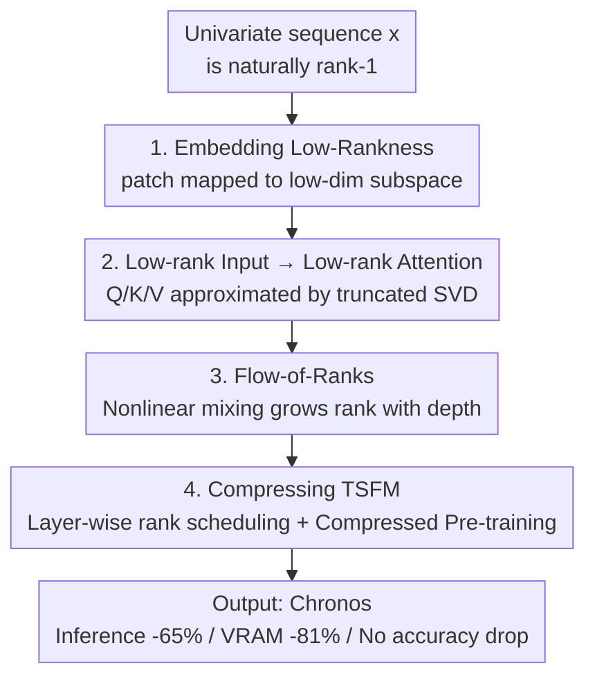

# Understanding Transformers for Time Series: Rank Structure, Flow-of-ranks, and Compressibility

**Conference**: ICLR 2026  
**OpenReview**: [https://openreview.net/forum?id=axR2KZwaD3](https://openreview.net/forum?id=axR2KZwaD3)  
**Code**: https://github.com/amazon-science/tsfm-compression  
**Area**: Time Series / Interpretability / Model Compression  
**Keywords**: Time Series Foundation Models, Numerical Rank, Low-rank Attention, flow-of-ranks, Chronos Compression

## TL;DR
This paper analyzes Time Series Transformers from the perspective of "numerical rank." It proves that patch embeddings of time series naturally fall into extremely low-rank subspaces, allowing $Q/K/V$ attention matrices to be approximated by low-rank counterparts. It proposes the "flow-of-ranks" to explain why rank grows with depth and why shallow layers are most compressible. Based on these insights, the time series foundation model Chronos is compressed to achieve a 65% reduction in inference time and 81% in VRAM with no loss in accuracy.

## Background & Motivation

**Background**: Initially designed for text, Transformers are now directly applied to modalities like time series, images, molecules, and DNA. A common practice is to migrate architectural hyperparameters (width $d$, number of heads $h$, depth $D$) from text models directly, assuming that "what works for text should generalize elsewhere." Recent Time Series Foundation Models (TSFMs, e.g., Chronos, TimesFM, Moirai) follow this path by mimicking LLM recipes.

**Limitations of Prior Work**: This assumption is fragile. Text and time series differ fundamentally in how signals are tokenized and embedded. The community lacks principled tools to characterize these differences, and no systematic study has answered how much pre-training and tuning experience from text can be transferred. In domains where data is less abundant than text, this is critical—blindly copying LLM settings may lead to severe over-parameterization.

**Key Challenge**: The structural properties of a model (whether attention matrices can be low-rank approximated, or how to allocate width/depth/heads) are essentially determined by the **structural properties of the data modality**. Text structures are large-vocabulary and high-rank, whereas univariate time series are essentially rank-1 signals. Using the same hyperparameters for two entirely different rank structures inevitably wastes capacity.

**Goal**: This study decomposes the problem into three provable sub-questions: (1) whether time series embeddings are low-rank and why; (2) whether low-rank inputs allow attention matrices to be low-rank approximated; and (3) how rank evolves along the depth of multi-layer Transformers. Finally, it targets a practical application: compressing a real-world TSFM.

**Key Insight**: The authors choose "numerical rank" from linear algebra as a unified metric. For a tolerance $\varepsilon > 0$, the $\varepsilon$-rank of an operator $U$ is defined as the number of singular values that remain significant relative to the maximum singular value:

$$\mathrm{rank}_\varepsilon(U) = \big|\{\,j \mid \sigma_j(U)/\sigma_1(U) > \varepsilon\,\}\big|.$$

A low numerical rank implies $U$ can be well-approximated by an operator with rank equal to $\mathrm{rank}_\varepsilon(U)$. This perspective unifies "modality differences," "attention compressibility," and "inter-layer evolution" into an analysis of singular value decay rates.

**Core Idea**: Time series patch embeddings map low-dimensional inputs into high-dimensional hidden spaces that still reside in low-dimensional subspaces—singular values decay rapidly. Consequently, $Q/K/V$ can be approximated via truncated SVD. Furthermore, nonlinear mixing causes rank to grow with depth (flow-of-ranks), making shallow layers the most compressible. Guiding layer-wise rank scheduling with this theory allows for significant TSFM compression without accuracy loss.

## Method

### Overall Architecture

This paper does not propose a new model but rather builds an analytical framework: "Data Modality → Model Rank Structure → Compression Strategy," applying it to Chronos. The logic chain starts by proving time series inputs are low-rank at the embedding layer (Section 2), then showing low-rank inputs allow single-layer attention matrices to be low-rank approximated while high-rank inputs (text/vision) remain incompressible (Section 3). The flow-of-ranks generalizes this to deep networks (Section 4), and the theory finally guides two complementary compression methods (Section 5).

### Key Designs

**1. Embedding Low-Rankness: Proving time series patches remain low-rank in high dimensions**

To explain why TSFMs are compressible, the first step is clarifying the low-rank nature of inputs. For a univariate sequence of length $T$ divided into patches of size $k$, using an embedding function $\phi:\mathbb{R}^k\to\mathbb{R}^d$ ($k\ll d$) yields $\Phi(x)\in\mathbb{R}^d\times L$. If $\phi$ is "regular" enough, it maps the low-dimensional patch space $\mathbb{R}^k$ into a low-dimensional submanifold within $\mathbb{R}^d$.

The authors provide support for two main embedding types. For **continuous embeddings** (neural networks $\phi(\cdot;\theta)$, e.g., Chronos-Bolt, TimesFM, Time-MoE), Theorem 1 proves guaranteed singular value decay: $\sigma_{j+1}=O(j^{-\nu}\sqrt{dL})$ for $\nu$-th order continuous derivatives, and exponential decay $\sigma_{j+1}=O(\rho^{-j}\sqrt{dL})$ for analytic functions. Theorem 2 provides a more direct bound for two-layer residual MLP embeddings $\Phi(X)=W_3X+W_2\,\omega(W_1X)$:

$$\big|\{\,j \mid \sigma_j(\Phi(X)) > \varepsilon\|W_2\|_2\|W_1X\|_2\,\}\big| \le \min\{d,\,(1+\varepsilon^{-2})k\}.$$

The numerical rank **depends linearly on the patch size $k$**, rather than the larger ambient dimension $d$. A counter-intuitive discovery is that Chronos-Bolt ($k=16$) is more low-rank than Chronos ($k=1$) because quantization-based embeddings initially map values to random vectors, whereas continuous embeddings naturally map low-dimensional spaces to low-dimensional submanifolds.

**2. Low-rank input → Low-rank attention: Translating data low-rankness to weight compressibility**

Theorem 3 provides a consistent bound on a fixed low-rank "vocabulary" $\Xi$: if $\sigma_{\tilde d+1}(\Xi)\le 1$, then there exist $\tilde W_Q, \tilde W_K, \tilde W_V$ of rank $\tilde d$ such that for any input $U$ formed by columns of $\Xi$:

$$\big\|\mathrm{Attention}(U;W_Q,W_K,W_V)-\mathrm{Attention}(U;\tilde W_Q,\tilde W_K,\tilde W_V)\big\|_F \le O\!\big(\sqrt{d}\,\sigma_{\tilde d+1}\big).$$

Crucially, this is an **input-independent** bound: the approximation depends on the intrinsic low-dimensionality of the embedding subspace $\Xi$. Theorem 3 also proves this bound is tight—for high-rank inputs (text, vision), the error is bounded below by $\tfrac{1}{4}\sigma_{\tilde d+1}$, meaning attention is **incompressible**. This explains why Chronos weights stay low-rank as $d$ increases, unlike T5 LLM weights.

**3. Flow-of-Ranks: Quantifying why rank grows with depth**

Nonlinearities (activation, residual mixing, normalization) **increase** the rank of inputs—a phenomenon called flow-of-ranks. Theorem 4 quantifies this growth for a residual attention layer $Z=U+Y/\sqrt{D}$:

$$\sigma_k(Z)/\sigma_1(Z) \le 2\min_{1\le j\le k}\Big(\sigma_{k-j+1} + \tfrac{e^2 h}{\sqrt{D}}\,\sigma_{\lfloor (j-1)/h\rfloor+1}\Big).$$

Corollary 1 provides a simplification: after one layer, the $k$-th singular value is raised to the magnitude of the $\lfloor k/h \rfloor$-th singular value of the input. Thus, **shallow layers are easier to approximate with SVD than deep layers**.

**4. Compressing TSFM: Guiding two complementary compression strategies**

Two paths are proposed. First, **compressing pre-trained models** via truncated SVD on attention matrices for immediate reduction without fine-tuning. Second, **pre-training compressed models from scratch** by parameterizing $d \times d$ matrices with rank $\tilde d$, using **layer-wise increasing rank scheduling**:

$$\tilde d(i) = \big\lceil \tilde d_0\,(1+i)^\alpha \big\rceil,$$

where $i$ is the layer index. Allocating smaller ranks to shallow layers and larger ranks to deep layers significantly outperforms uniform rank allocation. Unlike LoRA, this decomposes the weights themselves, enabling inference acceleration.

### Loss & Training
Compression is evaluated using WQL and MASE losses from Chronos. A geometric mean "score" relative to the original model is used (score < 1 is better). Truncated SVD requires no fine-tuning; pre-training follows the layer-wise rank scheduling.

## Key Experimental Results

### Main Results: Compressing Pre-trained Chronos / T5

| Ratio | Chronos In-Domain WQL↓ | Chronos In-Domain MASE↓ | Chronos Zero-Shot WQL↓ | T5 LPPL↓ |
|----------------|------------------------|--------------------------|------------------------|----------|
| 1.000 (Orig)   | 1.000 | 1.000 | 1.000 | 1.000 |
| 0.393          | 1.009 | 1.024 | 0.990 | 1.544 |
| 0.237          | 1.053 | 1.005 | 1.030 | 1.652 |
| 0.151          | 1.991 | 2.412 | 1.566 | 2.530 |
| 0.073          | 4.409 | 4.095 | 3.562 | 3.313 |

Chronos can be compressed to ~**23.7%** with nearly no loss, while T5 LLM degrades immediately at any ratio. Compressed Chronos achieves **65.4% faster inference and 81.4% less VRAM usage**.

### Ablation Study: Pre-training + flow-of-ranks scheduling

| Config | Size Ratio | Inf. Time | In-Domain WQL↓ | Note |
|------|-----------|---------|----------------|------|
| Baseline ($\tilde d_0{=}64,\alpha{=}0$) | 1.000 | 1.000 | 1.000 | Original Chronos |
| $\tilde d_0{=}3,\alpha{=}0.27$ | 0.075 | 0.346 | 1.034 | Near-lossless with reused emb |
| $\tilde d_0{=}5,\alpha{=}0.35$ | 0.150 | 0.398 | 1.048 | Medium compression |
| $\tilde d_0{=}7,\alpha{=}0.40$ | 0.250 | 0.494 | 1.021 | Light compression |
| Layer-wise vs Uniform (Moirai) | Fixed Ratio | — | Layer-wise better | Flow-of-ranks scheduling valid |

### Key Findings
- **Compressibility is a modality property**: Chronos is highly compressible while T5 is not, due to the rank structure of input embeddings.
- **Hard limit for post-training compression**: SVD truncation below ~20% causes performance collapse; aggressive compression requires pre-training from scratch.
- **Layer-wise rank scheduling > Uniform rank**: Assigning higher ranks to deep layers follows flow-of-ranks and outperforms uniform rank allocation.
- **Heads $h$**: More heads lead to higher numerical rank in weights, suggesting heads assist in robustness rather than pure expressivity.

## Highlights & Insights
- **Unified Metric**: Numerical rank bridges modality differences, compressibility, and inter-layer evolution with provable theorems.
- **Flow-of-ranks Concept**: Transforms the observation "shallow layers are easier to compress" into a quantifiable law, directly enabling "layer-wise rank scheduling."
- **Counter-intuitive Insight**: Continuous embeddings are lower rank than quantized ones due to structural smoothness being imposed from initialization.
- **Transferable Criterion**: Theorem 3 provides a "health check" for any modality: check the embedding singular value decay to decide if LLM hyperparams should be used.

## Limitations & Future Work
- **Univariate focus**: Rank analysis for high-dimensional multivariate inputs remains an open question.
- **Quantization Theory**: Theorems 1/2 cover continuous embeddings; the low-rankness of quantized embeddings depends on training dynamics and lacks theoretical coverage.
- **Parameter Sensitivity**: Finding optimal $\alpha$ and $\tilde d_0$ still requires manual tuning or further research into adaptive scheduling.

## Related Work & Insights
- **vs LoRA**: LoRA focuses on low-rank updates for fine-tuning; this work decomposes the weights themselves for inference acceleration.
- **vs Efficient Attention**: This work does not change the attention mechanism (like Performer) but demonstrates that $Q/K/V$ projections are naturally low-rank in TSFMs.
- **vs LLM hyperparams**: Proves that blindly copying LLM architectures leads to significant over-parameterization in TSFMs.

## Rating
- Novelty: ⭐⭐⭐⭐⭐ First unified framework for modality, compressibility, and flow-of-ranks.
- Experimental Thoroughness: ⭐⭐⭐⭐ Validated across Chronos, Moirai, and vision models, though multivariate cases are limited.
- Writing Quality: ⭐⭐⭐⭐⭐ Theorems align well with empirical results; counter-intuitive points are well-explained.
- Value: ⭐⭐⭐⭐⭐ Practical conclusions (65% speedup) are directly applicable to TSFM deployment.

<!-- RELATED:START -->

## Related Papers

- [\[ICLR 2026\] Understanding Transformers in Time Series Forecasting: A Case Study on MOIRAI](understanding_transformers_for_time_series_forecasting_a_case_study_on_moirai.md)
- [\[ICLR 2026\] Understanding the Implicit Biases of Design Choices for Time Series Foundation Models](understanding_the_implicit_biases_of_design_choices_for_time_series_foundation_m.md)
- [\[CVPR 2026\] Probabilistic Precipitation Nowcasting with Rectified Flow Transformers](../../CVPR2026/time_series/probabilistic_precipitation_nowcasting_with_rectified_flow_transformers.md)
- [\[ICLR 2026\] Structure Learning from Time-Series Data with Lag-Agnostic Structural Prior](structure_learning_from_time-series_data_with_lag-agnostic_structural_prior.md)
- [\[ICLR 2026\] Flow-based Conformal Prediction for Multi-dimensional Time Series](flow-based_conformal_prediction_for_multi-dimensional_time_series.md)

<!-- RELATED:END -->
