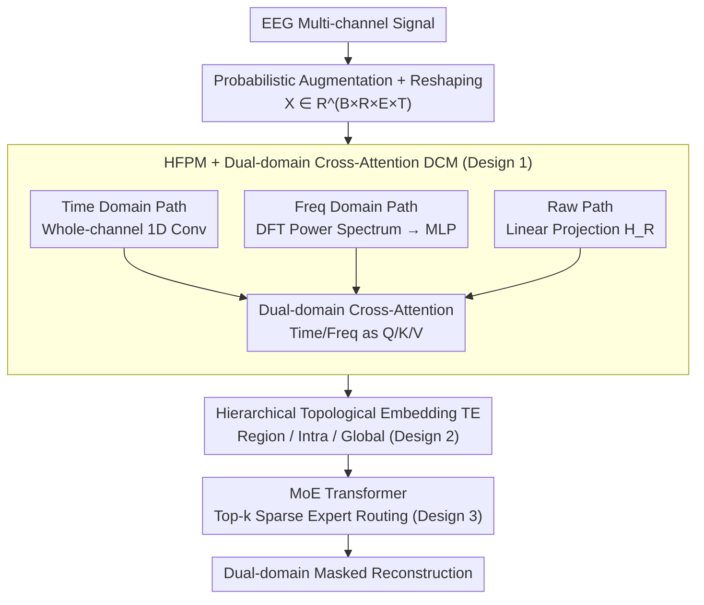

# Uni-NTFM: A Unified Foundation Model for EEG Signal Representation Learning

**Conference**: ICLR 2026  
**arXiv**: [2509.24222](https://arxiv.org/abs/2509.24222)  
**Code**: [https://anonymous.4open.science/r/Uni-NTFM-0924](https://anonymous.4open.science/r/Uni-NTFM-0924)  
**Area**: Time Series  
**Keywords**: EEG, Foundation Model, Neural Topology, Mixture of Experts, Self-Supervised Learning, Brain-Computer Interface

## TL;DR

Starting from neuroscience first principles, Uni-NTFM designs Heterogeneous Feature Projection (HFPM) to decouple time-frequency encoding, Hierarchical Topological Embedding (TE) to unify heterogeneous electrode configurations, and MoE Transformer to achieve functional modularity and sparse coding. Pretrained on 28,000 hours of EEG data with 1.9B parameters, it achieves SOTA in linear probing and fine-tuning across 9 downstream tasks.

## Background & Motivation

**Background**: EEG foundation models have been an active research direction in the past two years. Models such as LaBraM, EEGPT, and CBraMod attempt to transfer pretraining paradigms from NLP/CV to the EEG domain, obtaining universal representations through large-scale self-supervised learning.

**Limitations of Prior Work**: Existing EEG foundation models suffer from three fundamental architectural flaws:

1.  **Time-Frequency Encoding Coupling**: Standard architectures treat information as a single homogeneous flow, ignoring the fact that the brain uses decoupled encoding mechanisms for time-domain transient events (e.g., spikes, K-complexes) and frequency-domain steady-state rhythms (e.g., alpha, beta waves). Forcing a mixed encoding leads to interference between waveform morphology and spectral structure.
2.  **Inconsistent Electrode Configurations**: Different datasets use varying sensor layouts (clinical 19-channel 10-20 system vs. high-density 64-channel 10-10 system). 1D position embeddings in standard Transformers treat electrodes as simple sequences, discarding the geometric structure of the cortical surface and hindering cross-dataset transfer.
3.  **Lack of Functional Modularity**: Biological neural networks achieve efficient processing through functional modularity and sparse coding (e.g., V1 responding to vision, Broca's area to language). Standard dense Transformers activate all parameters for every input, which prone to task interference when processing highly heterogeneous EEG signals.

**Core Idea**: The model architecture should align with biological neural mechanisms—featuring decoupled encoding, topology awareness, and modular sparse processing—rather than simply transplanting CV/NLP architectures.

## Method

### Overall Architecture

Uni-NTFM processes an EEG segment through a four-stage pipeline aligned with neural mechanisms: first, HFPM decouples the time series of each electrode into time-domain, frequency-domain, and raw paths. Next, DCM performs dual-domain cross-attention to fuse time-frequency representations. Then, hierarchical Topological Embeddings are superimposed to inject cortical spatial priors. Finally, the data is fed into a MoE Transformer for high-level semantic encoding via sparse expert routing. Input data is augmented via Gaussian noise, channel dropping, and random time shifting, then reshaped as $X \in \mathbb{R}^{B \times R \times E \times T}$ (where $R$ is the number of predefined brain regions, $E$ is the maximum electrodes per region, and $T$ is the time length). The model is pretrained using dual-domain masked autoencoding.

### Key Designs

**1. Heterogeneous Feature Projection (HFPM) + Dual-domain Cross-Attention (DCM): Decoupling then Aligning Time-Frequency Information**

The brain naturally employs different encoding mechanisms for time-domain transients and frequency-domain steady-state rhythms. HFPM extracts three parallel paths to avoid interference. Unlike mainstream temporal patching, the time-domain path treats the full sequence of each electrode $x_i \in \mathbb{R}^T$ as a single token, using multi-layer 1D convolutional encoders $\Phi_T$ to capture local waveforms and non-stationary events, resulting in $h_{i,T} \in \mathbb{R}^D$. This "whole-channel encoding" preserves signal continuity. The frequency-domain path calculates the power spectral density via DFT, parameterized as mean power vectors $P_b \in \mathbb{R}^{N_b}$ across $N_b$ core bands, then projected via MLP $\Phi_F$ into $h_{i,F} \in \mathbb{R}^D$. Data is then realigned via DCM: time-domain features serve as Query to probe frequency-domain Key/Value, and vice versa. $H'_T = \text{LN}(H_T + \text{CrossAttn}(Q\!=\!H_T, K\!=\!H_F, V\!=\!H_F))$. The concatenation of both creates $H_{\text{fused}}$, establishing explicit time-frequency coupling.

**2. Hierarchical Topological Embedding: Generalizing by Functional Brain Regions Rather than Channel Indices**

Standard 1D position embeddings discard cortical geometry. This design decomposes electrode spatial identity into three levels of neuroanatomical semantics: region embeddings $E_{\text{region}} \in \mathbb{R}^{5 \times D}$ (Frontal, Central, Temporal, Parietal, Occipital); intra-region embeddings $E_{\text{intra}}$ encoding relative positions within a region; and global absolute embeddings $E_{\text{abs}}$ assigning unique IDs per IFCN standards. The final spatial representation is $H_{\text{in}}^{(i)} = H_{\text{fused}}^{(i)} + H_R^{(i)} + E_{\text{region}}[x_{\text{region}}^{(i)}] + E_{\text{intra}}[x_{\text{intra}}^{(i)}] + E_{\text{abs}}[x_{\text{abs}}^{(i)}]$. By anchoring generalization at the functional region level, 19-channel and 64-channel data can undergo seamless training and transfer within the same model.

**3. MoE Transformer and Sparse Routing: Modularized Avoidance of Heterogeneous Signal Interference**

To mimic biological modularity, each dense FFN layer is replaced with a sparsely activated MoE. A gating network $g(h_i) = h_i W_g$ calculates routing logits for $N_e$ experts for each token, and Top-k gating activates only a subset of experts. Self-attention layers use RoPE to encode relative spatial order of electrodes. To prevent routing collapse, an auxiliary load-balancing loss $L_{\text{aux}} = \alpha \cdot N_e \sum_j f_j \cdot \bar{p}_j$ is added. This allows scaling parameters to 1.9B while keeping computational costs manageable via sparse activation.

### Loss & Training

The pretraining objective is dual-domain masked autoencoding: randomly masked tokens are replaced by $e_{[\text{MASK}]}$, and the model reconstructs both time and frequency domain features. $L_{\text{total}} = \lambda_T L_{\text{time}} + \lambda_F L_{\text{freq}} + \lambda_{\text{aux}} L_{\text{aux}}$. The pretraining corpus consists of 9 public datasets, 17,000+ subjects, and approximately 28,000 hours of recordings. Four model scales are released: Tiny (57M), Small (427M), Middle (912M), and Large (1.9B), all trained on NVIDIA A100-80G GPUs using PyTorch 2.3.1 + CUDA 11.8.

## Key Experimental Results

### Main Results: Fine-tuning Performance Comparison Across 9 Tasks

Performance of Uni-NTFM$_\text{large}$ compared to task-specific methods and other foundation models:

| Task (Dataset) | Classes | Core Metric | Uni-NTFM | Best Baseline | Baseline Source |
|---|---|---|---|---|---|
| Abnormality (TUAB) | 2 | Bal. Acc. | **81.97** | 81.72 | CSBrain |
| Event Class. (TUEV) | 6 | Bal. Acc. | **69.91** | 69.03 | CSBrain |
| Emotion (SEED) | 3 | Bal. Acc. | **73.37** | 73.18 | LaBraM |
| Brain Age (TDBrain) | 2 | Bal. Acc. | **83.69** | 82.81 | CBraMod |
| Dementia (ADFTD) | 3 | Bal. Acc. | 76.61 | **77.63** | BIOT |
| MI (BCIC-IV-2a) | 4 | Bal. Acc. | 56.08 | **56.57** | CSBrain |
| Workload (Workload) | 2 | Bal. Acc. | 66.44 | **66.55** | BIOT |
| Sleep (HMC) | 5 | Kappa | **68.32** | 68.18 | CSBrain |
| Slowing (TUSL) | 3 | Bal. Acc. | 78.44 | **85.71** | CSBrain |

Under linear probing, Uni-NTFM$_\text{large}$ achieves a Bal. Acc. of 78.44 on TUAB and a Cohen's Kappa of 66.11 on TUEV, demonstrating high-quality pretrained representations.

### Ablation Study (TUAB + TUEV)

Evaluation of components using Uni-NTFM$_\text{tiny}$:

| ID | HFPM | DCM | TE | MoE | TUAB AUROC | TUEV Weighted F1 |
|---|---|---|---|---|---|---|
| A1 (baseline) | ✗ | ✗ | ✗ | ✗ | 71.16 | 73.66 |
| A2 | ✓ | ✗ | ✗ | ✗ | 78.05 (+6.89) | 76.69 |
| A3 | ✓ | ✓ | ✗ | ✗ | 79.76 | 78.72 |
| A6 | ✗ | ✗ | ✓ | ✓ | 80.03 | 78.94 |
| A7 | ✓ | ✗ | ✓ | ✓ | 81.10 | 80.81 |
| A9 | ✓ | ✓ | ✓ | ✗ | 81.40 | 79.39 |
| A10 (Full) | ✓ | ✓ | ✓ | ✓ | **83.25** (+12.09) | **81.74** (+8.08) |

### Key Findings

- **HFPM is the most critical component**: Adding HFPM alone increased TUAB AUROC from 71.16 to 78.05 (+6.89), proving the value of decoupled time-frequency encoding.
- **MoE Synergy**: While its individual gain was moderate, MoE's contribution was amplified when combined with other components (Full vs. A9: 83.25 vs 81.40), suggesting MoE requires high-quality multi-domain features to realize modular routing benefits.
- **Scaling Law**: Performance scales monotonically from 57M to 1.9B parameters.
- **Linear Probing Outperforms Traditional Fine-tuning**: Uni-NTFM$_\text{large}$ linear probing (TUAB Bal. Acc. 78.44) exceeds the fine-tuning results of most traditional methods (e.g., SPaRCNet 77.49).
- **Weakness on TUSL**: Performance on EEG slowing detection (78.44) lags behind CSBrain (85.71), indicating that universal representations may still fall short of specialized architectures for specific tasks.

## Highlights & Insights

- **Counter-intuitive "Whole-channel Encoding"**: Treating the entire electrode sequence as a single token rather than using patches preserves signal continuity and multi-scale structure in EEG.
- **Hierarchical Topological Embedding Elegant Solution**: Three-level embedding allows the model to generalize by functional brain regions rather than specific channel indices, enabling seamless cross-configuration transfer.
- **1.9B Parameter EEG Model**: The MoE architecture makes this scale possible for the first time in the EEG domain while maintaining controllable computational load.

## Limitations & Future Work

- **Sub-SOTA on TUSL and BCIC-IV-2a**: Lags behind CSBrain, suggesting a need for finer temporal resolution or subject-specific adaptation.
- **CSBrain Reproducibility**: Comparison data is from the original paper as its code is not open-sourced, which may affect fairness.
- **Limited Transfer Evaluation**: Lacks detailed analysis of few-shot or zero-shot capabilities.
- **Insufficient MoE Analysis**: No visualization provided to confirm if experts truly specialized in specific functional patterns (e.g., motor rhythms vs. pathological discharges).

## Related Work & Insights

- **vs. LaBraM (Jiang et al., 2024)**: LaBraM uses patches for MAE without time-frequency decoupling; Uni-NTFM outperforms it across TUAB/SEED tasks.
- **vs. CBraMod (Wang et al., 2024)**: CBraMod uses criss-cross attention but lacks explicit topological structures; Uni-NTFM shows a clear advantage on TDBrain.
- **vs. BIOT (Yang et al., 2023)**: BIOT remains slightly stronger on ADFTD and Workload, suggesting its dense architecture may better match those specific data characteristics.
- **Insight**: The "biological mechanism alignment" paradigm can be extended to other neural signals like MEG and fNIRS.

## Rating

- Novelty: ⭐⭐⭐⭐ 
- Experimental Thoroughness: ⭐⭐⭐⭐⭐ 
- Writing Quality: ⭐⭐⭐⭐ 
- Value: ⭐⭐⭐⭐ 

<!-- RELATED:START -->

## Related Papers

- [\[ICLR 2026\] GTM: A General Time-series Model for Enhanced Representation Learning](gtm_a_general_time-series_model_for_enhanced_representation_learning_of_time-series.md)
- [\[AAAI 2026\] A Unified Shape-Aware Foundation Model for Time Series Classification](../../AAAI2026/time_series/a_unified_shape-aware_foundation_model_for_time_series_class.md)
- [\[ICLR 2026\] Repurposing Foundation Model for Generalizable Medical Time Series Classification](repurposing_foundation_model_for_generalizable_medical_time_series_classificatio.md)
- [\[ICLR 2026\] Brain-Semantoks: Learning Semantic Tokens of Brain Dynamics with a Self-Distilled Foundation Model](brain-semantoks_learning_semantic_tokens_of_brain_dynamics_with_a_self-distilled.md)
- [\[ICLR 2026\] TRIDENT: Cross-Domain Trajectory Spatio-Temporal Representation via Distance-Preserving Triplet Learning](trident_cross-domain_trajectory_spatio-temporal_representation_via_distance-pres.md)

<!-- RELATED:END -->
