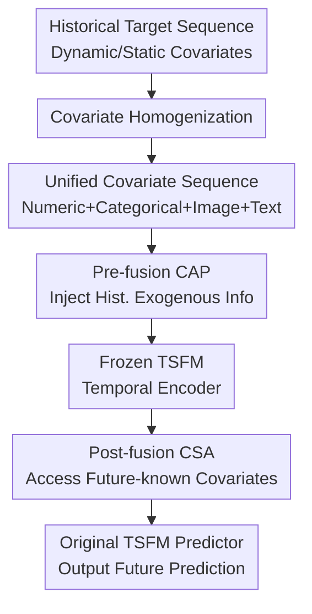

# UniCA: Unified Covariate Adaptation for Time Series Foundation Model

**Conference**: ICLR2026  
**OpenReview**: [https://openreview.net/forum?id=I8q4MZb4OP](https://openreview.net/forum?id=I8q4MZb4OP)  
**Code**: https://github.com/hanlu-nju/UniCA  
**Area**: Time Series Foundation Models / Covariate Adaptation  
**Keywords**: [Time Series Foundation Models, Covariate Adaptation, Heterogeneous Covariates, Multi-modal Forecasting, Adapter]

## TL;DR
UniCA maps heterogeneous covariates such as categories, images, and text into a unified "implicit time series" representation. It then integrates these via pre-fusion and post-fusion attention modules into a frozen time series foundation model, improving covariate-aware forecasting performance without compromising pre-trained generalization capabilities.

## Background & Motivation
**Background**: Time Series Foundation Models (TSFMs) have begun to emerge, similar to foundation models in NLP and Vision, achieving zero-shot or few-shot forecasting capabilities across domains through large-scale pre-training. Models like Chronos, TimesFM, Moirai, and Time-MoE mostly treat the input as the target sequence itself, focusing on learning shared temporal dependencies, trends, seasonality, and scale variations across datasets.

**Limitations of Prior Work**: Real-world forecasting tasks often involve more than just the target sequence. Power loads are affected by weather; retail sales are influenced by stores, products, holidays, and promotions; solar power generation might depend on satellite images; and macro-indicator forecasting may rely on textual reports. The problem is that many TSFM architectures and pre-training methods assume the input is a real-valued time series, handling at most numeric covariates isomorphic to the target. Once covariates become categorical, text, images, or task-specific static attributes, they are difficult to insert into the model directly.

**Key Challenge**: Re-training a covariate-aware model for each task can adapt to task-specific external information but loses the generalization advantages of large-scale TSFMs. Directly using a frozen TSFM ignores a large number of critical exogenous signals. More critically, covariates vary in type and temporal visibility: some are only visible in the historical window, some are known for the future, some are static IDs, and others are multi-modal observations. A truly universal solution must satisfy compatibility, universality, and generalization preservation simultaneously.

**Goal**: Ours aims to construct a lightweight adaptation framework that allows existing TSFMs to handle general covariate-aware forecasting tasks without major architectural changes or full-parameter retraining. General covariates here include both numeric isomorphic covariates and heterogeneous covariates like categorical variables, text, and images, while distinguishing the operational positions of historical, future-known, and static covariates.

**Key Insight**: The paper observes that the difficulty in using heterogeneous covariates does not necessarily stem from a requirement to maintain their original modality when entering the TSFM. If they can be converted into high-level continuous representations that vary over time, they can be treated as "time-series covariates" alongside ordinary numerical ones. This bypasses the need for customized predictors for each modality and allows the TSFM to continue working within its specialized time-series representation space.

**Core Idea**: UniCA utilizes Covariate Homogenization to transform heterogeneous covariates into unified continuous sequence representations. It then uses two attention-based fusion modules (pre and post) to inject past and future covariates into the frozen TSFM, effectively rewriting "covariate-rich but modally mixed" forecasting tasks into a unified adaptation problem manageable by TSFMs.

## Method
### Overall Architecture
The input to UniCA consists of the historical target sequence $Y_{1:T}$, dynamic covariates $C_{1:T+H}$, and static covariates $S$, outputting the future prediction $\hat{Y}_{T+1:T+H}$. It decomposes a pre-trained TSFM into three segments: a tokenizer $T(\cdot)$, a temporal encoder $E(\cdot)$, and a predictor $P(\cdot)$, inserting lightweight adapters only between these segments while keeping the TSFM backbone parameters frozen.

The overall workflow consists of three steps: first, transform heterogeneous covariates (images, text, categories, etc.) into homogenized continuous covariate sequences; second, before entering the temporal encoder, use historical covariates to supplement target tokens; finally, after the encoder, use future-known covariates to recalibrate the latent representation before passing it to the original predictor.

"Unification" here does not mean simple concatenation of raw features, but projecting various heterogeneous inputs into a time-aligned continuous covariate space. For the TSFM, it subsequently sees a set of additional isomorphic sequences; for downstream tasks, categorical IDs, satellite images, and text reports still influence predictions through the adapter.

### Key Designs
**1. Covariate Homogenization: Converting Heterogeneous Modalities into TSFM-understandable Implicit Time Series**

Existing TSFMs are not proficient at directly processing covariates like images, text, or categorical IDs because they do not reside in the same representation space as the target sequence. UniCA's approach is to use modality-specific encoders to extract heterogeneous features—such as CNNs for images, pre-trained text encoders for text, and embedding layers for categorical variables—and then map them into continuous time-series covariates via a Covariate Homogenizer (CH): $C^{het}_{1:T+H}=CH(H^{het}_{1:T+H})$.

The key to this design is not complexity; on the contrary, the paper defaults to using a simple linear layer. It acts more like a "modality-to-time-series-space" connector, compressing high-level semantics from images/text into several time-varying hidden covariates. After mapping, observed numeric covariates and homogenized heterogeneous covariates can be aligned along the time dimension and concatenated into a unified $C_{1:T+H}\in\mathbb{R}^{(T+H)\times M}$. Consequently, subsequent fusion modules do not need to know whether a covariate originated from a satellite image or a product ID; they only need to determine its utility for the current forecasting scenario.

This process resolves both universality and compatibility: universality is reflected in all covariates eventually entering the same fusion mechanism, while compatibility is reflected in the TSFM backbone still only processing time-series tokens without requiring a rewrite for every new modality.

**2. Pre-fusion CAP: Allowing Historical Covariates to Participate in Temporal Pattern Extraction Before Encoding**

Many exogenous factors are only visible in the historical window, such as past weather, past sales promotions, or past image observations. If these are added only after the temporal encoder has finished encoding the target sequence, the model might miss explanatory cues for "why the target trend changed this way." UniCA therefore adds a pre-fusion module before the encoder, using Conditional Attention Pooling (CAP) to inject historical covariates into the target tokens.

Specifically, the target sequence first passes through the TSFM tokenizer to obtain $Z=T(Y_{1:T})$. Historical dynamic covariates $C_{1:T}$ also form $E_{C_{1:T}}$ through the same tokenizer, and static covariates $S$ pass through a newly initialized embedding layer to get $E_S=\rho(S)$. CAP uses a Gated Residual Network (GRN) to generate attention weights for different covariates at each time token, followed by weighted pooling of the covariate representations: $Z_{C_{1:T}}=CAP(E_{C_{1:T}}\mid E_S)$. Instead of direct replacement, UniCA uses a Gated Linear Unit (GLU) for gated residuals: $\tilde{Z}=Z+GLU(Z_{C_{1:T}})$.

This is crucial because the value of covariates varies significantly across datasets—some are strong signals, while others are noise. CAP allows the model to select covariates based on sample, time, and static conditions, while the GLU controls the injection intensity to prevent the adapter from overwhelming the pre-trained representation of the target sequence itself.

**3. Post-fusion CSA: Incorporating Future-known Covariates Before Prediction Without Altering TSFM Backbone**

Future-known covariates are particularly critical for forecasting, such as holidays, planned promotions, weather forecasts, or future time features. These naturally correspond to the prediction interval $T+1:T+H$. UniCA adds a post-fusion module after the temporal encoder to connect future-known covariates to the encoded representation.

The process involves first tokenizing the future covariates $C_{T+1:T+H}$, then using the same CAP mechanism to select relevant future covariate representations $Z_{C_{T+1:T+H}}=CAP(E_{C_{T+1:T+H}}\mid E_S)$. UniCA then concatenates the encoded representation of historical targets $\tilde{H}$ with the future covariate representation and feeds them into a self-attention layer: $[\hat{H},\hat{Z}_{C_{T+1:T+H}}]=SelfAttn([\tilde{H},Z_{C_{T+1:T+H}}])$. Finally, the original TSFM predictor outputs $\hat{Y}_{T+1:T+H}=P(\hat{H})$.

This post-fusion design places "future conditions" closer to the prediction head. It does not require the TSFM to have seen these task-specific covariates during pre-training, nor does it require changing the predictor's semantics; the adapter is solely responsible for converting future exogenous information into a context that can interact with the hidden state.

## Key Experimental Results
### Main Results
The paper evaluates UniCA on 12 single-modality covariate datasets, the Time-MMD text-covariate multi-modality dataset, and the MMSP image-covariate multi-modality dataset. All indicators are normalized relative to a Naive baseline (lower is better); MAPE is primarily reported for Time-MMD and single-modality, while MAE is the primary metric for MMSP due to MAPE instability near zero.

| Scenario | Representative Model | Main Metric | Results | Comparative Conclusion |
|------|----------|--------|------|----------|
| 12 Single-modality Datasets | Chronos-Bolt + UniCA | Avg. MAPE | 0.506 | Outperforms Chronos-Bolt ZS (0.522) and SFT (0.514) |
| 12 Single-modality Datasets | TimesFM + UniCA | Avg. MAPE | 0.514 | Significantly better than TimesFM LR (0.557) |
| Time-MMD (TS-Text) | TimesFM + UniCA | Avg. MAPE | 0.601 | Better than TimesFM ZS (0.648) and Time-LLM (0.766) |
| MMSP (TS-Image) | Chronos-Bolt + UniCA | MAE | 0.193 | Better than Chronos-Bolt ZS (0.200) and SFT (0.225) |
| MMSP (TS-Image) | TimesFM + UniCA | MAE | 0.229 | Better than TimesFM SFT (0.258), but higher than TFT+CH (0.168) |

A notable conclusion is that UniCA does not outperform the strongest specialized models in every individual category. For instance, TFT+CH achieves the best MAE on MMSP, suggesting that strong task-specific structures still hold advantages in certain image-time series scenarios. However, the value of UniCA lies in the stable improvement of the same adaptation framework across TSFMs and single/multi-modal covariates.

### Ablation Study
| Configuration | Key Metric | Description |
|------|---------|------|
| Moirai ZS | Avg. MAPE 0.593 | Covariate dependencies are difficult to learn directly from the pre-trained model. |
| Moirai + UniCA | Avg. MAPE 0.523 | Adaptation consistently outperforms zero-shot, proving the covariate adapter's efficacy. |
| Chronos-Bolt + UniCA, Full Fine-tuning | Avg. MAPE 0.535 | Full parameter fine-tuning did not yield better generalization, likely damaging pre-trained knowledge. |
| Chronos-Bolt + UniCA, Frozen Backbone | Avg. MAPE 0.506 | Frozen TSFM + adapter is more stable, aligning with the "preserve generalization" goal. |
| Linear CH | Better overall on MMSP/Time-MMD | Simple linear homogenizer is sufficient; MLP provides no stable gain. |
| CH Dim $d_{het}=4$ | Stable low error range | Gain is significant from 1 to 4; diminishing returns beyond 8. |
| TFT + CH | MMSP MAE 0.168, Time-MMD MAPE 1.035 | CH is transferable to specialized models; MMSP benefits significantly. |

### Key Findings
- UniCA's core benefit comes from "frozen backbone + lightweight adaptation." On Chronos-Bolt, UniCA with a frozen backbone achieved an average MAPE of 0.506, while the full fine-tuning version reached 0.535, indicating that downstream data is not always sufficient to safely reshape TSFM parameters.
- Covariate Homogenization is not just an engineering patch for TSFMs. Adding CH to specialized models like TFT or TiDE also improves MMSP and Time-MMD, proving that "transforming multi-modal covariates into time-aligned continuous sequences" is a valid modeling hypothesis.
- Attention fusion provides interpretability. Case studies show the model assigns higher weights to covariates relevant to target trends, such as specific image covariates in MMSP.
- Efficiency overhead is minimal. UniCA primarily adds linear homogenizers, CAP/GLU, and a small amount of self-attention, with low increases in inference time and parameter count.

## Highlights & Insights
- **"Time-serializing" heterogeneous covariates is clean**: The paper does not attempt to make TSFMs directly understand text or images. Instead, it compresses modal information into high-level continuous covariates, returning complex multi-modal problems to the familiar representation space of TSFMs.
- **Pre/Post-fusion corresponds to information visibility**: Historical covariates explain past trends (pre-encoder), while future-known covariates directly affect the prediction interval (post-encoder). This structure is more aligned with the temporal causality of forecasting than simple concatenation.
- **Frozen backbones are more convincing than fine-tuning**: While many TSFM papers default to "more fine-tuning is better," UniCA shows that preserving the generalization of the pre-trained temporal encoder is often more important.
- **CH is a reusable component**: Even without UniCA, appending CH to TFT or TiDE improves multi-modal forecasting, suggesting a universal interface for handling heterogeneous covariates.

## Limitations & Future Work
- UniCA depends on the quality of external modality encoders. While simple CNNs/GIST encoders work for benchmarks, they may become a bottleneck if covariate modalities are extremely complex.
- The small homogenization dimension $d_{het}$ offers efficiency but may limit expressive power. Future work could explore dynamic dimensions or structured representations for more complex scenarios.
- The experiments cover image and text, but complex heterogeneous inputs like audio, graph structures, or spatial grids are not yet fully explored.
- Handling of future unknown covariates remains limited. If future covariates themselves need to be predicted, error propagation may affect final results.
- Multi-modal scenarios are not yet comprehensive SOTA. On MMSP, TFT+CH outperforms TSFM+UniCA, suggesting task-specific structures might still be stronger in certain data scales.

## Related Work & Insights
- **vs Moirai**: Moirai natively supports covariates via a unified training mechanism but primarily targets isomorphic inputs. UniCA emphasizes downstream adaptation for heterogeneous modalities.
- **vs ChronosX / LR Adapter**: These adapters often focus on numeric exogenous variables or specific TSFM structures. UniCA's advantage is separating past, future, and static covariates across modality-agnostic interfaces.
- **vs TFT / TiDE / DeepAR**: These learn covariate relationships from scratch but lack broad generalization. UniCA leverages TSFM pre-training, using adapters only to learn how covariates enter existing temporal representations.
- **Related Insight**: The stronger direction might not be building larger TSFMs, but refining the "covariate interface"—how to automatically assess covariate value and handle missing/noisy signals.

## Rating
- Novelty: ⭐⭐⭐⭐☆ The idea of homogenizing heterogeneous covariates for a frozen TSFM is concise and effective.
- Experimental Thoroughness: ⭐⭐⭐⭐⭐ Comprehensive coverage of 12 single-modality datasets, two multi-modal benchmarks, and multiple TSFM backbones.
- Writing Quality: ⭐⭐⭐⭐☆ Clear structure and complete formulas; post-analysis of multi-modal failure cases could be deeper.
- Value: ⭐⭐⭐⭐⭐ Highly practical for real-world business forecasting where covariates are often diverse and mixed in type.

<!-- RELATED:START -->

## Related Papers

- [\[AAAI 2026\] A Unified Shape-Aware Foundation Model for Time Series Classification](../../AAAI2026/time_series/a_unified_shape-aware_foundation_model_for_time_series_class.md)
- [\[ICLR 2026\] Uni-NTFM: A Unified Foundation Model for EEG Signal Representation Learning](uni-ntfm_a_unified_foundation_model_for_eeg_signal_representation_learning.md)
- [\[ICLR 2026\] Adapt Data to Model: Adaptive Transformation Optimization for Domain-shared Time Series Foundation Models](adapt_data_to_model_adaptive_transformation_optimization_for_domain-shared_time_.md)
- [\[ICLR 2026\] CauKer: Classification Time Series Foundation Models Can Be Pretrained on Synthetic Data](cauker_classification_time_series_foundation_models_can_be_pretrained_on_synthet.md)
- [\[ICLR 2026\] Repurposing Foundation Model for Generalizable Medical Time Series Classification](repurposing_foundation_model_for_generalizable_medical_time_series_classificatio.md)

<!-- RELATED:END -->
