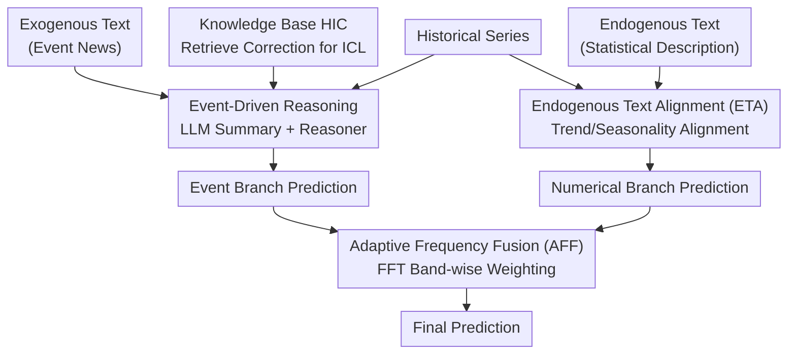

# Unlocking the Value of Text: Event-Driven Reasoning and Multi-Level Alignment for Time Series Forecasting

**Conference**: ICLR 2026  
**arXiv**: [2603.15452](https://arxiv.org/abs/2603.15452)  
**Area**: Time Series  
**Keywords**: Multi-modal time series forecasting, event-driven reasoning, text alignment, adaptive frequency fusion, LLM reasoning

## TL;DR

VoT is proposed, a multi-modal time series forecasting method that fully exploits text value through event-driven reasoning (utilizing LLMs for structured reasoning on exogenous text to obtain numerical predictions) and multi-level alignment (representation-level endogenous text alignment + prediction-level adaptive frequency fusion). It comprehensively outperforms existing methods across 10 real-world domains.

## Background & Motivation

Most existing time series forecasting methods rely solely on numerical data. However, abrupt events in the real world (e.g., the 2008 financial crisis or the unemployment spike caused by COVID-19 in 2020) are difficult to predict based only on historical numerical patterns. While text information can provide event-driven guidance, existing multi-modal methods face two major challenges:

### Challenge 1: Underutilization of Text

| Method Type | Issues |
|---------|------|
| Endogenous text methods (e.g., LLM-Mixer) | Use statistical summaries/data descriptions, which overlap significantly with time series information. |
| Exogenous text methods (e.g., CMIN, DualTime) | Perform only representation-level fusion, failing to mine deep semantics. |
| **VoT (Ours)** | **Simultaneously uses LLM reasoning + feature extraction, supporting both endogenous + exogenous text.** |

### Challenge 2: Difficulty in Modality Alignment

Text describes event-driven abrupt changes, while time series capture subtle numerical fluctuations. A significant modality gap exists between the two, making simple fusion difficult to achieve complementarity.

## Method

### Overall Architecture

VoT aims to solve the problem where abrupt events, such as the 2008 financial crisis or the 2020 COVID-19 pandemic, cannot be extrapolated from historical numerical patterns, even though text records these signals. Existing methods either encode text as vectors for shallow fusion, burying deep semantics, or use endogenous text that overlaps heavily with time series information. VoT decomposes the value of text into two complementary branches and converges them in the frequency domain. The event-driven branch enables an inference-capable LLM to read exogenous text (event news) and combine it with historical series to directly reason numerical predictions, specifically capturing the impact of abrupt events. The numerical branch aligns endogenous text (statistical descriptions) with time series representations for conventional forecasting, handling subtle fluctuations. The outputs of the two branches are finally combined via adaptive frequency fusion, determining which modality to trust based on frequency bands. Consequently, text participates in both "understanding events" and "rectifying values."

### Key Designs

**1. Event-Driven Reasoning: Integrating LLM Reasoning Ability Rather Than Just Representations**

Existing exogenous text methods only encode text as vectors for representation fusion, where deep semantics remain untapped and the impact of abrupt events is not predicted. VoT adopts a reasoning path, using a three-step pipeline to transform messy text into reason-able material: the LLM generates a structured template $\mathcal{D}$ based on data descriptions, uses the template to extract prediction-related summaries $\mathcal{S}_i$ from raw exogenous text, and finally, a Reasoner produces the prediction by combining the summary with historical series: $\hat{\mathbf{Y}}^{\text{event}}_i, \mathcal{R}_i = \text{Reasoner}(\mathcal{P}_{\text{reason}}, \mathcal{S}_i, \mathbf{X}_i)$, where $\mathcal{R}_i$ is the chain of thought. To prevent the reasoning from "running blind," a Historical In-Context Learning (HIC) mechanism is designed: during training, the Reasoner generates a prediction, reflects on the ground truth to produce a corrected reasoning $\mathcal{C}_i$, and stores "summary embedding → corrected reasoning" pairs in a knowledge base $\mathcal{K} = \{(\text{Embed}(\mathcal{S}_i), \mathcal{C}_i)\}_{i=1}^M$. During inference, the most similar historical correction $\mathcal{C}_{\tilde{i}}$ is retrieved as an ICL example: $\hat{\mathbf{Y}}^{\text{event}}_j = \text{Reasoner}(\mathcal{P}_{\text{ICL}}, \mathcal{C}_{\tilde{i}}, \mathcal{S}_j, \mathbf{X}_j)$. This injects past experience regarding errors and corrections into current reasoning without fine-tuning, improving the accuracy of event shock predictions.

**2. Multi-Level Alignment: Bridging Modality Gaps at Representation and Prediction Levels**

Since text describes event-driven shocks and time series record continuous fluctuations, direct concatenation is rarely complementary. VoT aligns them at two levels. The representation level involves Endogenous Text Alignment (ETA): two sets of learnable queries $\mathbf{Q}^{\text{tr}}, \mathbf{Q}^{\text{se}}$ use cross-attention to extract trend and seasonality semantics from text representations, followed by decomposition contrastive learning at the sample level to align trend and seasonality components between text and time series, avoiding redundancy. The prediction level uses Adaptive Frequency Fusion (AFF): FFT is applied to both branch predictions to extract low/mid/high-frequency components $\mathcal{F}^{\text{num}} = \text{FFT}(\hat{\mathbf{Y}}^{\text{num}})$ and $\mathcal{F}^{\text{event}} = \text{FFT}(\hat{\mathbf{Y}}^{\text{event}})$. A set of learnable weights $w_*^b$ weights the components by frequency band before an inverse transform: $\mathcal{F}_{\text{fused}} = \sum_* \sum_b w_*^b \mathcal{F}_*^b$, $\hat{\mathbf{Y}}_{\text{final}} = \text{iFFT}(\mathcal{F}_{\text{fused}})$. Since dependency on text vs. numerical data varies by frequency across different domains, this weighting allows the model to prioritize the event branch for frequencies where text is more informative and the numerical branch for others.

### Loss & Training

The total objective is a sum of three terms: time series forecasting loss, modality alignment loss, and final fused prediction loss, $\mathcal{L}_{\text{total}} = \mathcal{L}_{\text{ts}} + \mathcal{L}_{\text{align}} + \mathcal{L}_{\text{final}}$, which constrain the numerical branch, the decomposition contrastive alignment of ETA, and the AFF fused output respectively.

## Key Experimental Results

### Main Results: Comparison with Time Series and Multi-modal Methods (Average across 10 Domains)

| Method | Agriculture MSE | Climate MSE | Economy MSE | Health MSE | Weather MSE |
|------|----------------|-------------|-------------|------------|-------------|
| iTransformer | 0.220 | 1.135 | 0.222 | 1.519 | 1.231 |
| PatchTST | 0.228 | 1.184 | 0.210 | 1.432 | 1.145 |
| GPT4TS | 0.220 | 1.184 | 0.217 | 1.341 | - |
| TaTS | 0.215 | 1.180 | 0.215 | 1.356 | - |
| CALF | 0.250 | 1.286 | 0.207 | 1.491 | - |
| **VoT** | **0.209** | **1.078** | **0.201** | **1.205** | **0.968** |

### Success Records

- **VoT ranks first across all 20 metrics (MSE+MAE) in all 10 domains.**
- Consistently improves over pure time series methods (e.g., Health: 1.205 vs 1.432 PatchTST, -15.9%).
- Comprehensively leads existing multi-modal methods (e.g., Climate: 1.078 vs 1.180 TaTS, -8.6%).

### Key Findings

1. **Effectiveness of Text Reasoning**: The event-driven reasoning branch effectively captures the impact of external events on time series.
2. **Value of HIC**: Using historical corrected reasoning as ICL examples significantly improves reasoning accuracy.
3. **Necessity of Frequency Fusion**: Dependence on text and numerical information varies across different frequency bands across datasets.
4. **Cross-Domain Consistency**: Effective across 10 vastly different domains including finance, climate, health, and traffic.

## Highlights & Insights

1. **First multi-modal forecasting method to combine LLM reasoning with feature extraction**: Not only uses LLMs to extract representations but also leverages their reasoning capability to generate numerical predictions.
2.  **Innovative HIC Design**: Saves "error → correction" pairs during training and retrieves similar corrections as ICL guidance during inference, enhancing reasoning without fine-tuning.
3.  **Sophistication of Frequency Domain Fusion**: Learns weights for text and numerical data by frequency band, adapting to different domain characteristics.
4.  **Complementary Dual-Branch Architecture**: The event-driven branch handles abrupt changes while the numerical branch handles regular fluctuations, with AFF achieving the optimal combination.

## Limitations & Future Work

1. LLM reasoning (Reasoner) and knowledge base construction add significant computational and latency overhead.
2. Reliance on the availability and quality of exogenous text; domains lacking text may degrade to pure time series models.
3. HIC retrieval quality is limited by the size and diversity of the knowledge base.
4. Hyperparameter selection for frequency band strategies may vary by domain.
5. Noise and latency issues in temporal alignment for text were not considered.

## Rating ⭐⭐⭐⭐⭐

The method design is comprehensive and sophisticated; achieving first place across 20 metrics in 10 domains is rare. It truly introduces LLM reasoning into time series forecasting, with HIC and AFF being particularly novel. The primary drawback is the heavy computational cost, requiring a trade-off for practical deployment.

<!-- RELATED:START -->

## Related Papers

- [\[ICLR 2026\] TimeRecipe: A Time-Series Forecasting Recipe via Benchmarking Module Level Effectiveness](timerecipe_a_time-series_forecasting_recipe_via_benchmarking_module_level_effect.md)
- [\[ICML 2026\] PATRA: Pattern-Aware Alignment and Balanced Reasoning for Time Series Question Answering](../../ICML2026/time_series/patra_pattern-aware_alignment_and_balanced_reasoning_for_time_series_question_an.md)
- [\[ICLR 2026\] TimeSeriesExamAgent: Creating Time Series Reasoning Benchmarks at Scale](timeseriesexamagent_creating_time_series_reasoning_benchmarks_at_scale.md)
- [\[ICLR 2026\] Learning Recursive Multi-Scale Representations for Irregular Multivariate Time Series Forecasting](learning_recursive_multi-scale_representations_for_irregular_multivariate_time_s.md)
- [\[ICLR 2026\] MMPD: Diverse Time Series Forecasting via Multi-Mode Patch Diffusion Loss](mmpd_diverse_time_series_forecasting_via_multi-mode_patch_diffusion_loss.md)

<!-- RELATED:END -->
