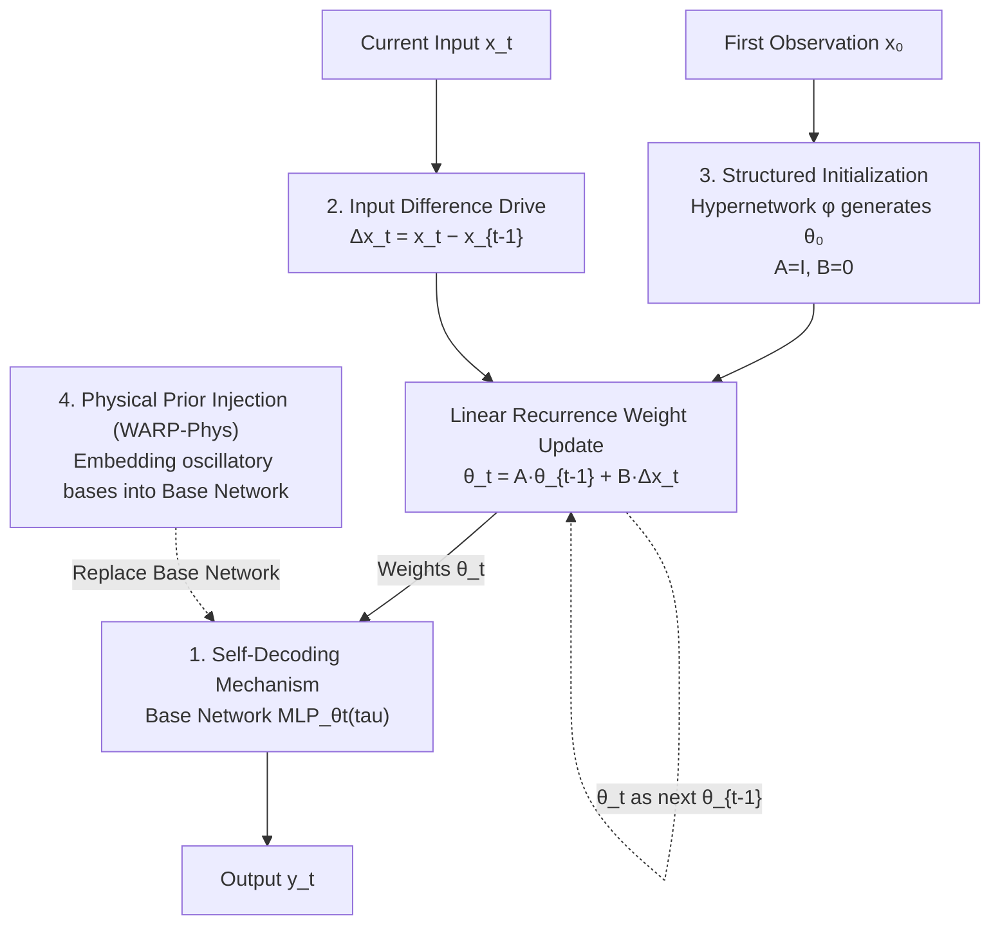

# Weight-Space Linear Recurrent Neural Networks

**Conference**: ICLR 2026  
**arXiv**: [2506.01153](https://arxiv.org/abs/2506.01153)  
**Area**: Time Series  
**Keywords**: Weight-space learning, Linear RNN, Adaptive prediction, Dynamical system reconstruction, Gradient-free adaptation

## TL;DR

Ours proposes WARP (Weight-space Adaptive Recurrent Prediction), which explicitly parameterizes the hidden state of a linear RNN as the weights and biases of an auxiliary MLP. It utilizes input differences to drive linear recurrence for weight updates, combined with non-linear decoding to achieve efficient sequence modeling, reaching SOTA on tasks including classification, prediction, and dynamical system reconstruction.

## Background & Motivation

Deep sequence models face two fundamental limitations:

**Insufficient Generalization**: They cannot work reliably outside the training distribution and require gradient descent for adaptation.

**Difficult Domain Prior Injection**: Domain knowledge, such as physical constraints, cannot be incorporated during the forward pass.

Meanwhile, two emerging paradigms have distinct advantages but have not yet been combined:

| Paradigm | Advantage | Limitation |
|------|------|------|
| **Weight-Space Learning** | Treats neural network weights as data points | Used only for input/output, not as intermediate representations |
| **Linear RNN** (S4, Mamba) | Hardware efficient, parallelizable training | Limited expressivity, insufficient information compression |

**Key Insight**: Linear RNNs lack expressivity due to the absence of non-linearity, but reintroducing non-linearity sacrifices training efficiency. WARP maintains linear recurrence efficiency while introducing non-linearity during decoding by defining the hidden state as MLP weights.

## Method

### Overall Architecture

The full name of WARP is Weight-space Adaptive Recurrent Prediction. It defines the hidden state $\theta_t$ of a linear RNN directly as the flattened weight vector of an auxiliary MLP (called the "base network"). In each step, the input difference drives a linear recurrence to update these weights, which then decode the output. The core of the model consists of two equations: state update $\theta_t = A\theta_{t-1} + B\Delta\mathbf{x}_t$ and output decoding $\mathbf{y}_t = \text{MLP}_{\theta_t}(\tau)$. Here, $\theta_t \in \mathbb{R}^{D_\theta}$ represents the base network weights, $\Delta\mathbf{x}_t = \mathbf{x}_t - \mathbf{x}_{t-1}$ is the input difference, $A \in \mathbb{R}^{D_\theta \times D_\theta}$ and $B \in \mathbb{R}^{D_\theta \times D_x}$ are state and input transition matrices, and $\tau$ is the query coordinate (e.g., normalized pixel position, time step). This preserves the parallelizable and hardware-friendly efficiency of linear recurrence while compensating for expressivity through non-linear decoding. The figure below illustrates the data flow within a time step and the recurrence loop of weights along the temporal axis:

### Key Designs

**1. Self-Decoding Mechanism: Using one set of weights as both hidden state and decoder**

The hidden state $\theta_t$ in WARP is not an abstract feature vector but a set of usable network weights. It serves as the state carrying historical information during recurrence and acts directly as parameters for $\text{MLP}_{\theta_t}(\tau)$ to generate current output, essentially "decoding itself." Traditional sequence models require an additional decoding head outside the recurrent backbone; WARP makes the hidden state itself the decoding head, eliminating the need for a separate decoder network and significantly compressing parameter counts. Simultaneously, since decoding is performed via a non-linear MLP, the expressivity lost in linear recurrence is regained, avoiding the information compression issues of pure linear RNNs.

**2. Input Difference Drive: Updating weights with changes rather than absolute inputs**

The driving term in the recurrence uses the input difference $\Delta\mathbf{x}_t$ instead of the raw input $\mathbf{x}_t$. This design is inspired by the brain's sensitivity to signal changes rather than absolute intensity. It introduces a natural property: when the input changes slowly, $\Delta\mathbf{x}_t$ is small, leading to proportional reductions in weight updates and a stable system; weights adjust significantly only when inputs change markedly. Essentially, the model learns "how to translate input changes into modifications of its own weights," which is equivalent to performing gradient-free online adaptation of the base network during the forward pass. This enables continuous learning and test-time adaptation without backpropagation.

**3. Structured Initialization: Making recurrence start like residual connections without divergence**

Matrix initialization is critical for training stability. $A$ is initialized as the identity matrix $I$, causing the recurrence to degenerate into $\theta_t \approx \theta_{t-1} + B\Delta\mathbf{x}_t$ early in training, which acts like an identity residual connection for smooth weight transfer and gradient flow. $B$ is initialized as a zero matrix $\mathbf{0}$, ensuring zero initial weight updates to prevent $\theta_t$ from diverging. The initial state $\theta_0 = \phi(\mathbf{x}_0)$ is generated directly from the first observation by a hypernetwork $\phi$, placing the model near reasonable input-dependent weights rather than a random starting point.

**4. Physical Prior Injection (WARP-Phys): Embedding domain formulas into the base network**

Since the forward pass of the base network is explicitly rewritable, WARP provides a channel for domain knowledge injection. The base network calculation can be replaced entirely with a known physical form—for instance, passing query coordinates through oscillatory basis functions like $\tau \mapsto \sin(2\pi\tau + \hat{\varphi})$ and letting the recurrence learn its parameters. This encodes the prior that "output should follow specific dynamics" into the model structure rather than relying solely on data fitting. In dynamical system reconstruction tasks, this injection improves performance by over 10 times compared to standard WARP because the model no longer needs to learn the functional form of physical laws from scratch.

### Loss & Training

During training, WARP supports two equivalent expansion methods: **Convolutional mode** expands the linear recurrence along the time axis into a convolution kernel $K$, enabling parallel processing of the entire sequence like S4 to accelerate training; **Recurrent mode** proceeds step-by-step and distinguishes between autoregressive (using previous output as input) and non-autoregressive settings for different tasks. Supervision signals are selected by task, with Mean Squared Error (MSE) for regression:

$$\mathcal{L}_{\text{MSE}} = \frac{1}{T}\sum_{t=0}^{T-1}\|\mathbf{y}_t - \hat{\mathbf{y}}_t\|_2^2$$

Probabilistic prediction uses Negative Log-Likelihood (NLL), and classification uses Categorical Cross-Entropy (CCE).

## Key Experimental Results

### Image Completion (MNIST, L=300 context pixels)

| Model | MSE ↓ | BPD ↓ |
|------|-------|-------|
| GRU | 0.054 | 0.573 |
| LSTM | 0.057 | 0.611 |
| S4 | 0.049 | 0.520 |
| **WARP** | **0.042** | **0.516** |

### Traffic Flow Prediction (PEMS08)

| Model | MAE ↓ | RMSE ↓ |
|------|-------|--------|
| STIDGCN (GNN-SOTA) | 13.45 | 23.28 |
| D2STGNN | 14.35 | 24.18 |
| **WARP** | **6.59** | **10.10** |

Without using graph structures, WARP reduces MAE by over 50%, significantly outperforming GNN models that utilize spatial information.

### Dynamical System Reconstruction

| Dataset | GRU MSE | LSTM MSE | Transformer MSE | WARP MSE | WARP-Phys MSE |
|--------|---------|----------|-----------------|----------|---------------|
| MSD | 1.43 | 1.46 | 0.34 | 0.94 | **0.03** |
| MSD-Zero | 0.55 | 0.57 | 0.48 | **0.32** | **0.04** |
| LV | 5.83 | 6.18 | 11.27 | **4.72** | — |
| SINE* | 4.90 | 9.48 | 1728 | 2.77 | **0.62** |

WARP-Phys achieves over **30x** improvement on MSD compared to WARP (0.94 → 0.03).

### Multivariate Time Series Classification (6 UEA Datasets)

WARP ranked in the top three for 4 out of 6 datasets, achieving SOTA on SCP2 and Heartbeat, and performed exceptionally well on extremely long sequences (EigenWorms, 17,984 steps).

## Highlights & Insights

1. **Paradigm-level Innovation**: First to use weight-space features as intermediate hidden state representations for recurrent networks, unifying weight-space learning and linear recurrence.
2. **Brain-inspired Input Difference**: Processes variations instead of absolute inputs, naturally supporting continuous learning and test-time adaptation.
3. **Gradient-free Adaptation**: Rapidly changing weights $\theta_t$ are updated via linear recurrence (not gradient descent), enabling efficient runtime adaptation.
4. **Physical Prior Flexibility**: Allows embedding arbitrary domain knowledge into the base network's forward pass, with WARP-Phys yielding over 10x performance gains.
5. **Stunning PEMS08 Results**: Reducing MAE by 50% without graph structures challenges the dominance of GNNs in traffic prediction.

## Limitations

1. The state transition matrix $A \in \mathbb{R}^{D_\theta \times D_\theta}$ can be extremely large, limiting the scale of the base network.
2. Physical prior injection (WARP-Phys) requires known domain formulas, restricting its universality.
3. Input differences assume equally spaced sampling; handling of irregular time series is not discussed.
4. The number of datasets in classification experiments is limited (6), and statistical significance could be further strengthened.
5. Direct comparison with the latest linear RNNs like Mamba and Griffin is not sufficiently comprehensive.

## Rating ⭐⭐⭐⭐⭐

A highly innovative paradigm-level work. It elegantly combines weight-space learning with linear recurrence, achieving strong expressivity and adaptability within a concise framework. The 50% MAE reduction on PEMS08 and the 10x improvement of WARP-Phys are impressive results. The primary concern remains the scaling of the state transition matrix.

<!-- RELATED:START -->

## Related Papers

- [\[ICLR 2026\] Tuning the burn-in phase in training recurrent neural networks improves their performance](tuning_the_burn-in_phase_in_training_recurrent_neural_networks_improves_their_pe.md)
- [\[ICLR 2026\] Learning Linear State-Space Models with Sparse System Matrices](learning_linear_state-space_models_with_sparse_system_matrices.md)
- [\[ICLR 2026\] TimeSliver: Symbolic-Linear Decomposition for Explainable Time Series Classification](timesliver_symbolic-linear_decomposition_for_explainable_time_series_classificat.md)
- [\[ICLR 2026\] Learning Mixtures of Linear Dynamical Systems via Hybrid Tensor-EM Method](learning_mixtures_of_linear_dynamical_systems_via_hybrid_tensor-em_method.md)
- [\[ICML 2026\] FRACTAL: State Space Model with Fractional Recurrent Architecture for Computational Temporal Analysis of Long Sequences](../../ICML2026/time_series/fractal_ssm_with_fractional_recurrent_architecture_for_computational_temporal_an.md)

<!-- RELATED:END -->
