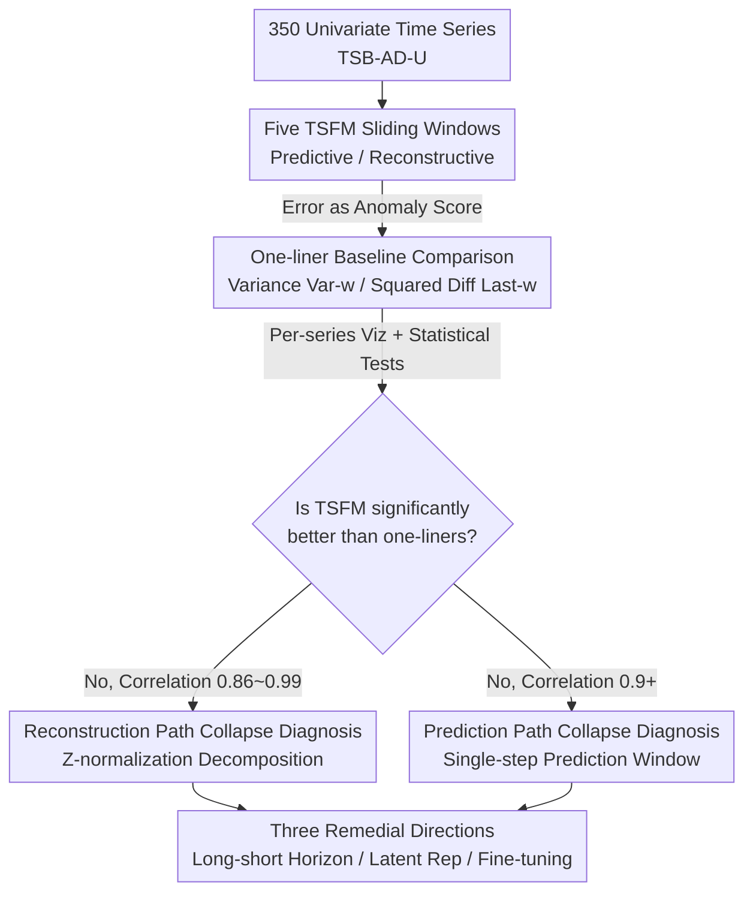

# When Foundation Models Are One-Liners: Limitations and Future Directions for Time Series Anomaly Detection

**Conference**: ICLR 2026  
**OpenReview**: [https://openreview.net/forum?id=H27kvyG4qf](https://openreview.net/forum?id=H27kvyG4qf)  
**Area**: Time Series Anomaly Detection  
**Keywords**: Time Series Foundation Models, Anomaly Detection, Reconstruction Error, Prediction Error, Baseline Diagnosis

## TL;DR
This paper systematically verifies the actual performance of five Time Series Foundation Models (TSFMs)—MOMENT, Chronos, TimesFM, Time-MoE, and TSPulse—on Time Series Anomaly Detection (TSAD). It finds that their zero-shot performance does not significantly differ from simple "one-liner" baselines written in a single line of code, such as "moving window variance" or "squared difference." The root cause is that the core assumption—"anomalies are harder to reconstruct/predict"—does not hold. Based on this, the paper proposes three remedial directions to make TSFMs truly effective.

## Background & Motivation

**Background**: The paradigm of "large-scale pre-training $\rightarrow$ emergent abilities" from Natural Language Processing has been transferred to the time series domain, leading to the emergence of TSFMs. These models are pre-trained on massive time series data using a single objective (predicting the next value or reconstructing a subsequence), with the expectation that they will generalize to various downstream tasks like forecasting, classification, and anomaly detection, similar to LLMs. TSAD is a high-value scenario, essential for fraud detection, fault diagnosis, and health monitoring.

**Limitations of Prior Work**: The standard practice for using TSFMs in TSAD is "error as anomaly score": predictive models use prediction error as the score, while reconstructive models use reconstruction error. Both assume that "anomalous points are harder to predict/reconstruct." Existing large-scale evaluations (Liu & Paparrizos, 2024) claim TSFMs are "promising and exceed most statistical and neural network methods in zero-shot settings." However, this conclusion is based on aggregate metrics (average VUS-PR) and only tests a single size and short context window for each model family.

**Key Challenge**: Aggregate metrics can mask counter-intuitive details within individual time series, while model size and context length—key variables for LLM performance—have not been thoroughly explored. In other words, the conclusion that "TSFMs are effective for TSAD" might be an artifact of the metrics. The real question is: Is the current paradigm of using TSFMs for TSAD itself valid?

**Goal**: To rigorously answer the research question: "Is the current methodology of applying time series foundation models to time series anomaly detection effective?" This involves a sensitivity analysis across model families, sizes (base/large), and context windows (64/256/512, even 1024) under the two main methodologies (predictive and reconstructive).

**Key Insight**: Instead of relying blindly on aggregate metrics, the authors return to the most primitive intermediate outputs—anomaly score curves and reconstruction error histograms—performing visualization and one-to-one comparisons for each time series. They deliberately construct two "one-liner baselines" as a litmus test: if a foundation model with hundreds of millions of parameters cannot beat a single line of code, its "ability" in this task is questionable.

**Core Idea**: By using minimal one-liner baselines (moving window variance and squared difference) for time-series-wise comparisons against TSFMs, the paper proves that the assumption of "anomalies being harder to reconstruct/predict" is invalid. This reveals the failure of the current paradigm and points toward three remedial paths that avoid this assumption.

## Method

### Overall Architecture

This paper does not propose a new model but rather provides an empirical study of "diagnosis + prescription." First, five TSFMs are categorized by their pre-training objectives into predictive (Chronos, TimesFM, Time-MoE) and reconstructive (MOMENT), along with TSPulse which utilizes both heads. For each time series, the context window is slid, and prediction/reconstruction errors are converted into anomaly scores following standard practices. A critical step is the introduction of two "one-liner baselines": Var-$w$ (moving window variance) for reconstructive comparison and Last-$w$/Centered-$w$ (squared difference) for predictive comparison. Evaluations are conducted using VUS-PR on TSB-AD-U (350 univariate time series), but **conclusions do not rely on aggregate metrics**. Instead, the study uses per-series anomaly score visualization, one-to-one scatter plots, reconstruction error histograms, and statistical tests (correlation coefficients, $p$-values, Cohen's $d$). After diagnosing the root cause of failure, the authors provide three remedial directions supported by qualitative experiments.

### Key Designs

**1. One-liner Baselines + Visualization-Driven Inspection: Using One Line of Code as a Litmus Test**

To address the issue of aggregate metrics masking the truth, the authors construct two simple baselines that can be written in one line. For reconstruction, they use **Moving Window Variance** Var-$w$, where the anomaly score is the variance of the subsequence: $s_{i+\lfloor w/2\rfloor}=\mathrm{variance}(T_{i,i+w-1})$. For prediction, they use **Squared Difference** Last-$w$/Centered-$w$, where the neighborhood mean serves as the "prediction": $s_{i+w}=(\mathrm{mean}(T_{i,i+w-1})-x_{i+w})^2$. These baselines involve no learning and zero parameters. The associated "visualization-first" methodology involves overlaying the original signal, TSFM anomaly scores, and baseline scores for manual comparison, supplemented by scatter plots and histograms. This focus on intermediate products revealed the collapse phenomenon hidden within aggregate averages—a point echoed by Wu & Keogh (2023) but long undervalued by the community.

**2. Reconstruction Path Collapse Diagnosis: Z-normalization Pulls Anomaly Scores toward Variance Proxies**

Why is the reconstructive MOMENT almost equivalent to moving window variance? The authors decompose the anomaly score based on the z-normalization/denormalization steps in the MOMENT pipeline. The anomaly score can be split into the product of the window variance $\sigma_i^2$ and the MSE of the "normalized window":

$$s_{i+\lfloor w/2\rfloor}\approx \sigma_i^2\cdot \mathrm{MSE}\big(T^{\mathrm{norm}}_{i,i+w-1},\,F^{(\text{reconstruct})}(T^{\mathrm{norm}}_{i,i+w-1})\big)$$

The key observation is that MOMENT-base consistently yields a high reconstruction MSE of ~1.1 for all normalized windows, **regardless of whether the window contains anomalies**. This debunked the "anomalies are harder to reconstruct" hypothesis. Consequently, the second factor in the product remains nearly constant, and the anomaly score degenerates into being dominated by the first factor, $\sigma_i^2$ (window variance), leading to high correlation with Var-$w$. Replacing z-normalization with Min-Max or global z-normalization reduces this correlation, confirming that window-wise z-normalization causes this collapse. Even with MOMENT-large, where the reconstruction MSE distribution is more dispersed, the distributions for anomalous and normal windows still heavily overlap, offering no stable advantage over the baseline.

**3. Prediction Path Collapse Diagnosis: Single-step Prediction Makes Anomalies "No Longer Surprising"**

Why do predictive TSFMs fail to beat squared difference and only excel at point anomalies while missing sequence anomalies? The root cause is that the anomaly score only uses the single-step error of "predicting the next value given a context window." As the window slides to cover a sequence anomaly, the most recent observations seen by the model are themselves anomalous. Thus, predicting the next anomalous value becomes "unsurprising," resulting in low error and missed detections. This again violates the "anomalies are harder to predict" assumption. The authors point out that the key remedy is **extending the prediction horizon**. When predicting multiple steps forward $\hat T_{t:t+h-1}$ from the same context window, the prediction no longer relies on anomalous inputs, causing sequence anomalies to be poorly predicted and thus exposed. This diagnosis sets the stage for remedial direction 6.1.

**4. Three Remedial Directions: Moving Beyond the "Error as Anomaly" Paradigm**

Since the root cause of failure is the breakdown of the "error as anomaly score" assumption, the authors provide three prescriptions. First, **Long-Short Horizon Ensemble**: A single fixed horizon $h$ involves a trade-off—large $h$ favors long anomalies but sacrifices sensitivity to short ones (in Table 6, as $h$ increases from 1 to 64, VUS-PR for a sequence anomaly of length 170 rises from 0.04 to 0.65, while for point anomalies it falls from 1.0 to 0.27). Thus, a MAX operation is used to aggregate scores across multiple horizons, ensuring high scores if an observation is anomalous in either short or long-horizon views. Second, **Detecting Anomalies in Latent Representations**: TSFM latent representations encode features like trend, magnitude, frequency, and phase. Performing KNN directly on latent representations is effective—MOMENT's VUS-PR jumps from 0.003 (ranked 31/32) using reconstruction error to 0.250 (ranked 5th) using latent KNN. Third, **End-to-End Fine-tuning with Labeled Anomalies**: The prediction/reconstruction objectives are fundamentally misaligned with anomaly detection. Continuing to fine-tune on pre-training tasks only improves prediction/reconstruction, not detection. Analogous to fine-tuning LLMs for sequence labeling, end-to-end fine-tuning with a small amount of labeled anomalies could adapt TSFMs to new domains.

## Key Experimental Results

### Main Results

Experiments cover five model families, measuring two sizes (except TSPulse) and at least three context windows (64/256/512) for each, evaluated using VUS-PR on 350 univariate series from TSB-AD-U. The core conclusion is that TSFMs are **statistically indistinguishable** from their corresponding one-liner baselines: correlation coefficients are extremely high, $p$-values are near 0, and Cohen's $d$ effect sizes are minimal.

| Setting | TSFM Mean | Baseline Mean | Correlation | Cohen's $d$ |
|------|----------|---------|---------|-------------|
| MOMENT-base-512 (Recon) | 0.311 | 0.313 | 0.991 | -0.047 |
| MOMENT-large-512 (Recon) | 0.313 | 0.313 | 0.857 | 0.003 |
| Chronos-Bolt-base-512 (Pred) | 0.297 | 0.284 | 0.927 | 0.102 |
| Time-MoE-large-512 (Pred) | 0.303 | 0.284 | 0.923 | 0.146 |
| TimesFM-2.0-512 (Pred) | 0.302 | 0.284 | 0.923 | 0.142 |

Even with an additional frequency-domain reconstruction head, TSPulse cannot beat baselines in a zero-shot setting: its reconstruction head Head$_{\text{time}}$ (0.42) is equivalent to Var-96 (0.42), and its prediction head Head$_{\text{future}}$ (0.30) is equivalent to Last-3 (0.28). Even after triangulation/ensemble, they remain nearly identical (0.48 vs 0.46).

### Ablation Study

| Configuration / Analysis | Phenomenon | Explanation |
|------------|------|------|
| Changing Norm (Min-Max/Global z/Mean-scaling) | Correlation with baseline decreases | Confirms window-wise z-norm is the main cause of recon path collapse |
| MOMENT-base $\rightarrow$ large | MSE distribution more dispersed but anomaly/normal still overlap | Increasing model size does not change "anomalies are not harder to reconstruct" |
| Context Window 64 $\rightarrow$ 512($\rightarrow$ 1024) | No stable improvement | Increasing context does not solve the underlying issue |
| Prediction Horizon $h$=1 $\rightarrow$ 64 (Sequence Anomaly) | VUS-PR 0.04 $\rightarrow$ 0.65 | Long horizon favors long anomalies |
| Prediction Horizon $h$=1 $\rightarrow$ 64 (Point Anomaly) | VUS-PR 1.0 $\rightarrow$ 0.27 | Sacrifices short anomalies; requires MAX ensemble |
| Latent KNN vs Recon Error (MOMENT) | 0.003 $\rightarrow$ 0.250, Rank 31 $\rightarrow$ 5 | Latent representation path shows potential |
| Non-TSFM Detectors vs Baselines | Correlations are generally low | Collapse is specific to TSFMs, not because the baselines are inherently strong |

### Key Findings

- **Collapse is independent of model size, context, and prediction/reconstruction performance**: Regardless of how large the model is, how long the window is, or how accurate the prediction/reconstruction is, TSFMs in TSAD degrade to one-liner levels. This indicates the problem lies in the paradigm assumptions, not engineering scale.
- **Reconstruction collapse stems from z-normalization**: The algebraic decomposition of anomaly scores proves the degeneration into a window variance proxy. This also explains why a few high-correlation non-TSFM detectors (like TimesNet) also happen to use z-normalization.
- **Prediction collapse stems from single-step horizons**: Sliding windows make anomalies "no longer surprising" once they enter the context, leading to missed sequence anomalies. Extending the horizon is a direct fix, but requires cross-horizon ensembles to balance long and short anomalies.
- **Methodological Insights**: Many high VUS-PR values stem from labeling issues or metrics magnifying minor differences. After removing these samples, the gap further narrows—again indicating that one should look at intermediate products rather than just aggregate metrics.

## Highlights & Insights
- **The "One-liner as Litmus Test" is highly persuasive**: Instead of using complex metrics to argue over slight improvements, proving a hundred-million parameter model cannot beat a zero-parameter one-liner makes the conclusion undeniable. This is a research paradigm transferable to questioning any "Foundation Model utility."
- **Algebraic Decomposition of Anomaly Scores**: The step of $s\approx\sigma^2\cdot\mathrm{MSE}$ elevates "why it collapses" from empirical observation to mechanistic explanation, naturally leading to normalization ablations and a clean logical loop.
- **One-to-one Mapping of Diagnosis and Prescription**: The diagnosis of single-step horizons directly leads to the long-short horizon ensemble; the diagnosis of misaligned objectives leads to labeled fine-tuning. Every future direction targets a specific failure point.
- **Re-emphasis on "Visualizing Intermediate Products"**: Aggregate metrics average out the collapse found in individual series. This lesson is a warning to the entire TSAD evaluation community.

## Limitations & Future Work
- The authors admit that the three remedial directions only provide qualitative or case-level evidence (e.g., latent KNN and single-series examples of horizon ensembles) and lack systematic large-scale validation. End-to-end fine-tuning is noted as "beyond the scope of this paper."
- The evaluation focuses on univariate time series (as most TSFMs natively support univariate). Multivariate TSFMs (e.g., Chronos-2, Toto) are only given preliminary qualitative results in the appendix.
- Although the latent representation route is superior to reconstruction error, it is still outperformed by dedicated detectors like KMeansAD, suggesting that "using TSFM representations" is not a silver bullet and requires better detection heads.
- Future improvements: Combining the three directions (horizon ensemble, latent detection, labeled fine-tuning) into a unified framework and systematically evaluating them on multivariate, multi-domain benchmarks is the logical next step.

## Related Work & Insights
- **vs Liu & Paparrizos (2024)**: They concluded "TSFMs are promising" using aggregate VUS-PR with single sizes/short windows. This paper uses the same benchmark and metrics but sweeps sizes and windows while inspecting intermediate products, arriving at the opposite conclusion—the difference lies in the evaluation granularity and questioning the metrics themselves.
- **vs Standard Reconstructive/Predictive TSAD (Schmidl et al., 2022)**: These methods default to the "anomalies are harder to reconstruct/predict" assumption. This paper uses histograms and algebraic decomposition to prove this assumption fails for TSFMs, fundamentally challenging the error-as-score paradigm.
- **vs TSPulse (Ekambaram et al., 2025)**: TSPulse adds a frequency-domain head and uses triangulation for head selection, yet still relies on traditional reconstruction/prediction methodologies. This paper proves it collapses to one-liner levels for the same reasons—adding more heads does not solve the paradigm issue.

## Rating
- Novelty: ⭐⭐⭐⭐⭐ Using one-liner baselines to falsify "TSFMs for TSAD" is a sharp perspective and execution.
- Experimental Thoroughness: ⭐⭐⭐⭐ Extensive sweep across 5 model families, sizes, and windows, though remedies only have qualitative evidence.
- Writing Quality: ⭐⭐⭐⭐⭐ Clean logical loop of diagnosis—mechanism—prescription; visualization and algebraic decomposition complement each other perfectly.
- Value: ⭐⭐⭐⭐⭐ Corrects over-optimism in the community while providing three actionable future directions.

<!-- RELATED:START -->

## Related Papers

- [\[ICLR 2026\] ICDiffAD: Implicit Conditioning Diffusion Model for Time Series Anomaly Detection](icdiffad_implicit_conditioning_diffusion_model_for_time_series_anomaly_detection.md)
- [\[ICLR 2026\] Towards Multimodal Time Series Anomaly Detection with Semantic Alignment and Condensed Interaction](towards_multimodal_time_series_anomaly_detection_with_semantic_alignment_and_con.md)
- [\[ICLR 2026\] T1: One-to-One Channel-Head Binding for Multivariate Time-Series Imputation](t1_one-to-one_channel-head_binding_for_multivariate_time-series_imputation.md)
- [\[ICLR 2026\] Point-wise Anomaly Detection via Fold-bifurcation ODE](point-wise_anomaly_detection_via_fold-bifurcation_ode.md)
- [\[ICML 2026\] IMPACT: Influence Modeling for Open-Set Time Series Anomaly Detection](../../ICML2026/time_series/impact_influence_modeling_for_open-set_time_series_anomaly_detection.md)

<!-- RELATED:END -->
