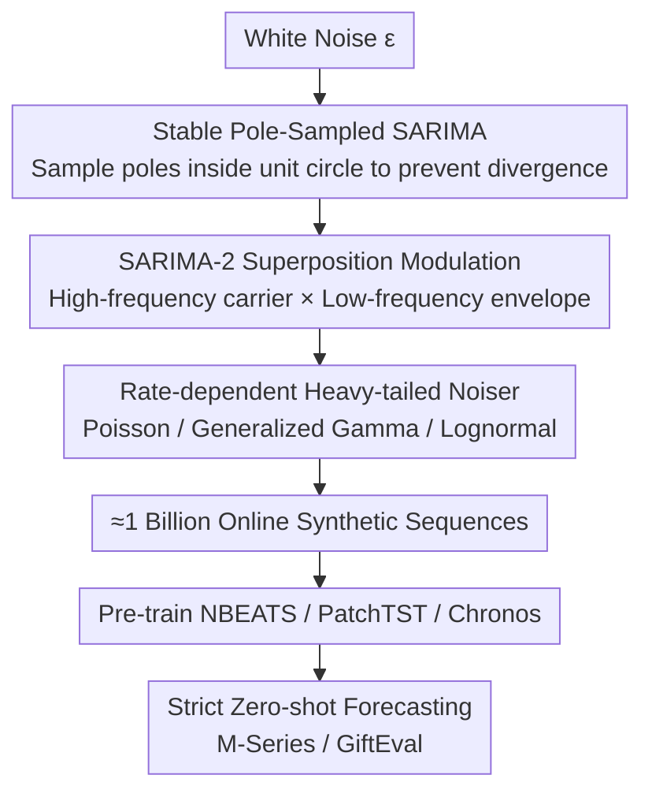

# Zero-shot Forecasting by Simulation Alone

**Conference**: ICLR 2026  
**OpenReview**: [https://openreview.net/forum?id=ZOLUTSU5gk](https://openreview.net/forum?id=ZOLUTSU5gk)  
**Code**: To be confirmed  
**Area**: Time-series Forecasting / Zero-shot Learning / Synthetic Data  
**Keywords**: Zero-shot forecasting, Time-series simulation, SARIMA, Synthetic data pre-training, Foundation models

## TL;DR
This paper proposes SarSim0—a fast time-series simulator based entirely on stable SARIMA processes. It is used to generate approximately 1 billion purely synthetic sequences online to pre-train general forecasting backbones. This enables small models to match or even exceed the forecasting accuracy of large foundation models (Chronos, MOIRAI, TimesFM) trained on real data under a strict zero-shot protocol. Furthermore, a "student surpasses teacher" phenomenon (neural networks exceeding the AutoARIMA that generated their training data) is observed on GiftEval.

## Background & Motivation

**Background**: Zero-shot time-series forecasting (keeping the pre-trained model frozen and performing direct inference on new sequences without parameter updates) is emerging because it eliminates the per-dataset tuning cycle, meets low-latency and low-cost deployment needs, and naturally aligns with privacy compliance (as inference is local and no gradient feedback leaks information). The current mainstream approach follows the "foundation model" path of NLP/CV—models like TimeGPT, Chronos, MOIRAI, and TimesFM are pre-trained on large-scale real-world time-series corpora.

**Limitations of Prior Work**: Real-world time-series corpora face three unavoidable issues. First, **limited scale and licensing**—publicly available real sequences are scarce and constrained by copyright or privacy. Second, **domain and sampling rate bias**—collected data naturally leans toward specific frequencies and industries. Third, and most critical, is **leakage**—overlap between train/test sets and hyperparameter searching on the target side compromises the integrity of "zero-shot" evaluation, making the reported capabilities unreliable.

**Key Challenge**: While purely synthetic data could solve these issues (controllable coverage, programmable rare events, and guaranteed zero leakage), prior synthetic strategies could not support a "synthetic-only" path. Chronos's KernelSynth found that using only synthetic data led to significant performance drops, requiring real data mixing; ForecastPFN used manually crafted trend/seasonal templates, which lacked expressivity and fidelity. Moreover, generators based on Gaussian kernels (GP kernel) are **too slow for online generation**, causing data scales to be bottlenecked by disk space and generation speed.

**Goal**: To create a univariate time-series simulator that is **fast enough for online generation and realistic enough to independently support zero-shot pre-training**, making "training on synthetic data only" truly viable, and systematically validating its zero-shot generalization on industrial-style benchmarks (trend, seasonality, and intermittency).

**Key Insight**: Instead of manually crafting templates, the authors return to the foundations of statistical time-series modeling—SARIMA. SARIMA is deeply rooted in stochastic process theory and can unify classical models like exponential smoothing, Holt-Winters, random walks, and Theta as special cases. It also serves as the core of the strongest zero-shot baseline, AutoARIMA, making it a natural "teacher." The key observation is that naive SARIMA simulations often diverge into useless sequences due to unstable autoregressive components, but stability can be structurally guaranteed by **sampling directly in the pole space**.

**Core Idea**: An online data generation pipeline using a three-stage simulator: "Stable Pole-Sampled SARIMA + Multi-seasonal Superposition Modulation + Rate-dependent Heavy-tailed Noise." This shifts the bottleneck of zero-shot forecasting from "finding real data" to "creating controllable high-fidelity synthetic data."

## Method

### Overall Architecture

SarSim0 (SARIMA Simulator for Zero-Shot Forecasting) formalizes the generation of a synthetic sequence as a composition of three operators:

$$y_{1:T} = N \circ I \circ S(\epsilon)$$

Where $S$ is a **structured base signal generator** (Stable SARIMA) responsible for producing well-behaved base waveforms with trends and seasonality; $I$ is an **interaction/superposition component** (SARIMA-2) that combines multiple base signals through additive or multiplicative modulation into multi-seasonal waveforms rich in cross-frequency structures; $N$ is a **noiser** that overlays heavy-tailed, rate-dependent random perturbations on the structured signal to characterize bursts and intermittency. The entire pipeline design is driven by three pre-training requirements: (i) structural fidelity to real sequence motifs (seasonality, trend, intermittency); (ii) scalability to billions of samples without storage; (iii) sufficient diversity to support generalization across heterogeneous benchmarks. Approximately 1 billion generated sequences are fed online to backbones like NBEATS / PatchTST / Chronos / MLP for pre-training, and the resulting models are used directly on real target sequences under a strict zero-shot protocol.

### Key Designs

**1. Stable Pole-Sampled SARIMA Base Generator: Transforming "Divergent" Simulation into "Stable by Construction"**

Naively assigning random coefficients $\alpha, \vartheta$ to ARIMA and expanding them via time-domain recursion often leads to useless sequences that diverge exponentially due to unstable autoregressive components (the paper's Figure 2 shows an example diverging to the magnitude of $10^{22}$), making them unusable for training. This paper's approach is **not to sample coefficients directly, but to sample in the pole space**. Using the equivalence between the summation form and the product (pole) form of polynomials:

$$\phi(L) = 1 - \sum_{i=1}^{p}\phi_i L^i = \prod_{i=1}^{p}(1 - \varphi_i L)$$

As long as all poles lie within the unit circle $|\varphi_i| < 1$, the AR component is theoretically guaranteed to be well-behaved. Thus, the process becomes: first uniformly sample a radius in $[0, r_{\max}]$ and a complex angle in $[0, 2\pi]$ to obtain the poles, then use product expansion (e.g., `np.poly` in numpy) to derive the coefficients. When incorporating seasonality, the AR side becomes a **lacunary polynomial**, where seasonal and non-seasonal factors are inseparable, and the stability region is non-convex and numerically "thin"—minor changes in $(\phi, \Phi)$ can push poles out of the unit circle. To bypass this numerical difficulty, the authors use a **mixture strategy**: with 0.5 probability, take only non-seasonal AR (set all $\Phi_j=0$); with 0.5 probability, take only seasonal AR (set all $\phi_i=0$), as each subcase is easy to stabilize. The integer differencing order is fixed at $d=D=1$ (higher orders are prone to numerical divergence), and **fractional differencing** between $[0,1]$ is introduced (approximated via Hosking's binomial coefficient FIR filter $\varrho_i = \Gamma(i-d')/(\Gamma(-d')\Gamma(i+1))$) to enrich trend patterns. Time-domain recursion itself has serial dependencies that prevent vectorization; the authors instead use **cross-trajectory vectorization**: parallelly expanding $B$ sets of different initial values under the same parameters, which both accelerates generation and creates diverse realizations from different initial states.

**2. SARIMA-2 Superposition Modulation: Reproducing Real Dual-Seasonality and Heteroscedastic Structures via "Carrier × Envelope"**

Many real sequences are **dual-seasonal**—fast rhythms are modulated by slow rhythms, such as road traffic, web activity, or call center traffic where "intra-day peaks are modulated by day-of-week effects," or power loads where "intra-day cycles are shaped by weekday and annual patterns." Single-season models can capture fast rhythms but fail to grasp amplitude modulation and the resulting induced heteroscedasticity. SARIMA-2 thus combines two independent, pole-stable SARIMAs: a high-frequency "base/carrier" $y^{(b)}$ and a low-frequency "envelope" $y^{(e)}$. After upsampling the envelope to the carrier rate, they are combined additively or multiplicatively:

$$\text{Additive:}\ y_t \leftarrow y^{(b)}_t + y^{(e)}_t, \qquad \text{Multiplicative:}\ y_t \leftarrow (1 + \omega\,\tilde{y}^{(e)}_t)\,y^{(b)}_t$$

In the multiplicative case, $\tilde{y}^{(e)}_t$ is normalized to $[-1,1]$, and the modulation depth is $\omega \sim \text{Uniform}(0,1)$. This combination produces **controlled amplitude modulation**, reproducing the real structure where the "envelope is superimposed on the carrier" (e.g., swings in weekday intensity). Ablation studies show this is the largest contributor to generalization (removing it causes the sharpest performance drop), as it upgrades the simulator from a "single time scale" to "multi-scale coupling," approximating the most common cross-frequency patterns in industrial sequences.

**3. Rate-dependent Heavy-tailed Noisers: Adding Intermittency and Bursts Beyond Seasonal Dynamics**

Pure seasonal dynamics have fixed time scales and cannot characterize statistical features like intermittent spikes and long strings of zeros in retail/spare parts demand, heavy-tailed bursts in internet traffic, or Gamma-type positive shocks in precipitation—all of which are **non-Gaussian and vary with local levels**. The Noiser module $N$ implements a random rate noise process $\eta_t \sim \mathcal{N}_\kappa(\lambda_t)$, where the rate $\lambda_t = g(y_t) \ge 0$ ties noise intensity to the local mean level (heteroscedasticity), and the shape hyperparameter $\kappa$ controls over-dispersion and skewness. The rate is normalized and intensity is sampled according to:

$$\lambda_t = \lambda_0 (y_t - \min_t y_t)/(\max_t y_t - \min_t y_t), \qquad \lambda_0 \sim \text{LogUniform}[\lambda_{\min}, \lambda_{\max}]$$

The authors implement three complementary noise families: **Poisson** $\eta_t \sim \text{Poisson}(\lambda_t)$ for count spikes in intermittent demand; **Generalized Gamma** where $\eta'_t \sim \text{Gamma}(\lambda_t, \kappa)$ followed by a random power transform $\eta_t = [\eta'_t]^\zeta$ to introduce controlled bursts; and **Lognormal** $\eta'_t \sim \text{LogNormal}(\lambda_t, \kappa)$ for multiplicative heavy-tailed shocks simulating volatility. Together, these form a compact, simulation-friendly toolbox covering major non-Gaussian, level-dependent perturbations while maintaining efficiency for large-scale online generation. ⚠️ Specific noise family parameterizations should refer to the original text.

### Loss & Training

Backbones are trained using **multi-step multi-quantile** empirical risk minimization. Given quantiles $\tau=(\tau_1,\dots,\tau_Q)$, a single quantile loss is $\rho_\tau(y,\hat y) = \tau(y-\hat y)_+ + (1-\tau)(\hat y-y)_+$. The multi-step multi-quantile loss for a single sample is averaged over $H$ horizons and all quantiles:

$$L_{H,Q} = \frac{1}{HQ}\sum_{h=1}^{H}\sum_{\tau\in\boldsymbol{\tau}}\rho_\tau\big(y_{T+h}, \hat y^{(\tau)}_{T+h}\big)$$

Training Setup: NBEATS is trained for 250k steps, while PatchTST and Chronos are trained for 500k steps, with models predicting 512 horizons at once. The zero-shot protocol is strict—all model selections are made only on partitions of the synthetic source corpora, and **no parameters or hyperparameters are tuned** for the real target sequences during inference. Under the same setup, ForecastPFN and KernelSynth baseline simulators were also trained for comparison (KernelSynth was limited to 10 million offline samples due to slow generation).

## Key Experimental Results

### Main Results

Evaluated on GiftEval (23 datasets, 7 domains, 10 sampling frequencies) and M-Series (M1/M3/M4/Tourism, >100k sequences) using sCRPS and MASE (lower is better). Below is an excerpt of the weighted aggregate main results:

| Model | GiftEval sCRPS | GiftEval MASE | M-Series sCRPS | M-Series MASE | Inference Time (min) | Zero-shot |
|------|------|------|------|------|------|------|
| Chronos-Base (Real Pre-trained) | 0.647 | 0.870 | 0.103 | 0.878 | 2103 | ✓ |
| MOIRAI-Large | 0.599 | 0.874 | 0.128 | 1.027 | 3976 | ✓ |
| TimesFM | 0.680 | 1.077 | 0.098 | 0.930 | 155 | ✓ |
| AutoARIMA (Per-sequence fit, "Teacher") | 0.912 | 1.074 | 0.096 | 0.843 | 420 | ✗ |
| NBEATS-KernelSynth | 0.686 | 0.978 | 0.116 | 1.033 | - | ✓ |
| NBEATS-ForecastPFN | 1.070 | 1.354 | 0.113 | 0.979 | - | ✓ |
| **NBEATS-SarSim0** | 0.602 | 0.849 | 0.096 | 0.869 | **46** | ✓ |
| **PatchTST-SarSim0** | **0.573** | **0.837** | 0.097 | 0.877 | 47 | ✓ |
| **Chronos-SarSim0** | 0.608 | 0.878 | 0.100 | 0.896 | 52 | ✓ |

Key Observations: (1) PatchTST-SarSim0, trained purely on synthetic data, achieves sCRPS=0.573 and MASE=0.837 on GiftEval, **outperforming all large foundation models pre-trained on real data**. (2) SarSim0 comprehensively outperforms more expensive synthetic pipelines like KernelSynth / ForecastPFN. (3) Small models (NBEATS) paired with SarSim0 match or slightly exceed large models like Chronos, with inference times one to two orders of magnitude faster (46 min vs 2103 min). (4) On GiftEval, models trained on SarSim0 surpass AutoARIMA—the very algorithm that generated their training data—demonstrating the "student surpasses teacher" phenomenon.

### Ablation Study

Components were removed step-by-step to verify the contributions of SARIMA-2 and Noisers (lower is better):

| Configuration | GiftEval sCRPS | GiftEval MASE | M-Series sCRPS | M-Series MASE | Description |
|------|------|------|------|------|------|
| PatchTST-SarSim0-500K | 0.573 | 0.837 | 0.097 | 0.877 | Full Model |
| PatchTST No SARIMA-2-250K | 0.647 | 0.926 | 0.103 | 0.929 | Removed modulation; sharpest drop on GiftEval |
| PatchTST No Noisers-250K | 0.594 | 0.859 | 0.096 | 0.861 | Performance drops on GiftEval, rises on M-Series |
| NBEATS-SarSim0 | 0.602 | 0.849 | 0.096 | 0.869 | Full Model |
| NBEATS No SARIMA-2 | 0.655 | 0.913 | 0.104 | 0.941 | Consistent drop across backbones |
| NBEATS No Noisers | 0.609 | 0.856 | 0.096 | 0.860 | Noisers have smaller impact |

### Key Findings
- **SARIMA-2 is the Primary Contributor to Generalization**: Removing it caused the largest performance drop across both backbones and benchmarks (e.g., PatchTST sCRPS on GiftEval 0.573 → 0.647), confirming that "multi-seasonal modulation" is key to aligning the simulator with real industrial sequences.
- **The Role of Noisers Depends on Budget/Dataset**: With a 250K training budget, removing Noisers hurt performance on the noisy and heterogeneous GiftEval but slightly improved it on the regular, short, low-noise M-Series. Increasing the PatchTST budget to 500K allowed the model with Noisers to recover on M-Series while maintaining its advantage on GiftEval—indicating that heavy-tailed noise requires more iterations to be fully utilized.
- **"Student Surpassing Teacher" is Dataset-Dependent**: Neural networks clearly outperform AutoARIMA on the heterogeneous and noisy GiftEval; however, on the regular and low-noise M-Series, AutoARIMA remains very strong, and the effect is mixed. This emergent generalization is more prominent in benchmarks with large heterogeneous noise.
- **Fidelity Visualization (Figure 3)**: UMAP embeddings of M4-Monthly real windows and SARIMA synthetic windows show seasonal layering with local interleaving, suggesting the simulator matches not only marginal distributions but also short-lag self-covariance and narrow-band peaks.
- **Hyperparameter Robustness**: Sensitivity studies on SarSim0 configurations showed that performance across both benchmarks remained close to the default, indicating the method is not trapped in a fragile "sweet spot" and its configuration is largely benchmark-independent.

## Highlights & Insights
- **Pole-Space Sampling for Stability**: This is the most clever technical move—avoiding sampling divergent coefficients by sampling poles within the unit circle, turning "hoping it doesn't diverge" into "stable by construction." This allows SARIMA to be truly used for large-scale online data generation. This idea could be transferred to any simulation scenario requiring sampling of stable IIR/linear recursive systems.
- **"Teacher" as a Data Engine, Not a Predictor**: Since AutoARIMA has long been a strong zero-shot baseline, this paper doesn't use it for direct prediction but uses its generation process (SARIMA) to create training data. The resulting neural network ultimately surpasses the teacher—effectively "distilling" the inductive bias of classical statistical models into neural backbones.
- **Speed as Scale**: Because the simulator is orders of magnitude faster than kernel methods, it enables the online generation of ~1 billion sequences without disk storage, completely bypassing real-world data issues regarding licensing, leakage, and bias. "Speed" here is not just an engineering detail; it is the prerequisite for "purely synthetic pre-training" to be viable.
- **Small Model + Diverse Synthetic Data ≈ Large Model**: The results hint that data diversity and scale can partially compensate for architectural complexity. A fully-connected design like NBEATS, when paired with SarSim0, can approach the performance of large foundation models, making it highly attractive for compute-constrained deployments.

## Limitations & Future Work
- **Industrial Domain Bias**: The method is oriented toward industrial sequences dominated by trends, seasonality, and intermittency. The authors acknowledge that on more regular, low-noise datasets like M-Series, the "student surpasses teacher" effect is mixed and AutoARIMA remains strong. Generalization advantages are dataset/domain dependent.
- **Univariate Only**: SarSim0 is a univariate simulator and does not cover multivariate or cross-channel dependencies (unlike multivariate synthetic schemes like TimePFN). Zero-shot prediction for cross-variable coupling remains an open problem.
- **Engineering Trade-offs for Seasonal Stability**: Due to the non-convexity of the seasonal-non-seasonal joint polynomial stability region, the authors use a mixture strategy (0.5 probability for non-seasonal / 0.5 for seasonal) rather than directly sampling arbitrary dual-seasonal SARIMAs, which sacrifices some expressivity (compensated by SARIMA-2).
- **Empirical Noise Parameterization**: The three noise families and their LogUniform intensity sampling are largely empirical tools. ⚠️ Specific hyperparameters should be checked in the original text; whether different domains require customized noise families has not been fully explored.
- **Potential Improvements**: Extending pole sampling to multivariate stability constraints or adaptively sampling noise families/seasonal structures based on target domain meta-information could further enhance generalization to sequences beyond industrial styles.

## Related Work & Insights
- **vs KernelSynth (Chronos)**: They used Gaussian kernel combinations to **augment** real data and found that purely synthetic data led to significant performance drops. SarSim0 is orders of magnitude faster, achieves fidelity sufficient for **purely synthetic** training, and consistently outperforms KernelSynth.
- **vs ForecastPFN**: They manually concatenated trend/seasonal templates + multiplicative Weibull noise. SarSim0 is rooted in stochastic process dynamics (stable SARIMA + hierarchical seasonality + heavy-tailed noise), results in far better fidelity and experimental outcomes (ForecastPFN's sCRPS on GiftEval was as high as 1.07).
- **vs AutoARIMA**: AutoARIMA is a strong statistical baseline requiring online fitting per sequence (not zero-shot). This paper uses its generative core, SARIMA, as a data engine. The trained neural network surpasses it on GiftEval and executes nearly 10x faster.
- **vs Foundation Models (Chronos, MOIRAI, TimesFM)**: These rely on massive real-world corpora and face leakage and licensing risks. SarSim0 proves that small models trained on purely synthetic data can match or exceed them under strict zero-shot protocols.

## Rating
- Novelty: ⭐⭐⭐⭐⭐ The first time-series simulator fast enough to generate 1 billion samples online and realistic enough to support zero-shot pre-training alone. The pole-space sampling idea is elegant and effective.
- Experimental Thoroughness: ⭐⭐⭐⭐⭐ Comparison across two major benchmarks, multiple backbones, two synthetic baselines, and several real-data foundation models, supplemented with fidelity visualization, ablation, sensitivity, and out-of-domain tests.
- Writing Quality: ⭐⭐⭐⭐⭐ Clear logic from motivation to method to conclusion. The three-stage simulator formalization is concise, and the "student surpasses teacher" conclusion is handled with scientific restraint.
- Value: ⭐⭐⭐⭐⭐ Liberates zero-shot forecasting from "finding real data" to "creating controllable synthetic data," with direct landing significance for privacy compliance and low-compute deployment.

<!-- RELATED:START -->

## Related Papers

- [\[ICLR 2026\] Relational Transformer: Toward Zero-Shot Foundation Models for Relational Data](relational_transformer_toward_zero-shot_foundation_models_for_relational_data.md)
- [\[NeurIPS 2025\] TiRex: Zero-Shot Forecasting Across Long and Short Horizons with Enhanced In-Context Learning](../../NeurIPS2025/time_series/tirex_zero-shot_forecasting_across_long_and_short_horizons_with_enhanced_in-cont.md)
- [\[ICML 2025\] VisionTS: Visual Masked Autoencoders Are Free-Lunch Zero-Shot Time Series Forecasters](../../ICML2025/time_series/visionts_visual_masked_autoencoders_are_free-lunch_zero-shot_time_series_forecas.md)
- [\[ACL 2025\] Revisiting LLMs as Zero-Shot Time-Series Forecasters: Small Noise Can Break Large Models](../../ACL2025/time_series/revisiting_llms_as_zero-shot_time_series_forecasters_small_noise_can_break_large.md)
- [\[ICLR 2026\] CPiRi: Channel Permutation-Invariant Relational Interaction for Multivariate Time Series Forecasting](cpiri_channel_permutation-invariant_relational_interaction_for_multivariate_time_se.md)

<!-- RELATED:END -->
