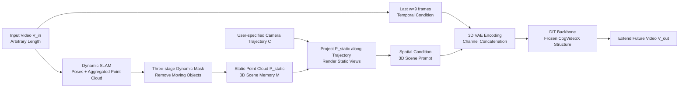

# 3D Scene Prompting for Scene-Consistent Camera-Controllable Video Generation

**Conference**: ICLR 2026  
**OpenReview**: [https://openreview.net/forum?id=3XxoBwMusJ](https://openreview.net/forum?id=3XxoBwMusJ)  
**Project Page**: [https://cvlab-kaist.github.io/3DScenePrompt](https://cvlab-kaist.github.io/3DScenePrompt)  
**Code**: To be confirmed  
**Area**: Video Generation / Camera-Controllable Video Generation  
**Keywords**: Camera-Controllable Video Generation, Scene Consistency, 3D Scene Memory, Dynamic SLAM, Dual Spatio-Temporal Conditioning  

## TL;DR
This paper proposes **3DScenePrompt**, which utilizes dual spatio-temporal conditions—"temporally adjacent frames + projected views from a static 3D point cloud"—to extend future videos from any length of input video, maintaining scene consistency with the entire history while achieving precise camera control.

## Background & Motivation
- **Background**: Camera-controllable video generation has evolved from "generating controllable videos from scratch" to "extending a single image or short clip along a user-specified camera trajectory." Representative methods like CameraCtrl, MotionCtrl, and AC3D inject camera embeddings (e.g., Plücker coordinates) into diffusion models via ControlNet, enabling precise trajectory following.
- **Limitations of Prior Work**: These methods can only process **extremely short condition sequences** (typically a few frames) and cannot understand longer videos, thus losing the rich scene context of long-duration sequences. Video-to-future-video methods (e.g., Cosmos-Predict2) use a temporal sliding window that only considers the last few frames; when the camera **revisits earlier viewpoints** (outside the window), long-range spatial consistency cannot be maintained.
- **Key Challenge**: Scene-consistent camera-controllable generation must simultaneously satisfy three conflicting requirements: ① Static elements must remain consistent throughout, while dynamic elements (pedestrians, cars) should evolve naturally from their most recent state—one **cannot** transplant a person frozen 50 frames ago into frame 200; ② Camera control requires understanding the underlying 3D geometry (occlusion, synthesis, extrapolation of unobserved regions); ③ This must be achieved within feasible computational constraints, as naively processing all input frames would lead to exploding quadratic complexity in self-attention.
- **Goal**: Define and solve the **scene-consistent camera-controllable video generation** task—given an input video $V_{in}\in\mathbb{R}^{L\times H\times W\times3}$ of arbitrary length and a target camera trajectory $C$, generate $T$ subsequent frames $V_{out}$ that are geometrically consistent with the entire scene.
- **Core Idea**: **Redefine how video models "reference history"**—"adjacency" in video is not just temporal but also **spatial**. When the camera revisits similar viewpoints, the frames to be generated are actually spatially adjacent to much earlier frames. Thus, **dual spatio-temporal conditions** are proposed: a temporal window ensures motion continuity, while a spatial window ensures scene consistency. A **3D scene memory containing only static geometry** is used to filter out dynamic content from spatial conditions, preventing the erroneous "frozen recurrence" of past dynamic elements.

## Method

### Overall Architecture
3DScenePrompt is based on CogVideoX-I2V-5B, modifying its original single-image condition channel into a "temporal + spatial" dual input. The pipeline consists of three steps: ① Run **dynamic SLAM** on the input video to obtain camera poses and aggregated point clouds; ② Use a **three-stage dynamic mask** to filter out moving objects, obtaining a point cloud $P_{static}$ containing only static geometry and forming the 3D scene memory $M$; ③ **Project** $M$ along the user-specified trajectory to create geometrically consistent rendered views as "3D scene prompts," which are concatenated channel-wise with the last few frames and fed into the frozen DiT backbone to extend the future video.

### Key Designs

**1. Dual Spatio-Temporal Sliding Window: Extending "Adjacency" from Time to Space**. Existing methods only take the last $w$ frames along the time axis, leading to "amnesia" once the camera revisits regions outside the window. Instead of brute-force increasing $w$ (which triggers quadratic attention costs), the authors introduce a **spatial window** that retrieves "spatially close" frames based on similarity to the target viewpoint, independent of time. The final condition is expressed as $V_{out}=\mathcal{F}(\tilde V_{in},\mathcal{T},C)$, where $\tilde V_{in}=\{\text{Temporal}(w)\}\cup\{\text{Spatial}(T)\}$. This allows the model to inherit motion dynamics from the most recent $w$ frames while referencing frames that observed the same space long ago to maintain consistency, **without processing all $L$ frames**. However, directly retrieving past raw frames would bring along past dynamic elements; therefore, the spatial condition must only provide "persistent static structures"—leading to the 3D scene memory.

**2. Static 3D Scene Memory + Three-stage Dynamic Mask: Keeping Geometry, Releasing Dynamics in Spatial Prompts**. First, poses and aggregated point clouds are estimated via dynamic SLAM: $(\hat C, P)=\text{DSLAM}(V_{in})$. Since $P$ contains a mix of static and dynamic elements, direct aggregation would cause moving objects to leave "ghosting artifacts" across multiple positions. The authors design a three-stage mask to thoroughly remove dynamics: ① **Pixel-level Motion Detection**—estimate optical flow with SEA-RAFT and subtract flow induced by camera ego-motion; regions exceeding a threshold $\tau$ are marked as potentially dynamic, $M_i^{pixel}=\mathbb{1}[\|\text{Flow}_{optical}-\text{Flow}_{warp}\|_1>\tau]$; ② **Backward Tracking Aggregation**—use CoTracker3 to track sampled points back to $t=0$ to capture objects that were "initially stationary but later moved"; ③ **SAM2 Propagation**—use aggregated points as prompts to generate complete object-level masks $M_i^{obj}$. The final static geometry is $P_{static}=\bigcup_{i=1}^{L}P_i\odot(1-M_i^{obj})$, and scene memory is $M=(\hat C, P_{static})$. Ablations show that removing the mask results in a PSNR drop of approximately 0.8dB (13.05 → 12.23) because ghosting artifacts pollute the spatial condition.

**3. 3D Scene Prompt: Projection over Retrieval for Precise Camera Control without Extra Encoders**. With $P_{static}$ available, the authors **do not directly retrieve $T$ frames**. Instead, for each target pose $C_t$, they project the static points of the most relevant input frames: $\text{Spatial}(t)=\Pi(K\cdot C_t\cdot P_{static}^{(n)})$, where $P_{static}^{(n)}$ is taken from the top-$n$ spatial neighbors ($n=7$) ranked by field-of-view overlap. Projections naturally contain only static content, are geometrically aligned with the target pose, and multi-view point clouds complement each other to fill regions previously occluded by dynamic objects. These projected views serve as "3D scene prompts"—they **explicitly encode what the camera should see**, allowing the model to achieve precise camera control without any additional camera embedding modules. Experiments confirm that increasing the temporal window $w$ provides almost no help for camera control; the control capability stems from the spatial prompts rather than more temporal context.

**4. Minimal Modifications to Reuse Pre-trained Priors**. The temporal condition uses the last $w=9$ frames, and the spatial condition uses $T$ projected views. Both are encoded by a frozen 3D VAE and concatenated in the channel dimension $Z_{cond}=E[\text{Concat}(\text{Temporal}(w),\text{Spatial}(T))]$, reusing CogVideoX's original image condition channel. The DiT backbone remains completely frozen to preserve all pre-trained video priors, with only full fine-tuning for 4K steps (approx. 48 hours) on 4×H100 GPUs.

## Key Experimental Results

### Main Results
**Spatial and Geometric Consistency** (Compared against the only baseline for the same task, DFoT, evaluated on revisit trajectories):

| Method | RealEstate10K PSNR↑ | SSIM↑ | LPIPS↓ | MEt3R↓ | DynPose-100K PSNR↑ | MEt3R↓ |
|------|------|------|------|------|------|------|
| DFoT | 18.30 | 0.596 | 0.308 | 0.1812 | 12.15 | 0.1832 |
| **3DScenePrompt** | **20.89** | **0.717** | **0.212** | **0.0408** | **13.05** | **0.1242** |

The geometric consistency metric MEt3R error **decreased by approximately 77%** (0.041 vs 0.181), indicating significantly better multi-view alignment.

**Camera Controllability** (DynPose-100K):

| Method | mRotErr(°)↓ | mTransErr↓ | mCamMC↓ |
|------|------|------|------|
| MotionCtrl | 3.565 | 7.823 | 9.783 |
| CameraCtrl | 3.327 | 9.599 | 11.212 |
| AC3D | 3.068 | 9.704 | 11.163 |
| DFoT | 2.398 | 8.087 | 9.233 |
| **Ours (w=9)** | **2.377** | **7.417** | **8.635** |

**Video Quality** (FVD↓ / VBench++): 3DScenePrompt achieved an FVD of **127.5**, much lower than FloVD (171.3), AC3D (281.2), and CameraCtrl (737.1); it also led across sub-metrics such as subject/background consistency, aesthetics, imaging quality, and motion smoothness.

### Ablation Study

| Configuration | Dynamic Mask | PSNR↑ | SSIM↑ | LPIPS↓ | MEt3R↓ |
|------|------|------|------|------|------|
| n=1 | ✓ | 13.02 | 0.373 | 0.377 | 0.1248 |
| n=4 | ✓ | 13.04 | 0.373 | 0.376 | 0.1249 |
| n=7 | ✗ | 12.23 | 0.306 | 0.382 | 0.1349 |
| **n=7** | ✓ | **13.05** | 0.367 | 0.381 | 0.1242 |

### Key Findings
- **Dynamic masks are indispensable**: Removing them drops PSNR by ~0.8dB and crashes SSIM from 0.367 to 0.306, as ghosting artifacts pollute spatial conditions.
- **Spatial neighbors $n=7$ reach saturation**: Further increases (even $n=L$) yield marginal gains, indicating 7 frames provide sufficient spatial context while saving computation.
- **Camera control relies on spatial prompts, not temporal windows**: $w=1$ and $w=9$ perform almost identically in camera control metrics.

## Highlights & Insights
- **Redefining "Adjacency"**: Expanding video conditioning from purely temporal to dual spatio-temporal axes is a simple yet effective perspective shift that addresses long-range consistency.
- **Decoupling "What to Keep" and "What to Evolve" via Static 3D Memory**: Static geometry persists while dynamics grow naturally from recent sequences, cleanly resolving the task-specific conflict that "past dynamics should not reappear."
- **Projection Views Kill Two Birds with One Stone**: They serve as spatial consistency prompts and, due to geometric alignment, naturally function as camera control signals, eliminating the need for extra camera encoding modules.
- **Minimal Intrusion**: The DiT backbone is completely frozen and only image condition channels are reused; 4K steps of fine-tuning suffice, maintaining pre-trained priors with low engineering overhead.

## Limitations & Future Work
- **Strong Dependence on Dynamic SLAM and Mask Quality**: Errors in SLAM poses/reconstruction or missed/mis-segmented masks (e.g., slow motion, thin structures) directly pollute scene memory and projected views.
- **Static/Dynamic Binary Assumption**: For semi-static, deformable, or fluid content, a hard binary classification may fail.
- **Unobserved Regions still Require Generative Extrapolation**: Projection can only fill geometry previously observed; the plausibility of entirely new areas remains limited by generative priors.
- **Narrow Baseline Comparison**: In terms of scene consistency, it is only directly comparable to DFoT (as the task is very new), resulting in relatively limited comparative evidence.
- The number of output frames $T$ is fixed, and retrieval/projection overhead grows with $L$; scalability for ultra-long horizons remains to be verified.

## Related Work & Insights
- **Single/Multi-frame Camera Controllable Generation** (CameraCtrl, MotionCtrl, VD3D, CameraCtrl2, Seaweed-APT2): Considers only temporal adjacency; memory constraints prevent maintaining scene consistency for long videos—this work introduces spatial adjacency via SLAM.
- **Geometrically Grounded Video Generation** (Gen3C, TrajectoryCrafter): Uses dynamic SLAM for 3D grounding but is limited to new viewpoint synthesis within existing spatio-temporal coverage; the core difference here is **extension across temporal boundaries**, requiring selective masking of dynamics during 3D construction.
- **Long-range Consistent Generation** (ReCamMaster, StarGen assuming static world, DFoT using history guidance): Either loses dynamics or suffers from memory limits; this work's dual spatio-temporal + SLAM spatial memory retrieves only the most relevant frames, balancing computation and consistency.
- **Insight**: The paradigm of "3D geometric memory + projection prompts" as a controllable condition can be generalized to long video editing, world models, and simulation data generation where "persistent space + natural dynamics" are required.

## Rating
- **Novelty**: ⭐⭐⭐⭐⭐ — Expanding video conditioning to dual spatio-temporal axes and decoupling dynamics with static 3D memory is an original perspective addressing consistency pain points.
- **Experimental Thoroughness**: ⭐⭐⭐⭐ — Comprehensive multi-baseline comparisons across consistency/control/quality and key ablations; however, few baselines are directly comparable for the specific scene consistency task.
- **Writing Quality**: ⭐⭐⭐⭐⭐ — Logical progression of motivation, clear illustrations, and good correspondence between formulas and pipeline.
- **Value**: ⭐⭐⭐⭐ — Directly applicable to long video extension in film, VR, robotics, and synthetic data; low engineering cost and ease of reuse.

<!-- RELATED:START -->

<!-- RELATED:END -->

## Related Papers

- [\[CVPR 2026\] CineScene: Implicit 3D as Effective Scene Representation for Cinematic Video Generation](../../CVPR2026/video_generation/cinescene_implicit_3d_as_effective_scene_representation_for_cinematic_video_gene.md)
- [\[CVPR 2026\] Geometry-as-context: Modulating Explicit 3D in Scene-consistent Video Generation to Geometry Context](../../CVPR2026/video_generation/geometry-as-context_modulating_explicit_3d_in_scene-consistent_video_generation_.md)
- [\[ICLR 2026\] MoCa: Modeling Object Consistency for 3D Camera Control in Video Generation](moca_modeling_object_consistency_for_3d_camera_control_in_video_generation.md)
- [\[ICLR 2026\] NewtonGen: Physics-consistent and Controllable Text-to-Video Generation via Neural Newtonian Dynamics](newtongen_physics-consistent_and_controllable_text-to-video_generation_via_neura.md)
- [\[CVPR 2026\] Diff4Splat: Repurposing Video Diffusion Models for Dynamic Scene Generation](../../CVPR2026/video_generation/diff4splat_controllable_4d_scene_generation_with_latent_dynamic_reconstruction_m.md)

<!-- RELATED:END -->
