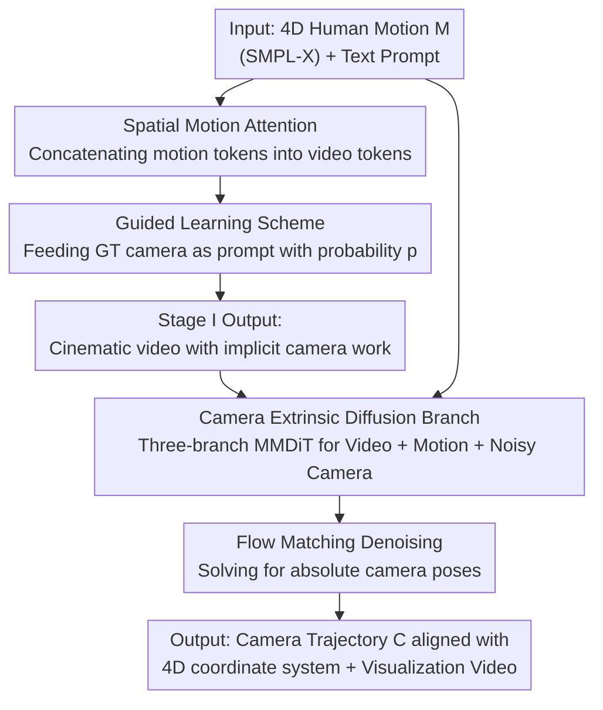

# AdaViewPlanner: Adapting Video Diffusion Models for Viewpoint Planning in 4D Scenes

**Conference**: ICLR2026  
**OpenReview**: [https://openreview.net/forum?id=c2EfS9E5CJ](https://openreview.net/forum?id=c2EfS9E5CJ)  
**Code**: [Project Page](https://yuli0103.github.io/AdaViewPlanner/)  
**Area**: Video Generation / Diffusion Models / 4D Viewpoint Planning  
**Keywords**: Text-to-Video Diffusion, Camera Trajectory Planning, 4D Scenes, Computational Cinematography, World Models

## TL;DR
By treating a pre-trained text-to-video (T2V) diffusion model as a "virtual cinematographer," this work implements a two-stage paradigm—first generating videos with implicit professional camera movements based on 4D human actions, and then explicitly extracting the viewpoint via a camera extrinsic diffusion branch—achieving automatic camera trajectory planning in 4D scenes with open-domain generalization and text controllability significantly exceeding specialized models.

## Background & Motivation
**Background**: Rendering 4D scenes (dynamic 3D content) into visually appealing videos requires designing the movement of virtual cameras. Traditionally, "automated cinematography/camera planning" techniques have been used, with mainstream solutions training specialized models on limited datasets, such as E.T. (conditioned on text + character trajectory) and DanceCamera3D (conditioned on music + dance poses).

**Limitations of Prior Work**: While these specialized models perform well in specific scenarios (e.g., dancing), they suffer from two major drawbacks: first, **poor generalization**, failing in diverse open-world scenes; second, **lack of preference control**, making it difficult to direct camera styles using natural language instructions. Essentially, the data they are exposed to is too narrow to learn general cinematographic knowledge of "which movement pairs with which shot."

**Key Challenge**: To make camera planning both generalizable and controllable, a prior that has observed massive amounts of film and internalized the "movement-to-scene" correspondence is required. Specialized models lack this prior natively, and training one from scratch is hindered by the lack of large-scale 4D data with camera annotations.

**Goal**: Without re-training large models, given a 4D human motion (SMPL-X joint sequence) and a text prompt, output a camera extrinsic sequence $C \in \mathbb{R}^{f\times 9}$ (3D translation + 6D rotation representation) aligned with the scene coordinate system, along with a visualization video.

**Key Insight**: The authors' key insight is that recent T2V models are trained on vast amounts of footage, and the dynamic videos they generate naturally possess professional camera work. This indicates that the models implicitly "know" how the camera should follow the action. Since viewpoints are already embedded in the video, why not borrow this "cinematographic expertise" to back-calculate the camera trajectory?

**Core Idea**: Instead of treating camera planning as a regression problem, it **reuses video generation priors** in two steps: first, letting the T2V model generate a video with implicit camera movement based on the action; second, using a dedicated camera diffusion branch to explicitly decode the viewpoint from the "video + action."

## Method

### Overall Architecture
The method aims to input viewpoint-independent 4D human motion $M \in \mathbb{R}^{f\times k\times 3}$ ($k=22$ SMPL-X joints) plus a text prompt, and output a camera trajectory aligned with the motion's coordinate system. The process follows two stages: **Stage I** injects motion into a frozen T2V backbone, allowing the model to autonomously generate videos with cinematographic movement—where the trajectory is "implicit." **Stage II** constructs a camera extrinsic diffusion branch, feeding in the Stage I generated video + raw motion skeleton, and uses flow matching to denoise absolute camera poses. Because the entire pipeline inherits T2V capabilities, text prompts can control both scene context and cinematic style.

### Key Designs

**1. Spatial Motion Attention: Injecting 4D Motion without Camera Labels into Frozen Video Models**

The first problem is making the T2V model "understand" human motion without destroying its generation prior. Borrowing from 3DTrajMaster, the authors use a pose encoder to map the motion sequence $M$ to latent embeddings $z_m \in \mathbb{R}^{f'\times k\times d}$, where a temporal downsampling module aligns the temporal resolution $f'$ with the VAE-encoded video latent. Then, video tokens $z_v^{(t)}$ and motion tokens $z_m$ are concatenated along the spatial dimension: $T = [z_v^{(t)}; z_m] \in \mathbb{R}^{f'\times(h\cdot w+k)\times d}$. Standard self-attention is applied: $z_v^{(t)} = z_v^{(t)} + \text{Truncate}(\text{Attn}(q,k,v))$, where Truncate discards the output of motion tokens, retaining only the updated video tokens. This allows the video content to align with motion via frame-by-frame correspondence while **fine-tuning only the new motion encoder and attention layers while freezing the video backbone**, maximizing the preservation of pre-trained cinematography knowledge.

**2. Guided Learning Scheme: Preventing Training Collapse with Curriculum GT Prompts**

Expecting the model to hallucinate a video that "conforms to 3D dynamics, satisfies cinematic composition, and renders an implicit camera trajectory" solely from motion is too difficult; unguided learning leads to training collapse due to the ambiguous projection between rendered video and 4D content. The solution is curriculum learning: with probability $p$, the ground-truth camera pose $z_c$ (encoded by an independent encoder symmetric to the pose encoder) is also concatenated into the token sequence:

$$T = \begin{cases} [z_v^{(t)}; z_m; z_c] \in \mathbb{R}^{f'\times(hw+k+1)\times d}, & \text{with probability } p, \\ [z_v^{(t)}; z_m] \in \mathbb{R}^{f'\times(hw+k)\times d}, & \text{with probability } 1-p. \end{cases}$$

Effectively, the model is allowed to "peek" at the correct camera half of the time ($p=0.5$ in experiments) to first learn "how to render motion correctly given a viewpoint," before transitioning to autonomous camera design. Furthermore, 3D spatial RoPE encodes motion tokens, and pose-specific RoPE distinguishes motion from camera tokens. This strategy decomposes a divergent joint learning problem into progressive learning with a difficulty gradient, crucial for Stage I convergence.

**3. Three-branch MMDiT Camera Extrinsic Diffusion: "Decoding" Viewpoints instead of "Estimating" Them**

The camera trajectory in Stage I videos is implicit and must be explicitly extracted and aligned with the 4D motion coordinate system. While off-the-shelf camera estimation (e.g., SfM from video) is an intuitive choice, it faces two fatal issues: (1) estimated poses require complex post-processing to align with human motion coordinates; (2) AI-generated videos often lack geometric/texture consistency, causing feature-matching-based estimation to jitter or fail. Consequently, the authors opt for **direct estimation**: using an MMDiT framework with three specialized branches—video (initialized from pre-trained), camera, and human motion (both randomly initialized with simplified spatial attention + FFN). A flow matching objective is used to predict the vector field moving noisy camera parameters toward clean ones. During training, video tokens $z_v$ and motion tokens $z_m$ act as clean conditions, while camera tokens $z_c^{(t)}$ mix linearly with noise across timesteps. Multi-modal spatial attention operates on the concatenated tokens: $q=[q_v; q_m; q_c^{(t)}]$, and similarly for $k$ and $v$. This works because the video provides camera cues and the motion provides a reference coordinate system; constrained by both, the model directly regresses **absolute** poses, bypassing sensitivity to generation artifacts and eliminating post-processing alignment.

**4. Synthetic Data + 4D Reconstruction for Unified Coordinates: Obtaining Precise Camera Annotations**

Direct estimation requires paired "video-precise camera pose" data, which is rare in the wild. The authors use Unreal Engine to render synthetic data (providing diverse motions + precise camera parameters), mixing 101k MultiCamVideo, 43k HumanVid UE, and 100k internal UE videos during training. GVHMR is used to reconstruct 4D human motion, unifying camera and motion data into the same coordinate system. Stage II training is split: 10k steps for relative camera poses, followed by 40k steps for absolute poses using the human motion branch. This data pipeline solves the fundamental difficulty of supervised absolute pose labels.

### Loss & Training
Stage I: Initialized from a 1B parameter Transformer T2V backbone, trained for 15k steps on 400k unfiltered videos ($384\times 672$), then fine-tuned for 10k steps on 10k selected high-quality cinematic internal videos; Adam, 16x H800, batch size 64, learning rate $5\times 10^{-5}$, timestep shift=15, camera guidance probability 0.5, freezing the backbone to train only motion encoder and spatial attention layers. Stage II: Uses flow matching, split into relative pose (10k steps) $\to$ absolute pose (40k steps) phases, with timestep shift reduced to 1. Sampling for both models uses 50 steps during inference.

## Key Experimental Results

### Main Results
Evaluated on the E.T. test set (refined to 500 samples) and a custom test set (240 samples), comparing against E.T. and DanceCam* (a re-implementation of DanceCamera3D using the paper's skeleton format). Evaluation includes rules-based metrics, MLLM (Gemini 2.5 Pro), and user studies.

| Test Set | Method | HMR↓ | Jerk_t↓ | Dist_t↑ | TCC↑ | CSD↑ | User Pref.%↑ |
|----------|--------|------|---------|---------|------|------|-------------|
| E.T. | E.T. | 0.064 | 0.001 | 0.538 | 0.850 | 0.608 | 23.81 |
| E.T. | DanceCam* | 0.053 | 0.013 | 1.236 | 0.975 | 0.569 | 14.29 |
| E.T. | **Ours (Full)** | **0.044** | 0.007 | **2.826** | **1.125** | **0.686** | **61.90** |
| Ours | E.T. | 0.048 | 0.001 | 0.700 | 0.790 | 0.623 | 20.83 |
| Ours | DanceCam* | 0.024 | 0.014 | 1.535 | 0.867 | 0.593 | 15.83 |
| Ours | **Ours (Full)** | **0.018** | 0.003 | 1.415 | **1.385** | **0.711** | **63.33** |

Lower HMR (Human Miss Rate) indicates the camera is more human-centric; higher Dist (Camera Diversity) shows the camera frames more freely in 360° space; TCC/CSD indicate trajectories follow text better with richer cinematic styles. User preference exceeds 60% on both sets, dominating the baselines. E.T. produces simple shots due to character degradation to single points; DanceCam* collapses to a single trajectory even when trained with the same data due to task divergence.

### Ablation Study
Table 2 shows the 4D human motion control comparison (calculating MPJPE in mm by reconstructing poses with GVHMR from generated videos):

| Config | TikTok WA-MPJPE↓ | General WA-MPJPE↓ | Description |
|--------|------------------|-------------------|-------------|
| MTVCrafter (Wan-2.1-14B) | 73.47 | 224.50 | Fixed frontal view baseline |
| Ours w/o Guided Learning | 72.60 | 127.68 | Removing guidance causes large General domain drop |
| Ours w/o 3D RoPE | 82.59 | 122.13 | Removing 3D RoPE causes TikTok domain drop |
| **Ours (Full)** | **71.65** | **103.92** | Full model has massive general domain advantage |

Table 3 shows ablation for camera trajectory generation:

| Config | HMR↓ | TCC↑ | Reproject IoU↑ | Description |
|--------|------|------|----------------|-------------|
| Stage II w/o Motion | 0.027 | 0.931 | 0.226 | Removing motion leads to viewpoint errors |
| Stage II Relative Cam | 0.039 | 1.413 | 0.325 | Relative poses cause scale awareness issues |
| **Ours (Full)** | **0.018** | 1.385 | **0.338** | Absolute pose prediction is most accurate |

### Key Findings
- **Guided learning is the lifeline of stable training**: Removing it increased General domain WA-MPJPE from 103.92 to 127.68, confirming that unguided learning fails due to projection ambiguity.
- **Motion conditions are indispensable**: Stage II w/o Motion saw Reproject IoU drop from 0.338 to 0.226 with viewpoint errors, showing that the motion branch provides a critical reference coordinate system.
- **Absolute pose outperforms relative pose**: While Relative Cam have slightly higher TCC, they suffer from scale awareness issues and larger Reprojection MSE; predicting absolute poses directly facilitates 4D coordinate alignment.
- **General domain advantage is greater than TikTok**: In the specialized TikTok domain, it only matches MTVCrafter, but leads significantly in the general domain (103.92 vs 224.50) thanks to training on broader motion distributions.

## Highlights & Insights
- **The "viewpoint is hidden in video" insight is clever**: Instead of treating camera planning as an isolated regression task, it acknowledges that T2V models already make implicit cinematic decisions when generating video—one just needs to decode them. This transforms a data-scarce annotation problem into a generation prior utilization problem.
- **Two-stage decoupling of "generation" and "extraction" is clean**: Letting the model express the viewpoint in pixel space (where it excels) and then using a diffusion branch to return the viewpoint to parameter space (structured output) assigns specific duties and avoids the instability of end-to-end camera regression.
- **Using diffusion denoising for camera extrinsic estimation bypasses feature matching**: Geometric inconsistencies in AI-generated videos destroy traditional SfM. Using conditional diffusion to output absolute poses is a transferable strategy for any downstream task extracting geometric quantities from generated video.
- **Curriculum ground-truth prompts (probability $p$ for camera)**: This "peek at the answer, then do it independently" progressive supervision is a valuable reference for any conditional generation task with projection ambiguity or training divergence.

## Limitations & Future Work
- **Only validated on "moving humans" 4D scenes**: To simplify, authors primarily considered human context; camera planning for multi-object, complex scenes, or non-human subjects remains unverified.
- **Heavy reliance on synthetic data (UE rendering)**: Absolute pose supervision for Stage II primarily comes from Unreal Engine; the domain gap between real-world and synthetic scenes may impact deployment.
- **Inherited T2V backbone costs and constraints**: A 1B backbone + 50-step sampling + two stages of diffusion results in high inference costs; the upper bound of capability is boxed in by the camera movement distribution of the pre-trained model.
- **Evaluation metrics are still nascent**: The authors built a three-part evaluation (Rules/MLLM/User) and admitted distributions of old metrics (FCD, CS) are biased; the universality and reproducibility of the new metrics await community testing.

## Related Work & Insights
- **vs. E.T. (Director)**: E.T. models characters as single points for text+trajectory camera generation, losing complex motion info and leading to monotonic trajectories; this work uses full 4D skeletons + video priors, leading in diversity (Dist_t 2.826 vs 0.538).
- **vs. DanceCamera3D**: DanceCamera3D specializes in dance/music; it collapses into a single trajectory for other tasks; this work generalizes across open domains via T2V priors.
- **vs. MTVCrafter / ISA-4D (Human Video Control)**: These methods either use fixed-view 2D poses or require 4D poses + camera parameters as input; this work uses only normalized 4D poses, letting the video model plan its own viewpoint and cinematography.
- **vs. Uni3C / RealisMotion**: They embed characters into unified 3D/world coordinates for joint control; this work emphasizes "letting the video model act as a world model to decide the viewpoint," pushing camera control to the generation prior rather than explicit constraints.

## Rating
- Novelty: ⭐⭐⭐⭐⭐ First to apply T2V generation priors to 4D viewpoint planning; the "implicit viewpoint" insight + two-stage decoupling is highly imaginative.
- Experimental Thoroughness: ⭐⭐⭐⭐ Solid triple evaluation (Rules/MLLM/User) + ablations, though baselines are few and rely on custom metrics.
- Writing Quality: ⭐⭐⭐⭐ Clear motivation, explicit two-stage narrative, good coordination between formulas and figures.
- Value: ⭐⭐⭐⭐⭐ Provides a convincing proof-of-concept for the "video models as world models" direction in 4D interaction; the approach is highly transferable.

<!-- RELATED:START -->

## Related Papers

- [\[ICLR 2026\] Vid2World: Crafting Video Diffusion Models to Interactive World Models](vid2world_crafting_video_diffusion_models_to_interactive_world_models.md)
- [\[CVPR 2026\] DriveLaW: Unifying Planning and Video Generation in a Latent Driving World](../../CVPR2026/video_generation/drivelaw_unifying_planning_and_video_generation_in_a_latent_driving_world.md)
- [\[ICCV 2025\] SteerX: Creating Any Camera-Free 3D and 4D Scenes with Geometric Steering](../../ICCV2025/video_generation/steerx_creating_any_camera-free_3d_and_4d_scenes_with_geometric_steering.md)
- [\[ICLR 2026\] Target-Aware Video Diffusion Models](target-aware_video_diffusion_models.md)
- [\[ICLR 2026\] Consistent Noisy Latent Rewards for Trajectory Preference Optimization in Diffusion Models](consistent_noisy_latent_rewards_for_trajectory_preference_optimization_in_diffus.md)

<!-- RELATED:END -->
