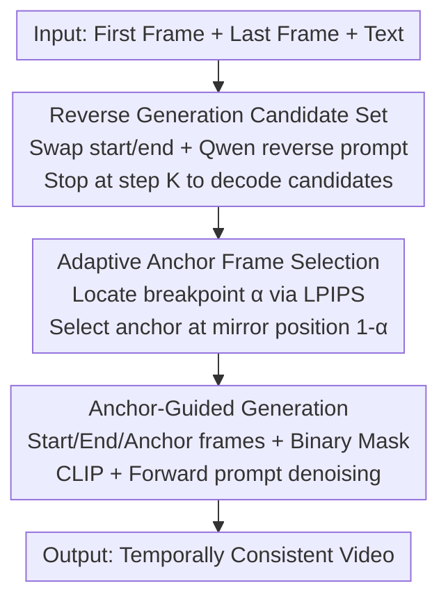

# Anchor Frame Bridging for Coherent First-Last Frame Video Generation

**Conference**: ICLR2026  
**OpenReview**: [https://openreview.net/forum?id=isNjWnVsUR](https://openreview.net/forum?id=isNjWnVsUR)  
**Code**: TBD  
**Area**: Video Generation  
**Keywords**: First-Last Frame Video Generation, Anchor Frame, Training-free, Temporal Consistency, Diffusion Models

## TL;DR
To address semantic decay and visual collapse in the intermediate frames of First-Last Frame Video Generation (FLF2V), this paper proposes a training-free Anchor Frame Bridging (AFB) method. By adaptively inserting an "anchor frame" at the point of most severe temporal rupture to "relay" semantics from start to end, AFB achieves a 16.58% improvement in FVD and 10.21% in PSNR on Wan2.1-I2V.

## Background & Motivation
**Background**: First-Last Frame Video Generation (FLF2V) requires the model to synthesize a coherent motion sequence given the first and last frames along with a text prompt. Since training large models from scratch to handle first-last frame conditioning is computationally expensive, mainstream approaches (e.g., Wan2.1-FLF2V, Make Pixels Dance) reuse existing Image-to-Video (I2V) models by concatenating the first and last frames as conditions.

**Limitations of Prior Work**: Such reused I2V methods suffer from severe "midpoint information decay." Deterministic semantics from the boundary frames weaken as they propagate toward the middle, leading to scene distortion, object deformation, and limb artifacts. Furthermore, the final frames often experience sudden attribute shifts to align with the terminal frame, causing temporal jitter.

**Key Challenge**: The authors identify the root cause through DiT self-attention visualization: within self-attention layers, significant inter-frame attention exists only between adjacent frames, while the attention weight from boundary frames to mid-segment frames is extremely low. Thus, semantic decay at the midpoint is an inherent architectural limitation. LPIPS analysis confirms high consistency near the first frame but a sharp decline in the mid-to-late segments.

**Goal**: To restore temporal consistency and eliminate collapse at continuity breakpoints by bridging first-last frame semantics to the midpoint without retraining the large model.

**Key Insight**: Since attention is strongest between neighboring frames, a high-quality, semantically aligned "anchor frame" should be placed at the most severe rupture point. This anchor serves as a new local reference to relay semantics segment-by-segment via neighbor attention.

**Core Idea**: Replace complex forward/backward denoising fusion with "adaptive anchor frame insertion at temporal breakpoints" to bridge semantic continuity from the boundary frames to intermediate frames in a training-free, plug-and-play manner.

## Method

### Overall Architecture
AFB takes the first frame $I_0$, last frame $I_{N-1}$, and a text prompt as input. The process consists of two stages: **first**, the "Adaptive Anchor Frame Selection" module identifies the most suitable anchor frame and its insertion position; **second**, "Anchor-Guided Generation" feeds the first, last, and anchor frames back into the I2V model as conditions to generate the final video.

The key mechanism is "Reverse Generation": the authors observe that breakage usually occurs in the mid-to-late segment as quality degrades over time. If the first and last frames are swapped for a reverse generation, the original "breakpoint" location becomes close to the start of the sequence and thus exhibits high quality. The forward breakpoint $\alpha$ corresponds to a high-quality anchor in the reverse video at the mirrored position $1-\alpha$.

### Key Designs

**1. Building Candidate Anchor Sets via Reverse Generation: Placing Quality Frames Where Needed**

Finding an anchor frame in the forward video is futile because the frame at the breakpoint is already collapsed. The authors swap the positions of $I_0$ and $I_{N-1}$, generate a reverse text prompt $P^{rev}=\text{Qwen}(I_{N-1}, I_0)$, and encode the swapped frames as condition $z_c=E(I_{N-1}, I_0)$. During denoising $z_{t-1}=\text{update}(z_t, u_\theta(z_t; t, z_c, c_{P^{rev}}); t)$, the "high quality" leading segment of the reverse video aligns with the "collapsed" mid-to-late segment of the forward video. To save computation, denoising can terminate at step $K\le T$, using predicted clean samples $\hat z_0=\frac{z_t-\sqrt{1-\bar\alpha_t}\,\epsilon_\theta(z_t,t)}{\sqrt{\bar\alpha_t}}$ to decode the candidate set $\{I_n\}_{n=0}^{N-1}$.

**2. Adaptive Anchor Frame Selection: Locating Breakpoints with LPIPS**

The quality assessment function $Q$ is defined using LPIPS to simulate human perception; a larger LPIPS between adjacent frames indicates poorer continuity. Specifically, $Q(I_n)=-\frac{1}{2}(\text{LPIPS}(I_{n-1},I_n)+\text{LPIPS}(I_n,I_{n+1}))$. The frame with the lowest $Q$ at position $n_p=\arg\min_n Q(I_n)$ is the breakpoint, normalized as $\alpha=n_p/(N-1)$. Due to the approximate symmetry of breakpoints in forward/reverse generation, the anchor $I_a$ is selected from the reverse candidate set at mirror position $n_a=(N-1)(1-\alpha)$.

**3. Anchor-Guided Generation: Mask-Controlled Condition Injection**

$I_0$, $I_{N-1}$, and $I_a$ are provided as conditions. A binary mask $M\in\{0,1\}^{1\times N\times h\times w}$ is introduced ($1$ for fixed, $0$ for generation). The conditions and zero-filled frames are concatenated along the temporal axis to form $I_c\in\mathbb{R}^{C\times N\times H\times W}$, then encoded to $z_c=E(I_c)$. CLIP features of the boundary frames $c_i=[c_0, c_{N-1}]$ and the forward prompt $c_{P^{fwd}}$ are injected via cross-attention. During denoising $z_{t-1}=\text{update}(z_t, u_\theta(z_t; t, m, c_i, c_{P^{fwd}}, z_c); t)$, the anchor at $\alpha$ relays semantics, ensuring higher consistency.

### Loss & Training
AFB is **training-free and plug-and-play**. It introduces no new parameters and requires no fine-tuning. All operations occur during inference (reverse sampling + LPIPS selection + conditional injection), allowing direct integration with existing I2V models like Wan2.1-I2V or HunyuanVideo.

## Key Experimental Results

### Main Results
Evaluated on a dataset of 436 frame pairs (from DAVIS, RealEstate10K, etc.) comparing AFB integrated with Wan2.1/HunyuanVideo against Baselines:

| Method | LPIPS ↓ | FVD ↓ | SSIM ↑ | PSNR ↑ | GPT-4o ↑ | Gemini ↑ |
|------|---------|-------|--------|--------|----------|----------|
| ViBiDSampler | 0.19 | 426.15 | 0.90 | 33.08 | 82.06 | 82.88 |
| Generative Inbetweening | 0.24 | 453.76 | 0.85 | 31.25 | 75.42 | 72.15 |
| HunyuanVideo-I2V | 0.25 | 496.32 | 0.82 | 31.48 | 73.28 | 71.69 |
| HunyuanVideo + AFB | 0.21 | 435.71 | 0.89 | 32.54 | 81.33 | 79.26 |
| Wan2.1-I2V | 0.22 | 449.68 | 0.87 | 32.13 | 79.31 | 76.43 |
| Wan2.1-FLF2V | 0.19 | 413.68 | 0.91 | 33.20 | 84.23 | 84.94 |
| **Wan2.1 + AFB** | **0.16** | **375.12** | **0.97** | **35.41** | **88.64** | **89.35** |

Wan2.1 + AFB achieves SOTA: reducing FVD from 449.68 to 375.12 (Gain: 16.58%) and increasing PSNR from 32.13 to 35.41 (Gain: 10.21%) compared to the base model.

### Ablation Study

| Dimension | Config | Key Metrics | Note |
|----------|------|---------|------|
| Anchor Count $N_a$ | $N_a=1$ | FVD 375.12 / PSNR 35.41 | Optimal for 5s video |
| Anchor Count $N_a$ | $N_a=2$ | FVD 386.94 / PSNR 34.27 | Excessive constraint reduces motion smoothness |
| Stop step $K$ | $K=15$ | FVD 388.45 / +35% Time | Best efficiency-quality trade-off |
| Stop step $K$ | $K=50$ | FVD 375.12 / +105% Time | Full denoising yields best quality |
| Text Prompt | Qwen Customized | FVD 375.12 | Detailed prompt aligning start/end semantics |

### Key Findings
- **Single Anchor Sufficiency**: For 5s videos, one anchor frame is optimal. Adding more induces competing constraints that degrade motion diversity.
- **Efficiency Balance**: $K=15$ provides a significant boost while only adding 35% to inference time, outperforming the full-denoising baseline.
- **Attention Visualization**: Post-AFB, the sparsity in the intermediate frame attention maps is mitigated, proving that the anchor effectively bridges semantics.

## Highlights & Insights
- **Reverse + Mirror Symmetry**: Swapping boundary frames to generate high-quality candidates and using the $1-\alpha$ mirror rule is a highly elegant solution for "what frame to use" and "where to put it."
- **Mechanism-Driven Design**: The method is derived from visualizing architectural attention decay, ensuring the solution directly addresses the underlying symptom.
- **Portability**: As a purely inference-side operation, it is agnostic to the underlying DiT architecture.

## Limitations & Future Work
- **Base Model Dependency**: AFB is limited by the underlying I2V model and may still fail in scenarios with extreme occlusions or non-rigid deformations.
- **Empirical Symmetry**: The $1-\alpha$ mirror assumption relies on forward/backward decay symmetry, which might fail in highly asymmetrical motion sequences.
- **Inference Overhead**: Reverse sampling effectively adds a second denoising pass. Improving the speed of candidate generation is necessary.

## Related Work & Insights
- **vs. FLF2V Methods (Wan2.1-FLF2V)**: AFB outperforms fine-tuned models by explicitly reinforcing semantic propagation through anchor frames without altering weights.
- **vs. Video Frame Interpolation (ViBiDSampler)**: Unlike dual-path fusion approaches which struggle with large motion discrepancies, AFB bridges the gap via a single stable anchor.

## Rating
- Novelty: ⭐⭐⭐⭐ Excellent use of reverse-mirror logic.
- Experimental Thoroughness: ⭐⭐⭐⭐ Solid cross-model validation and ablations.
- Writing Quality: ⭐⭐⭐⭐ Logical flow from motivation to verification.
- Value: ⭐⭐⭐⭐ High practical utility for controlled video generation.

<!-- RELATED:START -->

## Related Papers

- [\[ICLR 2026\] Controllable First-Frame-Guided Video Editing via Mask-Aware LoRA Fine-Tuning](controllable_first-frame-guided_video_editing_via_mask-aware_lora_fine-tuning.md)
- [\[CVPR 2026\] FFP-300K: Scaling First-Frame Propagation for Generalizable Video Editing](../../CVPR2026/video_generation/ffp-300k_scaling_first-frame_propagation_for_generalizable_video_editing.md)
- [\[ICLR 2026\] Frame Guidance: Training-Free Guidance for Frame-Level Control in Video Diffusion Models](frame_guidance_training-free_guidance_for_frame-level_control_in_video_diffusion.md)
- [\[CVPR 2025\] Generative Inbetweening through Frame-wise Conditions-Driven Video Generation](../../CVPR2025/video_generation/generative_inbetweening_through_frame-wise_conditions-driven_video_generation.md)
- [\[ICML 2026\] Enhancing Train-Free Infinite-Frame Generation for Consistent Long Videos](../../ICML2026/video_generation/enhancing_train-free_infinite-frame_generation_for_consistent_long_videos.md)

<!-- RELATED:END -->
