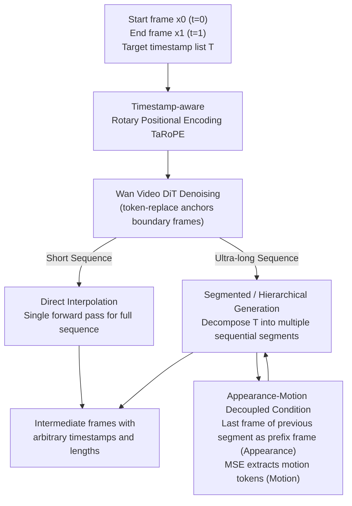

# Arbitrary Generative Video Interpolation

**Conference**: ICLR 2026  
**arXiv**: [2510.00578](https://arxiv.org/abs/2510.00578)  
**Code**: [Project Homepage](https://mcg-nju.github.io/ArbInterp-Web/)  
**Area**: Video Understanding / Video Generation  
**Keywords**: Video Frame Interpolation, Generative VFI, RoPE, Temporal Conditioning, Any-length Generation

## TL;DR

ArbInterp proposes a generative video frame interpolation framework that supports arbitrary timestamps and lengths. It achieves precise temporal control via Timestamp-aware Rotary Positional Encoding (TaRoPE) and enables seamless splicing of long sequences through an appearance-motion decoupled conditioning strategy.

## Background & Motivation

Video Frame Interpolation (VFI) is a fundamental task in video generation, aiming to generate intermediate transition frames given a start and an end frame. Recently, diffusion-model-based generative VFI methods (e.g., DynamiCrafter, TRF, GI) have demonstrated the ability to generate high-quality intermediate frames.

However, existing generative VFI methods face two critical limitations:

**Fixed Interpolation Count**: Current methods can only generate a fixed number of intermediate frames (e.g., 7 or 15 frames) in a single pass, lacking flexibility in adjusting the frame rate or total sequence duration. For instance, a user might need 2 intermediate frames (2x) or 31 frames (32x) between two frames; existing methods struggle to handle these uniformly.

**Incoherence in Long Sequences**: When many interpolation frames are required (e.g., 32x interpolation), generating long sequences directly faces video memory and quality issues. Segmented generation is a natural solution, but ensuring spatio-temporal coherence between different segments is difficult, often leading to unnatural motion or inconsistent appearances.

ArbInterp aims to construct a unified generative VFI framework that simultaneously addresses the challenges of "arbitrary timestamps" and "any length."

## Method

### Overall Architecture

ArbInterp is built upon a pretrained video diffusion model (Wan2.1-T2V-1.3B). Its core objective is: given a start frame $x_0$ and an end frame $x_1$, generate corresponding intermediate frames according to a user-specified sequence of timestamps $T=[0,t_1,\dots,t_n,1]$, where both the count and positions of the timestamps are arbitrary. The pipeline operates at two scales. Within a single segment, boundary frames are anchored via token-replace on latent codes, and **Timestamp-aware Rotary Positional Encoding (TaRoPE)** binds each frame to a continuous normalized timestamp $t\in[0,1]$. Consequently, a single DiT forward pass can produce intermediate frames at any position (even non-uniform). At the sequence level, because TaRoPE normalizes any length to the $[0,1]$ interval, ultra-long interpolations can be decomposed into several short segments generated sequentially or hierarchically. These segments are stitched using **appearance-motion decoupled conditions** to avoid appearance drift or motion jumps at the seams. The former facilitates "arbitrary timestamps," while the latter enables "any length," allowing one model to cover all interpolation needs from 2x to 32x and beyond.

### Key Designs

**1. Timestamp-aware Rotary Positional Encoding (TaRoPE): Enabling Arbitrary Continuous Timeframe Generation**

Methods like DynamiCrafter assign discrete integer indices $0,1,2,\dots$ to temporal RoPE. Consequently, the model relies on fixed positions (e.g., focusing only on positions 0 and 15 during 16-frame training), making it impossible to generate a single frame at $t=0.3$. TaRoPE leverages the fact that temporal RoPE in DiT is the **only** component allowing each frame latent to perceive its own temporal position; modifying it changes the frame's temporal placement. Specifically, it replaces discrete indices in the RoPE rotation angles with continuous timestamps. While original temporal RoPE rotates the $k$-th latent by $\theta_k=k\,\theta_{\text{base}}$, TaRoPE uses normalized timestamps $t_k=\frac{k-1}{N-1}$ as positions, with the rotation angle becoming $t_k\,\theta_{\text{base}}$. The first frame is fixed at $t=0$ and the last at $t=1$. This transforms positional encoding from "discrete steps" to "continuous sliding along the time axis." Videos of any length are mapped to the same continuous $[0,1]$ motion field, allowing 2x and 32x to share the same continuous mapping. It adds almost no parameters and requires only minor fine-tuning of the pretrained model.

**2. Segmented / Hierarchical Inference: Decomposing Arbitrary Lengths into Training Distributions**

Producing 31 frames (32x) directly in a single pass is memory-intensive, involves $O(N^2)$ self-attention complexity, and suffers from quality degradation. Since TaRoPE maps any length to $[0,1]$, long interpolations can be divided into short segments within training limits. The paper proposes three adaptive inference strategies: direct forward pass for short sequences; **sequential interpolation** (segmenting target timestamps into non-overlapping sequential segments for real-time low-latency scenarios like gaming); or **hierarchical interpolation** (predicting anchor frames sparsely before refining between anchors for better global trajectory coordination). Splitting a length $N$ into $M$ segments reduces self-attention complexity from $O(N^2)$ to $O(N^2/M)$. This step ensures computational feasibility, while seamless stitching is handled by the next design.

**3. Appearance-Motion Decoupled Conditioning: Ensuring Smooth Continuity across Segments**

The randomness of generative models can cause gradual appearance drift and abrupt motion jumps at segment boundaries. Concatenating previous latents into the input directly increases training and inference costs, while cross-attention alone weakens appearance consistency. ArbInterp splits inter-segment consistency into two orthogonal signals: For **Appearance**, only the last frame of the previous segment is used as a prefix frame in the input, maintaining visual continuity at minimal cost. For **Motion**, a Motion Semantic Extractor (MSE) extracts semantic-level motion tokens from the last $N$ frames of the previous segment. The MSE uses a temporally enhanced CLIP (replacing the last $L$ layers with spatio-temporal full attention) to extract spatio-temporal features aligned with text semantics, which are then compressed into a fixed number of motion tokens by a Q-Former. Both types of motion tokens are injected via the original cross-attention (the same channel as text prompts). After freezing cross-attention parameters, the MSE learns to extract semantics capable of controlling video motion. Appearance handles "visual similarity" while motion handles "flow smoothness," providing better controllability than mixed signals.

### Loss & Training

Training follows Wan’s flow matching objective $L=\lVert v_n-u_\theta(z_n,n,y)\rVert^2$, where $v_n=\epsilon_n-z$ and $y$ denotes text and other conditions. The process consists of three stages: Stage 1 involves full fine-tuning of the DiT to adapt the generative model to the VFI task, with inputs including boundary frames, a random number of target intermediate frames, and an optional prefix frame. Stage 2 freezes the denoising network to train the MSE independently. Training utilizes 50,000 selected video clips from OpenVid, fine-tuning for approximately 20,000 steps on 8 96GB GPUs. Each step predicts 1–19 intermediate frames with a maximum boundary interval of 2 seconds. Using 30–120fps data allows the training timestamps to naturally cover $1/2$ to $1/240$, treating "arbitrary $t$ and arbitrary length" as standard conditions.

## Key Experimental Results

### Evaluation Benchmarks

The authors constructed two comprehensive benchmarks:
1. **MultiInterp Benchmark**: Multi-scale frame interpolation evaluation (2x, 4x, 8x, 16x, 32x) to test generalization across different interpolation ratios.
2. **StreamInterp Benchmark**: Streaming/long-sequence interpolation evaluation to test spatio-temporal coherence during segmented generation.

### Main Results

Under the 2x setting of MultiInterpBench (↓ lower is better, ↑ higher is better):

| Method | FID↓ | LPIPS↓ | CLIPimg↑ | VBench Total Avg↑ |
|------|------|--------|----------|-------------------|
| LDMVFI | 85.8 | 0.297 | 0.863 | 0.7928 |
| TRF | 108.5 | 0.435 | 0.879 | 0.7739 |
| GI | 90.8 | 0.496 | 0.893 | 0.7728 |
| DynamiCrafter | 83.6 | 0.249 | 0.877 | 0.7996 |
| ArbInterp-SVD | 59.1 | 0.152 | 0.902 | 0.8144 |
| **Ours** | **44.9** | **0.076** | **0.913** | **0.8286** |

ArbInterp achieves optimal or sub-optimal results across all interpolation ratios (2x→32x), with significant leads in fidelity metrics like FID and LPIPS. Even with an SVD backbone (ArbInterp-SVD), it outperforms DynamiCrafter using the same backbone, suggesting that gains stem primarily from TaRoPE and decoupled conditioning.

### Ablation Study

| Configuration | Key Findings | Explanation |
|------|---------|------|
| w/o TaRoPE (Fixed Positional Encoding) | Quality decrease | Unable to adapt to different ratios |
| w/o Appearance-Motion Decoupled Conditioning | Incoherent segments | Motion jumps and appearance drift |
| Different Segment Lengths | Trade-off between efficiency and quality | Shorter segments are more flexible but may accumulate errors |

### Key Findings

1. **Continuous Controllability of TaRoPE**: A single model can handle any interpolation from 2x to 32x without needing separate training for each ratio.
2. **Necessity of Decoupled Conditioning**: Using only the last frame of the previous segment as a condition (without distinguishing appearance and motion) leads to progressive quality degradation in long sequences.
3. **Comprehensive Advantage**: ArbInterp surpasses existing methods in both quantitative metrics and qualitative visual smoothness.

## Highlights & Insights

- **Elegant TaRoPE Solution**: Encoding continuous timestamps into RoPE is a concise yet effective design, enabling arbitrary timestamp control with near-zero extra parameters. This can be extended to other generative tasks requiring continuous indexing.
- **Decoupled Design Philosophy**: Appearance consistency and motion coherence are orthogonal requirements; handling them separately provides better control. This is applicable to video editing and video extension tasks.
- **High Practicality**: Arbitrary ratio + Arbitrary length = A single model for all VFI needs, significantly reducing deployment complexity.
- **Benchmark Construction**: The creation of MultiInterp and StreamInterp benchmarks facilitates fair comparisons for future work.

## Limitations & Future Work

1. **Inference Speed of Diffusion Models**: Generative methods using frame-by-frame denoising are much slower than traditional optical flow methods (e.g., RIFE, IFRNet), becoming a bottleneck for high-ratio interpolation.
2. **Accumulated Segment Errors**: While decoupled conditioning helps, it remains uncertain if progressive degradation will occur for ultra-long sequences (e.g., 64x, 128x).
3. **Scene Diversity**: Demos focus on driving and sports; performance in extreme cases like complex occlusions or scene cuts is unknown.
4. **Comparison with Non-generative Methods**: Extensive quantitative comparison with efficient traditional flow-based VFI methods (RIFE, etc.) would be more convincing.
5. **Training Data Requirements**: Generative models typically require large-scale video pretraining, raising concerns about training costs and data sources.

## Related Work & Insights

- **Relationship with DynamiCrafter**: DynamiCrafter is a representative generative VFI method, but it is limited by fixed frame positional encoding. TaRoPE addresses this fundamental constraint.
- **Relationship with TRF and GI**: These methods also attempt generative interpolation but are similarly restricted by fixed sequence lengths.
- **Temporal Expansion of RoPE**: Originally used for sequence positional encoding in LLMs, ArbInterp extends RoPE to the temporal dimension of video with support for continuous values.
- **Inspiration for Video Generation**: TaRoPE and decoupled conditioning strategies are applicable not only to VFI but also to video prediction and extension.

## Rating
- Novelty: ⭐⭐⭐⭐
- Experimental Thoroughness: ⭐⭐⭐⭐
- Writing Quality: ⭐⭐⭐⭐
- Value: ⭐⭐⭐⭐

<!-- RELATED:START -->

## Related Papers

- [\[ICLR 2026\] Realtime Video Frame Interpolation Using One-Step Diffusion Sampling](realtime_video_frame_interpolation_using_one-step_diffusion_sampling.md)
- [\[ICLR 2026\] MTVCraft: Tokenizing 4D Motion for Arbitrary Character Animation](mtvcraft_tokenizing_4d_motion_for_arbitrary_character_animation.md)
- [\[CVPR 2026\] Towards Holistic Modeling for Video Frame Interpolation with Auto-regressive Diffusion Transformers](../../CVPR2026/video_generation/towards_holistic_modeling_for_video_frame_interpolation_with_auto-regressive_dif.md)
- [\[ICLR 2026\] Any-to-Bokeh: Arbitrary-Subject Video Refocusing with Video Diffusion Model](any-to-bokeh_arbitrary-subject_video_refocusing_with_video_diffusion_model.md)
- [\[ICLR 2026\] Generative View Stitching](generative_view_stitching.md)

<!-- RELATED:END -->
