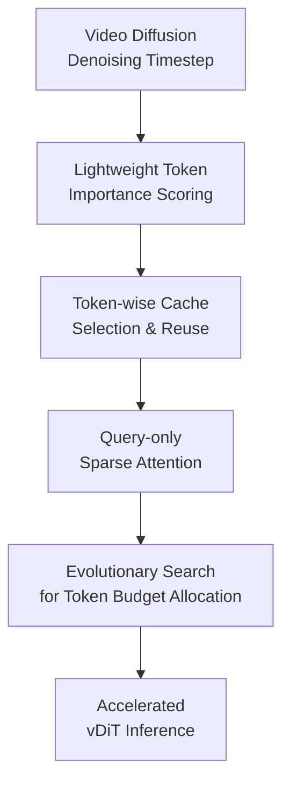

# Astraea: A Token-wise Acceleration Framework for Video Diffusion Transformers

**Conference**: ICLR2026  
**OpenReview**: [https://openreview.net/forum?id=e8P4Oo8S6U](https://openreview.net/forum?id=e8P4Oo8S6U)  
**Paper**: [Project Site](https://astraea-project.github.io/ASTRAEA/)  
**Code**: Not confirmed to be public  
**Area**: Video Generation / Video Diffusion Acceleration  
**Keywords**: Video Diffusion Transformer, token-wise acceleration, sparse attention, token caching, evolutionary search

## TL;DR
Addressing the inference bottlenecks of Video Diffusion Transformers, Astraea proposes a framework comprising token-wise selection, GPU-friendly sparse attention, and evolutionary token budget search, achieving up to 2.4× acceleration on a single GPU and up to 13.2× in multi-GPU scenarios while maintaining generation quality.

## Background & Motivation
**Background**: High-quality text-to-video systems predominantly rely on Video Diffusion Transformers (vDiTs). These models gradually restore random noise into video latents through dozens to hundreds of denoising timesteps, which are then decoded into the final video. The long token sequences in video tasks—amplified by spatial resolution, temporal frames, and transformer depth—lead to significant GPU time consumption by attention, cross-attention, and MLP layers during every denoising step.

**Limitations of Prior Work**: Existing acceleration methods primarily operate at two granularities. One reduces denoising steps via distillation or step skipping; the other reuses intermediate features at the block level, such as PAB, Delta-DiT, and AdaptiveCache. While these reduce computation, many strategies depend on manual configurations for skipping steps or blocks, resulting in high tuning costs and failing to meet industrial demands for automatically finding the most efficient solution for a given quality target.

**Key Challenge**: Redundancy in vDiTs is non-uniformly distributed. The impact on final image quality varies significantly across different timesteps, blocks, and tokens. Whole-step skipping or block-level caching is too coarse, potentially missing critical tokens. Conversely, token-level methods that cache or approximate entire attention maps often incur excessive memory overhead and produce sparse computations unsuitable for GPUs.

**Goal**: The authors aim to address a more granular question: given a performance target or token budget, which tokens should be computed at each denoising timestep to preserve the original model's generation quality? This objective is divided into three sub-problems: how to estimate token importance efficiently, how to ensure selected tokens translate into near-linear GPU acceleration, and how to allocate token budgets across different denoising steps.

**Key Insight**: A critical observation is that the Log-Sum-Exp (LSE) scores of attention are highly stable across adjacent denoising timesteps; on Wan 2.1, the average cosine similarity between adjacent LSEs reaches 99.1%. This implies that importance can be determined using byproducts of the previous timestep without recomputing expensive attention maps.

**Core Idea**: Astraea utilizes the "LSE importance from the previous timestep × current token variation" to select tokens worthy of recomputation. Only queries of these selected tokens undergo full attention computation while others reuse cached values. An evolutionary search automatically determines the token budget for each timestep.

## Method

### Overall Architecture
Astraea is integrated into the reverse diffusion inference process of vDiTs without modifying model weights or requiring retraining. Before each compute block, a subset of tokens is selected based on token importance and the current budget. Selected tokens proceed through normal self-attention, cross-attention, and MLP, while unselected tokens reuse cached outputs from the same block from an earlier timestep. Simultaneously, an offline search framework finds a token budget schedule for different timesteps to minimize computation under quality constraints.

From an execution perspective, Astraea maintains an output cache from the previous round for each block. Given an input sequence at a certain timestep, the selection module picks top tokens per the budget. Selected tokens are recomputed and update the cache, while unselected tokens are bypassed and populated from the cache. The final sequence is reconstructed by merging recomputed and cached tokens before passing to the next block or timestep.

### Key Designs
**1. Lightweight Token Importance Scoring: Identifying valuable tokens without recomputing attention maps**

The challenge in token selection is that the importance estimation itself must not cost more than the saved computation. Astraea's score consists of two parts: token significance $S_{sig}$ and a consecutive unselected penalty $S_{penalty}$, formulated as $S_{token}=w_\alpha S_{sig}+w_\beta S_{penalty}$, where $S_{sig}=S_{LSE,t-1}\Delta_{token,t}$. $S_{LSE,t-1}$ is derived from the LSE byproduct of the previous timestep's softmax, and $\Delta_{token,t}$ represents the variation between the current token and its state when last computed.

This design combines "how important this token is in attention" with "how much this token is currently changing." Relying solely on LSE favors historically important but currently static tokens, while relying only on token difference might select fast-changing tokens that have little impact on attention output. Their product effectively identifies tokens that are both important and dynamic. The penalty term $S_{penalty}=e^{n_i}$ prevents tokens from remaining uncomputed for too long, mitigating cumulative cache errors.

**2. Token-wise Cache Selection and Reuse: Transforming coarse block skipping into fine-grained token skipping**

Traditional block caching reuses or skips entire blocks, which is suboptimal for video generation as dynamics vary across spatial and temporal positions within the same frame and timestep. Astraea reduces the reuse granularity to the token level: before each compute block, it decides which tokens must pass through the block, while unselected tokens fetch previous outputs from the cache.

This approach transforms "whether to compute this block" into "which tokens in this block are worth computing." It is more flexible than whole-step or block skipping: tokens with intense motion, significant structural changes, or high attention contributions are prioritized, while static backgrounds or slow-moving tokens reuse the cache. Experiments show that fixed token or timestep-level variants perform worse, indicating that important tokens change across blocks and timesteps.

**3. Query-only Sparse Attention: Sacrificing theoretical FLOPs for semantic correctness and GPU friendliness**

An intuitive approach would be to prune $Q$, $K$, and $V$ for selected tokens simultaneously, reducing the attention map from $N \times N$ to a smaller sub-matrix. However, this alters self-attention semantics: every query should ideally attend to all keys/values and perform softmax normalization over the full row. Pruning keys distorts LSE and outputs. Caching the full attention map to correct this would cause memory explosion.

Astraea adopts a strategy that saves slightly fewer FLOPs theoretically but preserves semantics: it computes queries $Q_{sel}$ only for selected tokens, while components $K$ and $V$ are generated from all tokens. It then computes $\text{Softmax}(Q_{sel}K^\top/\sqrt{d})V$. This ensures that setiap recomputed token still attends to the full context, maintaining semantic correctness. Crucially, this row-wise attention structure can utilize GPU kernels like FlashAttention, allowing actual latency to decrease near-linearly with the number of selected tokens.

**4. Evolutionary Search for Token Budget Allocation: Automating token budget assignment**

Even if tokens can be selected within a block, the budget $\theta_i$ for each timestep must be determined. Astraea defines the search space as $\Theta=\{\theta_i\}$, where $\theta_i \in \{0, 10\%, 20\%, \ldots, 100\%\}$ represents the proportion of tokens selected at the $i$-th denoising timestep. Searching at the block level is too expansive, so the budget is fixed at the timestep level, with intra-block scoring determining specific tokens.

The search uses a classical evolutionary algorithm. It initializes $K=50$ candidate budget tables, selecting top candidates with lower MSE as parents each generation to produce new candidates via uniform crossover, block crossover, mutation, and repair. The repair step brings the total token budget back to target ranges (e.g., $[0.9\Theta_\$, 1.1\Theta_\$]$). Fitness is measured by the MSE between the accelerated output and the original model output. Search is performed using only 4 prompts of varying styles, as trends in the "MSE curve after skipping a timestep" are similar across prompts.

### Mechanism
Consider a 4-second video generation with Wan using 50 denoising timesteps. The original model processes every transformer block for all video tokens at every timestep. Astraea first obtains a budget table via offline evolutionary search—for example, allocating 40% tokens for certain early-middle timesteps, 70% for structure-sensitive phases, and 20% for stable phases.

During inference at a specific block, Astraea reads the current token, the previous input token, the previous LSE score, and the consecutive unselect count. If the budget is 40%, it selects the top 40% tokens based on $S_{token}$. Queries of selected tokens are projected and computed against all keys/values. The remaining 60% retrieve old outputs from the cache. After the block, outputs of selected tokens update the cache, and the full sequence proceeds. The complete sequence shape is maintained throughout, but the number of recomputed tokens is significantly reduced.

### Loss & Training
Astraea is a training-free inference acceleration method that does not modify vDiT weights or introduce new generation losses. Its "optimization objective" occurs during the offline search phase: each candidate budget table generates videos, and the MSE against the original unaccelerated model output is calculated. Lower MSE indicates higher fidelity to the original model for a given budget. Evolutionary search uses 30 generations, $K=50$ parents, and $P=30$ new candidates per generation, with mutation probability decreasing from $P_0=0.1$ to $P_{final}=0.01$.

Budgets in experiments are typically expressed as ASTRAEA 40%, 50%, or 70%, representing the total token calculation budget ratio. Regarding hyperparameters, $w_\alpha=1$ is fixed, and $w_\beta \approx 0.5$ is found optimal; however, sensitivity experiments show PSNR fluctuations within 0.2, suggesting the scoring weights are robust.

## Key Experimental Results

### Main Results
Evaluations were conducted on HunyuanVideo-T2V, Wan v2.1 1.3B, and OpenSora v1.2, using VBench, PSNR, SSIM, LPIPS, end-to-end latency, FLOPs, and VRAM.

| Model / Setting | Method | VBench(%)↑ | PSNR(dB)↑ | A100 Latency(s)↓ | A100 Speedup | VRAM(GB)↓ |
|:---|:---|:---|:---|:---|:---|:---|
| HunyuanVideo 5s | Original | 80.28 | - | 1226.99 | 1.00× | 45.81 |
| HunyuanVideo 5s | ASTRAEA 40% | 79.79 | 27.61 | 514.84 | 2.38× | 69.01 |
| HunyuanVideo 5s | ASTRAEA 50% | 80.20 | 28.71 | 636.35 | 1.93× | 69.01 |
| Wan 4s | Original | 80.28 | - | 155.01 | 1.00× | 8.97 |
| Wan 4s | TOCA 85% | 79.28 | 18.13 | 95.07 | 1.63× | 38.40 |
| Wan 4s | ASTRAEA 40% | 79.78 | 26.98 | 67.61 | 2.29× | 11.71 |
| Wan 4s | ASTRAEA 50% | 79.96 | 28.12 | 83.34 | 1.86× | 11.71 |
| OpenSora 4s | Original | 79.00 | - | 109.15 | 1.00× | 16.96 |
| OpenSora 4s | ASTRAEA 50% | 78.07 | 28.51 | 58.62 | 1.86× | 27.98 |

ASTRAEA 40% provides the highest latency gains, while ASTRAEA 50%/70% remain closer to the original quality. On Wan 4s, ASTRAEA 50% achieves a VBench score only 0.32 percentage points lower than the original, yet reduces A100 latency from 155.01s to 83.34s. Compared to TOCA 85%, PSNR improved from 18.13 dB to 28.12 dB, indicating higher fidelity.

### Ablation Study
Three key variants were compared on Wan 4s: naive sparse attention selecting both Q/K, timestep-level selection, and fixed token set selection.

| Config | VBench(%)↑ | PSNR(dB)↑ | A100 Latency(s)↓ | A100 Speedup | VRAM(GB)↓ | Description |
|:---|:---|:---|:---|:---|:---|:---|
| Original | 80.28 | - | 155.01 | 1.00× | 8.97 | Original Wan 4s |
| SELECTQ&K | 79.01 | 18.10 | 96.84 | 1.60× | 38.40 | Pruning Q/K; poor semantics and VRAM |
| TIMESTEP-LEVEL | 79.50 | 22.71 | 78.51 | 1.97× | 8.97 | Whole timestep skipping; fast but inconsistent |
| FIXED-TOKEN | 77.92 | 19.75 | 83.20 | 1.86× | 11.71 | Fixed token set; fails to adapt |
| ASTRAEA | 79.96 | 28.12 | 83.34 | 1.86× | 11.71 | Dynamic token selection + Q-only attention |

These results demonstrate: first, naive $Q$ and $K$ pruning significantly damages attention semantics (18.10 dB PSNR); second, timestep-only selection is faster but fails to maintain fine-grained consistency; third, fixed token sets lead to the largest quality drop, proving importance is dynamic and intra-block dynamic selection is essential.

### Key Findings
- Across multiple vDiTs, ASTRAEA maintains VBench losses within approximately 0.5% while providing 1.8× to 2.4× single-GPU acceleration. It prioritizes fidelity over pure speed.
- The implementation of sparse attention is critical. Computing only selected queries while retaining full keys/values preserves attention semantics and utilizes GPU kernels efficiently.
- Token selection overhead is minimal. Analysis shows selection accounts for only ~2.3% of total execution time.
- High multi-GPU scalability. ASTRAEA 50% achieves >10× speedup on 8 GPUs, with up to 13.2× reported for OpenSora 4s, indicating that sparse attention does not compromise parallelism.
- VBench scores dropped rapidly when the budget was below ~30%, identifying 30%-50% as a practical speed-quality trade-off zone.

## Highlights & Insights
- Generating token importance signals from attention softmax LSE byproducts is ingenious. It uses existing information without extra computation, providing a more grounded metric than pure heuristic token differences.
- The "sparse Q, dense K/V" approach represents an engineering-centric trade-off. By prioritizing semantic correctness and kernel friendliness over theoretical maximum FLOP reduction, it achieves near-linear latency gains on A100/A6000 hardware.
- Evolutionary search shifts video diffusion acceleration from manual tuning to automated timestep allocation. This methodology is transferable to other diffusion tasks, provided a low-cost quality proxy is defined.
- Ablations highlight the necessity of token-level dynamic selection. While coarser methods save time, they sacrifice quality consistency, proving redundancy in video diffusion has both temporal and spatial/token-specific structures.
- Assessments across HunyuanVideo, Wan, and OpenSora using both VBench and frame-level consistency provide high credibility, ensuring the accelerated outputs remain visually aligned with the original models.

## Limitations & Future Work
- The search phase remains costly. Average search is ~82 GPU hours (34h for OpenSora 2s, 139h for Wan 4s). Acceptable for industrial deployment but heavy for individual developers.
- The framework targets fidelity to the "original model output," which is a proxy and not always equivalent to optimal human-perceived quality. MSE/PSNR may penalize visually acceptable deviations.
- Memory performance is not optimized for all scenarios. While avoiding attention map caching, it still requires token output caches; for instance, peak VRAM for ASTRAEA on HunyuanVideo is higher than the original model.
- Whether budget tables can generalize across models, resolutions, or lengths was not fully explored. Future work could investigate universal budget predictors.
- Stability relies on adjacent diffusion timesteps. For models using very few steps (extreme distillation) or aggressive samplers, the LSE stability assumption may weaken, requiring re-validation.

## Related Work & Insights
- **vs. PAB / Delta-DiT**: These reuse whole blocks/steps. While efficient, they are coarser than Astraea's token-level decisions, which retain better frame-level consistency at similar speedups.
- **vs. ToCa**: ToCa also uses token-wise feature caching but suffers from high VRAM overhead (38.40 GB for Wan 4s). Astraea is more memory-stable and consistent.
- **vs. Sparse VideoGen / SVG2**: These focus on spatio-temporal sparsity in attention computation. Astraea frames the problem as token-wise selection + caching + budget search, acting as a general inference framework without breaking context.
- **vs. Step reduction / Distillation**: Distillation reduces steps through training. Astraea is training-free, making it more suitable for deploying existing vDiT models.
- **Insight**: For generative model acceleration, algorithm metrics, caching granularity, and hardware implementation must be co-designed. Semantics-preserving, parallel-friendly methods often outperform those that are purely FLOPs-efficient.

## Rating
- Novelty: ⭐⭐⭐⭐☆
- Experimental Thoroughness: ⭐⭐⭐⭐⭐
- Writing Quality: ⭐⭐⭐⭐☆
- Value: ⭐⭐⭐⭐⭐

<!-- RELATED:START -->

<!-- RELATED:END -->

## Related Papers

- [\[ICLR 2026\] BWCache: Accelerating Video Diffusion Transformers through Block-Wise Caching](bwcache_accelerating_video_diffusion_transformers_through_block-wise_caching.md)
- [\[ICML 2025\] AsymRnR: Video Diffusion Transformers Acceleration with Asymmetric Reduction and Restoration](../../ICML2025/video_generation/asymrnr_video_diffusion_transformers_acceleration_with_asymmetric_reduction_and_.md)
- [\[ICLR 2026\] UltraViCo: Breaking Extrapolation Limits in Video Diffusion Transformers](ultravico_breaking_extrapolation_limits_in_video_diffusion_transformers.md)
- [\[ICLR 2026\] TS-Attn: Temporal-wise Separable Attention for Multi-Event Video Generation](ts-attn_temporal-wise_separable_attention_for_multi-event_video_generation.md)
- [\[CVPR 2026\] VMonarch: Efficient Video Diffusion Transformers with Structured Attention](../../CVPR2026/video_generation/vmonarch_efficient_video_diffusion_transformers_with_structured_attention.md)

<!-- RELATED:END -->
