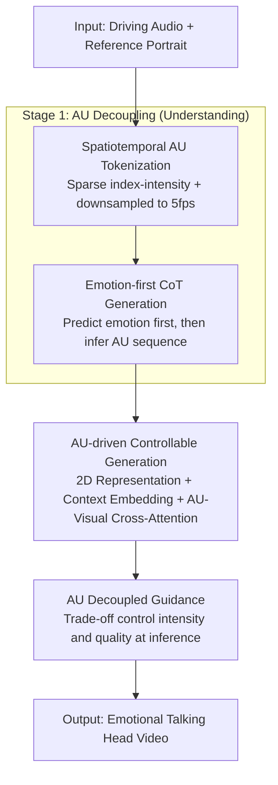

# AUHead: Realistic Emotional Talking Head Generation via Action Units Control

**Conference**: ICLR 2026  
**OpenReview**: [https://openreview.net/forum?id=dmzlAUkulz](https://openreview.net/forum?id=dmzlAUkulz)  
**Code**: https://github.com/laura990501/AUHead_ICLR  
**Area**: Video Generation / Talking Head Generation  
**Keywords**: Talking Head Generation, Emotional Expression, Facial Action Units (AU), Audio Language Model, Controllable Diffusion

## TL;DR
AUHead decomposes the "audio $\to$ emotional video" generation problem into two stages: first, an audio language model (ALM) "perceives emotion" from speech and reasons a discrete Facial Action Units (AU) sequence; then, an AU-driven controllable diffusion model renders these AUs into talking head videos that are both synchronized and carry nuanced expressions. It outperforms existing methods in emotional realism and lip-sync accuracy on MEAD/CREMA.

## Background & Motivation

**Background**: Audio-driven talking head generation currently favors feeding driving audio and a reference portrait directly into generative models (early GANs/motion coefficients, now diffusion models like EMO, Hallo, and MEMO). The goal is lip-sync, identity preservation, and natural facial movement.

**Limitations of Prior Work**: This "audio-in, video-out" paradigm is strong at lip-sync and identity preservation, but expressions are often **neutral and flat**. These models treat audio only as a driving signal, ignoring deeper emotional cues (pitch, rhythm, tone) in speech, resulting in faces that "can talk but have no mood."

**Key Challenge**: Expressing nuanced emotions requires a **fine-grained, controllable, and interpretable** emotional intermediate representation to bridge audio and visual modalities. Coarse-grained labels (happy/sad) lack information, while latent emotional codes are uninterpretable and hard to control. Furthermore, forcing emotion control signals into diffusion models often risks breaking lip-sync or image quality (the **controllability vs. quality** dilemma).

**Goal**: Split the task into two sub-problems: (1) how to accurately and efficiently decouple emotional signals from speech; (2) how to inject these signals into diffusion models without sacrificing lip-sync, identity, or quality.

**Key Insight**: The authors select **Facial Action Units (AU)** as the intermediate representation. AUs describe local muscle movements (lips, jaw, cheeks, eyebrows, etc.), containing both semantic and spatial/intensity information. Combinations of AUs cover a broad spectrum of expressions, making them naturally suitable for carrying both "articulation" and "emotion" cues. Moreover, speech itself is accompanied by coordinated facial muscle movements, providing a physical basis for the audio $\to$ AU mapping.

**Core Idea**: Use an **Audio Language Model (ALM)** to "generate" AU sequences like a language task (first think of the emotion, then reason the AU sequence), then use an **AU-driven controllable diffusion model** to render AUs into video—explicitly separating "understanding" and "generation."

## Method

### Overall Architecture
AUHead is a two-stage pipeline: input consists of a driving audio and a reference portrait; output is an emotionally rich, lip-synced talking head video. **Stage 1 (Understanding)** passes the audio to the ALM Qwen-Audio-Chat to first determine the emotion and then output a sequence of discrete AU tokens (sparse index–intensity pairs at 5 fps). **Stage 2 (Generation)** up-samples the AU sequence to 25 fps, maps it to a 2D facial representation, and uses a context-aware embedding to drive video synthesis via AU cross-attention adapters inserted into a pre-trained diffusion model. During inference, a decoupled guidance strategy balances AU control intensity and image quality.

### Key Designs

**1. Spatiotemporal AU Tokenization: Compressing dense AU into sparse tokens for ALMs**

The challenge is the density of AU sequences—a 4-second video at 25 FPS expands to approximately 13K tokens, exceeding the context window and modeling capacity of Qwen-Audio-Chat. Instead of treating AU as a regression target, the authors tokenize it as "natural language" (aligning with language modeling tasks and reusing pre-trained knowledge) and compress it spatially and temporally. Spatially, they exploit AU activation sparsity (on average, only $\sim$7 out of 24 dimensions are active per frame), trimming dense vectors into sets of "index–intensity pairs" $\hat{a}_{u_t}=\{(i, a_{u_{t,i}}) \mid a_{u_{t,i}} > \lambda\}$, where $\lambda$ is a sparsity coefficient. Temporally, the AU supervision sequence is uniformly downsampled by a factor $\gamma$. Crucially, **only the AU target is compressed, while the audio is processed at its original sampling rate**. The authors use 5 fps as a compromise, relying on AU trajectory continuity and the generative model to recover short-term losses. This scheme reduces the output sequence length by **80.95%** on average.

**2. Emotion-first CoT Generation: Predict emotion first, then infer AU to add a high-level anchor**

Directly predicting AU tokens from audio is difficult. Inspired by Chain-of-Thought (CoT), the ALM follows a "coarse-to-fine" process: first predicting the emotion category (happiness, sadness, anger, etc.) from audio, then using this emotion as high-level context to autoregressively generate the corresponding AU sequence. Since emotional states are highly correlated with AU activation patterns, explicitly inserting emotion prediction into decoding provides a semantic anchor for AU reasoning. Ablations show that compared to direct "audio $\to$ AU" prediction (precision 0.65, MAE 0.2447), "audio $\to$ emotion $\to$ AU" (CoT) pushes precision to 0.71 and drops MAE to 0.2085, with an emotion classification accuracy of 67%.

**3. AU-driven Controllable Generation: 2D representation + Context embedding + Cross-attention**

The second stage injects AUs without destroying lip-sync, identity, or quality. It consists of three components: **(i) AU Representation**: 5 fps AUs are up-sampled to the target frame rate ($1/\gamma$) via linear interpolation, then mapped from "AU $\to$ 2D" into structured facial representations (landmarks LMK or mesh-rendered RoM), transforming 1D sequences into spatial priors with facial topology; **(ii) Context-aware AU Embedding**: A local window of size $n$ is used to encode AU features via temporal convolutions $c_t = \mathrm{Conv_{AU}}([a_{u_{t-n}},\dots,a_{u_t},\dots,a_{u_{t+n}}])$ to ensure temporal smoothness; **(iii) AU–Visual Interaction**: Zero-initialized AU adapters with cross-attention layers are inserted into the pre-trained diffusion backbone, allowing latent variables to adaptively absorb AU cues at each denoising step $\hat{z}_t^{(s)} \leftarrow \mathrm{CrossAttn}(z_t^{(s)}, c_{AU})$. Zero-initialization and freezing other components ensure training stability.

**4. AU Decoupled Guidance: A knob for balancing AU control intensity and quality**

To address the controllability vs. quality trade-off, the authors designed a decoupled guidance (similar to classifier-free guidance but separating the AU condition). During training, conditions are randomly zeroed out. During inference, two independent guidance scales $s_H$ (audio/motion priors) and $s_{AU}$ (AU condition) are used for modulation:

$$\hat{\epsilon} = L_\theta(z_t, \phi, c_{AU}) + s_H \cdot \big(L_\theta(z_t, c_H, \phi) - L_\theta(z_t, \phi, \phi)\big) + s_{AU} \cdot \big(L_\theta(z_t, c_H, c_{AU}) - L_\theta(z_t, c_H, \phi)\big)$$

where $\phi$ is the null condition. As $s_{AU}$ increases, emotion accuracy rises and MAE decreases, but FID follows a U-shaped curve. A scale of 3.5 provides the best quality-emotion trade-off.

### Loss & Training
Stage 1 uses LoRA to fine-tune Qwen-Audio-Chat with ground-truth AU sequences as supervision, using cross-entropy for next-token prediction (24 GPU hours on 4×A100). Stage 2 freezes all components except the AU adapter, using the diffusion loss $L=\mathbb{E}\big[\lVert \epsilon - \epsilon_\theta(z_t,t,c)\rVert_2^2\big]$. The condition $c$ includes audio, reference image, and AU embeddings.

## Key Experimental Results

### Main Results
On MEAD and CREMA datasets (25 fps, 512×512), AUHead using MEMO as the backbone leads in image quality and lip geometry:

| Dataset | Method | PSNR ↑ | SSIM ↑ | FID ↓ | M-LMD ↓ | F-LMD ↓ |
|--------|------|--------|--------|-------|---------|---------|
| MEAD | MEMO* (Backbone) | 23.1910 | 0.7345 | 11.1237 | 2.0684 | 2.2473 |
| MEAD | **Ours (AUHead-MEMO)** | **23.3466** | **0.7395** | **10.9671** | **1.8608** | **2.1604** |
| MEAD | Sonic (2025) | 21.1874 | 0.7118 | 14.2623 | 2.5822 | 2.4025 |
| CREMA | MEMO* (Backbone) | 24.2808 | 0.7410 | 8.3881 | 1.9678 | 2.4296 |
| CREMA | **Ours (AUHead-MEMO)** | 24.2912 | 0.7413 | **8.2361** | **1.9313** | **2.3991** |

### Ablation Study
| Configuration | Key Metrics | Note |
|------|---------|------|
| A $\to$ AU (Direct) | Prec 0.65 / MAE 0.2447 | Audio direct to AU is worst |
| A $\to$ AU $\to$ E | Prec 0.68 / ACCemo 51.76% | Incorrect order |
| **A $\to$ E $\to$ AU (CoT)** | **Prec 0.71 / MAE 0.2085 / ACCemo 67%** | Emotion-first is optimal |
| MEMO + 1D AU Seq | FID 11.11 (MEAD) | 1D condition is weak |
| **MEMO + RoM/LMK (2D)** | FID 10.87 / 10.97 | 2D spatial prior is significantly better |

### Key Findings
- **Emotion-first (CoT) is the game changer in Stage 1**: Using emotion as a high-level anchor approaches the performance of using ground-truth emotion (MAE 0.2085 vs 0.1928).
- **2D AU Representation > 1D Sequence**: LMK/RoM provide explicit facial topology, improving PSNR/SSIM/FID/LMD, though Sync drops slightly as the model focuses more on expression accuracy.
- **AU Guidance Scale has an optimal point**: $s_{AU}=3.5$ is the sweet spot for balancing expression intensity and image quality.
- **Generalization**: Stable generation of 10-second videos with identity preservation and motion continuity on unseen styles (sketches, oil paintings).

## Highlights & Insights
- **Reforms "audio $\to$ emotional video" as "understanding then generation"**: Uses ALM to output interpretable intermediate AU representations, establishing a generalizable audio-driven facial control space.
- **Spatiotemporal tokenization allows ALMs to generate dense signals**: Exploiting signal sparsity to fit LLM context windows is a strategy transferable to other dense signals (gestures, body motion).
- **Zero-initialized adapter**: An efficient plug-and-play paradigm to extend pre-trained diffusion models without damaging original capabilities.
- **Decoupled guidance provides an "expression intensity" knob**: Explicitly balancing expressiveness and image cleanliness.

## Limitations & Future Work
- **Relative drop in Sync (lip-sync confidence)**: 2D AU spatial information slightly overlaps with lip-audio temporal alignment; while human evaluation shows minimal impact, quantitative Sync is lower than specialized lip-sync methods.
- **5 fps Temporal Trade-off**: Restricted by ALM context windows, AUs are generated at 5 fps. Rapid micro-expressions might lose detail.
- **Dependence on Paired Data**: Stage 1 requires audio–AU paired supervision. Emotion categories are still relatively coarse.

## Related Work & Insights
- **vs. Emotion Adapters (EAT / MEMO)**: These use a compact emotion code/memory module. Ours uses **temporally aligned AU features**, offering finer-grained and more interpretable control.
- **vs. Direct Generation (EMO / Hallo)**: These are strong in lip-sync but flat in expression. Ours inserts an "ALM understanding" layer specifically for emotional expressiveness.
- **vs. MLLM Text-guided (OmniHuman-1.5)**: Ours uses structured AU representations that can be rendered into 2D topologies rather than plain text instructions, offering more precise control over facial muscles.

## Rating
- Novelty: ⭐⭐⭐⭐⭐ 
- Experimental Thoroughness: ⭐⭐⭐⭐ 
- Writing Quality: ⭐⭐⭐⭐ 
- Value: ⭐⭐⭐⭐ 

<!-- RELATED:START -->

## Related Papers

- [\[ICLR 2026\] ReactID: Synchronizing Realistic Actions and Identity in Personalized Video Generation](reactid_synchronizing_realistic_actions_and_identity_in_personalized_video_gener.md)
- [\[CVPR 2026\] VerseCrafter: Dynamic Realistic Video World Model with 4D Geometric Control](../../CVPR2026/video_generation/versecrafter_dynamic_realistic_video_world_model_with_4d_geometric_control.md)
- [\[ICLR 2026\] VideoPhy-2: A Challenging Action-Centric Physical Commonsense Evaluation in Video Generation](videophy-2_a_challenging_action-centric_physical_commonsense_evaluation_in_video.md)
- [\[ICLR 2026\] Video-As-Prompt: Unified Semantic Control for Video Generation](video-as-prompt_unified_semantic_control_for_video_generation.md)
- [\[ICLR 2026\] Learning Video Generation for Robotic Manipulation with Collaborative Trajectory Control](learning_video_generation_for_robotic_manipulation_with_collaborative_trajectory.md)

<!-- RELATED:END -->
