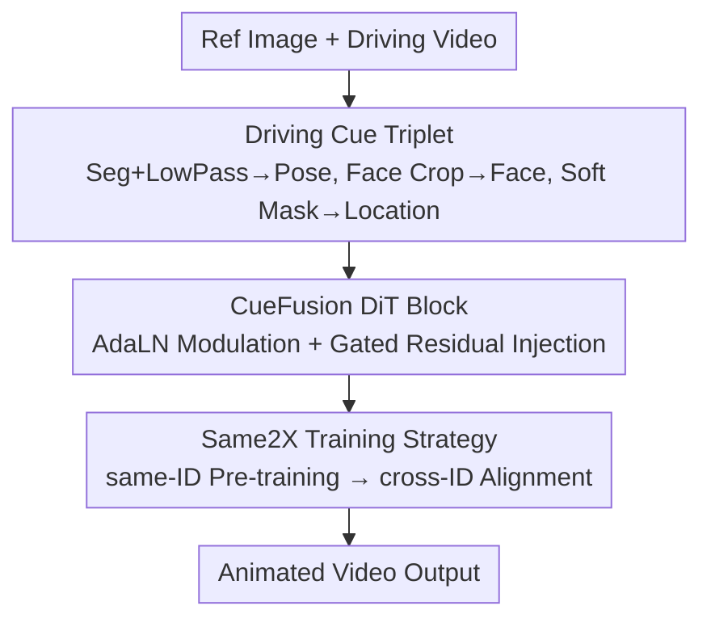

# Beyond Skeletons: Learning Animation Directly from Driving Videos with Same2X Training Strategy

**Conference**: ICLR2026  
**OpenReview**: [https://openreview.net/forum?id=HdEpZE3wFa](https://openreview.net/forum?id=HdEpZE3wFa)  
**Code**: TBD (Project page: https://directanimator.github.io/)  
**Area**: Video Generation / Human Image Animation  
**Keywords**: Human Image Animation, Driving Video, Skeleton Replacement, DiT, Representation Alignment

## TL;DR
This paper proposes DirectAnimator, which discards intermediate representations like skeletons or pose estimation. Instead, it animates a reference portrait directly using the raw pixels of driving videos. The method extracts a "Driving Cue Triplet" (Pose/Face/Location) from the original video and injects these cues into the denoising process via a CueFusion DiT Block. Coupled with a Same2X training strategy that aligns cross-ID features to a same-ID model, the system achieves SOTA performance on TikTok and Unseen datasets with 6.7× faster convergence and lower computational costs.

## Background & Motivation
**Background**: The task of Human Image Animation (HIA) is to animate a static reference image according to the movements and expressions in a driving video. Current mainstream approaches (AnimateAnyone, StableAnimator, UniAnimate-DiT, Champ, etc.) typically use a pose estimator to extract 2D skeleton maps (or DensePose/SMPL) from the driving video as an intermediate representation to guide the diffusion model.

**Limitations of Prior Work**: The "pose estimation first, then animation" pipeline has two major flaws. First, pose conditions are often unreliable; occlusions and complex limb movements cause OpenPose/DWPose to produce errors or omissions, leading to front-back confusion, misplaced hands, or missing limbs (e.g., the "extra hand" in StableAnimator shown in Figure 1). Second, 68-point facial landmarks lack expressiveness, making it difficult to capture subtle expressions and resulting in stiff, unnatural animations.

**Key Challenge**: Skeletons represent a "lossy compression"—rich visual information is compressed into sparse landmarks, allowing estimation errors to propagate through the generation process. The fundamental issue is that animation requires motion and expression information, which are explicitly but distortively encoded in skeletons.

**Goal**: Bypassing pose estimation by using raw driving video pixels as driving signals. This poses two sub-challenges: (i) motion/expression cues are entangled with appearance details (clothing, hair texture) in raw pixels, requiring the model to learn to decouple and control these cues while preserving the reference identity; (ii) cross-ID training (different identities for driver and reference) is unstable due to high gradient noise and slow convergence when attempting to follow motion while maintaining reference appearance.

**Core Idea**: Replace skeletons with "structured driving cues" extracted from the original video to decouple motion, expression, and alignment, and use "same-ID teaching cross-ID" feature alignment to stabilize cross-identity training.

## Method

### Overall Architecture
DirectAnimator is a DiT-based diffusion framework that takes a reference image $I$ and a driving video sequence $D_{1:N}$ as inputs. It decomposes the animation process into two layers: a **representation layer** that pre-processes the raw video into a Driving Cue Triplet (Pose Cue for motion, Face Cue for expression, and Location Cue for spatial alignment), encoded via a frozen 3D VAE and patchified for DiT; and an **injection layer** where the CueFusion DiT Block uses Adaptive LayerNorm (AdaLN) to modulate the three cues into the denoising process. This ensures that identity follows the main denoising path while motion and expression follow the conditional modulation path. Additionally, a Same2X training strategy is employed: after same-ID pre-training, an S2X alignment loss pulls internal features of the cross-ID model toward those of the same-ID model to accelerate convergence.

### Key Designs

**1. Driving Cue Triplet: Stable Cues from Raw Video**

To address "lossy skeletons and pixel entanglement," this method avoids landmarks and constructs three complementary cues from the raw driving video. **Pose Cue (Motion)**: Uses a segmentation model (e.g., Grounded SAM) to extract the foreground person, which is more stable than pose estimation under occlusion. It employs a random dropout strategy to force temporal reasoning and applies a low-pass filter in the frequency domain to suppress high-frequency appearance details (clothing/hair) while highlighting pose dynamics. **Face Cue (Expression)**: Directly crops, scales, and centers the facial region from the driving video to preserve maximum expressive detail. **Location Cue (Alignment)**: To handle scale/position differences in cross-ID settings, it uses body and face masks as spatial priors (following StableAnimator's strategy) with soft grid boundaries to prevent identity leakage.

**2. CueFusion DiT Block: AdaLN Modulation and Gated Residuals**

The extracted cues are injected into the DiT using Adaptive LayerNorm modulation. Time embeddings $e_t$ are processed via an MLP to learn scaling, shifting, and gating factors for pose and face:

$$\alpha_p, \beta_p, \gamma_p, \alpha_f, \beta_f, \gamma_f = \mathrm{MLP}(\mathrm{SiLU}(e_t))$$

Cues are modulated as $e^M_p = \mathrm{LN}(e_p)\cdot(1+\alpha_p)+\beta_p$. These modulated embeddings are added element-wise with text/visual embeddings before the 3D full attention. To ensure stability, a gated residual connection is added: $e^G_p = e_p + \gamma_p \cdot e^M_p$, allowing each DiT block to access both raw and modulated cues.

**3. Same2X Training Strategy: Feature Alignment**

Cross-ID training is difficult from scratch. Inspired by representation alignment works like REPA, this method uses two stages. **same-ID Stage**: Trains on reference-driving pairs from the same video. **cross-ID Stage**: Uses pseudo-driving cues (generated via StableAnimator and Face-Adapter) to simulate cross-identity conditions and introduces the Same2X (S2X) alignment loss:

$$L_{\text{S2X}}(\theta_S, \theta_X) := -\mathbb{E}_{x,c,\epsilon,t}\left[\frac{1}{N}\sum_{n=1}^{N}\mathrm{cm}\big(h^{[D_n]}_s, h^{[D_n]}_x\big)\right]$$

where $\theta_S, \theta_X$ are the same-ID and cross-ID models, and $h$ represents patch embeddings. The total loss is $L = L_{\text{Denoising}} + \lambda L_{\text{S2X}}$. This is the first method to use cross-setting feature alignment for HIA, achieving equivalent loss levels 6.7× faster in the cross-ID stage.

### Loss & Training
The backbone is CogVideoX1.5. DiT blocks are updated while the text encoder and VAE remain frozen. Stage 1 (same-ID) takes 10K steps, and Stage 2 (cross-ID) takes 30K steps using a learning rate of 2e-5 on 4×H20 GPUs. Data includes 4,000 web videos plus the TikTok training set. Prompts are generated by Qwen2-VL, and a bucket sampler is used for various resolutions.

## Key Experimental Results

### Main Results
Quantitative comparison on TikTok and Unseen test sets (a/b denotes TikTok / Unseen results):

| Dataset/Metric | DirectAnimator | StableAnimator | UniAnimate-DiT | Compute |
|----------------|----------------|----------------|----------------|---------|
| FID↓ (TikTok/Unseen) | **25.87 / 27.62** | - / 31.89 | - / 29.92 | 4×H20×40K |
| SSIM↑ | **0.806 / 0.708** | 0.801 / 0.603 | 0.787 / 0.649 | — |
| PSNR↑ | 30.12 / **29.41** | 30.81 / 27.11 | 29.76 / 27.89 | — |
| FIS↑ (Identity) | **0.682 / 0.661** | 0.662 / 0.653 | 0.643 / 0.647 | — |
| FVD↓ | 142.60 / **276.34** | 140.62 / 365.52 | 306.17 / 289.45 | — |

Ours leads in all metrics on the challenging Unseen set with significantly fewer training steps (40K vs 33M).

### Ablation Study
Evaluation on a 500-video subset of the TikTok test set:

| Configuration | FID↓ | SSIM↑ | FIS↑ | FVD↓ | Description |
|---------------|------|-------|------|------|-------------|
| Full Model | 27.61 | 0.752 | 0.638 | 180.52 | — |
| w/o Face Cue | 28.21 | 0.729 | 0.418 | 245.48 | FIS drops significantly |
| w/ Skeleton Map | 29.74 | 0.710 | 0.578 | 216.38 | Performance degrades with skeletons |
| w/o Same2X | 32.21 | 0.691 | 0.530 | 290.43 | Worst FVD/FID without strategy |

### Key Findings
- **Same2X is critical**: Removing it results in the largest performance drop, confirming cross-ID training as the primary bottleneck.
- **Face Cue is essential for ID/Expression**: Removing it causes FIS to plummet from 0.638 to 0.418.
- **Raw Cues outperform Skeletons**: Direct pixel-based cues consistently beat traditional skeleton-based methods.
- **Low-pass filtering is effective**: Suppressing high-frequency appearance while retaining pose dynamics improves results.

## Highlights & Insights
- **Changing the Representation**: Instead of patching skeleton errors (e.g., adding confidence scores), this work removes the skeleton entirely, addressing the root cause of pose estimation errors.
- **Same2X as a Paradigm**: Adapts the idea of aligning diffusion features to a "same-ID" internal teacher rather than external encoders, distilling an easier setting into a harder one.
- **Frequency Domain Decoupling**: Uses low-pass filtering to explicitly decouple "motion to follow" from "appearance to discard."
- **Pseudo-data for cross-ID**: Synthesizing cross-ID pairs from same-ID data bypasses the scarcity of real-world paired data.

## Limitations & Future Work
- **Segmentation Dependency**: Quality relies on Grounded SAM; failures in extreme occlusion or crowd scenes can degrade Pose Cues.
- **Data Ceiling**: The pseudo-driving cues are generated by baseline models (StableAnimator), potentially introducing their biases into the training.
- **Generalization**: Needs validation on ultra-long videos and more complex background interactions.
- **Sensitivity**: The impact of hyperparameters like grid softening in Location Cues is not fully explored.

## Related Work & Insights
- **vs. Skeleton-based (StableAnimator/AnimateAnyone)**: These rely on 2D skeletons + enhancers; Ours uses raw pixels to improve robustness against occlusions.
- **vs. Dense-representation (Champ)**: While those use DensePose/SMPL, they still rely on intermediate estimation; Ours skips this step.
- **vs. Alignment-based (REPA/SRA)**: This work brings feature alignment to HIA, using a same-ID model as the internal guide for cross-ID training.

## Rating
- Novelty: ⭐⭐⭐⭐⭐ Redefines driving signals and introduces cross-setting alignment for HIA.
- Experimental Thoroughness: ⭐⭐⭐⭐ Comprehensive across two test sets and eight ablations.
- Writing Quality: ⭐⭐⭐⭐ Logical flow from motivation to solution.
- Value: ⭐⭐⭐⭐⭐ Addresses long-standing pose error issues with high efficiency.

<!-- RELATED:START -->

## Related Papers

- [\[ICML 2026\] Rays as Pixels: Learning A Joint Distribution of Videos and Camera Trajectories](../../ICML2026/video_generation/rays_as_pixels_learning_a_joint_distribution_of_videos_and_camera_trajectories.md)
- [\[ICCV 2025\] Disentangled World Models: Learning to Transfer Semantic Knowledge from Distracting Videos for Reinforcement Learning](../../ICCV2025/video_generation/disentangled_world_models_learning_to_transfer_semantic_knowledge_from_distracti.md)
- [\[ICLR 2026\] UniVideo: Unified Understanding, Generation, and Editing for Videos](univideo_unified_understanding_generation_and_editing_for_videos.md)
- [\[NeurIPS 2025\] RLGF: Reinforcement Learning with Geometric Feedback for Autonomous Driving Video Generation](../../NeurIPS2025/video_generation/rlgf_reinforcement_learning_with_geometric_feedback_for_autonomous_driving_video.md)
- [\[ICLR 2026\] ConsisDrive: Identity-Preserving Driving World Models for Video Generation by Instance Mask](consisdrive_identity-preserving_driving_world_models_for_video_generation_by_ins.md)

<!-- RELATED:END -->
