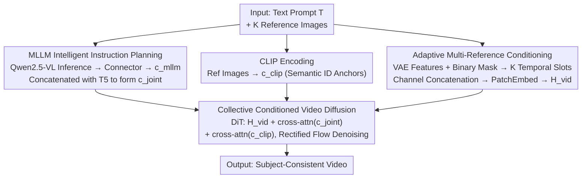

# BindWeave: Subject-Consistent Video Generation via Cross-Modal Integration

**Conference**: ICLR 2026  
**arXiv**: [2510.00438](https://arxiv.org/abs/2510.00438)  
**Code**: [https://lzy-dot.github.io/BindWeave/](https://lzy-dot.github.io/BindWeave/) (Project Page)  
**Area**: Video Generation / Subject Consistency  
**Keywords**: Subject-to-Video, MLLM condition injection, DiT, Multi-reference images, Cross-modal reasoning  

## TL;DR
BindWeave replaces traditional shallow fusion mechanisms with a Multimodal Large Language Model (MLLM) to parse complex text instructions involving multiple subjects. It generates subject-aware hidden states as conditioning signals for DiT, combined with CLIP semantic features and VAE fine-grained appearance features, enabling high-fidelity and subject-consistent video generation.

## Background & Motivation
**Background**: Video generation models based on the DiT architecture (e.g., Wan, HunyuanVideo) can generate high-quality long videos, yet precise control over subject identity and appearance remains insufficient.

**Limitations of Prior Work**:
   - Existing S2V methods (e.g., Phantom, VACE) employ a "separate-and-fuse" shallow information processing paradigm—using independent encoders to extract image and text features followed by late fusion via concatenation or cross-attention.
   - While effective for simple appearance maintenance instructions, shallow fusion cannot establish deep cross-modal semantic associations when faced with prompts involving complex spatial relations, temporal logic, or multi-subject interactions.
   - This results in issues such as identity confusion, motion misalignment, and attribute mixing.

**Key Challenge**: Complex semantics in text prompts (e.g., "Person A hands a gift to Person B") require deep cross-modal reasoning for correct parsing, which shallow fusion fails to achieve.

**Goal**: Establish deep semantic associations between text commands and visual entities to accurately parse roles, attributes, and interactions of multiple subjects.

**Key Insight**: Utilize a pre-trained MLLM as an "intelligent instruction parser" to complete deep cross-modal reasoning prior to generation.

**Core Idea**: Replace shallow encoder fusion with the deep reasoning capabilities of an MLLM, generating conditional signals that simultaneously encode subject identities and interaction relationships to guide the DiT.

## Method

### Overall Architecture
BindWeave addresses the problem of identity confusion and motion mismatch when a single text prompt contains multiple subjects, spatial relationships, and interaction logic (e.g., "Person A hands a gift to Person B"). The **Mechanism** is to decouple "instruction understanding" from "video generation," assigning the former to a multimodal large model for deep reasoning before proceeding to DiT diffusion.

The global pipeline operates as follows: inputs consist of a text prompt $\mathcal{T}$ and K reference images $\{I_k\}$, which are processed through three parallel paths before merging in the DiT. The first path interleaves text and images into a sequence for the MLLM, which binds roles, attributes, and interactions to corresponding reference subjects and outputs "subject-aware" hidden states. These are projected by a lightweight connector and concatenated with T5 text features to form a joint condition $c_{\text{joint}}$. The second path uses CLIP to encode reference images into semantic identity anchors $c_{\text{clip}}$. The third path uses a VAE to encode reference images into pixel-level appearance features $c_{\text{vae}}$, placed into K specially padded slots along the temporal axis of the video latent. Following channel concatenation, these are processed via PatchEmbed into video tokens $H_{\text{vid}}$. Finally, the DiT, within a Rectified Flow framework, denoises by superposing $c_{\text{joint}}$ and $c_{\text{clip}}$ onto $H_{\text{vid}}$ via cross-attention to generate subject-consistent videos.

### Key Designs

**1. MLLM Intelligent Instruction Planning: Replacing Shallow Fusion with Deep Reasoning**

This design targets the pain point where shallow "separate-and-fuse" paradigms fail to establish true cross-modal semantic associations. BindWeave instead uses Qwen2.5-VL-7B to process an interleaved text-image sequence: input is concatenated into a unified multimodal sequence $\mathcal{X} = [\mathcal{T}, \langle\text{img}\rangle_1, ..., \langle\text{img}\rangle_K]$. Each reference image uses a placeholder token to allow the MLLM to align internally with the corresponding image, thereby binding text commands to visual entities before generation. The output hidden state $H_{\text{mllm}} = \text{MLLM}(\mathcal{X}, \mathcal{I})$ is projected via a trainable lightweight connector into $c_{\text{mllm}}$, and finally concatenated with T5 text features into a joint condition $c_{\text{joint}} = \text{Concat}(c_{\text{mllm}}, c_{\text{text}})$. This is effective because the multimodal reasoning capability of the MLLM far exceeds the shallow feature extraction of independent encoders like CLIP or T5, enabling true understanding of complex logic such as "who does what, to whom, and where."

**2. Adaptive Multi-Reference Conditioning Strategy: Dedicated Temporal Slots for Reference Images**

Reference images are fundamentally different from video frames (S2V differs from I2V). Directly inserting them into the video sequence would contaminate temporal modeling. BindWeave first pads the temporal dimension of the video latent with K zero positions $\tilde{\mathbf{x}}_t = \text{pad}_T(\mathbf{x}_t, K)$, then places the VAE features of each reference image $c_{\text{vae}} = \mathcal{E}_{\text{VAE}}(\{I_{\text{ref}}^i\})$ and a binary mask into these dedicated slots (with all other positions set to 0). After channel concatenation, these are processed into video tokens:

$$H_{\text{vid}} = \text{PatchEmbed}\big(\text{concat}_c(\tilde{\mathbf{x}}_t,\ \tilde{c}_{\text{vae}},\ \tilde{m}_{\text{ref}})\big)$$

The binary mask emphasizes subject regions, informing the model that these positions are "references" rather than "frames to be generated." This design preserves pixel-level appearance info while avoiding temporal interference since the reference conditions only act within padded slots.

**3. Collective Conditioned Video Diffusion: Tri-path Injection of Reasoning, Identity, and Appearance**

To ensure high-level semantics and reference appearance collaborate without conflict, BindWeave assigns specific roles to the three conditional signals. Low-level appearance details are injected at the input layer via $c_{\text{vae}}$ and integrated into $H_{\text{vid}}$. High-level relationship reasoning is injected through $c_{\text{joint}}$ via cross-attention to handle scene composition. Semantic identity guidance uses CLIP features $c_{\text{clip}} = \mathcal{E}_{\text{CLIP}}(\{I_{\text{ref}}^i\})$ through an independent cross-attention path to anchor subject IDs. The outputs of both attention paths are superposed on the video features:

$$H_{\text{out}} = H_{\text{vid}} + \text{Attn}(Q_{\text{vid}}, K_{\text{joint}}, V_{\text{joint}}) + \text{Attn}(Q_{\text{vid}}, K_{\text{clip}}, V_{\text{clip}})$$

This structured division of labor ensures that high-level logic, identity persistence, and fine-grained details are all maintained.

### Loss & Training
- Rectified Flow + MSE velocity prediction loss: $\mathcal{L} = \|u_\Theta(z_t, t, c_{\text{joint}}, c_{\text{clip}}, c_{\text{vae}}) - v_t\|^2$
- 1 million high-quality video-text pairs selected from OpenS2V-5M.
- Two-stage training: 1000 steps for core data stabilization + 5000 steps for full data expansion.
- 512 xPU, batch size 512, lr=5e-6, AdamW.
- Random rotation/scaling augmentation for reference images to prevent copy-paste artifacts.
- Inference: 50 steps, CFG scale ω=5.

## Key Experimental Results

### Main Results — OpenS2V-Eval Benchmark (180 prompts, 7 categories)

| Method | NexusScore↑ | NaturalScore↑ | GmeScore↑ | Total↑ |
|------|-----------|-------------|---------|--------|
| Phantom | Low | Medium | Medium | Medium |
| VACE | Medium | Low (Unnatural) | Medium | Medium |
| SkyReels-A2 | High | Low (Distortion) | Medium | Low-Medium |
| Kling-1.6 | Medium | High | High | High |
| **Ours** | **Highest** | **Competitive** | **Competitive** | **Highest** |

- Ours significantly leads all open-source and commercial models in NexusScore (the core metric for subject consistency).
- Performance remains competitive in other metrics such as FaceSim, Aesthetics, and MotionSmoothness.

### Ablation Study

| Configuration | Effect |
|------|------|
| Full BindWeave | Optimal |
| w/o MLLM (replaced by simple encoder) | Identity confusion in multi-subject scenes; incorrect interaction logic |
| w/o CLIP Features | Decrease in subject identity persistence |
| w/o VAE Detail Injection | Loss of fine appearance details |

### Key Findings
- **MLLM deep reasoning is the core advantage**: Gains are most significant in complex multi-subject interaction scenes, where shallow fusion methods degrade severely.
- **Three-layer conditional signals are complementary**: MLLM provides semantic reasoning, CLIP preserves IDs, and VAE maintains details—removing any layer causes degradation.
- **Commercial models are aesthetically strong but weak in subject consistency**: Models like Kling and Vidu produce high visual quality but often exhibit common-sense violations (e.g., distorted limbs).

## Highlights & Insights
- **Paradigm shift to MLLM as an instruction parser**: Moving from "separate encoding and fusion" to "deep understanding via MLLM before guided generation" is theoretically sounder and empirically superior.
- **Three-layer conditioning philosophy**: High-level reasoning (MLLM) → Mid-level semantics (CLIP) → Low-level pixels (VAE) provides a clear, structured hierarchy.
- **Effectiveness of lightweight connectors**: A two-layer MLP is sufficient to align MLLM and DiT feature spaces, indicating that MLLM hidden states already carry sufficient structural information.

## Limitations & Future Work
- MLLM (Qwen2.5-VL-7B) increases inference computational overhead.
- The training dataset is limited to 1 million entries; scaling data may further improve generalization.
- Subject occlusion and recovery within videos have not yet been explicitly addressed.
- Reference image count is restricted (1-4); performance in scenes with extremely high subject counts is unverified.

## Related Work & Insights
- **vs Phantom**: Processes text/image branches independently before DiT injection (shallow fusion); BindWeave performs end-to-end deep reasoning via MLLM.
- **vs VACE**: Injects unified input formats through residual blocks but remains lacking in cross-modal reasoning depth.
- **vs per-subject optimization (e.g., CustomVideo)**: Requires separate fine-tuning for each subject; BindWeave is end-to-end and tuning-free.

## Rating
- Novelty: ⭐⭐⭐⭐ MLLM as an instruction parser is an innovative architectural design.
- Experimental Thoroughness: ⭐⭐⭐⭐ Comprehensive comparison against both open-source and commercial methods.
- Writing Quality: ⭐⭐⭐⭐ Clear architecture descriptions and well-articulated motivation.
- Value: ⭐⭐⭐⭐⭐ High practical value in addressing a key bottleneck in multi-subject video generation.

<!-- RELATED:START -->

## Related Papers

- [\[ICLR 2026\] Phantom-Data: Towards a General Subject-Consistent Video Generation Dataset](phantom-data_towards_a_general_subject-consistent_video_generation_dataset.md)
- [\[CVPR 2026\] UniAVGen: Unified Audio and Video Generation with Asymmetric Cross-Modal Interactions](../../CVPR2026/video_generation/uniavgen_unified_audio_and_video_generation_with_asymmetric_cross-modal_interact.md)
- [\[CVPR 2026\] Cross-Subject EEG-to-Video Reconstruction and Beyond](../../CVPR2026/video_generation/cross-subject_eeg-to-video_reconstruction_and_beyond.md)
- [\[ICLR 2026\] MAGREF: Masked Guidance for Any-Reference Video Generation with Subject Disentanglement](magref_masked_guidance_for_any-reference_video_generation_with_subject_disentang.md)
- [\[ICLR 2026\] 3D Scene Prompting for Scene-Consistent Camera-Controllable Video Generation](3d_scene_prompting_for_scene-consistent_camera-controllable_video_generation.md)

<!-- RELATED:END -->
