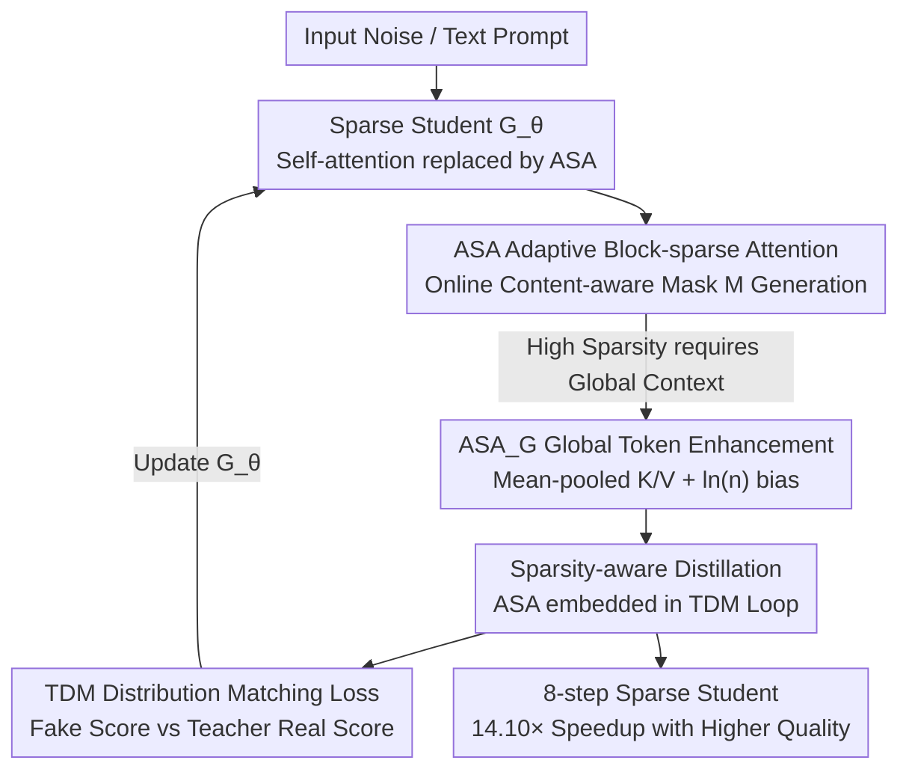

# BLADE: Block-Sparse Attention Meets Step Distillation for Efficient Video Generation

**Conference**: ICLR2026  
**OpenReview**: [https://openreview.net/forum?id=O9J20MsmRl](https://openreview.net/forum?id=O9J20MsmRl)  
**Code**: [Project Page ziplab.co/BLADE-Homepage](http://ziplab.co/BLADE-Homepage/)  
**Area**: Video Generation / Diffusion Models / Model Efficiency  
**Keywords**: Video Diffusion, Block-Sparse Attention, Step Distillation, Trajectory Distribution Matching, data-free  

## TL;DR
BLADE integrates "dynamic block-sparse attention" and "few-step distillation" into a unified data-free joint training framework for collaborative optimization. It achieves 14.10× end-to-end acceleration on Wan2.1-1.3B and 8.89× on CogVideoX-5B, with VBench-2.0 quality scores surpassing the original 50-step model.

## Background & Motivation
**Background**: Diffusion Transformer (DiT) is the de facto standard for high-quality video generation, but it face two coupled speed bottlenecks: iterative denoising requiring dozens of sampling steps, and attention complexity that grows quadratically with sequence length—further amplified by the temporal dimension in videos which scales token counts to tens or hundreds of thousands.

**Limitations of Prior Work**: Existing acceleration routes are largely independent. One is **step distillation**, condensing a 50-step "teacher" into a 1–8 step "student"; the other is **sparse attention**, reducing the per-step attention cost. Simply combining them is problematic: ① Training-free application of sparse attention to distilled models yields suboptimal results because the distillation process is "unaware" of the sparsity mask; ② Sequential pipelines (distillation followed by sparse fine-tuning) require massive high-quality video datasets, negating the data efficiency benefits of modern data-free distillation.

**Key Challenge**: Sparsity and distillation are treated as **independent post-processing steps**, leading to either quality degradation or high data costs. Furthermore, designing sparsity masks for video is difficult: content-agnostic static patterns (fixed local windows, fixed strides) fail to adapt to complex spatio-temporal structures, causing loss of detail and long-range dependencies at high sparsity ratios; dynamic methods like VSA assume regular 3D token grids and suffer from padding overhead with irregular latent shapes; SpargeAttention is training-free but cannot be trained and has limited sparsity potential.

**Goal**: Design a sparse attention mechanism that is **computationally efficient**, **content-adaptive**, and supports both **training-free inference and training-aware modes**, while ensuring sparsity is "perceived" by the distillation process from the start.

**Key Insight**: Instead of post-hoc concatenation, the student model should be trained with "sparsity constraints" during every step of distillation to align with the teacher's generation trajectory. This allows the student to learn a robust few-step generation path optimized for sparsity.

**Core Idea**: A data-free "sparsity-aware joint training" framework that embeds Adaptive Block-sparse Attention (ASA) directly into the Trajectory Distribution Matching (TDM) distillation loop, learning sparsity and few-step generation simultaneously rather than via two separate compression steps.

## Method

### Overall Architecture
BLADE follows a teacher-student framework. The teacher $f_\phi$ is a pre-trained, high-quality, many-step DiT video diffusion model. The student $G_\theta$ starts with the same architecture and weights, but replaces standard self-attention layers with **ASA (Adaptive Block-sparse Attention)**. Training utilizes the TDM (Trajectory Distribution Matching) paradigm: in each iteration, the sparse student $G_\theta$ generates an intermediate trajectory, and a data-free score distillation loss aligns the **distribution** of the student trajectory with that of the teacher. Thus, the student learns to output high-quality results under the computational constraints imposed by ASA. No real video data is used; all guidance signals are generated by the teacher (data-free).

For a distillation interval $[t_{i-1}, t_i)$: the sparse generator $G_\theta$ denoises input $x_{t_i}$ to $x_{t_{i-1}}$, then **re-adds Gaussian noise** to obtain an intermediate sample $x_{t_j}$. A specialized **Fake Score model** $f_\psi$ evaluates this re-noised sample, and its output is subtracted from the **Real Score model** (the pre-trained teacher) to calculate the distribution matching loss $\nabla_\theta D_{\mathrm{KL}}$. This updates the student generator to align its trajectory distribution with the teacher.

### Key Designs

**1. ASA Adaptive Block-sparse Attention: Content-aware mask generation via low-cost probes**

To address the failure of static masks to adapt to video structures, ASA allows each query block to dynamically decide which key/value blocks to attend to based on content. It rests on the prior that adjacent tokens in video latent representations share similar semantics, allowing tokens within a block to share a mask. The process involves three steps:

First, **locality-preserving token reordering**. Standard raster-scan tokenization breaks spatial adjacency. ASA uses Gilbert space-filling curves to reorder tokens before blocking, ensuring blocks contain spatially contiguous information and improving pruning accuracy.

Second, **efficient block importance estimation**. Computing the full attention $P=\mathrm{softmax}(QK^\top/\sqrt{d_k})$ followed by $b \times b$ max-pooling is too costly. ASA uses an online approximation: it samples $k$ representative tokens ($k < b$) from each block to form smaller $Q_s, K_s$, computes a low-resolution attention map $P_{\text{approx}}$, and applies max-pooling to get $P_{\text{imp}}$. This reduces mask generation complexity from $O(N^2)$ to approximately $O(N^2 \cdot (k/b)^2)$. Unlike methods that collapse blocks into a single mean token, ASA captures salient intra-block patterns via sampled attention.

Third, **threshold mask construction**. Each row of $P_{\text{imp}}$ is sorted in descending order, and key blocks are accumulated until a threshold (e.g., 90%/95%) is reached. Only these blocks are included in mask $M$. This dynamic pruning preserves significant paths while skipping low-information blocks, providing a flexible knob for accuracy and efficiency. Implementation uses block size $b=128$ and sampling $k=16$.

**2. ASA_G Global Token Enhancement: Retaining global context under high sparsity**

Pure ASA (standard training-free version) may lose global context when many blocks are pruned. ASA_G enhances K and V by applying mean pooling with window size $n$ to generate "global tokens," reducing length to $1/n$ of the original. These are concatenated as $K_{\text{aug}}=\mathrm{Concat}(K, \mathrm{MeanPool}_n(K))$. During attention, interaction between queries and original K regions is still controlled by binary mask $M$, while a fixed additive bias $\ln(n)$ is applied to global token regions:

$$\text{score}_{\text{global}} \mathrel{+}= \ln(n)$$

This bias compensates for the averaging effect of mean pooling, making each global token's contribution "equivalent to the combined importance of the $n$ tokens it represents," ensuring the query remains aware of global context even under high sparsity.

**3. TDM Trajectory Distribution Matching: Data-free distribution-level distillation foundation**

The distillation foundation is TDM, which aligns the **distribution** of student intermediate samples with the teacher's diffusion distribution rather than enforcing per-instance alignment. This data-free score distillation requires only the pre-trained teacher. It involves three components: teacher $f_\phi$ (real score $s_\phi$), student generator $G_\theta$, and a **fake score model** $f_\psi$ to approximate the student's sample score.

The fake score model is trained as a denoiser using student-generated samples $x_{t_i}$:

$$L(\psi)=\sum_{i=0}^{K-1}\mathbb{E}_{x_{t_i}\sim p_{\theta,t_i}}\mathbb{E}_{x_j\sim q(x_j|x_{t_i})}\,\lVert f_\psi(x_j,j)-x_{t_i}\rVert_2^2$$

The student generator minimizes the KL divergence between trajectory distributions: $L(\theta)=\sum_i \lambda_i D_{\mathrm{KL}}(p_{\theta,t_i}\Vert p_{\phi,t_i})$. The gradient is approximated as $\sum \lambda_j[s_\psi(x_j,j)-s_\phi(x_j,j)]\frac{\partial x_{t_i}}{\partial\theta}$. Non-overlapping intervals $[t_i,t_{i+1})$ allow a single fake score model to suffice for all stages.

**4. Sparsity-aware Joint Training: Embedding ASA directly into the distillation loop**

This is the core of BLADE. Rather than treating sparsity as a post-training step, student $G_\theta$ uses the ASA mechanism in **every training iteration**. The distribution matching loss updates weights based on quality under these dynamic sparse constraints. This co-design forces the student to learn robust, semantic representations effective even under sparsity, often resulting in higher perceptual quality. This explains how the 8-step sparse student can **outperform the 50-step dense teacher**: joint training regularizes the model to follow a more direct, stable generation path, filtering out the noise and "detours" accumulated in the teacher's long trajectory.

### Loss & Training
Training alternates between two objectives: the fake score model is updated via denoising MSE $L(\psi)$, and the student generator via distribution matching score gradients. The process is data-free, using 10,000 text prompts (from JourneyDB, augmented by Qwen2.5-3B-Instruct) to drive teacher guidance. Distillation typically runs for 100–200 iterations on 8×A800 (80GB) GPUs to reach an 8-step student.

## Key Experimental Results

### Main Results
Evaluation on VBench-2.0 for CogVideoX-5B and Wan2.1-1.3B (all distilled to 8 steps except Baseline):

| Model | Method | Sparsity | VBench-2.0 Total | Speedup |
|------|------|--------|------|------|
| CogVideoX-5B | Baseline (50-step Dense) | - | 0.534 | 1× |
| CogVideoX-5B | FA2 | - | 0.539 | 7.93× |
| CogVideoX-5B | **ASA_G (Ours)** | 0.82 | **0.569** | **8.89×** |
| Wan2.1-1.3B | Baseline (50-step Dense) | - | 0.563 | 1× |
| Wan2.1-1.3B | STA | 0.74 | 0.528 | 10.53× |
| Wan2.1-1.3B | FA2 | - | 0.580 | 9.37× |
| Wan2.1-1.3B | **ASA_G (Ours)** | 0.8 | **0.570** | **14.10×** |

Notable result: ASA_G quality **exceeds the 50-step dense baseline** on both models (0.534→0.569, 0.563→0.570) while providing 8.89×/14.10× speedup. Wan2.1-1.3B achieves a Human Fidelity score of 0.918.

Efficiency decomposition (Wan2.1-1.3B on H20):

| Metric | FA2-50 | FA2-8 | ASA-8 |
|------|--------|-------|-------|
| Kernel Time (ms) | 73.25 | 73.25 | 22.21 |
| Kernel Gain | 1.00× | 1.00× | 3.30× |
| End-to-end Time (s) | 338.41 | 36.11 | 24.00 |
| End-to-end Gain | 1.00× | 9.37× | 14.10× |

The attention kernel achieves 3.30× speedup, but the end-to-end gain from ASA is 1.504× (24.00s vs 36.11s). This indicates that after distillation, attention is no longer the sole bottleneck; VAE decoding and non-attention layers dominate.

### Ablation Study
Comparison of pure ASA with other sparse attention methods in training-free inference (Wan2.1-1.3B, 8-step distilled model, FA2 for first 2 steps, sparse for remaining):

| Method | Sparsity | PSNR | SSIM | Description |
|------|--------|------|------|------|
| STA | 0.74 | 16.72 | 0.6190 | Static Local Window |
| SVG | 0.75 | 16.68 | 0.6390 | Predefined Masks |
| **ASA** | 0.75 | **19.55** | **0.7433** | Ours (Dynamic, Significant Lead) |
| RaA | 0.50 | 22.07 | 0.8191 | Radial Attention |
| **ASA** | 0.50 | **22.20** | **0.8290** | Ours (Still Optimal) |

### Key Findings
- ASA significantly outperforms STA, SVG, and RaA in PSNR/SSIM at equal sparsity, proving content-aware dynamic masks + intra-block structure preservation better retain video details.
- Sparsity-aware joint training creates a regularization effect, allowing the 8-step sparse student to **outperform** the 50-step dense teacher in perceptual quality.
- Kernel speedup is much larger than end-to-end speedup, revealing that distillation shifts the bottleneck away from attention toward VAE and non-attention layers.

## Highlights & Insights
- **The "Sparsity-aware Distillation" co-design is key**: Moving sparsity from "post-hoc compression" to "training-perceived" avoids quality loss from training-free splicing and heavy data requirements of sequential fine-tuning.
- **ASA's online probe is clever**: Using $k=16$ sampled tokens for low-res attention reduces complexity while staying more accurate than SpargeAttention's single mean token approach.
- **$\ln(n)$ bias for global tokens is a clean trick**: This analytical bias compensates for mean pooling effects, preventing information collapse under high sparsity with zero overhead.
- **Sparsity as regularization**: The idea that sparsity-aware distillation filters out teacher noise could be transferred to 3D generation or high-res image synthesis.

## Limitations & Future Work
- Experiments focused on medium-length videos; validity for ultra-long sequences (100k+ tokens) remains to be verified.
- The Triton implementation of the ASA kernel does not yet realize the full theoretical speedup; optimized CUDA kernels are needed.
- End-to-end speedup is sub-linear to kernel speedup, suggesting future work should target VAE and non-attention layer optimization.

## Related Work & Insights
- **vs. Training-free Splicing**: Concurrent methods are unaware of sparsity during distillation, leading to suboptimal quality; BLADE embeds ASA in the training loop.
- **vs. Static Sparsity (STA / RaA)**: Static patterns fail under high sparsity; ASA's content-aware dynamic masks maintain fidelity at similar ratios.
- **vs. VSA**: VSA is constrained by 3D grid padding; ASA uses threshold pruning on reordered blocks, supporting arbitrary resolutions in both training-free and training modes.
- **vs. Pure TDM (Luo et al., 2025)**: BLADE builds on TDM but expands focus from reducing steps to simultaneous reduction of steps and attention complexity.

## Rating
- Novelty: ⭐⭐⭐⭐⭐ Excellent co-design of sparsity and distillation.
- Experimental Thoroughness: ⭐⭐⭐⭐ Solid results across scales, though ultra-long video testing is pending.
- Writing Quality: ⭐⭐⭐⭐ Clear motivation and technical breakdown.
- Value: ⭐⭐⭐⭐⭐ 14× speedup with quality gains is highly valuable for real-world deployment.

<!-- RELATED:START -->

## Related Papers

- [\[ICLR 2026\] DSA: Efficient Inference For Video Generation Models via Distributed Sparse Attention](dsa_efficient_inference_for_video_generation_models_via_distributed_sparse_atten.md)
- [\[ICLR 2026\] SANA-Video: Efficient Video Generation with Block Linear Diffusion Transformer](sana-video_efficient_video_generation_with_block_linear_diffusion_transformer.md)
- [\[CVPR 2026\] RAPID: Reusing Attention Sparsity with Inter-step Adaptation for Efficient Video Diffusion](../../CVPR2026/video_generation/rapid_reusing_attention_sparsity_with_inter-step_adaptation_for_efficient_video_.md)
- [\[ICML 2026\] DFSAttn: Dynamic Fine-Grained Sparse Attention for Efficient Video Generation](../../ICML2026/video_generation/dfsattn_dynamic_fine-grained_sparse_attention_for_efficient_video_generation.md)
- [\[ICLR 2026\] VMoBA: Mixture-of-Block Attention for Video Diffusion Models](vmoba_mixture-of-block_attention_for_video_diffusion_models.md)

<!-- RELATED:END -->
