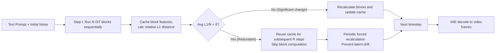

# BWCache: Accelerating Video Diffusion Transformers through Block-Wise Caching

**Conference**: ICLR 2026  
**OpenReview**: [https://openreview.net/forum?id=5bJZtzTFYy](https://openreview.net/forum?id=5bJZtzTFYy)  
**Code**: [https://github.com/hsc113/BWCache](https://github.com/hsc113/BWCache)  
**Area**: Video Generation / Diffusion Model Acceleration  
**Keywords**: Diffusion Transformer, Video Generation, Training-free Acceleration, Feature Caching, DiT block, Inference Acceleration  

## TL;DR
BWCache identifies that features of individual blocks in video DiTs exhibit a U-shaped similarity curve across adjacent timesteps (highly redundant in intermediate steps). Consequently, it caches and reuses features at the block granularity, using a lightweight similarity metric to dynamically decide when to reuse. This achieve a training-free, plug-and-play acceleration of up to 2.6× with almost no drop in visual quality.

## Background & Motivation
**Background**: Diffusion Transformers (DiTs) have become the SOTA architecture for video generation (e.g., Sora, HunyuanVideo, Wan 2.1). However, their iterative denoising nature is inherently serial, requiring $N$ DiT blocks to be run sequentially at each step, leading to extreme inference latency (thousands of seconds for a 129-frame video) and limiting deployment.

**Limitations of Prior Work**: Acceleration schemes fall into two categories, each with drawbacks. One relies on **architecture modification** (distillation, pruning, quantization); while reducing complexity, these require massive training data and compute for fine-tuning and often sacrifice quality, which is impractical for large pre-trained models. The other is **training-free feature caching**, but the choice of granularity is a dilemma—coarse-grained (caching entire timesteps, like TeaCache) loses critical information, while fine-grained (caching at the attention level, like PAB) saves little computation. Skip-DiT performs block-level stability analysis but requires architecture changes and retraining (weeks on 8×H100 for Latte).

**Key Challenge**: Caching faces two unresolved questions: (1) **What to cache**: Which layer's features are worth reusing while providing real speedup? (2) **When to reuse**: Feature similarity between adjacent timesteps fluctuates wildly with content; indiscriminate reuse blurs details.

**Goal**: Achieve high speedup and high fidelity without architecture changes or retraining by finding the correct caching granularity and adaptively judging reuse timing.

**Key Insight**: **[Blocks are the main latency cause + U-shaped redundancy]** Empirical tests reveal that DiT blocks account for over 80% of denoising time. Furthermore, the relative L1 distance of block features across adjacent timesteps follows a **U-shaped curve**: large changes at the start and end, with high similarity and redundancy in the middle. Thus, caching is set at the **DiT block** level, using a similarity threshold to trigger reuse and eliminate redundancy at the most effective granularity.

## Method

### Overall Architecture
BWCache inserts a caching module into the standard DiT video generation pipeline (Text prompt + Initial noise → Multi-step denoising → VAE decoding). After computing all blocks in a step, it caches their output features and calculates the average relative L1 distance as a similarity metric. When the metric is below threshold $\delta$, subsequent steps reuse the cached block outputs and skip computation; otherwise, it recalculates and updates the cache. To prevent latent drift from long-term reuse, periodic forced recalculation is introduced. The mechanism is training-free, memory-efficient (storing only one set of current block features), and plug-and-play.

### Key Designs

**1. Block-level Redundancy Analysis: U-shaped similarity as the basis.** The authors quantify feature changes per block using relative L1 distance: $L1_{rel}(h_{t,i}) = \frac{\|h_{t,i} - h_{t+1,i}\|_1}{\|h_{t+1,i}\|_1}$, then aggregate differences across one step: $ARL1(t) = \sum_{n=1}^{N} L1_{rel}(h_{t,i})$. A consistent **U-shaped curve** is observed across five models (Open-Sora, Latte, Wan 2.1, HunyuanVideo): early steps recover low-frequency components with drastic changes (left arm), middle steps stabilize with high redundancy (bottom), and final steps recover high-frequency details with increased changes (right arm). This frequency-domain perspective justifies why the middle steps should be cached and locks the granularity to the "block" level.

**2. Adaptive Similarity Metric: Data-driven reuse.** Feature similarity varies significantly across prompts (static vs. dynamic scenes); fixed strategies fail. BWCache uses the average relative L1 distance across all blocks as the trigger: reuse occurs only when $\sum_{n=1}^{N} L1_{rel}(h_{t,i})/N < \delta$. This allows reuse to **adapt to scene dynamics**—automatically caching less during high-change periods and more during stable periods. A larger $\delta$ increases speedup but risks quality; the default is $\delta=0.15$. Furthermore, since the final steps are critical for transitioning from structural noise to high-fidelity video, if a cache is triggered at step $k$, reuse is only allowed in the first half of the remaining steps; the **last $k/2$ steps are always forced to recalculate**.

**3. Periodic Cache Recalculation: Preventing latent drift.** Continuous reuse of the same block features accumulates error and erases fine details (latent drift). Borrowing from PAB’s progressive computation, BWCache periodically recalculates within the caching interval $R$: after computing at step $t$, it reuses for $R$ steps ($[t-1, t-R]$), then updates again at $t-R-1$: $OH = \{\dots, \underbrace{h''_t}_{\text{cached}}, \underbrace{h''_t, \dots, h''_t}_{\text{reuse } R \text{ steps}}, \underbrace{h''_{t-R-1}}_{\text{cached}}, \dots\}$. $R$ is typically 10% of the total steps.

## Key Experimental Results

### Main Results
Comparison across five DiT video models (A800 GPU, metrics calculated relative to the original model):

| Model | Method | VBench↑ | LPIPS↓ | SSIM↑ | PSNR↑ | Speedup↑ | Latency(s)↓ |
|------|------|---------|--------|-------|-------|-------|---------|
| Open-Sora | Original | 80.33% | - | - | - | 1× | 44.56 |
| | TeaCache | 79.16% | 0.1496 | 0.8104 | 22.39 | 1.50× | 29.64 |
| | FasterCache | 79.21% | 0.1165 | 0.8435 | 23.99 | 1.35× | 32.03 |
| | **BWCache** | **80.03%** | **0.0879** | **0.8854** | **27.05** | **1.61×** | **27.68** |
| Latte | TeaCache | 77.40% | 0.1969 | 0.7606 | 22.19 | 1.86× | 14.46 |
| | Skip-DiT(Retrain) | 75.76% | 0.1403 | 0.8087 | 25.50 | 1.65× | 16.28 |
| | **BWCache** | **78.28%** | **0.1399** | **0.8181** | **26.46** | **1.90×** | **14.16** |
| Wan 2.1 | TeaCache | 81.73% | 0.2407 | 0.6593 | 18.62 | 1.41× | 644 |
| | **BWCache** | **81.99%** | **0.0782** | **0.8539** | **25.86** | **2.00×** | **457** |
| HunyuanVideo | TeaCache | 82.13% | 0.1630 | 0.8052 | 24.37 | 2.27× | 493 |
| | **BWCache** | **82.48%** | **0.0794** | **0.8903** | **29.91** | **2.60×** | **433** |

BWCache leads in quality metrics almost across the board. On HunyuanVideo, VBench even exceeds the original model (82.48% vs 82.29%) with 2.6× speedup. The exception is Open-Sora-Plan, where TeaCache is faster (4.41× vs 2.24×) because BWCache avoids caching early-stage fluctuating features to preserve quality.

### Ablation Study
Trade-offs between threshold $\delta$ (reuse rate) and interval $R$ (Open-Sora):

| Threshold $\delta$ | Reuse Rate | VBench↑ | LPIPS↓ | SSIM↑ | PSNR↑ |
|------|--------|---------|--------|-------|-------|
| 0.25(Fast) | 59.00% | 79.03% | 0.1935 | 0.7829 | 21.39 |
| 0.20(Mid) | 53.05% | 79.42% | 0.1486 | 0.8267 | 23.45 |
| 0.15(Slow) | 41.38% | 80.03% | 0.0879 | 0.8854 | 27.05 |

| Interval $R$ | Latency(s)↓ | VBench↑ | LPIPS↓ | SSIM↑ | PSNR↑ |
|------|---------|---------|--------|-------|-------|
| 5% | 34.70 | 80.28% | 0.0451 | 0.9250 | 30.72 |
| 10% | 27.68 | 80.03% | 0.0879 | 0.8854 | 27.05 |
| 20% | 25.97 | 79.48% | 0.1415 | 0.8465 | 24.82 |

### Key Findings
- **Caching vs. Reducing Steps**: At equal latency, reducing the original model to 19 steps causes quality collapse (LPIPS 0.3139), whereas BWCache at 30 steps maintains high fidelity (LPIPS 0.0879), proving caching is superior to brute-force step reduction.
- **Reuse rate fluctuates over timesteps**, peaking in the middle, perfectly matching the U-shaped redundancy analysis.
- **Strong Multi-GPU Scalability**: Combined with Dynamic Sequence Parallelism, BWCache achieves 17.2× speedup on 8 GPUs for Open-Sora (204 frames), surpassing TeaCache's 13.2×.

## Highlights & Insights
- **Empirical Answer to Granularity**: Not timestep (too coarse) or attention (too fine), but DiT block. The choice is solidified by the 80% latency share and U-shaped redundancy observations.
- **Physical Interpretation**: The U-shaped curve explains why the middle steps are most redundant (stable phase) while the start (low-freq) and end (high-freq) require full computation.
- **Plug-and-Play & Low Memory**: No retraining, stores only a single set of current features (unlike ProfilingDiT which stores multiple steps), making it highly friendly for large pre-trained models.
- **Late-stage Quality Guard**: Identifying that the final transition phase cannot be cached avoids the common "blurring" issue found in other caching methods.

## Limitations & Future Work
- **Performance on Oscillating Models**: Models with unstable early-stage features (like Open-Sora-Plan) limit acceleration potential as BWCache skips early reuse to maintain quality.
- **Manual Hyperparameters**: $\delta$ and $R$ are currently set empirically; cross-model/task automatic tuning is missing.
- **Universality of U-shape**: While verified on five models, its stability for future multi-modal or ultra-long video DiTs remains to be seen.
- **Reuse Ceiling**: Even in "Fast" settings, the reuse rate caps around 59%, limited by the actual redundancy between blocks.

## Related Work & Insights
- **Training-free Caching Lineage**: DeepCache (high-level features), T-GATE (attention output), PAB (attention redundancy), TeaCache (timestep embedding based)—BWCache differentiates by focusing on blocks with U-shape justification.
- **Block-level Stability**: Skip-DiT uses Long-Skip-Connections but requires retraining; ProfilingDiT identifies mid-stage redundancy but has higher memory costs. BWCache is lighter and more compatible.
- **Inspiration**: The methodology of "detailed per-layer redundancy analysis → identifying the correct granularity → adaptive triggering" can be transferred to other serial generation models like autoregressive video or world models.

## Rating
- **Novelty**: ⭐⭐⭐⭐ — Block-level caching is not revolutionary, but the "80% latency + U-shape" analysis provides a deep justification for the design choices.
- **Experimental Thoroughness**: ⭐⭐⭐⭐⭐ — Comprehensive coverage across five models, four baselines, multi-GPU scaling, and thorough ablations.
- **Writing Quality**: ⭐⭐⭐⭐ — Clear motivation and logical flow; minor mixing of indices in some formulas.
- **Value**: ⭐⭐⭐⭐ — Highly practical for video generation deployment due to its training-free nature and efficiency.

<!-- RELATED:START -->

## Related Papers

- [\[ICLR 2026\] Flow Caching for Autoregressive Video Generation](flow_caching_for_autoregressive_video_generation.md)
- [\[CVPR 2026\] Accelerating Diffusion-based Video Editing via Heterogeneous Caching: Beyond Full Computing at Sampled Denoising Timestep](../../CVPR2026/video_generation/accelerating_diffusion-based_video_editing_via_heterogeneous_caching_beyond_full.md)
- [\[CVPR 2026\] DisCa: Accelerating Video Diffusion Transformers with Distillation-Compatible Learnable Feature Caching](../../CVPR2026/video_generation/disca_accelerating_video_diffusion_transformers_wi.md)
- [\[ICML 2026\] WorldCache: Accelerating World Models for Free via Heterogeneous Token Caching](../../ICML2026/video_generation/worldcache_accelerating_world_models_for_free_via_heterogeneous_token_caching.md)
- [\[ICLR 2026\] Astraea: A Token-wise Acceleration Framework for Video Diffusion Transformers](astraea_a_token-wise_acceleration_framework_for_video_diffusion_transformers.md)

<!-- RELATED:END -->
