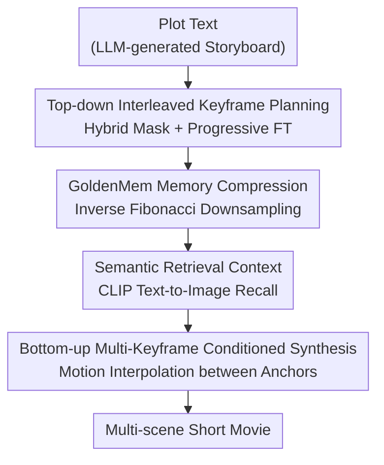

# Captain Cinema: Towards Short Movie Generation

**Conference**: ICLR2026  
**OpenReview**: [https://openreview.net/forum?id=zlNZBxQZIC](https://openreview.net/forum?id=zlNZBxQZIC)  
**Code**: To be confirmed  
**Area**: Video Generation / Diffusion Models  
**Keywords**: Short Movie Generation, Long Context, Keyframe Planning, Memory Compression, Interleaved Conditioning

## TL;DR
Captain Cinema decomposes the task of "generating a short movie" into two steps: top-down planning of a full set of keyframe storyboards, followed by bottom-up synthesis of video motion between these keyframes. It utilizes Golden Ratio Memory Compression (GoldenMem) to fit historical frames from thousands of seconds across dozens of shots into a fixed token budget, maintaining character and scene consistency over long sequences.

## Background & Motivation
**Background**: Video generation models based on Diffusion (DiT, Sora, CogVideo) and Autoregression (VideoPoet, Emu) are capable of producing 5–10 second clips with high visual fidelity, covering tasks such as image animation, video editing, and stylization.

**Limitations of Prior Work**: These methods are inherently "clip-centric." While they excel at local temporal coherence within a single shot, they lack mechanisms to ensure narrative coherence and visual consistency across multiple shots and scenes. Extending generation to movie-scale (multi-scene, thousands of seconds) leads to context length explosion (OOM due to accumulating tokens) and visual drift (characters and styles becoming unrecognizable).

**Key Challenge**: To narrate a complete story, a model must capture long-range dependencies (remembering a character's appearance from dozens of shots ago) while preserving fine-grained details (ensuring current shot quality). These two objectives conflict under fixed compute—stuffing all history into the context is computationally prohibitive, while discarding history destroys consistency.

**Goal**: To generate multi-scene short movies with character/scene consistency and narrative coherence within controllable compute, while decoupling "long-range planning" from "local motion synthesis."

**Key Insight**: The authors observe that human filmmaking starts with a storyboard followed by filling in the motion between shots. Thus, generation is explicitly split into two layers: a "Director" model generates a sequence of keyframes to define the global narrative, and a "Cinematographer" model synthesizes motion between those keyframes for local fidelity.

**Core Idea**: Replacing end-to-end long video generation with a two-stage process consisting of "top-down interleaved keyframe planning" and "bottom-up keyframe-conditioned video synthesis," using GoldenMem to keep long-context token costs constant.

## Method

### Overall Architecture
Captain Cinema takes a detailed movie plot text and outputs a multi-scene short movie. The pipeline is divided into two parts: the **top-down phase** converts the plot into a sequence of annotated keyframes via interleaved text-to-image generation (using Flux 1.Dev). Each keyframe attends to its text prompt and compressed historical keyframes to maintain global consistency. This step centers on GoldenMem compression and semantic retrieval conditioning. The **bottom-up phase** uses these keyframes as anchors for a long-context video model (Seaweed-3B) to interpolate spatio-temporal motion between adjacent keyframes. Both phases are unified by an interleaved multimodal data format, and the system is trained on full movies with progressive long-context fine-tuning.

### Key Designs

**1. Top-down Interleaved Keyframe Planning: Utilizing Hybrid Attention Masks for Global MM-DiT Efficiency**

Generating a set of coherent keyframes in a T2I model requires individual clarity and mutual alignment. Leveraging the Flux architecture ($D$ dual-stream blocks and $S$ single-stream blocks), given $P$ pairs $S=\{(x_i,y_i)\}_{i=1}^P$ where $z_i=[x_i\|y_i]$, the first $D$ **local blocks** use a block-diagonal mask $M_{\text{local}}=\mathrm{diag}(M_1,\dots,M_P)$. This ensures $z_i$ only attends to itself, keeping initial computations cheap. The subsequent $S$ **global blocks** use a full-zero mask $M_{\text{global}}\equiv 0$ for bidirectional cross-pair attention during training (or upper-triangular for inference), enabling global style and character alignment.

**2. GoldenMem: Constant Visual Memory via Golden Ratio Inverse Fibonacci Downsampling**

As the number of shots increases, historical tokens expand linearly. GoldenMem preserves the current frame at full resolution while progressively downsampling older frames. Let the golden ratio be $\varphi=(1+\sqrt5)/2\approx1.618$. If the latest latent short side is $s_0$, the $i$-th frame's short side is $s_i=\lfloor s_{i-1}/\varphi\rfloor$, resulting in an inverse Fibonacci sequence (e.g., $25, 15, 9, 5, 3$). Each $s_i\times s_i$ latent contributes $t_i=(s_i/p)^2$ tokens. Due to geometric decay, the total cost $T$ is:

$$T=\sum_{i=0}^{k}t_i=t_0\big(1+\varphi^{-2}+\varphi^{-4}+\dots\big)<\frac{\varphi^2}{\varphi^2-1}t_0\approx 1.62\,t_0$$

This ensures total token usage remains within ~1.62$\times$ the cost of a single frame, regardless of history length. Experiments show GoldenMem maintains context up to 48 frames without OOM, whereas baseline token counts exceed 30k.

**3. Semantic Retrieval Context: Non-temporal Historical Retrieval**

Movies often use flashbacks or non-linear narratives. Instead of purely temporal conditioning, the model retrieves historical frames based on semantic similarity using CLIP (text-to-image) and T5 (text-to-text) embeddings. CLIP-based retrieval shows higher recall coverage, allowing the model to reference the most relevant historical visuals accurately.

**4. Bottom-up Multi-Keyframe Conditioned Video Synthesis**

With high-quality keyframes as anchors $\{I_1,\dots,I_K\}$, a diffusion generator $G_\theta$ synthesizes motion between them using tiled captions $c_{\text{tiled}}$ and visual embeddings:

$$V_k=\Big\{I_k,\ G_\theta\big(I_{1:K},\,c_{\text{tiled}},\,t=2{:}T_k\big)\Big\},\quad k=1,\dots,K$$

Decoupling narrative planning from motion synthesis allows the video model to focus solely on temporal dynamics, resulting in fewer artifacts, more consistent environmental contexts (e.g., rising smoke), and smoother camera movements.

### Loss & Training
Two strategies ensure stability: **Progressive Long-Context Fine-tuning**, which gradually expands the sequence from 1 to 32 pairs to prevent training collapse and loss of distilled knowledge (optimal warmup at 40k steps); and **Dynamic Stride Sampling**, which uses an overlap rate (max 25%) to generate thousands of times more effective sequences compared to naive continuous sampling from the 500-hour movie dataset.

## Key Experimental Results

### Main Results
The evaluation uses VBench-2.0 for visual/temporal metrics, LCT protocols for text alignment, and 4-tier human ranking (Average Human Ranking, AHR).

| Method | Aesthetic↑ | Visual Q↑ | Consistency↑ | Dynamic↑ | Text Align↑ | Human Q↑ | Human Sem↑ |
|:---|:---:|:---:|:---:|:---:|:---:|:---:|:---:|
| IC-LoRA | 54.1 | 60.5 | 88.7 | 61.1 | 23.1 | 1.5 | 2.3 |
| LCT | 56.2 | 59.9 | 94.8* | 51.8 | 23.9 | 2.4 | 3.1 |
| Ours (w/o MF-FT) | 56.8 | 60.9 | 91.9 | 64.4 | 25.7 | 2.8 | 3.5 |
| **Ours** | **57.2** | **61.7** | 91.0 | **65.4** | **26.1** | **3.3** | **3.7** |

`*` LCT's high consistency score stems from low temporal dynamics (static frames score high). Ours leads in aesthetics, visual quality, dynamics, and text alignment, particularly in generating vivid motion over long sequences.

### Ablation Study
**Long-context Stress Test** (8 to 48 pairs, Gemini Flash 2.5 Scoring + VBench-2.0 ID Consistency):

| Method | Context Pairs | Character Cons. | Scene Cons. | Narrative Coh. | ID Cons. |
|:---|:---:|:---:|:---:|:---:|:---:|
| LCT | 8 | 4.3 | 3.5 | 2.8 | 0.43 |
| LCT | 24 | 3.1 | 0.7 | 0.6 | 0.14 |
| Ours (w/ G.Mem) | 16 | 4.6 | 3.8 | 3.8 | 0.44 |
| Ours (w/ G.Mem) | 48 | 4.5 | 3.0 | 3.3 | 0.31 |

**Compute Ablation for GoldenMem**:

| Config | Compute (PFLOPS) | Visual Q↑ | Text Align↑ | Notes |
|:---|:---:|:---:|:---:|:---|
| 16-frame | 30 → 21 | 4.4 → 4.3 | 4.1 → 4.1 | ~30% compute Gain with negligible quality loss |
| 32-frame | 55 → 35 | 4.1 → 3.9 | 3.8 → 3.6 | Same as above |
| 48-frame | OOM → 52 | – → 3.6 | – → 3.5 | Baseline OOMs; GoldenMem remains functional |

### Key Findings
- LCT quality drops sharply at 24 context pairs, while Ours + GoldenMem maintains >93% consistency up to 48 pairs.
- Multi-frame fine-tuning (MF-FT) significantly improves human-perceived quality (2.8 to 3.3) and temporal dynamics.
- Progressive fine-tuning is sensitive: excessive warmup (80k steps) leads to knowledge forgetting and artifacts.

## Highlights & Insights
- **Elegant Memory Compression**: Using the golden ratio for inverse Fibonacci downsampling provides a closed-form guarantee of constant cost, applicable to any autoregressive generation requiring long visual memory.
- **Consistency-Motion Decoupling**: Offloading consistency to a high-fidelity image model while letting the video model focus on temporal dynamics effectively solves the "jack-of-all-trades" dilemma of end-to-end models.
- **Semantic Retrieval over Temporal Order**: This approach aligns better with cinematic structures like flashbacks and non-linear storytelling.

## Limitations & Future Work
- Dependency on external LLMs for storyboarding limits end-to-end optimization of text planning and visual generation.
- High training costs (256$\times$H100) and reliance on specific sampling strategies suggest limited generalization to out-of-distribution genres.
- Metrics are heavily dependent on LLM scoring (Gemini Flash), and current consistency scores often favor static frames.

## Related Work & Insights
- **vs LCT**: LCT fine-tunes on single-scene clips; Ours learns from full movies with GoldenMem, significantly improving long-context robustness.
- **vs IC-LoRA / StoryDiffusion**: These focus on "semantically consistent image sets," whereas Ours targets full narrative videos via keyframe decomposition.
- **vs FramePack / FlexTok**: While those compress at the attention or tokenizer level, GoldenMem optimizes the "historical keyframe memory" via spatial downsampling.

## Rating
- Novelty: ⭐⭐⭐⭐⭐ Decoupling plus GoldenMem is a significant step toward movie generation.
- Experimental Thoroughness: ⭐⭐⭐⭐ Strong stress tests, though objective metrics rely on LLMs.
- Writing Quality: ⭐⭐⭐⭐ Clear framework and mathematical formulations.
- Value: ⭐⭐⭐⭐⭐ Directly addresses consistency and context bottlenecks in long video generation.

<!-- RELATED:START -->

## Related Papers

- [\[CVPR 2026\] Captain Safari: A World Engine with Pose-Aligned 3D Memory](../../CVPR2026/video_generation/captain_safari_a_world_engine_with_pose-aligned_3d_memory.md)
- [\[CVPR 2025\] MovieBench: A Hierarchical Movie Level Dataset for Long Video Generation](../../CVPR2025/video_generation/moviebench_a_hierarchical_movie_level_dataset_for_long_video_generation.md)
- [\[ICLR 2026\] EditVerse: Unifying Image and Video Editing and Generation with In-Context Learning](editverse_unifying_image_and_video_editing_and_generation_with_in-context_learni.md)
- [\[ICLR 2026\] Anchor Frame Bridging for Coherent First-Last Frame Video Generation](anchor_frame_bridging_for_coherent_first-last_frame_video_generation.md)
- [\[ICLR 2026\] DSA: Efficient Inference For Video Generation Models via Distributed Sparse Attention](dsa_efficient_inference_for_video_generation_models_via_distributed_sparse_atten.md)

<!-- RELATED:END -->
