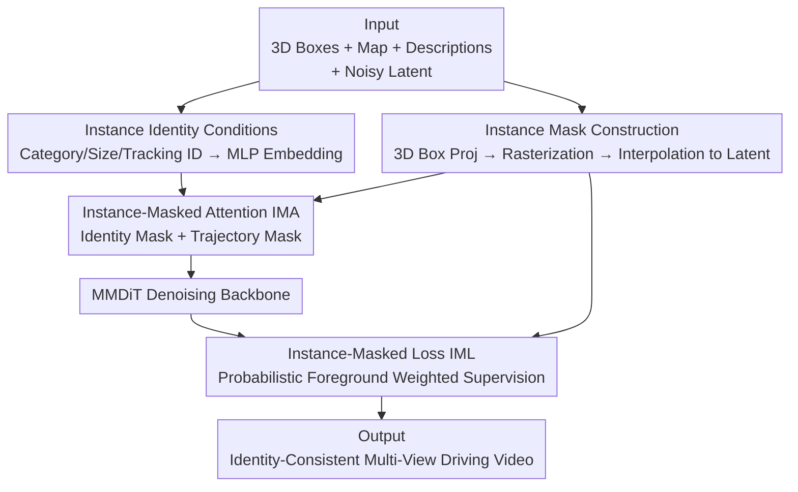

# ConsisDrive: Identity-Preserving Driving World Models for Video Generation by Instance Mask

**Conference**: ICLR2026  
**OpenReview**: [https://openreview.net/forum?id=zgqFQM8VNe](https://openreview.net/forum?id=zgqFQM8VNe)  
**Code**: Project Page https://shanpoyang654.github.io/ConsisDrive/page.html  
**Area**: Video Generation / Autonomous Driving World Models  
**Keywords**: Driving world models, Identity consistency, Instance mask attention, Temporal consistency, nuScenes

## TL;DR
ConsisDrive utilizes "instance masks" within a diffusion-based driving world model to constrain both attention and loss to individual objects. This ensures each visual token interacts only with its own instance's identity and trajectory tokens (preventing a bus from transforming into a truck or a red car into a black one) while shifting supervision focus toward the foreground. Consequently, it achieves a record FVD of 37.23 and FID of 3.88 on nuScenes, significantly enhancing downstream perception and tracking metrics.

## Background & Motivation
**Background**: Perception, tracking, and planning models in autonomous driving rely on large-scale, multi-view driving videos with precise annotations. However, real-world data collection and labeling are extremely costly. With the progress of diffusion-based video generation, "driving world models" have become the mainstream alternative for low-cost data generation: synthesized multi-view driving videos can be generated given conditions such as 3D boxes, road maps, and scene descriptions.

**Limitations of Prior Work**: Existing diffusion world models commonly suffer from **identity drift**, where the appearance or even the category of the same object changes across different frames. The paper highlights three typical failures in Fig. 1: in DriveDreamer2, a bus gradually turns into a truck (category drift); in MagicDrive-V2, the color of the same car fluctuates between frames (color drift); and small targets (pedestrians) become blurred because the foreground supervision is diluted (foreground dilution). These inconsistencies reduce video realism and prevent the generated data from being reliably used for downstream tasks like tracking and perception that demand high temporal stability.

**Key Challenge**: The authors attribute the root cause to three factors. First, there is a lack of explicit instance identity conditions, providing no "anchor" for the model to maintain the same identity over long spans. Second, the attention mechanisms in existing diffusion transformers (e.g., MMDiT in FLUX using global 3D full attention) are **not instance-aware**, allowing all tokens to interact indiscriminately, which leads to cross-instance information leakage (e.g., one car's color "bleeding" into another). Third, the training objective applies uniform supervision over the entire frame; since background pixels (sky, buildings) dominate, supervision is diluted, causing the model to neglect fine-grained identity features of small foreground objects.

**Goal**: To inject "instance awareness" into both the attention mechanism and the training objective, enforcing temporal consistency at the instance level for world models.

**Key Insight**: Utilize a set of "instance masks" constructed from 3D box projections as structural priors. These masks guide the attention mechanism (restricting each token to its own instance's identity and trajectory) and the loss function (tilting supervision toward the foreground), thereby suppressing identity drift.

## Method

### Overall Architecture
ConsisDrive is built upon OpenSora V2.0: using Video DC-AE (a 3D VAE) to encode videos, T5XXL + CLIP-Large to encode text, and MMDiT as the denoising backbone. Control signals (3D box projections, road maps, scene descriptions) are injected via a ControlNet-style architecture, where the first 19 base blocks of the MMDiT dual-stream backbone are replicated as dedicated control/copy blocks to fuse conditional features with base block outputs. On top of this, two core components are added: **Instance-Masked Attention (IMA)**, which injects instance identity conditions (category, size, tracking ID) into the attention and uses masks to limit visibility between tokens; and **Instance-Masked Loss (IML)**, which weights denoising supervision toward foreground objects using foreground masks. Both sets of masks are derived from the same instance mask construction process: "3D box projection $\rightarrow$ rasterization $\rightarrow$ trilinear interpolation to latent space."

### Key Designs

**1. Instance Mask Construction: Mapping 3D Boxes to Token-Level Lookup Tables**

This serves as the foundation for the other components, answering which visual tokens in the latent space belong to which instances. The paper defines a token-to-instance indicator function $I(v_k)$. Each instance $i$ is described by eight 3D corners $C_i=\{X_{i,c}\}_{c=1}^{8}$. At frame $t$, corners are projected onto the image plane via camera parameters $(K_t, R_t, T_t)$ as $\tilde{x}^t_{i,c}=K_t(R_t X_{i,c}+T_t)$. Perspective division yields pixel coordinates, and the convex hull of these points forms a polygon $P^t_i$. Rasterization produces a binary mask $BM_i\in\{0,1\}^{T\times H\times W}$, which is trilinearly interpolated to the latent space $\widetilde{BM}_i$. For a patch token $v_k\equiv(t,p)$ compressed by the VAE:

$$I(v_k)=\{\,i \mid \exists(x,y),\ \widetilde{BM}_i(t,x,y)=1\,\}$$

This represents the set of all instance IDs covering token $v_k$. Attention, trajectory, and loss masks are all derived from $I(v_k)$, ensuring consistency.

**2. Instance Identity Condition: Encoding Category, Size, and Tracking ID**

Explicit identity conditions are crucial for preventing category drift. For each instance $i$, the paper fuses three attributes into a global identity embedding: semantic features of the category label $c_i$ from CLIP-Large $\tau_\theta(\cdot)$, and Fourier mappings $\gamma(\cdot)$ of the tracking ID $\mathrm{ID}_i$ and box dimensions $s_i=(dx_i,dy_i,dz_i)$. These are concatenated and passed through an MLP:

$$g_i=\mathrm{MLP}([\tau_\theta(c_i),\ \gamma(s_i),\ \gamma(\mathrm{ID}_i)])$$

The set of all $n$ instance embeddings $G=\{g_i\}_{i=1}^n$ provides an "identity fingerprint" that anchors the same object across frames using semantic, geometric, and unique identifiers.

**3. Instance-Masked Attention (IMA): Cutting Cross-Instance Leakage and Enabling Intra-Instance Propagation**

IMA addresses the issue that standard attention is not instance-aware. The $m=T_{c}\times H_{c}\times W_{c}$ visual tokens $V$ from the copy blocks and $n$ identity tokens $G$ are concatenated for masked 3D self-attention: $\tilde{V}=\mathrm{SA}_{\text{mask}}([V,G])$. The mask matrix $M\in\mathbb{R}^{(m+n)\times(m+n)}$ is governed by two rules:

- **Instance Identity Mask**: If $i\notin I(v_k)$, then $M_{k,m+i}=M_{m+i,k}=-\infty$. This ensures visual tokens only attend to the identity tokens of instances covering them, injecting identity features into correct objects while preventing cross-instance crosstalk.
- **Instance Trajectory Mask**: If $I(v_k)\cap I(v_j)=\varnothing$, then $M_{k,j}=-\infty$. This ensures visual tokens only interact with tokens belonging to the same instance across frames, forcing appearance features (color, texture) to propagate **along the object's trajectory**, suppressing color drift.

The result is added back to the backbone via gated residual connection: $V=V+\tanh(\omega)\,\tilde{V}[:m]$, where $\omega$ is a learnable scalar initialized to 0.

**4. Instance-Masked Loss (IML): Probabilistically Weighting Supervision Toward the Foreground**

To solve foreground dilution, a binary loss mask $M_{\text{Loss}}(v_k)=\mathbb{1}\{I(v_k)\neq\varnothing\}$ is constructed, selecting only tokens covered by at least one instance. The masked loss is defined as $L_{\text{mask}}=M_{\text{Loss}}\odot L$ (where $L$ is the original denoising loss). To avoid overfitting the foreground at the expense of background quality (roads, maps), a probabilistic dynamic mask is used: the masked loss is applied with probability $\alpha$; otherwise, the full-frame loss is used:

$$\tilde{L}_{\text{mask}}=\begin{cases}L_{\text{mask}}, & p<\alpha\\ L, & p\ge\alpha\end{cases}$$

This switching allows the model to focus on foreground consistency while maintaining natural background realism.

### Loss & Training
The training objective is the probabilistic $\tilde{L}_{\text{mask}}$ defined above, applied on top of the OpenSora V2.0 denoising loss. The implementation uses a resolution of $16\times256\times448$ and was trained on 64 A100 GPUs, capable of generating stable long videos of 200+ frames.

## Key Experimental Results

### Main Results
Evaluated on nuScenes against models like BEVControl, DrivingDiffusion, Panacea, MagicDrive-V2, and DriveDreamer2. FID/FVD measure visual and temporal fidelity, while StreamPETR measures the utility of generated data for perception (NDS, mAP) and MOT (AMOTA, AMOTP, IDS).

| Dataset | Metric | ConsisDrive | Prev. SOTA | Description |
|--------|------|------|----------|------|
| nuScenes val | FVD↓ | **37.23** | 38.06 (InstaDrive) | Best temporal fidelity |
| nuScenes val | FID↓ | **3.88** | 3.96 (InstaDrive) | Best visual realism |

Downstream perception (training StreamPETR on generated data): Using only generated data achieves mAP 31.5 (91.3% of real data performance) and NDS 42.06. Augmenting real data with generated data reaches NDS 54.6, +7.7 higher than real data alone.

| Task/Setting | Metric | ConsisDrive | Comparison |
|------|------|------|------|
| Perception (Real+Gen Augment) | NDS↑ | **54.6** (+7.7) | Panacea 49.2 (+2.3) |
| Perception (Gen val eval) | NDS↑ | **41.38** (88.23%) | MagicDrive-V2 36.82 |
| MOT (Data Augmentation) | IDS↓ | **525** (-162) | InstaDrive 532 (-155) |

### Ablation Study (nuScenes val, (T+I)2V)

| Configuration | FVD↓ | FID↓ | NDS↑ | IDS↓ |
|------|------|------|------|------|
| Full model | 37.23 | 3.88 | 41.38 | 525 |
| w/o IMA (Identity Mask) | 40.89 (+3.66) | 5.29 (+1.41) | 37.55 (-3.83) | 735 (+210) |
| w/o IMA (Trajectory Mask) | 53.66 (+16.43) | 4.41 (+0.53) | 40.40 (-0.98) | 1074 (+549) |
| w/o IML | 40.19 (+2.96) | 4.24 (+0.36) | 36.85 (-4.53) | 637 (+112) |

### Key Findings
- **Trajectory Mask contributes most to temporal fidelity**: Removing it causes FVD to jump by +16.43 and IDS to double (525 to 1074), confirming that propagating features along trajectories is key to frame-to-frame consistency.
- **Identity Mask is crucial for category correctness**: Removing it increases FID by +1.41 and drops NDS by -3.83. Qualitatively, traffic cones may be rendered as crouching pedestrians without it.
- **IML significantly impacts downstream perception**: Removing it drops NDS by 4.53, highlighting the importance of foreground-weighted supervision for small target fidelity.
- Generated data serves as an effective substitute/augmentation: Training perception solely on generated data reaches 91.3% of the mAP of real data.

## Highlights & Insights
- **Elegant dual-use of 3D box projection masks**: Reusing the same $I(v_k)$ for identity, trajectory, and loss masks ensures consistency and engineering simplicity—a great example of converting geometric priors into token-level constraints.
- **Translating "temporal consistency" into "token visibility"**: Instead of using explicit optical flow, ConsisDrive uses 3D box cross-frame associations to restrict attention visibility. This approach is clean and transferable to any video generation task with instance annotations.
- **Probabilistic foreground loss is a practical trick**: To focus on the foreground without sacrificing the background, a Bernoulli switch between losses is more stable than fixed weighting. This is applicable to any scenario where the foreground is critical but the background must remain intact (e.g., medical lesions, remote sensing).
- **Gated residual $\tanh(\omega)$ with $\omega$ initialized to 0**: This allows new modules to grow smoothly into the pre-trained base from "zero contribution," protecting the foundation.

## Limitations & Future Work
- **High dependency on 3D box and tracking ID accuracy**: The entire mask system relies on 3D bbox projections; noise in annotations directly contaminates the masks. It is difficult to apply to datasets without high-quality instance labels.
- **Validation limited to nuScenes**: Cross-dataset or cross-domain (different cities, sensors) generalization has not been fully verified, and the lead in FVD/FID over previous work is relatively small.
- **Computational Overhead**: Constructing $(m+n)\times(m+n)$ mask matrices for masked 3D attention on 64 A100s poses significant memory and compute pressure, raising questions about scalability for higher resolutions or longer videos.
- **Potential Improvements**: Replacing hard $-\infty$ masking with soft learnable instance affinity or introducing segmentation/flow redundancy for unreliable boxes could improve robustness.

## Related Work & Insights
- **vs MagicDrive-V2**: MagicDrive-V2 adds temporal attention for global consistency but lacks fine-grained instance alignment, leading to color drift. ConsisDrive achieves instance-level alignment via trajectory masks, reducing FVD from 94.84 to 37.23.
- **vs DriveDreamer2**: DriveDreamer2 lacks explicit identity conditions, resulting in semantic drift (bus $\rightarrow$ truck). Ours uses identity masks and tokens to anchor categories.
- **vs Panacea**: Panacea uses uniform supervision, diluting small foreground targets. Ours uses probabilistic IML, increasing the NDS gain from +2.3 to +7.7 in downstream tasks.
- **vs DrivingDiffusion**: DrivingDiffusion uses a complex multi-stage pipeline; Ours is an end-to-end framework and maintains geometric fidelity via 3D boxes instead of 2D BEV projections.

## Rating
- Novelty: ⭐⭐⭐⭐ The combination of instance masks for both attention and loss is clear and addresses identity drift directly, though individual components are instance-level specializations of existing ideas.
- Experimental Thoroughness: ⭐⭐⭐⭐ Covers FID/FVD, perception, tracking, and full ablations. Limited to nuScenes, missing cross-domain generalization.
- Writing Quality: ⭐⭐⭐⭐ Root causes and methodology are clearly explained with corresponding diagrams and formulas.
- Value: ⭐⭐⭐⭐ Generated data achieves 91% of real-data perception performance, offering practical value for autonomous driving data generation.

<!-- RELATED:START -->

## Related Papers

- [\[ICLR 2026\] DrivingGen: A Comprehensive Benchmark for Generative Video World Models in Autonomous Driving](drivinggen_a_comprehensive_benchmark_for_generative_video_world_models_in_autono.md)
- [\[CVPR 2026\] EvoID: Reinforced Evolution for Identity-Preserving Video Generation](../../CVPR2026/video_generation/evoid_reinforced_evolution_for_identity-preserving_video_generation.md)
- [\[CVPR 2026\] ConsID-Gen: View-Consistent and Identity-Preserving Image-to-Video Generation](../../CVPR2026/video_generation/consid-gen_view-consistent_and_identity-preserving_image-to-video_generation.md)
- [\[CVPR 2025\] Identity-Preserving Text-to-Video Generation by Frequency Decomposition](../../CVPR2025/video_generation/identity-preserving_text-to-video_generation_by_frequency_decomposition.md)
- [\[CVPR 2026\] DriveLaW: Unifying Planning and Video Generation in a Latent Driving World](../../CVPR2026/video_generation/drivelaw_unifying_planning_and_video_generation_in_a_latent_driving_world.md)

<!-- RELATED:END -->
