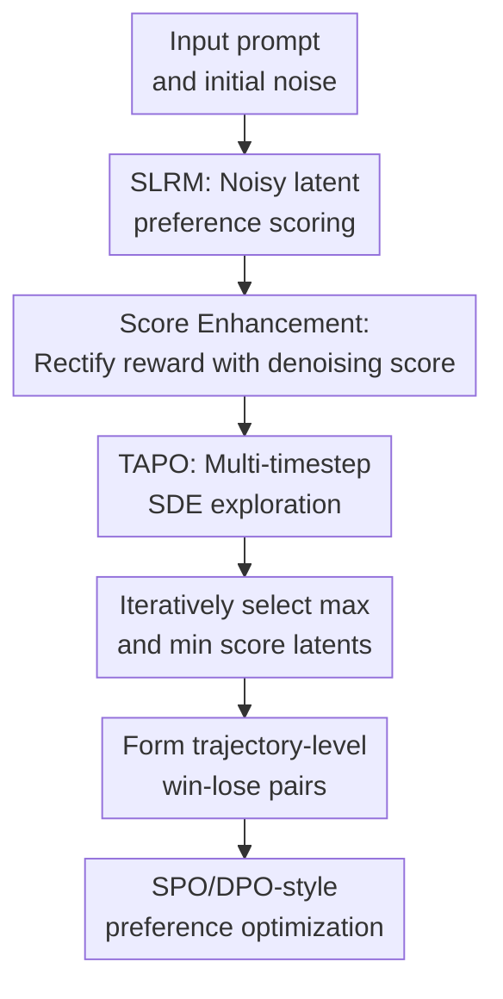

# Consistent Noisy Latent Rewards for Trajectory Preference Optimization in Diffusion Models

**Conference**: ICLR2026  
**OpenReview**: [https://openreview.net/forum?id=qGihS60jfT](https://openreview.net/forum?id=qGihS60jfT)  
**Code**: TAPO (The paper states it will be open-sourced; no accessible URL in cache)  
**Area**: Diffusion Models / Video Generation / Preference Optimization  
**Keywords**: Diffusion preference alignment, noisy latent reward model, trajectory-level preference optimization, T2I, T2V  

## TL;DR
This paper proposes SLRM + TAPO: first, a score-based latent reward model that preserves diffusion score capabilities is used to stably evaluate intermediate sampling states; then, multi-timestep SDE exploration and filtering are employed to construct more consistent win-lose trajectory pairs, thereby improving preference alignment for text-to-image and text-to-video diffusion models.

## Background & Motivation
**Background**: The visual generation capabilities of diffusion models are already strong. The natural next step is "human preference alignment," similar to RLHF / DPO in LLMs. Existing visual diffusion alignment can be broadly categorized into two types: offline methods that use human-annotated preference image pairs to learn only on final clean images, and reward model (RM) based methods that score candidate samples during training or sampling to support online, trajectory-related optimization.

**Limitations of Prior Work**: Offline DPO-like methods typically only know which final image is better, but do not know which intermediate latent leads to a healthier path during the diffusion sampling process. RM-based methods seem better suited for trajectory optimization because they can score intermediate timesteps, but they face two major issues. First, many reward models are essentially pixel-level VLMs or CLIP/BLIP variants, which are highly sensitive to noise perturbations and easily distort when interpreting noisy latents as image quality. Second, even if a reward model can score a single timestep, the ranking at one point may not represent the entire sampling trajectory: the same pair of candidates might yield reversed preference orders in early, middle, or late stages.

**Key Challenge**: The intermediate states of a diffusion model are not ordinary images; their interpretability depends on the current noise level and denoising dynamics. If a reward model only learns "preference classification," it may lose the score/velocity structure originally learned by the diffusion backbone. If preference optimization only looks at a single time point, it may mistake local high scores for globally superior trajectories.

**Goal**: The authors decompose the problem into two layers: first, training a reward model that can reliably score noisy latents, and second, designing a trajectory sampling strategy where preference pairs are determined by the amplified trajectory advantages across multiple stages rather than single-point evaluations.

**Key Insight**: The key observation is that diffusion models can handle different noise levels not just because they have "seen noise," but because they learn a score/velocity field related to the data distribution during training. If a reward model directly borrows the diffusion backbone but switches entirely to a preference classification objective, this noise compatibility degrades during fine-tuning. Therefore, reward scoring must explicitly incorporate denoising score information.

**Core Idea**: Use a score-enhanced latent reward model to maintain noise compatibility, and apply multi-timestep trajectory advantage sampling to generate training trajectory pairs with more distinct preference differences and consistent rankings.

## Method
### Overall Architecture
The paper presents a two-stage framework. The first stage involves training the Score-based Latent Reward Model (SLRM), which initializes a full diffusion model as the backbone, adds learnable task tokens alongside text and visual latent tokens, and rectifies reward logits using denoising score enhancement. The second stage performs Trajectory Advantages Preference Optimization (TAPO): several timesteps are chosen uniformly along the diffusion sampling trajectory for SDE stochastic exploration. SLRM selects the best and worst branches from candidate latents to form trajectory pairs with stronger contrast for SPO/DPO-style optimization.

In this workflow, SLRM ensures "accurate perception of noise," while TAPO ensures that "the whole trajectory is not judged by a single frame." The connection between the two is direct: if the reward model cannot stably evaluate noisy latents, multi-step evaluation will only amplify noise; if only SLRM is trained while still using single-timestep sampling, the inconsistency in trajectory ranking remains.

### Key Designs
**1. SLRM: Transforming a full diffusion model into a noisy latent reward discriminator**

Standard VLM reward models usually encode images and text separately and then provide scores via similarity or a regression head. These work for clean images, but noisy latents are not natural images; direct evaluation is easily swayed by noise perturbations. SLRM takes a more aggressive approach: it does not just borrow a visual encoder but initializes the entire pre-trained diffusion model as the reward model backbone, allowing reward discrimination to occur in the latent + timestep representation space the model is already familiar with.

To make the backbone more than a text-image similarity tool, learnable task tokens are introduced. They enter the MM-DiT blocks alongside text tokens and visual latent tokens, aggregating fine-grained visual, semantic, and noise-stage information across layers via self-attention. The final output of the task tokens passes through a linear layer to produce the base reward $S(x_t, c)$. The emphasis here is not merely adding tokens, but making "reward discrimination" a task condition internal to the diffusion transformer rather than wrapping a fragile pixel-level scorer outside it.

**2. Denoising Score Enhancement: Preventing noise compatibility degradation during preference training with score constraints**

Using a diffusion backbone alone is insufficient. The paper points out that diffusion models handle various noise levels because the original training objective learns the velocity/score function. Once fine-tuned as a Bradley-Terry preference model, the training signal pushes the backbone toward "distinguishing winners from losers" rather than maintaining the geometric structure of the denoising score. Consequently, a naive SLRM gradually loses stability on noisy latents during training.

The authors fix this by using the denoising score matching distance as a reward correction term. For flow matching models, the original velocity objective aims to make $v_\theta(x_t,t,c,s)$ close to the real velocity $x_1-x_0$. The paper uses a single-sample estimation to convert this distance into multiplicative score compatibility: $\hat D_s(x,y,s)=e^{-\rho\|v_\theta(x_t,t,c,s)-(x_1-x_0)\|^2}$, and then obtains the enhanced reward via $\hat S(x_t,c)=S(x_t,c)\cdot \hat D_s(x_t,c,s)$. Intuitively, even if a latent seems semantically superior, if it does not conform to denoising dynamics at the current noise level, its final reward is suppressed.

**3. TAPO: Converting local preferences into trajectory advantages via multi-timestep SDE exploration**

Different stages of diffusion sampling focus on different attributes: early stages prioritize layout and composition, middle stages influence content consistency, and late stages add detail and texture. A single-timestep reward might prefer A at one stage and B at another. If training only uses one point to decide win-lose, accidental local advantages are written into the preference optimization objective. The core of TAPO is changing "sampling" from single-point comparison to iterative filtering along the trajectory.

Specifically, $n$ evaluation points $W_T=\{\tau_1,\tau_2,\ldots,\tau_n\}$ are chosen uniformly from the total $T$ sampling steps. At these points, randomness is injected via SDE sampling to generate multiple candidate latents; other points maintain ODE sampling to keep costs manageable. At each SDE point, SLRM scores the candidate set, keeping the highest-scoring branch as the winner and the lowest-scoring branch as the loser before continuing sampling. This results in trajectory-level preference pairs where the gap is widened across multiple noise stages, rather than pairs where "one frame happened to be better."

**4. Trajectory-level training pairs: Providing high-quality preference samples for SPO optimization**

TAPO does not introduce a complex new RL algorithm but instead feeds the filtered win-lose latent pairs into an SPO-style objective. The optimization term compares the relative probability of winner/loser transitions between the current model and a reference model, with $\beta$ controlling the strength of deviation from the reference. The key difference is that training samples are not two random trajectories with a single-point score, but high-variance trajectory pairs continuously filtered by SLRM across multiple timesteps.

The value of this design lies in moving the reward model's utility upstream to the "data construction" phase. It avoids simple reward maximization, thereby reducing reward-hacking risks, and avoids exhaustive evaluation of every timestep to prevent computational explosion. Ablation studies show that trajectory advantages are not obvious when the number of evaluation points $n$ is too small, while costs rise and returns saturate when $n$ is too large; the main setting $n=8$ is a compromise between effectiveness and efficiency.

### Loss & Training
SLRM employs Bradley-Terry style contrastive training. Given preference data $P=\{(x_i^w,x_i^l,c_i)\}_{i=1}^N$, the authors randomly sample timesteps, convert winner/loser images into corresponding noisy latents, and feed them into SLRM to obtain $\hat S(x_t^w,c)$ and $\hat S(x_t^l,c)$. The training objective encourages the enhanced reward of the winner to be greater than that of the loser, formally minimizing the negative log-likelihood of $\hat S(x_t^w,c)^\eta /(\hat S(x_t^w,c)^\eta+\hat S(x_t^l,c)^\eta)$.

The TAPO phase is implemented using SD3.5-medium as the T2I base and Wan2.1-1.3B as the T2V base. The T2I SLRM is trained on 580,000 preference pairs from Pick-a-Pic v1 and evaluated for noisy latent discrimination on approximately 28,000 validation/test samples. For preference optimization, 4k prompts are used with 20 sampling timesteps. Due to the lack of high-quality video preference data, the authors constructed 10,000 video preference pairs to train the T2V SLRM, validated using GenAI-Bench settings.

## Key Experimental Results

### Main Results
T2I main experiments show that TAPO improves both general preference metrics and text-image alignment metrics on the SD3.5-M base, with a particularly significant boost in GenEval. Compared to LPO, TAPO increases HPSv3 from 9.10 to 9.89 and GenEval from 59.85 to 68.93, demonstrating that multi-timestep trajectory filtering is more stable than single-point latent preference.

| Method | HPSv2.1 ↑ | HPSv3 ↑ | PickScore ↑ | MPS ↑ | CLIP-Score ↑ | GenEval ↑ |
|------|-----------|---------|-------------|-------|--------------|-----------|
| SD3.5-M Base | 27.15 | 8.29 | 22.15 | 1.00 | 25.18 | 55.34 |
| Diffusion-DPO | 28.23 | 7.59 | 22.64 | 1.93 | 25.71 | 54.93 |
| DenseReward | 29.99 | 8.05 | 22.83 | 2.51 | 26.18 | 55.27 |
| SPO | 31.52 | 8.74 | 22.70 | 2.24 | 24.72 | 52.75 |
| LPO | 31.89 | 9.10 | 22.86 | 3.12 | 26.15 | 59.85 |
| TAPO | 32.01 | 9.89 | 23.03 | 3.07 | 27.07 | 68.93 |

Reward model experiments directly verify the noise compatibility of SLRM. While HPSv3 and PickScore show high accuracy on clean images, their accuracy drops significantly upon entering noisy timesteps. SLRM maintains around 66% accuracy across both high and low noise intervals, surpassing LRM-3.5 and various VLM rewards.

| Reward Model | $t\in[501,1000]$ ↑ | $t\in[1,500]$ ↑ | $t=0$ Clean Image ↑ |
|----------|--------------------|------------------|-------------------|
| CLIP Score | 46.91 | 44.37 | 61.84 |
| ImageReward | 49.68 | 47.92 | 62.66 |
| HPSv3 | 44.26 | 47.26 | 72.80 |
| PickScore | 45.26 | 48.21 | 71.93 |
| LRM-3.5 | 59.56 | 64.12 | 66.41 |
| SLRM | 66.35 | 66.59 | 67.08 |

### Ablation Study
Ablation results show that both modules are essential. Removing score enhancement drops SLRM's Val-Test Accuracy from 67.52 to 62.49, while downstream MPS, GenEval, and HPSv2.1 also decrease. Replacing task tokens with image-text similarity also results in a loss of comprehensive quality assessment capability.

| Configuration | Val-Test Accuracy ↑ | MPS ↑ | GenEval ↑ | HPSv2.1 ↑ | Note |
|------|---------------------|-------|-----------|-----------|------|
| SLRM w/o Score Enhanced | 62.49 | 1.92 | 54.83 | 26.49 | Preference training breaks noise compatibility |
| SLRM w/o Task Tokens | 65.33 | 2.08 | 55.27 | 28.37 | Degrades to image-text similarity scoring |
| SLRM full | 67.52 | 3.07 | 64.93 | 30.71 | Retains both score rectification + task tokens |

The number of evaluation steps $n$ for TAPO shows a clear trend. $n=2$ results in insufficient exploration, while $n=8$ performs best. Further increasing to $n=16$ slightly improves GenEval but decreases MPS and HPSv2.1, with sampling time increasing from 4.52s/iter to 6.08s/iter, indicating that denser evaluation is not always better.

| TAPO Setting | Time | MPS ↑ | GenEval ↑ | HPSv2.1 ↑ | Note |
|-----------|------|-------|-----------|-----------|------|
| $n=2$ | 3.50s/iter | 2.27 | 52.39 | 27.39 | Insufficient trajectory coverage |
| $n=4$ | 3.91s/iter | 2.93 | 56.20 | 28.31 | Superior to fewer steps |
| $n=8$ | 4.52s/iter | 3.07 | 68.93 | 32.01 | Main setting, best overall |
| $n=16$ | 6.08s/iter | 2.09 | 69.18 | 31.29 | Higher cost, unstable preference gains |

### Key Findings
- The core benefit of SLRM comes from "explicitly preserving denoising score information," rather than simply feeding noisy latents to a diffusion backbone; otherwise, noise compatibility degrades once the training target shifts.
- TAPO shows a particularly large improvement on GenEval, suggesting that multi-timestep filtering not only improves aesthetic preferences but also benefits compositional alignment, such as object counts, attribute binding, and spatial relations.
- There is a "sweet spot" for trajectory evaluation steps. Too few steps fail to cover the trajectory, while too many increase costs and may reintroduce local reward noise into training.
- T2V results indicate the method is not only suitable for static images, but the video section relies primarily on qualitative displays and self-constructed preference data, with weaker evidentiary strength than T2I.

## Highlights & Insights
- The most ingenious aspect of SLRM is that it does not treat "noise robustness" as simple data augmentation but returns to the essence of score/velocity learning in diffusion models. This perspective explains why existing latent reward models using diffusion backbones might still lose reliability at noisy timesteps during preference training.
- TAPO uses the reward model to construct training pairs rather than greedily maximizing rewards. This allows it to exploit dynamic information from online sampling while avoiding exposing the optimization process entirely to reward hacking.
- Multi-timestep selection corresponds well with the stages of diffusion generation: early for layout, middle for semantic consistency, and late for details and aesthetics. This approach is transferable to video generation, 3D generation, or any generative model with incremental refinement trajectories.
- The paper designs the reward model and sampling strategy as a pair rather than just proposing a new loss. Results show that the bottleneck of trajectory preference optimization is often whether the win-lose pairs truly represent global generation quality differences, rather than the DPO formula itself.

## Limitations & Future Work
- Computational cost remains higher than standard single-trajectory sampling. Although TAPO only performs SDE exploration at $n$ timesteps, each evaluation point requires candidate sampling and SLRM scoring, impacting training throughput.
- T2V evaluation is not yet comprehensive. The paper uses Wan2.1-1.3B for video experiments and 10,000 self-built video preference pairs but lacks a complete, multi-metric, reproducible quantitative table like in T2I.
- SLRM depends on a strong diffusion backbone, entailing significant parameter counts and training costs. If the base model changes to a non-DiT architecture, different noise schedules, or longer video diffusion models, the specific form of score enhancement may need recalibration.
- Reward models may still inherit biases from preference datasets. Pick-a-Pic and self-built video pairs primarily cover common aesthetics and prompt alignment, which may not represent safety, authenticity, copyright-sensitive content, or professional domain needs.
- Future work could investigate adaptively selecting evaluation timesteps instead of uniformly placing $n$ SDE points. Different prompts vary in difficulty and uncertainty at different generation stages; a fixed $n=8$ may not be the optimal budget for all samples.

## Related Work & Insights
- **vs Diffusion-DPO**: Diffusion-DPO propagates final image preferences into the diffusion training objective, which is simple and stable. This paper argues that final image preference is insufficient to describe intermediate trajectories, thus introducing noisy latent rewards and multi-timestep trajectory filtering.
- **vs SPO / LPO**: SPO and LPO have begun focusing on intermediate latent preferences, with LPO specifically using latent reward models. This paper further points out inconsistencies in single-timestep ranking and uses TAPO to ensure preference selection covers multi-stage trajectories.
- **vs DenseReward**: DenseReward distributes preference signals from clean images across trajectory steps, functioning more like spreading out an endpoint evaluation. This paper trains SLRM directly on noisy latents and involves every critical timestep in candidate filtering.
- **vs VLM reward models**: Methods like HPS, PickScore, and ImageReward are strong on clean images but fail on noisy latents. This paper's insight is that reward models in the diffusion process are best defined within the generative model's own state space rather than relying on heavy pixel-space semantic models.

## Rating
- Novelty: ⭐⭐⭐⭐⭐ Combines denoising score preservation with trajectory-level preference selection, providing a systematic solution for two real pain points in diffusion preference optimization.
- Experimental Thoroughness: ⭐⭐⭐⭐☆ T2I experiments and ablations are solid, and noisy evaluation for the reward model is convincing; the T2V part is more illustrative and could have stronger quantification.
- Writing Quality: ⭐⭐⭐⭐☆ Problem definitions are clear and motivations are logical, but some formulas and symbol layouts are slightly unpolished; some table descriptions require the reader to align them manually.
- Value: ⭐⭐⭐⭐⭐ Highly valuable for online preference optimization in diffusion models, especially for visual generation tasks requiring filtering, re-ranking, or reinforcement-learning-style alignment along the sampling trajectory.

<!-- RELATED:START -->

## Related Papers

- [\[CVPR 2026\] LocalDPO: Direct Localized Detail Preference Optimization for Video Diffusion Models](../../CVPR2026/video_generation/mind_the_generative_details_direct_localized_detail_preference_optimization_for_.md)
- [\[NeurIPS 2025\] DenseDPO: Fine-Grained Temporal Preference Optimization for Video Diffusion Models](../../NeurIPS2025/video_generation/densedpo_finegrained_temporal_preference_optimization_for_vi.md)
- [\[ICLR 2026\] Dual-IPO: Dual-Iterative Preference Optimization for Text-to-Video Generation](dual-ipo_dual-iterative_preference_optimization_for_text-to-video_generation.md)
- [\[ICLR 2026\] LikePhys: Evaluating Intuitive Physics Understanding in Video Diffusion Models via Likelihood Preference](likephys_evaluating_intuitive_physics_understanding_in_video_diffusion_models_vi.md)
- [\[CVPR 2026\] LaVR: Scene Latent Conditioned Generative Video Trajectory Re-Rendering using Large 4D Reconstruction Models](../../CVPR2026/video_generation/lavr_scene_latent_conditioned_generative_video_trajectory_re-rendering_using_lar.md)

<!-- RELATED:END -->
