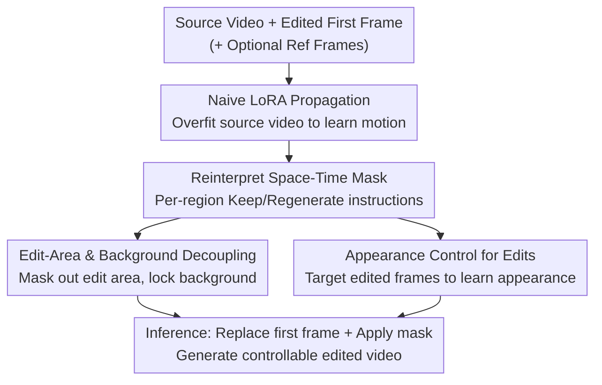

# Controllable First-Frame-Guided Video Editing via Mask-Aware LoRA Fine-Tuning

**Conference**: ICLR2026  
**OpenReview**: [https://openreview.net/forum?id=xkRMJ1Y7Um](https://openreview.net/forum?id=xkRMJ1Y7Um)  
**Code**: https://cjeen.github.io/LoRAEdit (Project page, including code and videos)  
**Area**: Video Editing / Diffusion Models / Image-to-Video (I2V)  
**Keywords**: Video Editing, First-Frame Guidance, Space-Time Mask, LoRA Fine-Tuning, I2V Diffusion Models

## TL;DR
This paper reinterprets the space-time mask in pre-trained Image-to-Video (I2V) models—originally used only for "preserving the first frame and generating subsequent frames"—as a spatially-varying "keep/regenerate" instruction. By combining this with LoRA fine-tuning on a single input video, the model learns the motion of the source video while capturing the target appearance from reference frames. This enables controllable propagation of "edit the first frame only" changes to the entire video, significantly outperforming AnyV2V, I2VEdit, and Go-with-the-Flow in first-frame-guided editing.

## Background & Motivation
**Background**: Video editing has advanced significantly with diffusion models, primarily following two paths. One involves generic editing models trained on large-scale conditional data (e.g., VACE), which are powerful but require massive data for each new edit type and suffer from instability with out-of-distribution samples. The other is "first-frame-guided editing" (AnyV2V, I2VEdit): users modify the first frame with any image tool, and an I2V motion-conditioned model "propagates" these changes to subsequent frames. This approach is flexible and not tied to specific datasets.

**Limitations of Prior Work**: While flexible, first-frame guidance offers almost no control over the evolution of subsequent frames. For instance, in a video of a blooming flower, a user can change the appearance of the flower in the first frame but cannot control "how it blooms." When an object rotates, the user cannot specify the content of previously occluded areas. Worse, changes in the first frame often "leak" into areas that should remain static, causing background leakage.

**Key Challenge**: A naive approach is to overfit the source video using LoRA to learn motion and propagate edits. However, a single generation path cannot distinguish between "areas to change" and "areas to preserve," nor can it guarantee controllable appearance for edited objects during motion or deformation—it must synthesize unseen appearances from scratch. The conflicting requirements of preserving the background and propagating edits compete within the same generation path.

**Goal**: Develop an editing framework that retains the flexibility of first-frame guidance while providing fine-grained control across the entire video, without altering model architectures or requiring large-scale training.

**Key Insight**: The authors noticed that recent I2V models, meant to use the first frame for guidance, receive a pseudo-video $V_{cond}$ and a binary space-time mask $M_{cond}$. Typically, this mask only functions temporally (first frame = 1 to preserve, others = 0 to generate). The insight is that this mask possesses significant **spatial control** potential and can be reinterpreted as a "per-region keep/regenerate instruction."

**Core Idea**: Use a spatially-varying space-time mask to "direct" LoRA fine-tuning. This both strengthens the model's execution of the mask commands and uses the mask to **determine what LoRA learns** (masking the edit area to learn motion; targeting reference frames to learn appearance). By decoupling motion and appearance, controllable editing of the entire video evolution is achieved.

## Method

### Overall Architecture
The input consists of a source video $V_{input}=[I_1,\dots,I_T]$ and a user-edited first frame $\tilde{I}_1$ (optionally with additional edited subsequent frames as references). The output is an edited video $\tilde{V}=[\tilde{I}_1,\dots,\tilde{I}_T]$ with the first-frame changes propagated controllably. The pipeline is built on a pre-trained I2V diffusion model (primarily Wan2.1-I2V 480P) **without architecture changes**, using only per-video LoRA fine-tuning in three steps: first, naive LoRA overfitting to learn source motion; second, revealing the spatial control potential of the I2V's built-in mask; finally, using "mask-aware LoRA" to configure masks into different forms to learn "edit-area/background decoupling" and "appearance control via reference frames." During inference, the edited first frame $\tilde{I}_1$ is used with the training-time mask configuration.

### Key Designs

**1. Naive LoRA Propagation: Building a Motion Foundation via Single-Video Overfitting**

To address the fundamental requirement that "edits must move consistently in subsequent frames," the authors first build a naive baseline. LoRA modules $\phi_\theta$ are inserted into the self-attention and cross-attention layers of the I2V model and optimized on a single input video $V_{input}$ to encode its motion patterns into the parameters. During training, the model is supervised to reconstruct the full video conditioned on the original first frame $I_1$ and a prompt $[p^*]+c$ (where $p^*$ is a special token and $c$ is a caption generated by Florence-2). The I2V's flow matching objective is used:

$$L_{flow}=\mathbb{E}_{t,x_0,x_1}\big[\|v_\theta(x_t,t;\,I_1,[p^*]+c)-(x_0-x_1)\|_2^2\big],\quad x_t=(1-t)x_1+tx_0$$

where $x_0\sim\mathcal{N}(0,I)$ is sampled noise, $x_1=E(V_{input})$ is the VAE latent of the source video, and $v_\theta$ is the LoRA-enhanced velocity prediction network. During inference, replacing $I_1$ with $\tilde{I}_1$ and $c$ with $\tilde{c}$ propagates the edit along the motion. While this ensures temporal consistency, it lacks control over "content"—what changes and what it becomes.

**2. Mask Reinterpretation: Transforming the "Preserve First Frame" Switch into Spatial Instructions**

To address the lack of regional control, the authors exploit the I2V model's internal conditional mechanism. These models receive a pseudo-video $V_{cond}\in\mathbb{R}^{C\times T\times H\times W}$ (concatenating the first frame with zero-filled frames) and a binary space-time mask $M_{cond}\in\{0,1\}^{1\times T\times h\times w}$, where 1 signifies "keep" and 0 signifies "generate." By replacing the pseudo-video with **actual video frames**, the mask—originally purely temporal—is redefined as a **flexible mechanism for per-region control across space and time.** They tested various mask configurations: "default" (preserving only the first frame) generates full motion; "all zeros" forces full appearance regeneration; "all ones" attempts to preserve everything but produces artifacts at motion discontinuities; "spatially-varying" (keep background, generate foreground) reveals the base model's inability to synthesize coherent foregrounds. The conclusion: vanilla I2V models handle frame-level instructions well but fail at fine-grained selective editing—a gap that LoRA can bridge by being "directed" by the mask during training.

**3. Edit-Area and Background Decoupling: Change the Foreground, Lock the Background**

Many edits only target small regions, creating a conflict where the edited area must evolve while the background remains static. Using a single generation path causes these targets to interfere. The authors separate them by carefully configuring the mask and conditional video during LoRA fine-tuning with a conditional flow matching loss:

$$L=\mathbb{E}_{t,x_0,x_1}\big[\|v_\theta(x_t,t;\,V_{cond},M_{cond},[p^*]+c)-(x_0-x_1)\|_2^2\big]$$

where $x_1=E(V_{target})$. Specifically, $M_{cond}$ is set to 1 for the entire first frame, while for subsequent frames, **unedited regions are set to 1 (keep) and edited regions are set to 0 (generate)**. $V_{cond}$ is cleared in mask-0 areas and preserved elsewhere. The training target $V_{target}$ is the input video itself. This forces the model to focus on generating the edited content while locking the unedited areas. During inference, the same $M_{cond}$ is used, but the first frame of $V_{cond}$ is updated to $\tilde{I}_1$. Interestingly, while pre-trained I2V models struggle with selective editing, **single-video LoRA training effectively learns an inpainting prior guided by the mask**, likely because DiT models treat inputs as tokens, making spatial mask adaptation natural.

**4. Appearance Control: Directing Evolution Appearance via Subsequent Reference Frames**

First-frame edits are rarely static; the edited region rotates, deforms, and follows a trajectory. When using only the first frame as a constraint, the appearance of the region in future states is under-determined, causing the edit to drift. The solution allows users to edit **any subsequent frame** as an appearance anchor. During LoRA fine-tuning, this edited frame serves as $V_{target}$. $V_{cond}$ uses the pre-edited frame with the edit region masked out, and $M_{cond}$ marks the background as 1 and the edit region as 0. If multiple edited frames are used, they are treated as **isolated static images** for training to prevent the model from hallucinating incorrect temporal dynamics between them, thereby decoupling appearance from motion. Unlike methods that feed edited frames at inference, here they "teach" the appearance to the model, which then generates content smoothly based on learned patterns and context even if masks are not perfectly aligned in time.

### Loss & Training
The standard I2V flow matching objective (Eq 1/2) is used. Training follows a two-stage process: first, 100 steps of "edit-area/background decoupling" on the input video; second, if subsequent reference frames exist, 100 additional steps of "appearance control." The learning rate is $1\times10^{-4}$. Videos are 49 frames at $832\times480$ or $480\times832$ resolution. A single sample requires ~20GB VRAM (the appendix provides memory reduction strategies). Masks are obtained via an automated workflow, specifically using **loose bounding-box masks** rather than pixel-perfect segmentation.

## Key Experimental Results

### Main Results
In first-frame-guided editing on the I2VEdit test set, the proposed method leads across three metrics: CLIP Score (alignment with the edited first frame), DeQA Score (image quality), and Input Similarity (frame-by-frame CLIP similarity with the input).

| Method | CLIP Score ↑ | DeQA Score ↑ | Input Similarity ↑ |
|------|------|------|------|
| AnyV2V | 0.8995 | 3.7348 | 0.7569 |
| Go-with-the-Flow | 0.9047 | 3.5622 | 0.7504 |
| I2VEdit | 0.9128 | 3.4480 | 0.7536 |
| **Ours** | **0.9172** | **3.8013** | **0.7608** |

In reference-guided editing, a user study with 35 participants ranked methods on motion consistency and background preservation (Average Rank, lower is better). The method significantly outperformed Kling1.6 and the 14B VACE model.

| Method | Motion Consistency ↓ | Background Preservation ↓ |
|------|------|------|
| Kling1.6 | 1.869 | 1.806 |
| VACE (14B) | 2.511 | 2.460 |
| **Ours** | **1.620** | **1.734** |

### Ablation Study

| Configuration | Key Finding | Explanation |
|------|---------|------|
| w/o FG-BG Mask | Global edit leakage | Changing hair color affects global lighting; masks restrict edits to the hair. |
| First frame only vs. + Ref frames | Ref frames enhance control | The first frame suffices for some edits, but additional frames provide consistent appearance evolution. |
| Tight vs. Noisy vs. BBox Masks | Pixel-perfect masks are restrictive | Tight masks force new objects into old contours; loose masks (including 7x7 noisy/BBox) allow natural detail. |

### Key Findings
- **Mask conditioning is vital for background preservation**: Its absence leads to global leakage (e.g., hair color change affecting overall lighting), while its presence locks edits to target regions.
- **"Loose masks" are counter-intuitively better**: Generative editing requires spatial "buffer" for contour changes. Tight masks over-constrain the model, whereas loose masks allow the model's strong prior to "heal" the boundary between the edit and the frozen background. This justifies using automated, approximate mask workflows.
- **Single-video LoRA learns effective inpainting priors** without requiring large-scale training.

## Highlights & Insights
- **Reinterpreting "Off-the-shelf" mechanisms**: The authors discovered that the temporal masks in I2V models function as per-region spatial switches, transforming them into fine-grained editing tools with zero architecture changes.
- **Directing LoRA via Masks**: Using the same LoRA fine-tuning but switching mask configurations (masking edits to learn motion vs. targeting reference frames to learn appearance) allows decoupling of motion and appearance—the most clever aspect of the work.
- **Insight on Loose Masks**: The finding that "pixel-perfect" segmentation is not always better contradicts standard intuition, suggesting that generative editing needs boundary buffers. This insight is applicable to other inpainting/editing tasks.
- Treating multiple edited frames as isolated static images to avoid hallucinated dynamics is a clean, effective trick.

## Limitations & Future Work
- The method depends on pre-trained bases like Wan2.1-I2V or HunyuanVideo-I2V, inheriting their inherent data biases and risks (e.g., deepfakes).
- **Per-video optimization (100+100 steps, ~20GB VRAM)**: Requires training for every video rather than feed-forward inference, limiting scalability and real-time use.
- Evaluation scale is relatively small (20 clips for first-frame, 35 people for user study). Quantitative metrics rely on proxies like CLIP/DeQA; there is a lack of rigorous temporal consistency metrics.
- Future work: Distilling per-video LoRA into one-shot feed-forward adapters or exploring shared mask-aware adapters to reduce costs.

## Related Work & Insights
- **vs. VACE / Large-scale conditional models**: VACE is powerful but costly to extend to new edit types and unstable out-of-distribution. This method avoids large training, using per-video LoRA for better background and identity preservation.
- **vs. AnyV2V / I2VEdit (First-frame guidance)**: These methods decouple editing into "edit + propagate" but lack explicit constraints. Propagation often dilutes edits or leaks into the background. This work uses **explicit space-time mask constraints** and supports subsequent frame anchors for finer control.
- **vs. Direct Edit-Frame Injection**: Since edited frames are used only during training to teach appearance, the method is more robust to temporal misalignment between the edit and the video context.

## Rating
- Novelty: ⭐⭐⭐⭐ Clever reinterpretation of I2V masks and use of masks to direct LoRA learning with zero architecture changes.
- Experimental Thoroughness: ⭐⭐⭐ Good comparisons and ablations, but the evaluation scale is small and lacks rigorous temporal consistency metrics.
- Writing Quality: ⭐⭐⭐⭐ Clear narrative following the three-step progress (Naive -> Mask potential -> Mask-aware LoRA).
- Value: ⭐⭐⭐⭐ Practical for creative tools as it avoids large-scale training, though per-video fine-tuning limits scalability.

## Related Papers

- [\[ICLR 2026\] Anchor Frame Bridging for Coherent First-Last Frame Video Generation](anchor_frame_bridging_for_coherent_first-last_frame_video_generation.md)
- [\[ICLR 2026\] DreamSwapV: Mask-guided Subject Swapping for Any Customized Video Editing](dreamswapv_mask-guided_subject_swapping_for_any_customized_video_editing.md)
- [\[CVPR 2026\] FFP-300K: Scaling First-Frame Propagation for Generalizable Video Editing](../../CVPR2026/video_generation/ffp-300k_scaling_first-frame_propagation_for_generalizable_video_editing.md)
- [\[ICLR 2026\] EditVerse: Unifying Image and Video Editing and Generation with In-Context Learning](editverse_unifying_image_and_video_editing_and_generation_with_in-context_learni.md)
- [\[ICML 2026\] MiVE: Multiscale Vision-language features for reference-guided video Editing](../../ICML2026/video_generation/mive_multiscale_vision-language_features_for_reference-guided_video_editing.md)

<!-- RELATED:END -->

<!-- RELATED:START -->

## Related Papers

- [\[ICLR 2026\] Anchor Frame Bridging for Coherent First-Last Frame Video Generation](anchor_frame_bridging_for_coherent_first-last_frame_video_generation.md)
- [\[ICLR 2026\] DreamSwapV: Mask-guided Subject Swapping for Any Customized Video Editing](dreamswapv_mask-guided_subject_swapping_for_any_customized_video_editing.md)
- [\[CVPR 2026\] FFP-300K: Scaling First-Frame Propagation for Generalizable Video Editing](../../CVPR2026/video_generation/ffp-300k_scaling_first-frame_propagation_for_generalizable_video_editing.md)
- [\[ICLR 2026\] MATRIX: Mask Track Alignment for Interaction-aware Video Generation](matrix_mask_track_alignment_for_interaction-aware_video_generation.md)
- [\[ICLR 2026\] Pixel-Perfect Puppetry: Precision-Guided Enhancement for Face Image and Video Editing](pixel-perfect_puppetry_precision-guided_enhancement_for_face_image_and_video_edi.md)

<!-- RELATED:END -->
