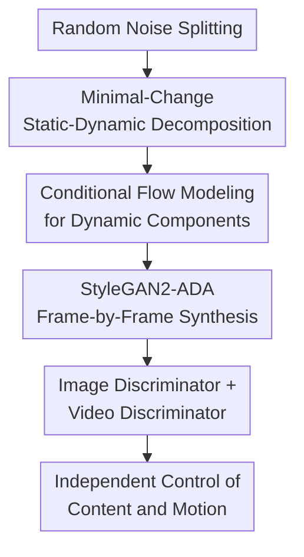

# Controllable Video Generation with Provable Disentanglement

**Conference**: ICLR2026  
**OpenReview**: [https://openreview.net/forum?id=OcLNKpcY4J](https://openreview.net/forum?id=OcLNKpcY4J)  
**Code**: To be confirmed  
**Area**: Video Generation / Controllable Video Generation  
**Keywords**: Controllable Video Generation, Representation Disentanglement, Identifiability, Temporal Dynamic Modeling, GAN

## TL;DR
This paper proposes CoVoGAN, which models static content variables and time-varying dynamic style variables separately. It provides identifiability guarantees through the principle of minimal change, sufficient change properties, and temporal conditional independence constraints, enabling more independent control over factors such as head movement, blinking, and camera displacement in video generation.

## Background & Motivation
**Background**: Video generation models have achieved high quality and temporal coherence. Mainstream approaches include GANs, VAEs, diffusion models, and large-scale text-to-video models. Many controllable video generation methods apply text, trajectories, poses, or other conditions directly to the entire video representation, treating the video as a unified 4D spatio-temporal block and relying on the model to learn which factors should change and which should remain static.

**Limitations of Prior Work**: Such holistic control often suffers from two issues. First, the control granularity is insufficient; for instance, when a user intends to turn a character's head to the right, the model might only partially complete the action or simultaneously alter the face shape, head size, or background details. Second, different motion factors tend to be coupled; adjusting blinking might affect head pose, or changing camera direction might impact scene content, leading to inconsistent semantics for the same latent dimension across different samples.

**Key Challenge**: True controllable video generation requires "modifying only the intended factors." However, observed training data consists only of pixel videos, while the underlying content factors, motion factors, and distinct concepts within motion are latent. Without identifiability conditions, a model may learn arbitrary mixtures of latent variables even if the generated distribution appears correct. Such a latent space might be manipulable on the surface but is unpredictable in practice.

**Goal**: The authors decompose the problem into two layers. The first is block-wise disentanglement, which separates the static content element $z^c$ from the dynamic style variables $z_t^s$ so that motion control does not damage identity or scene. The second is component-wise disentanglement, which further maps different dimensions of dynamic variables to distinct motion concepts, allowing for individual manipulation of factors like head movement, blinking, and camera translation.

**Key Insight**: The paper adopts the perspective of "identifiability" from nonlinear ICA and temporal causal representation learning. The authors argue that videos naturally possess temporal structure: content remains relatively invariant within a video clip while dynamic factors evolve over time. If a model restricts the dimensions of dynamic variables and ensures dynamic components are conditionally independent given their history, it becomes possible to recover the true generative factors from observed videos.

**Core Idea**: A Temporal Transition Module is used to explicitly generate "static content + conditionally independent dynamic styles," which is then embedded as a plugin into the StyleGAN2-ADA generator. By constraining the latent variable structure through theoretical assumptions, controllable video generation is advanced from empirical disentanglement to disentanglement based on identifiability.

## Method
### Overall Architecture
The generation process of CoVoGAN starts with random noise, which is first split into static content noise and dynamic noise for each time step. The Temporal Transition Module then generates the content variable $z^c$ and dynamic style variables $z_t^s$. For each frame, the concatenated $z_t = z^c \oplus z_t^s$ enters a StyleGAN2-ADA-style synthesis network to generate image frames. During training, an image discriminator ensures single-frame quality, while a video discriminator constrains the distribution of the entire video sequence.

The key to this framework is that the content variable handles information that is invariant across frames, while dynamic variables handle information that changes over time; within the dynamic variables, components are made conditionally independent through GRU historical states and component-wise flow. Consequently, the model does not search for control directions by chance in a mixed latent space but instead structurally incorporates "invariant content, variable motion, and separable motion components" into the generator.

### Key Designs
**1. Minimal-Change Static-Dynamic Decomposition: Ensuring No Mutual Contamination**

The paper formalizes the video generation process where, given a video $V=\{x_1,x_2,\ldots,x_T\}$, each frame is generated by a nonlinear mixing function: $x_t = g(z_t^s, z^c)$. Here, $z^c$ represents the content elements that remain basically unchanged, such as identity, scene, and object appearance, while $z_t^s$ represents style dynamics that change over time, such as head pose, eye closure, and camera movement. The dynamic variables themselves originate from a causal process with time-lagged parent nodes, formally $z_{t,i}^s=f_i^s(Pa(z_{t,i}^s),\epsilon_{t,i}^s)$.

"Minimal change" here corresponds to a low-dimensional dynamic representation in identifiability theorems. If a small-dimensional $z_t^s$ can already achieve observational equivalence between the generated and real video distributions, there is no need to cram static information into dynamic variables. Theoretically, under assumptions of positive density, injectivity of linear operators, and weak monotonicity, observational equivalence leads to block-wise identifiability of content and dynamic subspaces. In practice, the authors choose a smaller dimension for dynamic variables to encourage the model to place only truly changing factors into $z_t^s$.

**2. Conditional Flow Modeling for Dynamic Components: Splitting Motion Concepts into Dimensions**

Separating content and motion is not enough, as "motion" itself can be a mixture. CoVoGAN aggregates historical information $h_t$ using a GRU and models each dynamic dimension separately using Deep Sigmoid Flow: $h_t = GRU(h_{t-1},\epsilon_{t-1}^s)$, $z_{t,i}^s = DSF_i(\epsilon_{t,i}^s;h_{t-1})$. Since each $DSF_i$ processes an independent noise component conditioned on the historical state, the dynamic components remain mutually independent given the history.

This step corresponds to the component-wise identifiability in the paper. The authors require the dynamic distribution to have "sufficient changes," meaning the variations of dynamic variables under different historical conditions are rich enough. Simultaneously, they require the learned $\hat z_t^s$ to be independent of $\hat z^c$, and dimensions of $\hat z_t^s$ to be conditionally independent given $\hat z_{t-1}^s$. Under these conditions, each true dynamic component corresponds to at most one learned dynamic component, with remaining uncertainties being permutations and element-wise invertible transformations. Intuitively, the model may not know that "the 3rd dimension must be called blinking," but it should learn that one particular dimension stably controls blinking without mixing it with head rotation or identity.

**3. StyleGAN2-ADA Plugin Implementation: Implementing Theoretical Constraints in a Trainable Generator**

Instead of redesigning a complete generator, the authors attach the Temporal Transition Module to the front of StyleGAN2-ADA. Static noise $\epsilon^c$ passes through an MLP to obtain $z^c$; the dynamic noise sequence $\epsilon_1^s,\ldots,\epsilon_T^s$ passes through the GRU and component-wise flow to obtain $z_1^s,\ldots,z_T^s$. At each time step, these are concatenated into $z_t$ and fed into the mapping network to produce $w(z_t)\in\mathcal W$, and finally into the synthesis network to generate the $t$-th frame.

This design leverages the image synthesis capabilities of StyleGAN2-ADA while handling the temporal structure of the video in the latent variable transition. The gating mechanism of the GRU automatically filters irrelevant history, suitable for dynamic processes with unknown time lags; the component-wise flow preserves information from noise to dynamic variables, making "sufficient changes" easier to achieve. Compared to using a standard MLP or RNN, this module directly corresponds to the conditional independence and history-dependence conditions in the paper’s theorems.

**4. Video Discriminator and Mutual Information Constraints: Serving Real Video Distribution**

Identifiability is discussed under the premise of observational equivalence, meaning the generated distribution must match the real data distribution. Consequently, CoVoGAN retains the image discriminator $D_I$ from StyleGAN2-ADA for single-frame quality and adds a video discriminator $D_V$ to judge the spatio-temporal consistency of the entire video. The video discriminator handles spatio-temporal output through channel-wise concatenation of activations at different resolutions.

Furthermore, a term for maximizing the mutual information between the dynamic variables $z_t^s$ and the intermediate layer outputs of the video discriminator is added to the training objective. Similar to InfoGAN, if a dynamic latent variable truly corresponds to an interpretable motion, it should leave information in the spatio-temporal features learned by the video discriminator. While the mutual information term does not independently guarantee disentanglement, it encourages dynamic variables to carry more usable and structured motion information.

### Loss & Training
The training objective consists of three parts. The first is the original image-level adversarial loss of StyleGAN2-ADA to ensure each frame looks realistic. The second is the video discriminator loss, which constrains the joint distribution $p(V)$ of the generated video, acting as a practical approximation of "observational equivalence" in the theoretical analysis. The third is the mutual information maximization term, encouraging a predictable relationship between dynamic latent variables and video-level features.

Implementation-wise, the authors train or evaluate on four real-world video datasets: FaceForensics, SkyTimelapse, RealEstate, and CelebV-HQ. FaceForensics, SkyTimelapse, and RealEstate use $256\times256$ videos, while CelebV-HQ uses $512\times512$ videos. Evaluation considers both generation quality and disentangled control. Quality metrics are primarily FVD8 and FVD16; disentanglement metrics include MCC, SAP, and Modularity. For FaceForensics, semantic attributes like eye size, mouth size, head position, and head angle are extracted using Dlib as evaluation signals.

## Key Experimental Results
### Main Results
The paper first compares video generation quality. CoVoGAN achieves optimal or near-optimal FVD across multiple datasets, with significant advantages over StyleGAN-V and MoStGAN-V on RealEstate and CelebV-HQ. Note that FVD only measures distribution quality and is not directly equivalent to controllability; thus, the authors separately compared latent space manipulation and disentanglement metrics.

| Dataset | Metric | CoVoGAN | Prev. SOTA Baseline | Gain |
|--------|------|---------|--------------|------|
| FaceForensics | FVD8 ↓ | 43.75 | 45.49 (Latte) | -1.74 |
| FaceForensics | FVD16 ↓ | 48.80 | 49.02 (Latte) | -0.22 |
| SkyTimelapse | FVD8 ↓ | 35.58 | 40.21 (Latte) | -4.63 |
| SkyTimelapse | FVD16 ↓ | 46.51 | 41.84 (Latte) | +4.67 (Ours slightly weaker) |
| RealEstate | FVD8 ↓ | 154.88 | 182.86 (DIGAN) | -27.98 |
| RealEstate | FVD16 ↓ | 174.87 | 178.27 (DIGAN) | -3.40 |
| CelebV-HQ | FVD16 ↓ | 97.16 | 127.62 (MoStGAN-V) | -30.46 |

In disentanglement metrics, the advantage of CoVoGAN is more consistent. On FaceForensics, the authors extract facial semantic attributes and compare latent representations of StyleGAN-V, MoStGAN-V, LVDM, Latte, and CoVoGAN. Since diffusion models lack compact latent representations, PCA is used to reduce high-dimensional latents to 128 dimensions before calculating metrics; CoVoGAN uses dynamic variables $z_t^s$ directly.

| Method | MCC (%) ↑ | SAP (%) ↑ | Modularity (%) ↑ | Description |
|------|-----------|-----------|-------------------|------|
| StyleGAN-V | 29.00 | 4.25 | 7.66 | Has motion code, but limited semantic consistency |
| MoStGAN-V | 27.95 | 5.90 | 13.48 | Good modularity, moderate MCC |
| LVDM | 21.60 | 0.72 | 7.25 | Weak disentanglement after PCA on high-dim latent |
| Latte | 20.87 | 0.75 | 7.44 | Strong generation quality, weak interpretable control |
| CoVoGAN | 33.78 | 8.48 | 17.37 | Highest across all three disentanglement metrics |

### Ablation Study
The ablation study focuses on validating the two core components of the Temporal Transition Module: GRU history modeling and component-wise flow. The authors compare full CoVoGAN, a version without GRU, and a version without flow on FaceForensics.

| Config | FVD16 ↓ | MCC (%) ↑ | SAP (%) ↑ | Modularity (%) ↑ | Description |
|------|---------|-----------|-----------|-------------------|------|
| CoVoGAN | 48.80 | 33.78 | 8.48 | 17.37 | Full Model |
| w/o GRU | 53.68 | 26.59 | 7.25 | 12.40 | History selection ability drops with non-gated structure |
| w/o flow | 82.81 | 8.22 | 0.55 | 10.24 | Conditional independence/sufficient change impaired by FC-MLP |

### Key Findings
- CoVoGAN performs stably across multiple datasets (FaceForensics, SkyTimelapse, RealEstate, CelebV-HQ), indicating the general effectiveness of the Temporal Transition Module for different video dynamics.
- Removing the component-wise flow results in the greatest performance loss (FVD16 from 48.80 to 82.81, MCC from 33.78 to 8.22), confirming that "component-wise conditional flow" is the core implementation for separable motion concepts.
- Removing the GRU also degrades performance, but less than removing the flow, suggesting that gated history modeling primarily helps find valid time-lagged parent variables, while flow directly determines the independence of dynamic components.
- Qualitative results show that the same dynamic dimension produces similar head pose changes across different identities; further adjusting another dimension can overlay blinking or nodding, indicating the model learns motion semantics consistent across identities rather than sample-specific editing directions.
- Latte performs better on FVD16 for SkyTimelapse, reminding readers that the primary selling point of CoVoGAN is not to completely surpass large diffusion models in visual quality, but to provide structural advantages in controllability, interpretability, and provable disentanglement.

## Highlights & Insights
- Framing "why controllable video generation is difficult" as a latent variable identifiability problem is the most valuable perspective of this paper. It moves beyond an empirical motion/content split to ask: under what conditions is such a split theoretically significant?
- The design of the Temporal Transition Module closely aligns with theoretical conditions. Low-dimensional dynamic variables correspond to minimal change, GRU to history dependency, component-wise flow to conditional independence given history, and the video discriminator to observational distribution matching.
- The paper explains why earlier methods splitting video into identity and motion were sometimes effective. As long as content remains invariant, dynamic dimensions are small enough, and changes are sufficiently rich, block-wise identifiability may hold.
- This work is inspiring for "controllable generation": control interfaces do not necessarily rely on stacking external conditions; they can also be built by first disentangling causal factors in the generation process and then performing stable control in the latent space.
- It offers insights for future video diffusion models. Although implemented on a GAN, the Temporal Transition Module acts as a latent transition plugin that could theoretically be ported to higher-fidelity latent video diffusion or transformer-based generators.

## Limitations & Future Work
- The base generator remains a StyleGAN2-ADA style model, whose visual upper bound and open-domain generalization are inferior to current large-scale video diffusion models. The authors acknowledge that integrating this framework into higher-fidelity architectures is a future direction.
- Theoretical guarantees rely on a set of strong but reasonable assumptions (e.g., positive density, sufficient change, and observational equivalence). In real-world training, these can only be approximated, so "provable disentanglement" provides a structural guarantee rather than a absolute result for any data.
- Experiments primarily validate structured scenarios (faces, sky timelapses, real estate). For complex human-object interactions or long-term narratives, dynamic factors may not be covered by a few low-dimensional variables.
- Current control still relies on latent dimension manipulation, which is not intuitive for average users. Future work could align identifiable dynamic dimensions with text, trajectories, or poses to make the "provably disentangled" latent space a more usable interface.
- Disentanglement metrics mainly rely on face attributes on FaceForensics; semantic control on other datasets largely depends on qualitative demonstration. More systematic validation requires richer video semantic annotations.

## Related Work & Insights
- **vs StyleGAN-V / MoStGAN-V**: These methods provide video latent spaces and motion control but rely more on empirical architectural modeling. CoVoGAN differs by explicitly proposing a static-dynamic generation process and using identifiability theorems to explain when content and motion can be separated.
- **vs MoCoGAN-HD / DIGAN**: These emphasize content-motion decomposition or generative modeling with implicit neural representations. CoVoGAN shares their intuition but further requires dynamic components to be conditionally independent given history, supporting finer-grained component-wise control.
- **vs LVDM / Latte etc.**: Diffusion models typically provide higher visual quality, but their latent spaces are high-dimensional and difficult to map to interpretable factors. CoVoGAN's advantage lies in compact, interpretable, and manipulable dynamic latents.
- **vs Nonlinear ICA / Temporal Causal Representation Learning**: The paper translates tools from these fields (sufficient change, conditional independence) into video generator structures. It suggests that controllability can be derived from more rigorous conditions in causal representation learning.

## Rating
- Novelty: ⭐⭐⭐⭐⭐ Systematically introduces identifiability theory to controllable video generation with two layers of disentanglement guarantees.
- Experimental Thoroughness: ⭐⭐⭐⭐ Spans four datasets and multiple baselines; however, fine-grained semantic metrics are limited to face data.
- Writing Quality: ⭐⭐⭐⭐ Clear correspondence between theory, architecture, and experiments, though the theorem section has a high barrier for non-causal researchers.
- Value: ⭐⭐⭐⭐⭐ Provides a more solid explanatory framework than simple "prompt/latent tuning," offering significant reference value for future interpretable and controllable video models.

<!-- RELATED:START -->

## Related Papers

- [\[ICLR 2026\] MAGREF: Masked Guidance for Any-Reference Video Generation with Subject Disentanglement](magref_masked_guidance_for_any-reference_video_generation_with_subject_disentang.md)
- [\[CVPR 2025\] ConMo: Controllable Motion Disentanglement and Recomposition for Zero-Shot Motion Transfer](../../CVPR2025/video_generation/conmo_controllable_motion_disentanglement_and_recomposition_for_zero-shot_motion.md)
- [\[CVPR 2026\] PerformRecast: Expression and Head Pose Disentanglement for Portrait Video Editing](../../CVPR2026/video_generation/performrecast_expression_and_head_pose_disentanglement_for_portrait_video_editin.md)
- [\[AAAI 2026\] OmniVDiff: Omni Controllable Video Diffusion for Generation and Understanding](../../AAAI2026/video_generation/omnivdiff_omni_controllable_video_diffusion_for_generation_and_understanding.md)
- [\[ICLR 2026\] 3D Scene Prompting for Scene-Consistent Camera-Controllable Video Generation](3d_scene_prompting_for_scene-consistent_camera-controllable_video_generation.md)

<!-- RELATED:END -->
