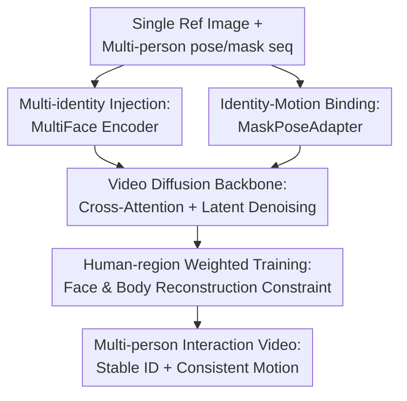

# DanceTogether: Generating Interactive Multi-Person Video without Identity Drifting

**Conference**: ICLR2026  
**OpenReview**: [https://openreview.net/forum?id=7VEECFBzmm](https://openreview.net/forum?id=7VEECFBzmm)  
**Code**: TBD  
**Area**: Video Generation / Controllable Character Animation / Multi-person Interaction  
**Keywords**: Multi-person video generation, Identity preservation, Pose control, MaskPoseAdapter, Interaction consistency

## TL;DR
DanceTogether generates long-duration multi-person interactive videos using a single reference image and individual pose-mask sequences per actor. The core mechanism continuously binds "who the person is" with "how the person moves" during the diffusion denoising process, significantly mitigating identity drifting during character swaps, occlusions, and physical contact.

## Background & Motivation
**Background**: Controllable character video generation has achieved stable results in single-person dancing, pose transfer, and image-to-video animation. Prevailing methods typically provide a reference image of a person and use frame-wise poses, human masks, text, or trajectories as conditions for a diffusion model to generate video matching the control signals. Methods like StableAnimator, AnimateAnyone, and HumanVid share a common premise: identity is extracted from the reference image, motion is extracted from pose conditions, and the video backbone fuses them into temporally continuous frames.

**Limitations of Prior Work**: This setup fails significantly in multi-person interactions. When two people hold hands, cross, occlude, or swap positions, pose keypoints themselves do not carry reliable identity information. If the model only processes pose stream 1 and stream 2, it easily misapplies the textures/face of subject A onto subject B after spatial position shifts. Conversely, human masks can reliably inform the model that "this region belongs to a specific tracked person," but masks lack skeleton, limb orientation, and motion semantics; using them alone results in coarse motion control.

**Key Challenge**: The difficulty in multi-person interactive video is not merely "more complex poses," but the inherent separation of identity and motion cues. Poses dictate "how to move" but lose track of "who is moving" during occlusion and swapping; tracking masks dictate "who occupies where" but lack fine structures of arms, legs, and body posture. Merely concatenating these conditions at the input or applying temporal smoothing post-generation cannot guarantee that identity and motion remain bound at each denoising step.

**Goal**: Ours aims to generate long-duration interactive videos involving two or more characters from a single reference image, satisfying four requirements: distinct identities per person, motion following independent pose control, coherent interaction during occlusion/swapping, and high visual quality despite multi-person conditions. The paper further constructs training data and evaluation benchmarks to advance this problem into a systematically comparable task.

**Key Insight**: DanceTogether observes that multi-person generation requires explicit, persistent identity-motion binding. Rather than treating pose, mask, and face embeddings as loose conditions, the authors decouple identity and motion then re-couple them at the feature layer via MaskPoseAdapter and MultiFace Encoder. This allows the diffusion UNet to access "person $i$'s identity token" and its corresponding "pose-mask condition" during every denoising step.

**Core Idea**: Use tracking masks to stabilize "who," pose heatmaps to express "how to move," and bind them into a unified condition using gated fusion and cross-person attention, resolving identity drifting and appearance crosstalk in multi-person interaction video generation.

## Method

### Overall Architecture
The input to DanceTogether is a reference image containing multiple people, along with independent pose, human mask, and face mask sequences for each. The output is a multi-person interactive video. The backbone inherits a latent video diffusion structure (StableAnimator / Stable Video Diffusion style), extending the single-person conditional injection into three synergistic paths: MultiFace Encoder extracts identity tokens per person, MaskPoseAdapter fuses individual poses and masks into identity-motion bound conditions, and the Video Diffusion UNet generates frames in latent space.

Implementation-wise, the reference image is encoded via VAE and replicated temporally; ground truth video frames are also encoded during training. CLIP image encoders provide global visual semantics, and ArcFace provides 512-dimensional identity vectors per person. MultiFace Encoder transforms each ArcFace vector into identity tokens readable by UNet cross-attention. MaskPoseAdapter processes pose maps and tracking masks, outputting control features at the same resolution as the video latent. Finally, these conditions are injected via cross-attention and element-wise addition.

### Key Designs
**1. Multi-identity Injection: Allowing UNet to Remember Each Actor Simultaneously**

Single-person animation typically requires one face embedding, but in dual-person interaction, "taking only the largest face" discards the other identity. MultiFace Encoder extracts ArcFace embeddings $e_i^{id}\in\mathbb{R}^{512}$ for each person, projects them into $K=4$ identity tokens of width $768$ via a shared MLP, and refines them using CLIP image embeddings through 4 FacePerceiver layers. All tokens are concatenated into $T\in\mathbb{R}^{B\times NK\times D}$ and fed into the UNet cross-attention layers.

The key is avoiding the compression of multiple identity conditions into a single hybrid vector. By retaining independent tokens, the UNet can selectively read identity information while generating local regions. The FacePerceiver aligns identity tokens with global visual semantics, reducing the distribution gap between ArcFace and CLIP features. Ours also adopts the distribution-aware ID Adapter from StableAnimator, aligning the face branch mean and variance to the image branch: $\tilde h_{face}=\frac{h_{face}-\mu_{face}}{\sigma_{face}}\sigma_{img}+\mu_{img}$.

**2. Identity-Motion Binding: Merging "Who" and "How" via MaskPoseAdapter**

Pose keypoints are prone to error during occlusion and swapping: skeletons may cross, or keypoints may be lost, making it hard for the model to distinguish which motion belongs to which identity. MaskPoseAdapter utilizes independent branches with shared weights: PoseNet encodes RGB pose maps into $f_i^{pose}\in\mathbb{R}^{320\times64\times64}$, while a lightweight mask processor compresses human/face masks into 3-channel $f_i^{mask}$. Per-pixel gates then adjust the reliability of pose and mask, biased towards pose semantics with $\lambda\approx0.8$: $f_i=\lambda w_i^{pose}\odot f_i^{pose}+(1-\lambda)w_i^{mask}\odot f_i^{mask}+residual$.

This gated fusion addresses the trade-off: pose has strong semantics but weak identity, while masks provide identity stability but weak motion. After fusion, the model perceives "person $i$ moving with this pose at this location" rather than a set of disjoint pose and mask maps.

**3. Cross-person Attention: Dynamic Weighting during Occlusion and Swapping**

Multi-person interaction is not just the sum of single animations. When characters overlap, condition reliability varies across the foreground, background, and contact areas. Direct summation would mix conflicting features. Ours applies LayerNorm to each individual fusion feature $f_i$, concatenates them, and uses a lightweight network to predict cross-person attention logits. A softmax with learnable temperature $\tau$ yields $\alpha_{att}$: $\alpha_{att}=softmax(\phi([LN(f_1),...,LN(f_N)])/\tau)$.

The final control feature is $F=0.95\cdot Conv_{1\times1}(\sum_i\alpha_{att,i}\odot f_i)+0.05\cdot\frac{1}{N}\sum_i f_i$. The 0.95 branch emphasizes reliable character conditions based on spatial relationships, while the 0.05 residual mean preserves weak information to prevent subjects from being erased.

**4. Human-region Weighted Training: Focusing Capacity on Drift-prone Areas**

The training objective remains diffusion reconstruction, but Ours explicitly incorporates individual body and face masks into the loss. Masks are downsampled to $64\times64$, and $1+M_i^{body}+2M_i^{face}$ is used as the region weight: $L_{rec}=\sum_i\mathbb{E}_{\epsilon\sim\mathcal{N}(0,1)}\|(z_{gt}-z_\epsilon)\odot(1+M_i^{body}+2M_i^{face})\|_2^2$.

This tells the model the background can be relatively loose, but person bodies and especially faces must be precise. Identity drifting is most perceptible on faces and garment textures; the weighted loss focuses training error on these regions.

### Mechanism Example
Consider a reference image of two figure skaters: a man in black and a woman in white. The control signal spans 16 frames: parallel skating (fr. 1-6), occlusion (fr. 7-11), and swapping positions (fr. 12-16). A traditional pose-only model might extend white dress textures to the foreground skater during occlusion at frame 8. After swapping at frame 12, it might assume "the person on the left" is the original identity, causing a swap.

DanceTogether tracks two identity threads. MultiFace Encoder turns each skater into identity tokens. At frame 8, even if pose keypoints are missing, the mask still indicates the occluded region. Cross-person attention adjusts contributions based on overlap. At frame 12, the model follows the binding of "identity token + tracking mask + pose" rather than raw screen position, ensuring textures follow the correct character trajectories.

### Loss & Training
The model initializes weights from StableAnimator. It first learns identity preservation and animation on large-scale single-person data, then transfers weights to the MaskPoseAdapter and MultiFace Encoder for fine-tuning on multi-person data. Training utilized 8 NVIDIA A100 80G GPUs, batch size 1 per card, and a learning rate of $1e^{-5}$ for 20 epochs.

Data is critical. The authors aggregated single-person data (TikTokDataset, Champ, etc.) and dual-person data (Swing Dance, Harmony4D, Beyond Talking, and the self-built PairFS-4K). For $N$ people, MaskPoseAdapter replicates the shared weight branch. Single-person clips activate one branch, dual-person two, and multi-person all, ensuring architecture scalability without extra losses.

## Key Experimental Results

### Main Results
TogetherVideoBench evaluates three axes: Identity-Consistency, Interaction-Coherence, and Video Quality. The core test set, DanceTogEval-100, includes 100 unseen interaction videos (boxing, skating, hugging, etc.).

| Dimension | Metric | Ours (Best) | Prev. SOTA | Gain |
| :--- | :--- | :--- | :--- | :--- |
| ID Consistency | HOTA↑ | 83.94 | 71.35 (StableAnimator + Dataswing) | +12.59 |
| ID Consistency | IDF1↑ | 89.59 | 82.53 | +7.06 |
| Interaction | MPJPE2D↓ | 492.24 | 1555.16 | ~68% Decr. |
| Interaction | OKS↑ | 0.83 | 0.70 | +0.13 |
| Interaction | PoseSSIM↑ | 0.93 | 0.84 | +0.09 |
| Video Quality | Full-frame FVD↓ | 76.3 | 78.8 | -2.5 |
| Human Quality | Masked FVD↓ | 17.1 | 29.0 | -11.9 |
| Human Quality | Masked FID↓ | 48.0 | 66.7 | -18.7 |

ID consistency shows the most significant gain: even with additional fine-tuning on interaction data, StableAnimator is outperformed by DanceTogether (HOTA 83.94). MPJPE2D drops from 1555.16 to 492.24, indicating generated videos adhere much closer to pose controls.

### Ablation Study
| Configuration | HOTA↑ | IDF1↑ | MPJPE2D↓ | OKS↑ | FVD↓ | C-FID↓ | Description |
| :--- | :--- | :--- | :--- | :--- | :--- | :--- | :--- |
| w/o mask input | 33.63 | 42.49 | 1625.04 | 0.28 | 40.4 | 14.7 | ID positioning collapses without mask |
| w/o pose input | 81.48 | 86.38 | 1292.33 | 0.46 | 19.7 | 9.4 | ID stable but motion following fails |
| w/o MaskPoseAdapter | 48.95 | 62.02 | 1692.55 | 0.48 | 41.3 | 14.2 | PoseNet alone cannot bind multi-ID |
| w/ SimpleFusion | 58.23 | 65.71 | 1487.26 | 0.39 | 31.2 | 12.4 | Direct sum fails occlusion/swapping |
| Ours (Full) | 83.94 | 89.59 | 492.24 | 0.83 | 17.1 | 7.9 | Full model performance |

### Key Findings
- **Mask input is the backbone of ID consistency.** Removing it drops HOTA from 83.94 to 33.63, proving poses alone cannot distinguish identities during swapping.
- **Pose input is the backbone of motion control.** Removing it keeps HOTA relatively high (81.48), but MPJPE2D and OKS degrade sharply, showing masks cannot replace skeletal semantics.
- **MaskPoseAdapter is superior to simple fusion.** SimpleFusion significantly lags behind, proving that gated fusion and cross-person attention are necessary to handle occlusions.
- **PairFS-4K provides substantial gains.** Adding the high-quality skating data (including synchronization and lifting) further lowered MPJPE2D to 492.24.
- **Inference speed remains practical.** Ours runs at 0.88 fps, nearly identical to StableAnimator (0.89 fps) and significantly faster than UniAnimate-DiT (0.03 fps).

## Highlights & Insights
- **Redefining multi-person generation as an identity-motion binding problem**: The paper identifies separate handling of "who" and "how" as the root cause of failure, leading to a closed-loop design in architecture, data, and evaluation.
- **MaskPoseAdapter as a reusable control paradigm**: Gated fusion of stable-but-weak masks and strong-but-weak poses can be transferred to tasks like virtual try-on or HRI simulation.
- **Value of benchmarks over visual demos**: TogetherVideoBench uses HOTA/IDF1 for identity and MPJPE2D/OKS for interaction, reflecting failures more accurately than traditional full-frame FVD.
- **Data pipeline fills a gap**: PairFS-4K is not just more data, but interaction-structured data covering synchronization, occlusion, and relative movement.
- **Human-Robot Interaction (HRI) transfer**: Fine-tuning on HumanRob-300 demos adaptability for embodied AI simulation beyond purely human dance.

## Limitations & Future Work
- **Dependency on high-quality control signals**: Requires independent person pose/mask sequences. Errors in upstream tracking or segmentation will propagate.
- **Focus on dual-person scenarios**: Although it supports $N$ people, the benchmark and PairFS-4K are dual-person heavy. Performance in crowded scenes with $3+$ people requires more evidence.
- **Speed**: 0.88 fps is suitable for offline production but slow for real-time HRI. Potential acceleration via distillation or rectified flow.
- **Physical contact constraints**: Lacks explicit physics/dynamics. Lifting or wrestling may still suffer from hand interpenetration; future work could integrate contact maps or 3D body priors.

## Related Work & Insights
- **vs StableAnimator**: Inherits its backbone but extends condition injection for multi-person support; requires per-person mask/pose.
- **vs AnimateAnyone / Champ**: These focus on single-person 3D/SMPL guidance. DanceTogether's explicit identity-motion binding handles the "texture swapping" problem they face in interactions.
- **vs Multi-HumanVid / EverybodyDance**: Ours emphasizes identity binding within every denoising step and cross-person attention, rather than relying on external ID matching or coarse positioning.

## Rating
- Novelty: ⭐⭐⭐⭐☆ Targeting identity-motion binding in interaction is insightful; however, the framework relies heavily on existing diffusion backbones (StableAnimator/SVD).
- Experimental Thoroughness: ⭐⭐⭐⭐⭐ Comprehensive three-track benchmark, multiple ablations, and HRI transfer demonstrations.
- Writing Quality: ⭐⭐⭐⭐☆ Clear logic; some module details are best understood alongside the provided figures.
- Value: ⭐⭐⭐⭐⭐ Addresses a significant pain point in content creation and embodied AI with a complete package of method, data, and metrics.

## Related Papers

- [\[CVPR 2026\] PLACID: Identity-Preserving Multi-Object Compositing via Video Diffusion with Synthetic Trajectories](../../CVPR2026/video_generation/placid_identity-preserving_multi-object_compositing_via_video_diffusion_with_syn.md)
- [\[ICLR 2026\] EgoTwin: Dreaming Body and View in First Person](egotwin_dreaming_body_and_view_in_first_person.md)
- [\[ICLR 2026\] ReactID: Synchronizing Realistic Actions and Identity in Personalized Video Generation](reactid_synchronizing_realistic_actions_and_identity_in_personalized_video_gener.md)
- [\[ICCV 2025\] Multi-identity Human Image Animation with Structural Video Diffusion](../../ICCV2025/video_generation/multi-identity_human_image_animation_with_structural_video_diffusion.md)
- [\[ICLR 2026\] ConsisDrive: Identity-Preserving Driving World Models for Video Generation by Instance Mask](consisdrive_identity-preserving_driving_world_models_for_video_generation_by_ins.md)

<!-- RELATED:END -->

<!-- RELATED:START -->

## Related Papers

- [\[ICLR 2026\] EgoTwin: Dreaming Body and View in First Person](egotwin_dreaming_body_and_view_in_first_person.md)
- [\[ICLR 2026\] Streaming Drag-Oriented Interactive Video Manipulation: Drag Anything, Anytime!](streaming_drag-oriented_interactive_video_manipulation_drag_anything_anytime.md)
- [\[ICLR 2026\] TS-Attn: Temporal-wise Separable Attention for Multi-Event Video Generation](ts-attn_temporal-wise_separable_attention_for_multi-event_video_generation.md)
- [\[ICLR 2026\] LongLive: Real-time Interactive Long Video Generation](longlive_real-time_interactive_long_video_generation.md)
- [\[ICLR 2026\] ReactID: Synchronizing Realistic Actions and Identity in Personalized Video Generation](reactid_synchronizing_realistic_actions_and_identity_in_personalized_video_gener.md)

<!-- RELATED:END -->
