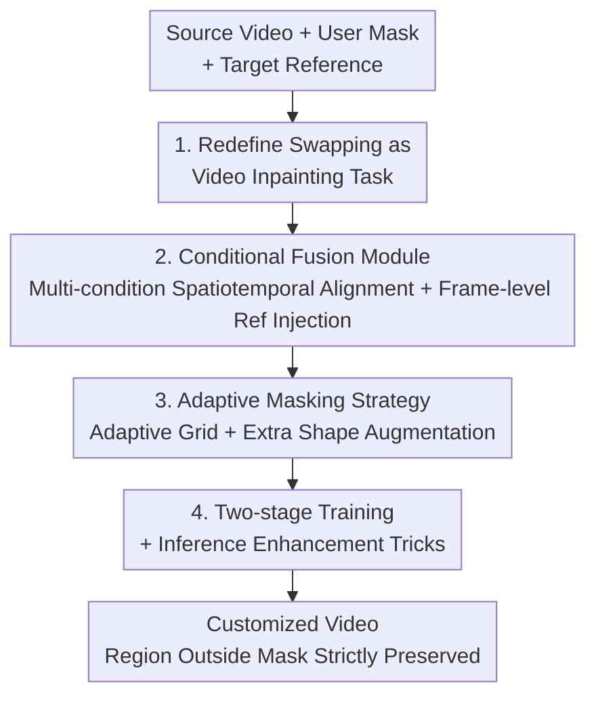

# DreamSwapV: Mask-guided Subject Swapping for Any Customized Video Editing

**Conference**: ICLR2026  
**OpenReview**: [https://openreview.net/forum?id=xH0pSRWbFi](https://openreview.net/forum?id=xH0pSRWbFi)  
**Code**: To be confirmed  
**Area**: Video Generation / Video Editing  
**Keywords**: Video Subject Swapping, Mask-guided, Video Inpainting, Conditional Fusion, Diffusion Transformer

## TL;DR
DreamSwapV redefines "video subject swapping" as a **mask-guided video inpainting** task. Given a source video, a mask designating the object to be replaced, and a reference image of the target subject, the model performs end-to-end swapping of any subject with any new target. This is achieved through a conditional fusion module and an adaptive masking strategy for fine-grained control and natural subject-environment interaction. It outperforms VACE, HunyuanCustom, and commercial models like Kling 1.6 on the newly established DreamSwapV-Benchmark.

## Background & Motivation
**Background**: As video generation technologies (especially Diffusion Transformers, DiT) mature, the demand for "customized video editing" has surged. Among these, "subject swapping"—replacing a specific person or object in a video with a user-specified target while preserving original motion trajectories and scene interactions—is one of the most frequent and challenging requirements.

**Limitations of Prior Work**: Existing methods either have a **narrow domain** or **convoluted injection methods**. Domain-specific methods like MagicAnimate or Animate Anyone 2 are restricted to human bodies. Human-Object Interaction (HOI) methods like AnchorCrafter or DreamActor-H1 serve only handheld objects in live-streaming or e-commerce contexts and lack generalization. General video editing methods also have flaws: (1) Tuning-free methods (e.g., AnyV2V) rely on manipulating attention features, resulting in poor detail recovery and ignored subject-environment interaction; (2) Tuning-based methods either rely on text prompts (VideoPainter) lacking fidelity or learn per-subject LoRAs (VideoSwap), which is computationally expensive and indirect; (3) Emerging unified frameworks (VACE) pursue all-in-one tasks but sacrifice identity consistency and interaction realism in specific subject swapping scenarios.

**Key Challenge**: Subject swapping must simultaneously satisfy three requirements: preserving target subject appearance details, tracking source video motion trajectories, and ensuring natural interaction between the swapped subject and the environment. Existing paradigms (re-generation or editing external objects into a scene) inherently treat "new objects" as foreign, making it difficult for them to "grow into" the original video.

**Goal**: To build a **subject-agnostic, end-to-end** framework that can swap any subject in a video using only a "user mask + one reference image" while ensuring realistic subject-environment interaction.

**Key Insight**: Instead of viewing swapping as "editing an external object into a scene," the authors **treat it as video inpainting**: the region outlined by the mask is a "missing hole," and the model's task is to fill in the target subject "as if it always belonged to that hole." This makes both training and inference direct and intuitive.

**Core Idea**: Use "mask-guided video inpainting" instead of "re-generation/external editing" for subject swapping. During training, the reference image is cropped from the source video's masked area (learning to "restore the removed subject"). At inference, an external reference image is fed as the "removed subject," leveraging the learned restoration capabilities.

## Method

### Overall Architecture
DreamSwapV is built on the Wan2.1-I2V-14B DiT video base model. The pipeline is divided into four parts: "data and task definition → multi-condition fusion → adaptive masking → two-stage training and inference enhancement." **Inputs** include the source video $V=\{v_t\}$, a frame-wise mask sequence $M^s=\{m^s_t\}$, a reference image $r^s$, and detected poses with 3D hand sequences $P$. The **output** is a customized video $V'$ where the masked subject is replaced by the reference subject, while other regions are strictly preserved.

A key training-inference consistency trick: During training, the reference image is obtained via $r' = v_i \odot m_i$ (randomly selecting one frame and cropping the masked subject). The loss then forces the model to restore the original video using this cropped reference: $V' = f_\theta(M^s, P, r')$. At inference, the **external** reference $r^s$ is placed in the same position, and the model "assumes" it was cropped from the masked area, thus completing the swap: $V' = f_\theta(M^s, P, r^s)$. Multiple conditions (mask, agnostic video, pose/3D hands, reference image) are strictly aligned via a conditional fusion module and fed into the DiT alongside the noisy video.

### Key Designs

**1. Redefining Swapping as Video Inpainting: Making the Subject "Grow" into Missing Regions**

Existing paradigms treat new subjects as foreign entities to be "re-generated or edited into the scene," leading to a conflict between identity consistency and scene integration. The authors treat swapping entirely as inpainting: the mask $m^s_0$ identifies the region to change, and the reference $r^s$ provides the new appearance. The model simply "fills the hole according to the reference." This definition naturally covers two degenerate tasks—standard video inpainting when the reference is missing, and "video addition" when no subject originally exists in the masked area. Training ensures "faithful appearance restoration + seamless interaction," which is reused during inference. Since it is inpainting, regions outside the mask are strictly preserved as context, inherently preventing background distortion—a common failure in re-generation methods like Kling.

**2. Conditional Fusion Module: Strictly Aligning Multiple Signals for Efficient Injection**

While binary masks distinguish "swapped" and "preserved" areas, capturing motion trajectories and boundary interactions is harder. The authors introduce multiple conditions: dynamic subjects (humans, animals) use **poses** for motion information; static object motion is inferred from mask deformation, but because hand-object interaction realism is critical, **3D hand estimation** is included. Poses and 3D hands are synthesized into a temporal sequence $P$. Beyond the mask sequence $M^s$, there is an agnostic masked video $A^s = V\odot(1-M^s)$ and the reference $r^s$. These signals (except the binary mask) are encoded into a shared latent space via a pre-trained 3D VAE (temporal compression by 4, spatial by 8). The binary mask skips the VAE, concatenating every 4 frames along the channel dimension and downsampling 8x spatially to align to $[b,(f{-}1)//4{+}1,4,h//8,w//8]$.

The most critical design is the **reference injection method**. The authors compare three prior schemes: (a) Channel concatenation breaks spatiotemporal alignment as the reference is a global signal; (b) Cross-attention via CLIP features is limited by the encoder bottleneck for fine details; (c) ReferenceNet introduces parameter redundancy and feature space misalignment. Instead, the authors use **frame-level (temporal) concatenation**: the reference latent is concatenated along the $f$ dimension with the noise/dummy reference latents, extending token length. In self-attention, the video attends to the reference while the reference only attends to itself (via KV cache), and the reference latent is excluded from loss calculation—effectively achieving ReferenceNet performance with a simpler temporal concat. A dummy reference latent is also drawn from the first frame of the noisy video to facilitate long video extrapolation.

**3. Adaptive Masking Strategy: Variable Grids + Extra Shape Augmentation to Cure "Shape Leakage"**

Masking is the bottleneck for this task: masks that are too precise cause the model to overfit to the shape, failing when swapping across categories (e.g., square box $\rightarrow$ ball; known as "shape leakage"). Masks that are too coarse lead to artifacts and blurriness. Animate Anyone 2 used grid augmentation but applied a one-size-fits-all approach.

The authors propose an **adaptive grid size**: there is a 30% chance of using bounding box augmentation (coarsest), and 70% chance of using a grid strategy, but **slicing the entire frame instead of the bbox** and making the grid size inversely proportional to the subject scale. Specifically: $K_h^{train}=\text{bbox}_h//\text{rand}(h_1,h_2)$ and $K_h^{inf}=\text{bbox}_h//h_3$. The intuition is: large subjects get larger $K_h\times K_w$ (finer grids) for precise motion control, while small subjects get coarser masks to allow for diverse cross-category swapping. Additionally, **extra shape augmentation** (adding circles, triangles, rectangles to mask edges) decouples the subject from the precise mask shape, teaching the model that "not all masked pixels belong to the subject," thus improving background completion at boundaries.

**4. Two-stage Training + Inference Enhancement: Addressing Cross-domain Gaps and Small Objects**

During pre-training, references are cropped from the source video (perfect scale/lighting), risking a "copy-paste" shortcut. The authors use **two-stage training**: (i) Pre-training freezes everything but self-attention layers on the HumanVID dataset to preserve base generation capability; (ii) Quality fine-tuning uses a smaller, high-quality, cross-domain dataset (AnyInsertion, Subject200K, and AnchorCrafter-400) with full parameter updates. To handle tiny subjects (e.g., jewelry), a **subject-region reweighted loss** is used:

$$L_{rw} = \frac{E}{E_s} M^s \odot L_{pt}, \quad L_{final} = (1-M^s)\odot L_{pt} + \lambda L_{rw}$$

where $E$ and $E_s$ represent the frame and subject areas. Inference tricks include **tunnel inpainting** (cropping tightly around masks $<0.05$ area) and **long video extrapolation** using dummy reference latents.

### Loss & Training
The pre-training loss $L_{pt}$ is the standard diffusion denoising target. The final target balances the preserved area and the reweighted subject area signal using $\lambda$. Training took approximately 13 days on 32 H100 80GB GPUs.

## Key Experimental Results

### Main Results
Evaluated on the **DreamSwapV-Benchmark** (100 Pexels videos, 167 instances, 4 aspect ratios), using 5 VBench metrics + 3 custom metrics (Ref appearance, Background retention, Semantic consistency) + User Study.

| Method | VBench Avg | Ref Appearance | Background Retention | Semantic Consistency | Total Avg | User Study (Fidelity) |
|------|------|------|------|------|------|------|
| AnyV2V | 75.93% | 34.70% | 42.71% | 51.00% | 63.51% | 0.42 |
| VACE | 74.99% | 39.66% | 47.46% | 66.93% | 66.16% | 2.46 |
| HunyuanCustom | 78.17% | 41.33% | 48.14% | 63.65% | 68.00% | 2.13 |
| Kling 1.6 | 79.79% | 42.27% | 39.17% | 69.95% | 68.80% | 3.14 |
| **DreamSwapV** | **80.44%** | **45.22%** | **52.49%** | **72.01%** | **71.49%** | **3.32** |

DreamSwapV ranks first across all major metrics. While Kling 1.6 is competitive in VBench average, its re-generation framework often alters backgrounds significantly. AnyV2V's feature manipulation is unstable, often leading to video collapse.

### Ablation Study

| Config | VBench Avg | Total Avg | Description |
|------|------|------|------|
| Full (Ours) | 80.44% | 71.49% | Complete model |
| Ref Injection $\rightarrow$ Channel Concat | 77.80% | 67.15% | Uses channel concat; largest drop |
| Ref Injection $\rightarrow$ Cross-attention | 79.61% | 69.11% | Uses cross-attn; significantly lower |
| w/o Adaptive Grid | 80.08% | 69.81% | Removed adaptive grid sizing |
| w/o Extra Shape Aug | 80.19% | 70.34% | Removed extra shape augmentation |
| w/o Two-stage Training | 80.15% | 70.23% | Bypassed quality fine-tuning |

### Key Findings
- **Reference injection method is the most significant contributor**: Changing to channel concatenation dropped the total average by 4.34%, proving that "frame-level temporal concat + unidirectional self-attention" is superior for high-fidelity appearance injection.
- **Adaptive grids and two-stage training significantly boost semantic consistency and appearance**: Removing adaptive grids caused semantic consistency to drop from 72.01% to 65.55%.
- **Extra shape augmentation** primarily improves the rationality of background completion at mask boundaries.

## Highlights & Insights
- **"Swapping = Inpainting" is a brilliant redefinition**: It allows for self-supervised training using "remove and restore," solving data scarcity and ensuring background preservation by design.
- **Temporal concatenating as a ReferenceNet substitute**: Achieving high-fidelity injection without extra network parameters is a lightweight trick transferable to other tasks.
- **Inverse grid-scale relationship**: Large subjects with fine grids and small subjects with coarse masks is a counter-intuitive but accurate design for the diverse needs of subject swapping.

## Limitations & Future Work
- **Cross-domain constraints**: Swapping across vastly different structures (e.g., animal $\rightarrow$ human) remains difficult due to the reliance on pose conditions.
- **Mask Sensitivity**: The method is strictly mask-guided. Leaks in the mask can cause the source subject's information to persist.
- **Future Directions**: Exploring mask-free cross-domain swapping and relaxing the strong reliance on pose conditions.

## Related Work & Insights
- **vs Animate Anyone 2**: Both use grid augmentation, but AA2 is human-specific. DreamSwapV introduces frame-wide adaptive grids and extra shape augmentation for general subjects.
- **vs VideoPainter / VideoSwap**: DreamSwapV uses direct frame-level concatenation for higher fidelity compared to text-based or LoRA-based injection.
- **vs VACE / HunyuanCustom**: These unified frameworks sacrifice performance on specific tasks; DreamSwapV's focused approach leads in appearance and consistency.

## Rating
- Novelty: ⭐⭐⭐⭐ 
- Experimental Thoroughness: ⭐⭐⭐⭐ 
- Writing Quality: ⭐⭐⭐⭐ 
- Value: ⭐⭐⭐⭐ 

<!-- RELATED:START -->

## Related Papers

- [\[ICLR 2026\] Controllable First-Frame-Guided Video Editing via Mask-Aware LoRA Fine-Tuning](controllable_first-frame-guided_video_editing_via_mask-aware_lora_fine-tuning.md)
- [\[ICLR 2026\] Any-to-Bokeh: Arbitrary-Subject Video Refocusing with Video Diffusion Model](any-to-bokeh_arbitrary-subject_video_refocusing_with_video_diffusion_model.md)
- [\[ICLR 2026\] MAGREF: Masked Guidance for Any-Reference Video Generation with Subject Disentanglement](magref_masked_guidance_for_any-reference_video_generation_with_subject_disentang.md)
- [\[CVPR 2026\] SMRABooth: Subject and Motion Representation Alignment for Customized Video Generation](../../CVPR2026/video_generation/smrabooth_subject_and_motion_representation_alignment_for_customized_video_gener.md)
- [\[ICLR 2026\] Pixel-Perfect Puppetry: Precision-Guided Enhancement for Face Image and Video Editing](pixel-perfect_puppetry_precision-guided_enhancement_for_face_image_and_video_edi.md)

<!-- RELATED:END -->
