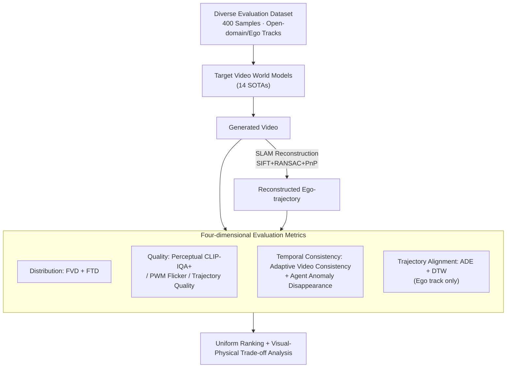

# DrivingGen: A Comprehensive Benchmark for Generative Video World Models in Autonomous Driving

**Conference**: ICLR 2026  
**arXiv**: [2601.01528](https://arxiv.org/abs/2601.01528)  
**Code**: [https://drivinggen-bench.github.io/](https://drivinggen-bench.github.io/)  
**Area**: Autonomous Driving / World Models  
**Keywords**: Video World Models, Benchmark, Driving Scene Generation, Trajectory Evaluation, Temporal Consistency

## TL;DR
DrivingGen introduces the first comprehensive benchmark for autonomous driving video world models. It features a diverse evaluation dataset across various weather, geographies, times, and complex scenarios, along with a four-dimensional evaluation system (Distribution, Quality, Temporal Consistency, and Trajectory Alignment). Benchmarking 14 SOTA models reveals the core trade-offs between general-purpose and driving-specialized models.

## Background & Motivation

**Background**: Video generation models are rapidly evolving as world models in autonomous driving for future scenario prediction, scalable simulation, and synthetic data generation. Both general-purpose models (e.g., Kling, Sora) and driving-specialized models (e.g., Vista, GEM) are undergoing fast iterations.

**Limitations of Prior Work**: Current evaluations suffer from four major flaws: (a) general video metrics (FVD) overlook driving-specific imaging issues such as PWM flicker; (b) physical plausibility of trajectories is rarely quantified; (c) temporal consistency assessments ignore agent-level anomalies (e.g., sudden disappearing vehicles); and (d) trajectory controllability is seldom evaluated.

**Key Challenge**: Existing datasets are heavily biased toward sunny/daytime and single urban scenes (nuScenes is >80% sunny/day), failing to assess model robustness under diverse real-world conditions. The lack of a unified benchmark leads to unfair comparisons between methods.

**Goal**: To establish a unified evaluation framework covering data diversity, visual quality, physical plausibility, temporal consistency, and controllability.

**Key Insight**: Evaluating from both a visual and robotics perspective—visual quality alone is insufficient; the underlying trajectories must also be physically plausible.

**Core Idea**: The first benchmark to comprehensively evaluate driving video world models from both visual and robotics perspectives across four dimensions.

## Method

### Overall Architecture
DrivingGen addresses the question of how to fairly measure the performance of a video world model in driving scenarios. The evaluation process is structured as a pipeline: a deliberately diverse dataset is fed into the target model to generate videos, which are then analyzed through two complementary perspectives. The visual perspective examines the imagery directly, while the robotics perspective reconstructs the ego-trajectory from the video using a classic SLAM pipeline (SIFT+RANSAC+PnP). Both videos and trajectories are analyzed using 11 specific metrics across four dimensions: Distribution, Quality, Temporal Consistency, and Trajectory Alignment (the latter only for tracks providing ego-trajectories), resulting in a unified ranking and trade-off analysis for 14 models.

### Key Designs

**1. Diverse Evaluation Dataset: Countering "Sunny/Day Bias" with Rare Scenarios**

Existing datasets are over 80% sunny/daytime single-city scenes (like nuScenes), causing models to appear strong on such distributions but fail under extreme conditions. DrivingGen reverses this by suppressing the sunny/daytime ratio to <60%, explicitly including extreme weather like snow (13.1%), fog (12.6%), sandstorms, and floods, along with various time periods (dawn/night), global geographies (North America, East Asia, Europe, Middle East, Africa), and complex interactions (dense traffic, pedestrians crossing, aggressive lane merging). The dataset is split into two tracks: the open-domain track uses data from the internet to test generalization to unseen scenes, while the ego-conditioned track uses data from five open-source driving datasets (Zod, DrivingDojo, COVLA, nuPlan, WOMD) with ground-truth ego-trajectories to test controllability. The scale is set at 400 samples (200 per track) to balance evaluation efficiency and scene coverage.

**2. Fréchet Trajectory Distance (FTD): Applying Distributional Concepts to Trajectory Space**

This addresses the distribution dimension. Evaluating visual appearance via FVD alone is insufficient—a video with beautiful imagery but physically impossible trajectories is dangerous in driving. FTD adopts the distributional distance concept of FVD but replaces video frames with trajectories. An encoder from the Motion Transformer (MTR) is utilized to map trajectories into a latent space, where the Fréchet distance between real and generated trajectory distributions is computed. This marks the first time distributional evaluation has been migrated to trajectories, allowing "physical plausibility" to be quantified similar to "visual quality." Experiments show that FTD and FVD rankings are inconsistent, proving visual and trajectory distributions are independent dimensions.

**3. Quality Dimension: Expanding from "Looking Good" to "Imaging Standard + Drivable Trajectories"**

This addresses the quality dimension, targeting the point that general perceptual quality scores ignore driving-specific imaging and motion constraints. DrivingGen splits quality into three parts: perceptual quality (CLIP-IQA+ for alignment with human subjectivity), objective imaging quality (utilizing the Modulation Mitigation Probability [MMP] from the IEEE Automotive P2020 standard to quantify PWM-induced lighting flicker which interferes with perception), and trajectory quality (a reference-free composite score). The trajectory score aggregates sub-scores for comfort (penalizing longitudinal jerk, lateral acceleration, and yaw-rate), motion (penalizing "pseudo-static" trajectories), and curvature (penalizing zigzagging and irrational sharp turns). Together, these target attributes critical for controllability, planning, and passenger comfort.

**4. Temporal Consistency Dimension: Adaptive Anti-hacking + Agent Anomaly Disappearance**

This addresses the temporal consistency dimension, innovating to solve the problem where traditional consistency metrics are easily "cheated" and ignore agent-level anomalies. First, Adaptive Video Consistency is introduced: since near-static videos naturally have high consistency, models can "hack" scores by generating pseudo-static scenes. This method uses optical flow to estimate motion and adaptively downsample frames (more sparse sampling for low-motion videos) to ensure displacement between sampled frames is comparable to normal/high-speed driving before calculating DINOv3 feature similarity. Second, Agent Anomaly Disappearance detection identifies non-physical phenomena where vehicles/pedestrians vanish (not at the field-of-view edge or occluded). DrivingGen uses YOLOv10 for detection and SAM2 for tracking, then feeds keyframes to a VLM (Cosmos-Reason1) to determine if the disappearance is reasonable or "evaporated." The ratio of "anomaly-free" videos is reported as a metric.

### Loss & Training
DrivingGen is an evaluation benchmark and does not involve model training. Trajectories are extracted from generated videos via a classic SLAM pipeline consisting of SIFT, RANSAC, and PnP.

## Key Experimental Results

### Main Results
Ranking of 14 models on the open-domain track (by average rank):

| Model | Params | FVD↓ | FTD↓ | Subj. Qual.↑ | Obj. Qual.↑ | Traj. Qual.↑ | Vid. Consist.↑ | Agent Consist.↑ | Avg Rank |
|------|--------|------|------|----------|----------|----------|-----------|------------|----------|
| Kling 2.1 | - | 693.4 | 26.73 | 0.554 | 0.802 | 0.644 | 0.895 | 0.798 | **1** |
| Gen-3 Alpha | - | 801.0 | 93.50 | 0.546 | 0.838 | 0.654 | 0.890 | 0.817 | 2 |
| LTX-Video | 13B | 648.2 | 31.29 | 0.522 | 0.829 | 0.556 | 0.885 | 0.745 | 3 |
| Vista (Specialized) | 2.5B | 675.7 | 54.66 | 0.434 | **0.847** | 0.603 | 0.857 | 0.636 | 6 |
| VaViM (Specialized) | 1.2B | 1446.6 | 449.2 | 0.469 | **0.847** | 0.312 | **0.916** | 0.772 | 9 |

### Ablation Study

| Evaluation Dimension | Key Findings |
|---------|---------|
| General vs. Specialized | General models have higher visual quality but poorer physical consistency; specialized models have more realistic trajectories but lag in visual quality. |
| Objective Quality (PWM flicker) | Specialized models perform better on IEEE P2020 standards (less flicker) as training data includes real sensor characteristics. |
| Agent Disappearance | General models perform better (fewer anomalies), likely due to larger training data scales and better object permanence. |
| Trajectory Alignment | Cosmos-Predict2 performs best ($ADE = 22.38$), suggesting that embedding physical engines aids controllability. |

### Key Findings
- **Core Trade-off**: General models "look good but break physics," while driving-specialized models "get physics right but look worse"—the two directions have yet to converge.
- Kling 2.1 ranks first in both tracks, benefiting from commercial-grade data scale and training resources.
- The discrepancy between FTD and FVD rankings proves that visual quality and trajectory quality are independent dimensions.
- Although VaViM has the worst FVD, it excels in agent consistency and disappearance metrics, showing that different dimensions reveal distinct model characteristics.

## Highlights & Insights
- **Introduction of FTD fills a gap**: By migrating FID/FVD concepts to trajectory space using MTR encoders, it provides a physical distribution-level assessment for driving video generation. This metric can be reused in future work.
- **Adaptive Temporal Consistency prevents hacking**: Using optical flow for adaptive downsampling solves the issue where static videos receive inflated consistency scores; this trick is applicable to any video generation consistency assessment.
- **Four-dimensional Framework**: Provides a methodology template—evaluations of generative models should consider distribution, quality, consistency, and controllability to avoid the pitfalls of single-metric bias.

## Limitations & Future Work
- The 400-sample dataset scale might be small for high statistical confidence.
- Extracting trajectories via SLAM introduces noise; ideally, trajectories should be obtained directly from the model if supported.
- Lack of downstream task evaluation (e.g., closed-loop performance of a planner trained on generated videos).
- Fair efficiency comparisons for commercial closed-source models (Kling, Gen-3) are not possible.

## Related Work & Insights
- **vs VBench**: VBench is for general video evaluation and lacks trajectory or driving-specific metrics; DrivingGen designs a complete system for driving.
- **vs WorldScore (Duan et al., 2025)**: WorldScore focuses on general scenario consistency, whereas DrivingGen adds agent-level consistency, trajectory quality, and controllability.
- **vs DrivingDojo/Driverse**: These works only cover partial dimensions of evaluation; DrivingGen is the first to achieve comprehensive coverage.

## Rating
- Novelty: ⭐⭐⭐⭐ The evaluation system design is novel (FTD, adaptive consistency, agent disappearance), though as a benchmark paper, it lacks fundamental algorithmic innovation.
- Experimental Thoroughness: ⭐⭐⭐⭐⭐ Comprehensive comparison of 14 models, including commercial and open-source models across different tracks and dimensions.
- Writing Quality: ⭐⭐⭐⭐⭐ Clear problem analysis, well-grounded metric design, and systematic presentation of results.
- Value: ⭐⭐⭐⭐⭐ Fills a gap in evaluating driving video world models and reveals the critical insight that "visual quality $\neq$ physical plausibility."

<!-- RELATED:START -->

## Related Papers

- [\[ICLR 2026\] ConsisDrive: Identity-Preserving Driving World Models for Video Generation by Instance Mask](consisdrive_identity-preserving_driving_world_models_for_video_generation_by_ins.md)
- [\[ICML 2026\] V2V-Bench: A Comprehensive Benchmark for Video-to-Video Generation Evaluation](../../ICML2026/video_generation/v2v-bench_a_comprehensive_benchmark_for_video-to-video_generation_evaluation.md)
- [\[CVPR 2026\] VABench: A Comprehensive Benchmark for Audio-Video Generation](../../CVPR2026/video_generation/vabench_a_comprehensive_benchmark_for_audio-video_generation.md)
- [\[ICLR 2026\] NarrLV: Towards a Comprehensive Narrative-Centric Evaluation for Long Video Generation](narrlv_towards_a_comprehensive_narrative-centric_evaluation_for_long_video_gener.md)
- [\[ICLR 2026\] Vid2World: Crafting Video Diffusion Models to Interactive World Models](vid2world_crafting_video_diffusion_models_to_interactive_world_models.md)

<!-- RELATED:END -->
