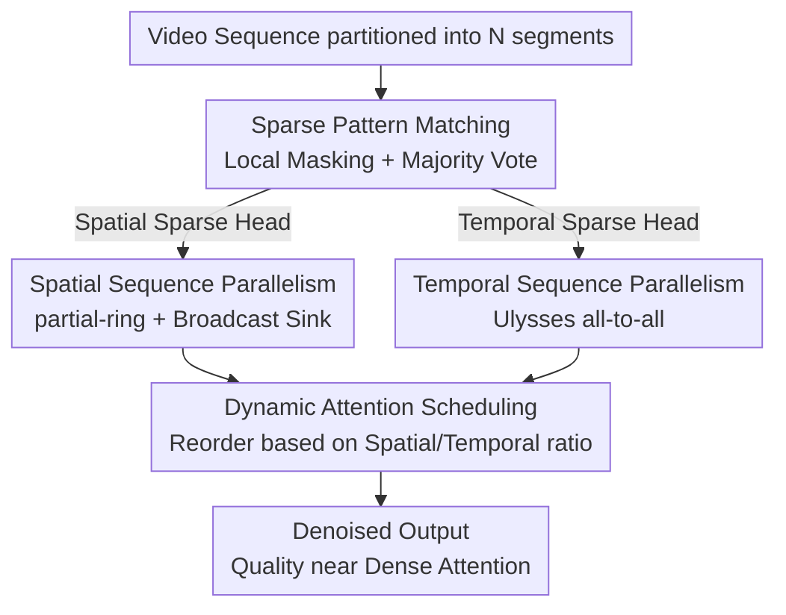

# DSA: Efficient Inference For Video Generation Models via Distributed Sparse Attention

**Conference**: ICLR2026  
**OpenReview**: [https://openreview.net/forum?id=1ZmdfDzGE1](https://openreview.net/forum?id=1ZmdfDzGE1)  
**Code**: To be confirmed  
**Area**: Video Generation / Diffusion Model Inference Acceleration / Distributed Systems  
**Keywords**: Video Diffusion Transformer, Sparse Attention, Sequence Parallelism, Distributed Inference, Super-linear Scaling

## TL;DR
DSA intertwines "sparse attention" and "sequence parallelism," two previously independent acceleration paths. By matching spatial and temporal sparse attention patterns in video diffusion models with partial-ring and Ulysses parallelism respectively, and hiding communication within computation via dynamic scheduling, it achieves a $10.79 \times$ speedup for 720p/5s video generation on 8x H100 compared to single-card dense attention ($1.43 \times$ faster than USP) with negligible quality loss.

## Background & Motivation
**Background**: Diffusion Transformers (DiT) are the primary backbone for video generation (e.g., Sora, Wan, Hunyuan-Video). However, DiTs flatten high-resolution videos into ultra-long token sequences for full attention. For instance, generating a 5s 720p video with Wan2.1-14B involves approximately 302k tokens per channel across 16 channels, where attention complexity grows quadratically with sequence length, taking 31 minutes on a single card.

**Limitations of Prior Work**: Two independent acceleration routes exist, but both have limitations. ① **Sparse Attention** (SVG, STA, SpargeAttention) exploits spatio-temporal sparsity to compute only key tokens, saving FLOPs without training. However, these are designed for single-card setups; sparse pattern identification requires the full sequence's query/key, which is incompatible with sequence parallelism that partitions the sequence. ② **Sequence Parallelism** (xDiT/USP) distributes sequences across multiple cards to share the compute load. However, frequent exchange of Q/K/V results in communication overhead that leads to **sub-linear scaling**: Wan2.1-14B scaling from 1 to 8 cards only reduces time from 1837.9s to 287.9s (79.7% efficiency).

**Key Challenge**: Sparse attention reduces "computation," while sequence parallelism utilizes more "cards," but they are inherently conflicting. Sparse detection requires the full sequence, whereas sequence parallelism fragments it. Moreover, existing sparse methods ignore distributed issues like **attention sinks** (all queries attending to the first few text tokens), which may reside on one card but must be accessed by all. Existing solutions like MagiAttention combine sparsity and distribution but are for LLM **training**, not inference.

**Goal**: Achieve the computational benefits of sparse attention and the parallel benefits of multi-GPU setups in distributed inference, minimizing communication overhead while maintaining video quality.

**Key Insight**: Video DiT attention exhibits two **well-structured** sparse patterns: **spatial sparsity** (queries attend mostly to local tokens in the same or adjacent frames) and **temporal sparsity** (queries attend to tokens at the same spatial position across different frames). Since these patterns have different communication requirements, a "one-size-fits-all" parallel strategy is inefficient.

**Core Idea**: Tailor parallel strategies for each sparse pattern—partial-ring for spatial sparsity (communicating only with neighbors) and Ulysses all-to-all for temporal sparsity. Use dynamic scheduling to hide communication in computation based on real-time spatial-temporal ratios, achieving **training-free, quality-preserving, and super-linear scaling**.

## Method

### Overall Architecture
DSA (Distributed Sparse Attention) is a training-free distributed attention mechanism for inference. It partitions an ultra-long video token sequence across $N$ GPUs and performs sparse computation on each. The process follows: the input sequence is split into $N$ sub-sequences. A lightweight profiler **locally** determines if each attention head is spatial or temporal, followed by an all-gather majority vote for global consensus. Spatial heads follow "Spatial Sequence Parallelism" (neighbor communication + sink broadcasting), while temporal heads follow "Temporal Sequence Parallelism" (Ulysses all-to-all head regrouping). Finally, Dynamic Attention Scheduling reorders execution based on the real-time ratio of spatial/temporal heads to overlap communication with computation.

### Key Designs

**1. Sparse Pattern Matching: Reconstructing global patterns through voting on fragmented sub-sequences**

Static sparse methods like SVG match heads to spatial or temporal masks using the full sequence. In sequence parallelism, cards only hold sub-sequences, breaking this matching. DSA uses **local pattern matching + majority vote**: each card computes a local sparse pattern for its sub-sequence against predefined masks. An all-gather operation aggregates these local decisions, and a majority vote determines the final sparse pattern (spatial or temporal) for the head. This enables the reuse of high-performance static sparse kernels without requiring the full sequence on each card.

**2. Spatial Sequence Parallelism: partial-ring for neighbors and sink broadcasting**

Spatial sparsity involves queries attending to spatial neighbors in the same or adjacent frames. Standard ring attention rotates K/V through all cards ($N-1$ transmissions). DSA introduces **partial-ring**: it performs only one clockwise and one counter-clockwise send-receive (2 total transmissions) and uses online softmax for block accumulation to overlap communication with computation. This reduces transmissions from $N-1$ to a constant 2. For the **attention sink** (usually text tokens in the first frame), DSA uses a **broadcast** to distribute it from the first GPU to all others. The bidirectional transmission of partial-ring covers adjacent spatial tokens, preserving quality.

**3. Temporal Sequence Parallelism: Ulysses all-to-all for head regrouping and sparse computation**

Temporal sparsity requires a query to attend to keys at the same spatial position across **all cards**. Partial-ring cannot handle this; global rearrangement is necessary. DSA utilizes **Ulysses-style** parallelism: sub-sequences of shape $[B, S/N, H, D]$ are restructured via all-to-all into $[B, S, H/N, D]$, where each card holds the **full sequence for a subset of heads**. This allows each card to independently apply sparse masks locally. While the total communication volume matches standard Ulysses, the **computational cost is significantly reduced** due to the sparse attention mask.

**4. Dynamic Attention Scheduling: Overlapping all-to-all with computation**

The ratio of spatial to temporal sparse heads in diffusion models changes dynamically across layers, denoising steps, and prompts. DSA proposes **Dynamic Attention Scheduling (DAS)** to switch between two schedules: **Spatial-dominant schedule**—when spatial heads are the majority, spatial and temporal computations are interleaved to hide the temporal all-to-all communication overhead. **Temporal-dominant schedule**—when temporal heads are the majority, local spatial attention is computed and overlapped with all-to-all, and partial-ring is executed during Ulysses computation to aggregate spatial tokens into larger tensors, finally overlapping spatial computation with temporal communication.

### Loss & Training
DSA is a **training-free** inference mechanism that requires no fine-tuning. It is applied directly to pre-trained DiTs like Wan and Hunyuan-Video. Tuning handles sparsity levels: the default is 75% for both spatial and temporal dimensions. Since DSA decouples spatial and temporal computation, they can utilize different sparsity levels.

## Key Experimental Results

### Main Results
Evaluations on Wan2.1-1.3B, Wan2.1-14B, and Hunyuan-Video use VBench (4 dimensions) + PSNR/SSIM/LPIPS for quality, and end-to-end latency for system performance. DSA matches the strongest static sparse method (SVG) in quality and significantly outperforms USP in performance on 8 GPUs.

| Model | Method | GPUs | Latency (s) | Speedup |
|------|------|--------|------------|--------|
| Wan2.1-1.3B | Dense | 1 | 402.34 | 1× |
| Wan2.1-1.3B | SVG | 1 | 310.14 | 1.29× |
| Wan2.1-1.3B | USP | 8 | 59.45 | 6.76× |
| Wan2.1-1.3B | **DSA** | 8 | 54.11 | **7.43×** |
| Wan2.1-14B | Dense | 1 | 1889.25 | 1× |
| Wan2.1-14B | USP | 8 | 251.26 | 7.52× |
| Wan2.1-14B | **DSA** | 8 | 175 | **10.79×** |
| Hunyuan-Video-13B | Dense | 1 | 1790.34 | 1× |
| Hunyuan-Video-13B | USP | 8 | 284.71 | 6.29× |
| Hunyuan-Video-13B | **DSA** | 8 | 189.38 | **9.45×** |

Quality comparison (Wan2.1-14B): DSA achieves PSNR 33.19, SSIM 0.775, and LPIPS 0.103, comparable to SVG (33.03 / 0.781 / 0.109) and superior to Sparge (30.79 / 0.641 / 0.189). USP is equivalent to Dense (lossless).

### Ablation Study
Scheduling policy ablation (Wan2.1-14B, 720p 5s video):

| Policy | Latency (s) | Description |
|------|------------|------|
| Naive Schedule | 188.92 | Sequential spatial/temporal attention, no overlap |
| Dynamic Schedule | 180.47 | Ratio-based reordering + overlap, 4.7% reduction |
| Spatial Only | 175 | All heads use spatial mode, 8% reduction vs naive |

Sparsity sensitivity: When fixing temporal sparsity at 95%, overall consistency drops slightly (0.179 to 0.174) as spatial sparsity increases from 80% to 95%. High temporal sparsity (95%) maintains quality significantly better than high spatial sparsity.

### Key Findings
- **Super-linear scaling is the primary highlight**: On Wan2.1-14B and Hunyuan-13B, the 8-GPU speedups ($10.79 \times$, $9.45 \times$) exceed the GPU count ($8 \times$). This demonstrates that combining sparse-saved computation with optimized communication allows large models to run more efficiently on multiple cards than on one. Small models (Wan-1.3B) remain sub-linear ($7.43 \times$) due to lower hardware utilization on smaller slices.
- **Temporal attention is naturally sparser than spatial**: Since the number of frames is usually much smaller than tokens per frame, there are fewer keys at the same spatial position across frames. Consequently, 95% temporal sparsity has little impact on quality compared to spatial sparsity.
- **Scheduling gains are stable**: Dynamic scheduling provides a 4.7% improvement over naive execution, while spatial-only provides 8%. The bulk of the speedup comes from the hybrid parallel architecture.

## Highlights & Insights
- **"Divide and Conquer" by sparse pattern**: Instead of treating sparse attention as a black box, DSA identifies spatial and temporal patterns and applies optimal parallel strategies (partial-ring vs. Ulysses) for each.
- **Reducing Ring communication from $N-1$ to 2**: Leveraging the physical fact that spatial sparsity only requires local neighbors drastically improves scalability as GPU counts increase.
- **"Free" Ulysses optimization**: By keeping all-to-all communication volume the same but reducing the internal computation via sparsity, DSA gains efficiency without additional communication cost.
- **Orthogonal to caching**: DSA optimizes the attention algorithm and parallelism without modifying cross-step activation caching (like PAB or TaylorSeer), making it compatible with other acceleration techniques.

## Limitations & Future Work
- **Pattern dependency**: DSA currently targets known spatial/temporal patterns; it may not cover new patterns in future models. The authors plan to integrate computation-communication fusion into CUDA kernels via Triton-Distributed.
- **Small model efficiency**: Speedup on Wan2.1-1.3B is sub-linear, suggesting DSA is more advantageous for large models or ultra-long sequences.
- **Experimental scope**: Evaluations are limited to single-node 8-GPU setups. Multi-node scalability and quality metrics like motion consistency for longer videos require further exploration. Sparsity levels (75%) are currently manual hyperparameters.

## Related Work & Insights
- **vs SVG**: SVG uses static masks for single-card speedup with high quality. DSA adapts this to distributed settings via local matching and voting, decoupling spatial and temporal sparsity levels.
- **vs USP / xDiT**: USP uses hybrid ring/Ulysses parallelism for lossless inference but ignores sparse structures, leading to sub-linear scaling. DSA is 43% faster on Wan2.1-14B by leveraging sparsity.
- **vs MagiAttention**: While both address distributed sparse attention, MagiAttention is designed for LLM training, whereas DSA is optimized for video generation inference.
- **vs Caching (PAB/TaylorSeer)**: These methods reuse activations across denoising steps. DSA is orthogonal and can be combined with them for further gains.

## Rating
- Novelty: ⭐⭐⭐⭐ Innovative "divide and conquer" for sparse patterns and distributed strategies, though individual components are well-known.
- Experimental Thoroughness: ⭐⭐⭐⭐ Strong results on three models; however, lacks multi-node and ultra-long video data.
- Writing Quality: ⭐⭐⭐⭐ Clear motivation and technical breakdown; diagrams are intuitive.
- Value: ⭐⭐⭐⭐⭐ Highly practical for reducing deployment costs of video generation models due to super-linear scaling and training-free nature.

<!-- RELATED:START -->

## Related Papers

- [\[ICLR 2026\] BLADE: Block-Sparse Attention Meets Step Distillation for Efficient Video Generation](blade_block-sparse_attention_meets_step_distillation_for_efficient_video_generat.md)
- [\[ICML 2026\] DFSAttn: Dynamic Fine-Grained Sparse Attention for Efficient Video Generation](../../ICML2026/video_generation/dfsattn_dynamic_fine-grained_sparse_attention_for_efficient_video_generation.md)
- [\[ICML 2026\] VEDA: Scalable Video Diffusion via Distilled Sparse Attention](../../ICML2026/video_generation/veda_scalable_video_diffusion_via_distilled_sparse_attention.md)
- [\[NeurIPS 2025\] VORTA: Efficient Video Diffusion via Routing Sparse Attention](../../NeurIPS2025/video_generation/vorta_efficient_video_diffusion_via_routing_sparse_attention.md)
- [\[NeurIPS 2025\] VSA: Faster Video Diffusion with Trainable Sparse Attention](../../NeurIPS2025/video_generation/vsa_faster_video_diffusion_with_trainable_sparse_attention.md)

<!-- RELATED:END -->
