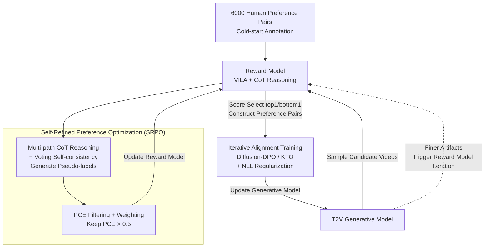

# Dual-IPO: Dual-Iterative Preference Optimization for Text-to-Video Generation

**Conference**: ICLR 2026  
**arXiv**: [2502.02088](https://arxiv.org/abs/2502.02088)  
**Code**: [https://github.com/SAIS-FUXI/IPO](https://github.com/SAIS-FUXI/IPO)  
**Area**: Diffusion Models / Video Generation  
**Keywords**: Preference Optimization, Video Generation, Reward Model, DPO, Iterative Training  

## TL;DR

The Dual-IPO framework is proposed to continuously improve the quality and human preference alignment of text-to-video generation through multi-round bidirectional iterative optimization between a reward model and a video generation model, enabling a 2B model to surpass a 5B model without massive human annotations.

## Background & Motivation

**Limitations of video generation models**: Despite the significant progress driven by DiT architectures, existing models still fail to meet user expectations in terms of subject consistency, motion smoothness, and aesthetic quality.

**Data bottleneck of preference learning**: Post-training methods like DPO/KTO require large amounts of human-annotated preference data, which is extremely costly to construct.

**Distribution mismatch of external reward models**: Existing general reward models (e.g., VideoScore, VideoAlign) exhibit significant distribution shifts across different video generation models, leading to unreliable reward signals.

**Overfitting issues with static preference data**: Training on fixed offline preference datasets often leads to model overfitting or even collapse.

**Reward signals need to co-evolve with the model**: As training progresses, generation artifacts become more subtle; a fixed reward model produces bias.

**Under-exploited potential of small-scale models**: Through effective post-training strategies, small models can theoretically approach or exceed the performance of larger models.

## Method

### Overall Architecture

The Key Challenge Dual-IPO addresses is that the ceiling of preference optimization is determined by the reward model, and a fixed external reward model becomes increasingly "unable to keep up" as generation quality improves—it can identify obvious flaws in early stages but starts to misjudge subtle defects later, leading the generative model astray. Instead of treating the reward model as a static judge, Dual-IPO allows it and the generative model to "feed each other" through multi-round iterations. Post-training is split into two alternating phases. The first phase is **Self-Refined Preference Optimization (SRPO)**, which uses a small amount of human annotation to cold-start a VLM reward model, after which it generates pseudo-preference labels to refine its own discriminative power. The second phase is **Iterative Alignment Training**, which uses scores from the current reward model to construct preference pairs for optimizing the Text-to-Video (T2V) model. After each round, the stronger generative model produces finer artifacts, which in turn triggers another round of SRPO for the reward model to evolve, thereby bypassing the distribution drift caused by fixed offline rewards.

### Key Designs

**1. Self-Refined Preference Optimization (SRPO): Enabling Self-Evolution of Reward Models with Minimal Human Annotation**

General reward models suffer from distribution shifts and unreliable discrimination across different generative models, and relying solely on human annotation is too expensive. SRPO turns reward model refinement into a self-iterative closed loop: it first uses a small amount of Chain-of-Thought (CoT) annotations for cold-starting to unlock the VLM's structured reasoning capability, breaking down "which video is better" into interpretable scoring reasons. It then employs a voting self-consistency mechanism—running multiple CoT reasoning paths for the same pair and aggregating by answer frequency—to automatically generate stable pseudo-preference labels, suppressing random noise from single paths. Crucially, these pseudo-labels are not blindly trusted; the authors use a Preference Certainty Estimator (PCE) to filter them. It measures the probability that the implicit reward of the winning sample exceeds the dataset mean: $\text{PCE}(y_w \mid x) = \mathbb{P}_\theta\!\left(R(y_w \mid x) > Q\right)$, where the implicit reward is borrowed from the DPO formula $R(y\mid x) = \log \frac{\pi_\theta(y\mid x)}{\pi_{\text{ref}}(y\mid x)}$ and $Q$ is the average reward of the current dataset. Only high-confidence samples with $\text{PCE} > 0.5$ are retained. Finally, PCE is not just a filtering threshold but also acts as a sample weight in the training objective: $\mathcal{L}_{\text{SRPO}}(\theta) = \mathbb{E}_{x,y_w,y_l}\!\left[\text{PCE}(y_w \mid x) \cdot \mathcal{L}_{\text{DPO}}(\theta)\right]$—the more certain the preference pair, the greater its contribution. With only 6,000 human-annotated pairs at the start (generating ~20K pseudo-labels per round), this avoids large-scale annotation and prevents low-quality pseudo-labels from polluting the reward model, ensuring its discriminative power grows steadily.

**2. Iterative Alignment Training: Continuous Optimization and Overfitting Suppression via Closed-loop Feedback**

Training diffusion models on fixed offline preference datasets is prone to overfitting or collapse, and a single alignment step cannot fully exploit the reward model's potential. This phase links the generative and reward models in a closed loop: in each iteration, the current T2V model samples multiple candidates (8 in the implementation) for each caption; the reward model scores them to form preference pairs (about 100K pairs per round) using the top-1 and bottom-1 samples, which are then used to update the generative model. If performance degradation or loss anomalies are detected, an SRPO cycle is automatically triggered to update the reward model. The alignment objective supports paired Diffusion-DPO and pointwise Diffusion-KTO. To suppress overfitting, two Negative Log-Likelihood (NLL) regularization terms are added to the DPO loss—one for generated winning samples and one for ground-truth videos: $\mathcal{L}_{\text{total}}^{\text{DPO}} = \mathcal{L}_{\text{dpo}} + \lambda_1 \cdot \mathbb{E}_{\mathcal{D}^{\text{sample}}}[-\log p_\theta(y^w \mid x)] + \lambda_2 \cdot \mathbb{E}_{\mathcal{D}^{\text{real}}}[-\log p_\theta(y \mid x)]$. The real video term (from VidGen-1M) pulls the generation distribution toward natural data, preventing the model from drifting too far on self-sampled data. Pointwise Diffusion-KTO uses similar regularization with real data.

## Key Experimental Results

| Model | Total Score | Quality Score | Semantic Score |
|------|-------------|---------------|----------------|
| CogVideoX-2B (Baseline) | 80.91 | 82.18 | 75.83 |
| CogVideoX-2B + IPO-3 rounds | 82.74 | 83.92 | 78.00 |
| CogVideoX-5B (Baseline) | 81.61 | 82.75 | 77.04 |
| CogVideoX-5B + IPO-3 rounds | 84.63 | 85.40 | 81.54 |
| Wan-1.3B (Baseline) | 84.26 | 85.30 | 80.09 |
| Wan-1.3B + IPO-3 rounds | 86.28 | 86.38 | 85.87 |

| Reward Model | Human Preference Accuracy | VBench Gain |
|----------|----------------|-------------|
| VideoScore | 63.58% | 80.87 (Decrease) |
| VideoAlign | 65.21% | 81.27 |
| VisionReward | 68.44% | 81.31 |
| **Ours** | **81.33%** | **81.54** |

**Main Results Highlights**: After Dual-IPO, CogVideoX-2B surpasses the 5B baseline on VBench (82.74 vs 81.61); Wan-1.3B reaches 88.32 after 5 iterations, surpassing Sora (84.28).

## Highlights & Insights

1.  **Dual-Iterative Closed-loop Design**: The reward model and generative model mutually reinforce each other, avoiding the distribution drift of static rewards.
2.  **Data Efficiency**: Requires only 6,000 human-annotated pairs for startup, far fewer than other reward models.
3.  **Flexible Preference Strategies**: Supports both DPO and KTO, adapting to different data formats.
4.  **Cross-architecture Generalization**: Effective on both CogVideoX (cross-attention DiT) and Wan (MMDiT) architectures.
5.  **"Small Model Beats Large Model"**: Validates the immense potential of post-training strategies.

## Limitations & Future Work

1.  Training costs remain high (128 GPUs × two weeks/round), making rapid iteration difficult.
2.  The setting of the PCE threshold (0.5) lacks theoretical basis and may require task-specific adjustments.
3.  The reward model relies on VLMs (VILA 13B/40B), introducing extra computational and storage overhead.
4.  Finer-grained quality dimensions (e.g., physical plausibility, causal consistency) have not yet been explored.
5.  Performance gains diminish as the number of iterations increases; deeper analysis of convergence behavior is needed.

## Related Work & Insights

-   **Diffusion-DPO** (Wallace et al.): Extends DPO to diffusion models; this work adds iterative optimization on top.
-   **InstructVideo**: Proposes temporal decay rewards, but gains are limited; this work achieves larger improvements via iterations.
-   **RLHF for LLM**: Borrows the scoring + alignment paradigm from the LLM field but innovatively introduces reward model self-iteration.
-   Insight: The quality of the reward model is the bottleneck for preference optimization; the self-training paradigm might generalize to other fields like image generation.

## Rating

-   Novelty: ⭐⭐⭐⭐ — The dual-iterative closed loop and PCE mechanism are innovative.
-   Experimental Thoroughness: ⭐⭐⭐⭐⭐ — Extensive ablation studies across multiple architectures, scales, and iterations.
-   Writing Quality: ⭐⭐⭐⭐ — Clear structure and complete mathematical derivations.
-   Value: ⭐⭐⭐⭐ — Significant practical guidance for post-training in video generation.

<!-- RELATED:START -->

## Related Papers

- [\[ICLR 2026\] EchoMotion: Unified Human Video and Motion Generation via Dual-Modality Diffusion Transformer](echomotion_unified_human_video_and_motion_generation_via_dual-modality_diffusion.md)
- [\[CVPR 2026\] Dual-Granularity Memory for Efficient Video Generation](../../CVPR2026/video_generation/dual-granularity_memory_for_efficient_video_generation.md)
- [\[ICLR 2026\] JavisDiT++: Unified Modeling and Optimization for Joint Audio-Video Generation](javisdit_unified_modeling_and_optimization_for_joint_audio-video_generation.md)
- [\[CVPR 2026\] DynamicsBoost: Dynamic Plausible Video Generation via Annotation-Free Continuation Preference Optimization](../../CVPR2026/video_generation/dynamicsboost_dynamic_plausible_video_generation_via_annotation-free_continuatio.md)
- [\[ICCV 2025\] V.I.P.: Iterative Online Preference Distillation for Efficient Video Diffusion Models](../../ICCV2025/video_generation/vip_iterative_online_preference_distillation_for_efficient_video_diffusion_model.md)

<!-- RELATED:END -->
