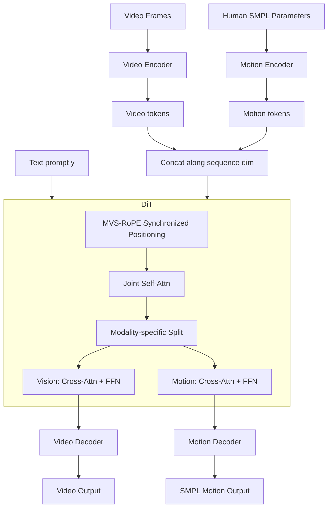

# EchoMotion: Unified Human Video and Motion Generation via Dual-Modality Diffusion Transformer

**Conference**: ICLR 2026  
**OpenReview**: [https://openreview.net/forum?id=eflUxFmIhZ](https://openreview.net/forum?id=eflUxFmIhZ)  
**Code**: [Project Page](https://yuxiaoyang23.github.io/EchoMotion-webpage/)  
**Area**: Video Generation / Human Motion Generation  
**Keywords**: Human Video Generation, SMPL Motion Parameters, Dual-Modality Diffusion Transformer, MVS-RoPE, Joint Distribution Modeling  

## TL;DR
EchoMotion moves beyond treating human video generation as a pure pixel regression problem by employing a dual-branch DiT to explicitly model the joint distribution $p(x, m \mid y)$ of "video appearance + SMPL parametric motion." Combined with temporally synchronized MVS-RoPE and a two-stage training strategy, it significantly improves anatomical plausibility and motion coherence in complex human videos, while inherently enabling bidirectional cross-modal video-to-motion and motion-to-video generation.

## Background & Motivation

**Background**: DiT-based video diffusion models (Wan, CogVideoX, HunyuanVideo, etc.) have achieved excellence in visual fidelity and temporal consistency. However, they frequently fail when faced with complex human movements (gymnastics, skateboarding, combat), often producing videos with distorted joints, entangled limbs, and disordered anatomical structures.

**Limitations of Prior Work**: The authors attribute the root cause to the training objective itself—pure pixel regression loss is dominated by static appearance and background details, remaining largely insensitive to fine-grained temporal kinematics. Given the high degrees of freedom in the human body, even minor kinematic errors appear visually unnatural, yet pixel loss fails to force the model to learn underlying joint movement laws. Existing remedies using 2D keypoints or 3D poses as explicit conditions (DisCo, Animate Anyone, Champ, RealisDance) suffer from two flaws: reliance on control signals often unavailable at inference, and the loss of critical 3D geometric information when projecting 3D poses back to the 2D image plane for alignment.

**Key Challenge**: The model must simultaneously learn appearance (pixel level) and kinematics (structural level), yet pure pixel objectives naturally favor the former. Existing external pose-conditioned schemes result in 3D structural dimensionality loss and are restricted to conditional generation rather than joint generation.

**Goal**: To allow the model to natively and explicitly model human motion as a parallel modality alongside video, thereby enhancing human video quality while naturally supporting bidirectional video-motion cross-modal generation.

**Core Idea**: **[Joint Distribution Modeling]** Modeling $p(x, m \mid y)$ instead of $p(x \mid y)$, where $m$ is a token-efficient SMPL parametric motion representation that retains native 3D structure; **[Dual-modality DiT]** Using a dual-branch DiT to concatenate video tokens and motion tokens for joint self-attention; **[Temporal Synchronized Positioning]** Utilizing MVS-RoPE to provide both modalities with a synchronized 3D coordinate system to enforce temporal alignment.

## Method

### Overall Architecture

EchoMotion uses Wan as its backbone to simultaneously generate video and temporally aligned SMPL motion sequences from text prompts. The process involves parameterizing human motion into compact motion tokens and concatenating them with video tokens along the sequence dimension to form a unified multi-modal context. This sequence passes through a series of dual-modality DiT blocks, where precise positions are injected via MVS-RoPE to facilitate intra-modal and cross-modal information exchange within joint self-attention. Subsequently, features are split for modality-specific cross-attention (interacting with text) and FFNs. Finally, respective decoders reconstruct the video and motion. The training follows a two-stage strategy—training the motion branch to convergence first, then performing multi-task training on paired video-motion data to master joint generation, motion-to-video, and video-to-motion paradigms.

### Key Designs

**1. Parametric Human Motion Representation: Using SMPL for token-efficient, 3D-aware sequences.** Given a human motion video, low-dimensional parameters are extracted per frame using the SMPL model: shape $\beta \in \mathbb{R}^{10}$, pose $\theta \in \mathbb{R}^{24\times 6}$, global orientation $\gamma \in \mathbb{R}^{6}$, and root translation $v \in \mathbb{R}^{3}$. Following DART, 3D joint positions $\eta \in \mathbb{R}^{24\times 3}$ are also used. These parameters are categorized into three groups—position $\{v, \eta\}$, 6D rotation $\{\theta, \gamma\}$, and shape $\beta$—and projected into the Transformer hidden dimension using independent MLPs, yielding 51 motion tokens per frame. Key point: unlike video tokens which undergo temporal downsampling, motion tokens **retain full temporal resolution** to capture fast motion details with minimal computational overhead. Compared to concatenating pose rendering maps (e.g., RealisDance), this representation is more token-efficient and preserves 3D geometry.

**2. Dual-modality DiT Block: Sequence-level concatenation and joint self-attention.** Each block uses modality-specific learnable projections to map video and motion embeddings, which are then concatenated along the sequence dimension for unified $Q/K/V$ computation:
$$Q_{mm}, K_{mm}, V_{mm} = [Q_v; Q_m],\ [K_v; K_m],\ [V_v; V_m]$$
A subsequent joint self-attention layer allows video and motion tokens to capture dependencies within the same attention span. Post-attention, features are decoupled for modality-specific cross-attention (text injection) and FFNs. Unlike the original MMDiT which only denoises video, EchoMotion models parametric motion as an explicit denoising target, significantly reducing motion artifacts.

**3. MVS-RoPE: Synchronized coordinate systems with 4:1 temporal scaling.** The challenge lies in the video VAE's 4x temporal compression, making the motion sequence four times longer than the video sequence. MVS-RoPE solves this via "diagonal expansion" in space and "proportional scaling" in time. Video tokens occupy basic $(h, w)$ spatial regions with standard 3D RoPE. Motion tokens' spatial indices are shifted to diagonal regions $(H+i, W+i)$ to avoid collision, and temporal indices are scaled by $t/4$ to align with video index $t$:
$$\hat{f}^{v}_{t,h,w} = R(t, h, w)\cdot f^{v}_{t,h,w}, \qquad \hat{f}^{m}_{t,i} = R\!\left(\tfrac{1}{4}t,\ H+i,\ W+i\right)\cdot f^{m}_{t,i}$$
This design preserves pre-trained knowledge, enforces temporal alignment, and ensures modality distinguishability.

**4. Two-stage Training + In-Context CFG.** Stage 1 freezes the video branch and trains the motion branch on motion-only data (HuMoVi + HumanML3D) to convergence. Stage 2 unfreezes both for multi-task training on paired data, sampling between joint generation, motion-to-video, and video-to-motion. When a modality is used as a condition, its features are fed with zero noise, and a lightweight MLP projects task embeddings as hints. ICCFG applies specific dropout strategies for each paradigm. In motion-to-video mode, guidance is combined from text and motion paths:
$$o^{v}_{t} = u_\theta(x_t, \varnothing, \varnothing) + \omega_1\big(u_\theta(x_t, m_t, y) - u_\theta(x_t, m_t, \varnothing)\big) + \omega_2\big(u_\theta(x_t, m_t, \varnothing) - u_\theta(x_t, \varnothing, \varnothing)\big)$$

## Key Experimental Results

### Main Results

Based on VBench/VBench-2.0 and human evaluation (higher is better):

| Model | Human Anatomy | Motion Smoothness | Dynamic Degree | Aesthetic | Video Quality | Prompt Following | Posture Plausibility |
|-------|:---:|:---:|:---:|:---:|:---:|:---:|:---:|
| CogVideoX-2B | 61.7 | 97.0 | 49.4 | 51.6 | 55.3 | 52.1 | 53.6 |
| Wan-1.3B | 78.1 | 98.2 | 60.6 | 60.1 | 68.2 | 70.3 | 64.0 |
| Video Tuning (Wan-1.3B) | 77.4 | 98.3 | 61.6 | 59.7 | 69.3 | 73.2 | 65.5 |
| **EchoMotion (Wan-1.3B)** | **79.6** | **98.9** | **61.9** | 60.0 | **71.3** | 73.2 | **66.1** |
| CogVideoX1.5-5B | 65.3 | 98.5 | 54.4 | 53.2 | 62.5 | 60.4 | 59.4 |
| Wan-5B | 83.0 | 98.9 | 62.2 | 58.3 | 72.8 | 78.9 | 68.9 |
| Video Tuning (Wan-5B) | 83.1 | 98.7 | 63.1 | 57.9 | 72.3 | 79.6 | 70.2 |
| **EchoMotion (Wan-5B)** | **85.1** | **99.3** | **64.0** | 58.3 | **81.0** | **81.5** | **81.6** |

### Ablation Study

| Ablation Item | Conclusion |
|---------------|------------|
| Joint Modeling vs. Video-only Tuning | Video Tuning only yielded marginal gains. EchoMotion significantly outperformed in Human Anatomy and Posture Plausibility (70.2→81.6 on 5B), proving joint modeling is essential. |
| MVS-RoPE (Temporal Sync) | With MVS-RoPE, attention maps show a clear 4:1 asymmetric diagonal structure. Removing it results in scattered attention, hindering modality synchronization. |

### Key Findings
- On the 5B scale, EchoMotion improved Posture Plausibility from 68.9 to 81.6 and Video Quality from 72.8 to 81.0, without degrading Aesthetic Quality.
- Explicit human motion modeling is complementary to pixel appearance, drastically improving the coherence of human movements.
- A single model naturally supports bidirectional cross-modal completion (Motion-to-Video and Inverse Kinematics).

## Highlights & Insights
- **Problem Redefinition**: Attributes poor human motion generation to the "pure pixel objective" rather than just "data scarcity." Joint distribution modeling is proposed as a fundamental cure.
- **Elegance of Parametric Motion**: SMPL tokens are more efficient than rendered pose maps and avoid geometric information loss from 3D-to-2D projection.
- **Engineering Ingenuity of MVS-RoPE**: The $t/4$ scaling and spatial diagonal expansion elegantly solve pre-training preservation, temporal alignment, and modality distinction.
- **Unified Architecture Gains**: Joint modeling essentially provides specialized capabilities like Video-to-Motion (inverse kinematics) for free.

## Limitations & Future Work
- **Single Person Restriction**: Current framework handles only one person. Scaling to multiple persons is architecturally feasible but requires large-scale datasets with multi-person annotations.
- **Reliance on SMPL**: Bound by SMPL parameterization and recovery quality; may struggle with fine hand gestures, complex human-object interaction, or loose clothing.
- **Training Cost**: The 5B version requires 32×A100 for ~4 days (~4000 GPU hours), posing a high barrier for reproduction.
- **Custom Benchmarks**: Evaluation relies on author-constructed T2V benchmarks and prompt sets; cross-work comparability requires standardized community benchmarks.

## Related Work & Insights
- **VideoJAM** (Chefer et al., 2025): Also injects explicit motion priors but uses low-level dense optical flow; EchoMotion uses high-level structural SMPL kinematics.
- **MMDiT** (Esser et al., 2024): Source of the dual-modality token concatenation idea, but MMDiT only denoises video, whereas EchoMotion denoises both.
- **Conditional Human Video** (Animate Anyone, etc.): These are strict conditional generators; EchoMotion couples motion and video as joint modalities.
- **Insight**: When generative quality plateaus, reconsider whether the training objective forces the model to learn critical latent variables (like kinematics)—elevating these variables to a parallel modality for joint modeling may be the solution.

## Rating
- **Novelty**: ⭐⭐⭐⭐ Joint modeling of video+SMPL and MVS-RoPE are distinct and well-diagnosed combinations.
- **Experimental Thoroughness**: ⭐⭐⭐⭐ Covers 1.3B/5B scales, dual evaluation (auto/human), and key ablations.
- **Writing Quality**: ⭐⭐⭐⭐ Clear motivation, intuitive diagrams, and consistent design logic.
- **Value**: ⭐⭐⭐⭐ Provides the HuMoVi dataset and a viable path for "kinematic-aware" human video generation.

<!-- RELATED:START -->

## Related Papers

- [\[ICLR 2026\] MoSA: Motion-Coherent Human Video Generation via Structure-Appearance Decoupling](mosa_motion-coherent_human_video_generation_via_structure-appearance_decoupling.md)
- [\[ICLR 2026\] Dual-IPO: Dual-Iterative Preference Optimization for Text-to-Video Generation](dual-ipo_dual-iterative_preference_optimization_for_text-to-video_generation.md)
- [\[ICLR 2026\] Neodragon: Mobile Video Generation Using Diffusion Transformer](neodragon_mobile_video_generation_using_diffusion_transformer.md)
- [\[ICLR 2026\] SANA-Video: Efficient Video Generation with Block Linear Diffusion Transformer](sana-video_efficient_video_generation_with_block_linear_diffusion_transformer.md)
- [\[AAAI 2026\] MotionCharacter: Fine-Grained Motion Controllable Human Video Generation](../../AAAI2026/video_generation/motioncharacter_fine-grained_motion_controllable_human_video_generation.md)

<!-- RELATED:END -->
