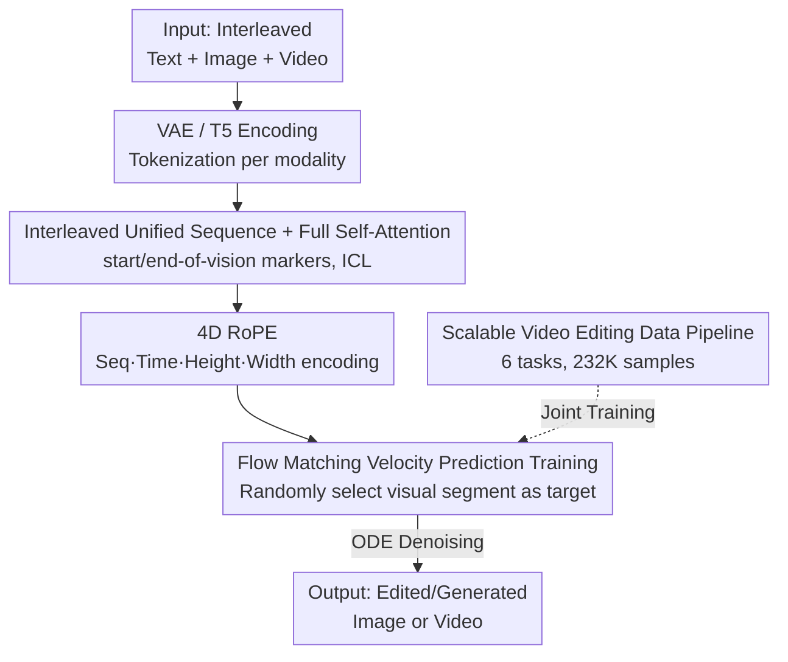

# EditVerse: Unifying Image and Video Editing and Generation with In-Context Learning

**Conference**: ICLR2026  
**OpenReview**: [https://openreview.net/forum?id=blJXE07r7I](https://openreview.net/forum?id=blJXE07r7I)  
**Code**: To be confirmed (See project page in the paper)  
**Area**: Video Generation / Video Editing / Multimodal Generation  
**Keywords**: Unified framework, In-context learning, Full self-attention, Video editing, Flow Matching  

## TL;DR
EditVerse unifies text, images, and videos into a single interleaved token sequence. By employing full self-attention for in-context learning, a single 2B model supports both generation and editing across image and video domains. A self-constructed 232K video editing data pipeline transfers editing knowledge from the image domain to the data-scarce video domain. Experimental results on the EditVerseBench show that this method outperforms open-source baselines and even surpasses the commercial model Runway Aleph in editing fidelity.

## Background & Motivation
**Background**: The trajectory of foundation models is "unification + scaling"—joint training on diverse data unlocks emergent capabilities. The image domain has transitioned from task-specific models (e.g., various ControlNets, inpainting models) to general-purpose models that unify generation and editing. However, exploration of "unified generation + editing" in the video domain remains at an early stage.

**Limitations of Prior Work**: Video models are hindered by two specific issues. First, **Architectural constraints**: Existing video generation models are mostly based on cross-attention or MMDiT, designed for single tasks like text-to-video. Extending them to multiple editing tasks requires significant additional design. Representative work like VACE adds an extra branch to a text-to-video model to receive unedited videos + masks, transforming it into a video inpainting model—but it depends on masks for localization and task-specific input configurations, limiting practicality. Second, **Data scarcity**: While image editing has massive high-quality instruction datasets (UltraEdit, OmniEdit, AnyEdit, etc.), high-quality and diverse video editing data is extremely scarce. Current datasets like Se\~norita-2M are insufficient in both quality and diversity.

**Key Challenge**: To enable video models to emerge with the capability to perform "unseen editing tasks," a truly unified architecture is needed to support flexible multimodal/resolution/duration inputs for in-context learning. However, current cross-attention architectures designed for single tasks cannot achieve this naturally. Furthermore, video editing data is insufficient to feed such generalization capabilities on its own.

**Goal**: To unify image and video generation and editing within a single model, ensuring the architecture can flexibly handle interleaved multimodal inputs while transferring abundant editing knowledge from the image domain to the video domain.

**Key Insight**: The authors draw inspiration from Native Image Generation in Multimodal Large Language Models (MLLMs)—treating all modalities as token sequences and modeling them with full self-attention. Since the in-context learning capability of self-attention is the source of MLLM emergent abilities, unifying text, images, and videos into a long sequence allows them to "attend" to each other, unifying the architecture and naturally transferring knowledge in a shared attention space.

**Core Idea**: Represent text/images/videos as an interleaved 1D token sequence. Replace cross-attention/MMDiT with full self-attention to achieve strong in-context learning and cross-modal knowledge transfer. Supplement this with an automated data pipeline to fill the gap in video editing data.

## Method

### Overall Architecture
The core mechanism of EditVerse is "everything is a token sequence": regardless of the number of text segments, images, or videos in the input, they are flattened into an interleaved 1D sequence according to the original instruction order. This sequence is fed into a transformer with full self-attention, allowing the model to determine through in-context learning which text describes which visual segment and identify the editing target.

Specifically, a forward pass proceed as follows: Images/videos are compressed into a spatio-temporal latent space via a convolutional VAE and then patchified into visual tokens; text is encoded into tokens by Flan-T5-XXL. Both types are projected to a shared hidden dimension $C$, concatenated as a unified sequence $X\in\mathbb{R}^{L\times C}$, with learnable "start of vision / end of vision" markers inserted around visual tokens. A 4D RoPE (Sequence / Time / Height / Width) is applied to each token, followed by $N$ full self-attention blocks. During training, a segment of image or video in the sequence is randomly selected as the generation target, and Flow Matching is used to predict the velocity field. During inference, denoising is performed from noise using an ODE solver. The required video editing data is generated offline by an automated pipeline (6 task categories, 232K samples) and mixed with image/video generation and editing data for joint training.

### Key Designs

**1. Interleaved Unified Sequence + Full Self-Attention: Binding modalities for ICL**

This is the fundamental difference from "branch-adding" solutions like VACE. The pain point in cross-attention/MMDiT is that conditions (unedited video, mask) and generation targets follow different paths, requiring task-specific configs, making it hard for the model to generalize. EditVerse projects all modalities into a shared embedding space and concatenates them into a long sequence $X=\text{Concat}(X^{(0)},X^{(1)},\dots,X^{(n)})$, where each $X^{(i)}$ is clean image, video, or text. **Full self-attention** allows any token to see all others. Thus, the mapping of "Instruction Text ↔ Reference Image ↔ Video to Edit ↔ Target Output" is no longer manually configured but learned as contextual relationships within the attention mechanism.

To identify boundaries, learnable start/end-of-vision markers are added. The key benefit is **Cross-modal knowledge transfer**: Image editing data (6M) and video editing data (288K) are jointly trained in the same attention space. The "how to understand instructions and perform diverse edits" knowledge from the image domain is directly leveraged by the video domain, bypassing the data scarcity bottleneck.

**2. 4D RoPE: Distinguishing modality, order, and spatio-temporal position**

Interleaved sequences introduce a problem: How does the model distinguish the sequence index, the frame index, and the spatial position of a token? Standard 1D positional encoding is insufficient. The authors design a 4D RoPE with four independent components: (1) **Sequence dimension**—captures global position; (2) **Time dimension**—active only for video frames, encoding temporal order; (3) & (4) **Height / Width dimensions**—spatial coordinates for pixels.

The embedding dimensions for RoPE are 12 / 4 / 56 / 56. For variable-length inputs, NTK-aware interpolation is used for extrapolation. This design allows the model to differentiate modalities (based on non-zero dimensions) and accurately locate spatio-temporal content, providing the flexibility to handle any resolution or duration.

**3. Flow Matching Velocity Prediction: Denoising random targets in long sequences**

The model uses Flow Matching. Given an interleaved sequence $X_1$, one segment $X_1^{(i)}$ is randomly chosen as the target, while others remain clean conditions. Noise $X_0^{(i)}\sim\mathcal N(0,1)$ is interpolated as $X_t^{(i)}=tX_1^{(i)}+(1-t)X_0^{(i)}$. The model $u_\Theta$ learns to predict the velocity field $V_t=\frac{dX_t^{(i)}}{dt}=X_1^{(i)}-X_0^{(i)}$:

$$L=\mathbb{E}_{t,X_0,X_1}\big|u_\Theta(X_t,t)-(X_1-X_0)\big|^2$$

During inference, result is obtained via a 50-step ODE solver. This paradigm naturally covers both generation (no source segment) and editing (source segment as condition) without task-specific losses.

**4. Scalable Video Editing Data Pipeline: Automated generation and filtering**

Architecture alone cannot resolve the lack of diverse video editing samples. The authors design a pipeline to create pairs from arbitrary videos covering 6 tasks: (1) **Object Removal/Addition**—using Grounded-SAM-2 and DiffuEraser; (2) **Object Replacement**—using SAM-2, VLM for imagination, and VACE for inpainting; (3) **Style Transfer**—styling the first frame and using VACE with depth guidance; (4) **Camera Motion**—using ReCamMaster; (5) **Mask Detection**; (6) **Propagation**.

Filtering is critical: A VLM scores quality (instruction following, consistency, artifacts, etc.), and thresholds are set based on manual verification. This produces 232K high-quality samples, mixed with filtered Se\~norita-2M data and massive image data for training.

### Loss & Training
The model is a 2B dense transformer (LLaMA-3-like), pre-trained on 360p text-to-image/video and then fine-tuned on the hybrid data for ~56K steps. Global batch size is 256 using AdamW ($\beta_1=0.9, \beta_2=0.95$) with a peak learning rate of $8\times10^{-6}$. Images/videos are scaled to areas between $256\times256$ and $512\times512$. KnapFormer's packing strategy is used for varying sequence lengths. Inference uses CFG scale 5.0 and 50-step sampling.

## Key Experimental Results

### Main Results
The authors established **EditVerseBench**: 200 editing pairs covering 20 tasks, evaluated using 6 metrics (VLM Editing Quality, Pick Score, CLIP/ViCLIP alignment, etc.).

| Method | Type | Editing Quality (VLM)↑ | Pick↑ | CLIP Frame↑ | ViCLIP Video↑ |
|------|------|------|------|------|------|
| TokenFlow | Training-free | 5.26 | 19.73 | 25.57 | 22.70 |
| STDF | Training-free | 4.41 | 19.45 | 25.24 | 22.26 |
| Se\~norita-2M | Propagation | 6.97 | 19.71 | 26.34 | 23.24 |
| InsV2V | Instructional | 5.21 | 19.39 | 24.99 | 22.54 |
| Lucy Edit | Instructional | 5.89 | 19.67 | 26.00 | 23.11 |
| **EditVerse** | Instructional | **7.65** | **20.07** | **26.73** | **23.93** |
| Runway Aleph | Commercial | 7.44 | 20.42 | 27.70 | 24.27 |

EditVerse leads all open-source methods. Compared to Runway Aleph, while generation quality is slightly lower due to base model differences, **editing fidelity (7.65 vs 7.44) is higher**.

### Ablation Study
**Data Ablation** (20K steps, Editing Quality via VLM):

| Image | Video Gen | Video Edit | Edit Quality | Text Alignment (Video) | DINO Consist. |
|:-:|:-:|:-:|------|------|------|
| ✓ | ✓ | ✗ | 3.62 | 20.44 | 90.27 |
| ✗ | ✗ | ✓ | 5.76 | 22.37 | 97.83 |
| ✓ | ✓ | ✓ | **6.95** | **23.81** | **98.44** |

**Model Design Ablation**:

| Interleaved | Seq PE | Edit Quality | Text Alignment (Video) |
|:-:|:-:|------|------|
| ✓ | ✗ | 6.42 | 22.74 |
| ✗ | ✓ | 6.84 | 23.51 |
| ✓ | ✓ | **6.95** | **23.81** |

### Key Findings
- **Image data is the key to emergence**: Without video editing data, quality is only 3.62; without image data, it drops to 5.76. Image editing data helps understand instructions, while video generation data ensures temporal consistency.
- **Interleaved format + Seq RoPE** mainly affect text alignment and editing quality—the core components of in-context learning.
- **Emergent abilities**: The model can perform out-of-distribution tasks (material/weather change) and task combinations (reference insertion) even if not explicitly trained on those specific video categories.

## Highlights & Insights
- **Unified Architecture + Data Transfer**: Using "everything as a sequence + full self-attention" elegantly solves both architectural unification and cross-modal knowledge transfer, avoiding task-specific branching.
- **"Borrowing" from neighbors for data-scarce domains**: The model validates that a data-rich domain (image editing) can "carry" a data-scarce domain (video editing) when trained in a shared attention space.
- **4D RoPE dimension allocation (12/4/56/56)**: An empirical insight that spatial dimensions require more capacity than sequence/time dimensions for visual tokens.
- **VLM-based data filtering**: Proves that a pipeline of specialized models can generate high-quality data if combined with a robust VLM scoring and human-calibrated thresholding system.

## Limitations & Future Work
- **Generation quality limited by base model**: Still trails Runway Aleph in aesthetic/Pick scores; 2B scale is also a bottleneck.
- **Chain of model dependency**: The data pipeline relies on several external models (SAM-2, etc.), which could accumulate errors despite filtering.
- **Square video generalization**: Relies on zero-shot generalization as no square video editing samples were in the training set.
- **Future directions**: Scaling the base model, incorporating more diverse real-world video editing data instead of purely synthetic ones.

## Related Work & Insights
- **vs VACE**: VACE requires masks and specific setups; EditVerse is more flexible with its interleaved sequence and covers more tasks.
- **vs UNIC**: UNIC only supports 6 tasks with task-aware PE; EditVerse covers 20 and uses generic 4D RoPE to enable emergent capabilities.
- **vs Image Unified Models (e.g., transfusion)**: EditVerse successfully extends the "sequence concatenation + ICL" paradigm to video, filling a gap in unified video frameworks.

## Rating
- Novelty: ⭐⭐⭐⭐⭐ 
- Experimental Thoroughness: ⭐⭐⭐⭐⭐ 
- Writing Quality: ⭐⭐⭐⭐ 
- Value: ⭐⭐⭐⭐⭐ 

<!-- RELATED:START -->

## Related Papers

- [\[ICLR 2026\] Unified In-Context Video Editing](unified_in-context_video_editing.md)
- [\[ICML 2026\] Lightning Unified Video Editing via In-Context Sparse Attention](../../ICML2026/video_generation/lightning_unified_video_editing_via_in-context_sparse_attention.md)
- [\[ICLR 2026\] Pixel-Perfect Puppetry: Precision-Guided Enhancement for Face Image and Video Editing](pixel-perfect_puppetry_precision-guided_enhancement_for_face_image_and_video_edi.md)
- [\[ICLR 2026\] UniVideo: Unified Understanding, Generation, and Editing for Videos](univideo_unified_understanding_generation_and_editing_for_videos.md)
- [\[CVPR 2026\] EffectMaker: Unifying Reasoning and Generation for Customized Visual Effect Creation](../../CVPR2026/video_generation/effectmaker_unifying_reasoning_and_generation_for_customized_visual_effect_creat.md)

<!-- RELATED:END -->
