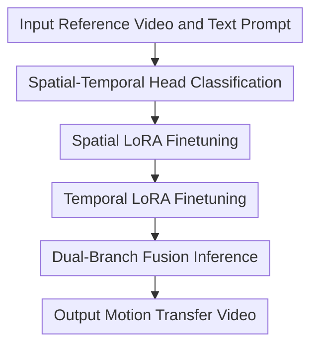

# EffiVMT: Video Motion Transfer via Efficient Spatial-Temporal Decoupled Finetuning

**Conference**: ICLR 2026  
**Paper**: [OpenReview](https://openreview.net/forum?id=vRgEutPE4m)  
**Code**: Authors state partial open-sourcing (full repository not public during review)  
**Area**: Video Generation / Video Editing / Motion Transfer  
**Keywords**: Video Motion Transfer, Diffusion Transformer, Spatial-Temporal Decoupling, LoRA, Sparse Sampling  

## TL;DR
EffiVMT addresses the dual challenges of "motion inconsistency" and "slow finetuning" in DiT-based video motion transfer. It proposes a three-stage spatial-temporal decoupled finetuning process (head classification -> spatial LoRA -> temporal LoRA) combined with sparse motion sampling and adaptive RoPE, achieving significant speedups while maintaining higher motion fidelity and temporal consistency.

## Background & Motivation
**Background**: Video motion transfer aims to transfer motion patterns (camera movement, object trajectories, human actions) from a reference video to new semantic content. Existing approaches are roughly divided into training-free and tuning-based methods. Training-free methods do not modify parameters and are fast to deploy, but their ability to transfer complex motions is limited by the pre-trained priors. Tuning-based methods can learn complex motions via parameter-efficient finetuning like LoRA but face higher computational costs and stability challenges.

**Limitations of Prior Work**: In the UNet era, spatial and temporal layers could often be explicitly separated. However, modern Video DiTs mostly adopt 3D full attention, where spatial and temporal features are "mixed" within the same attention heads. Directly performing two-stage LoRA (spatial then temporal) while updating all attention heads leads to two issues: first, the spatial stage, intended to preserve appearance via static frames, may degrade temporal heads, worsening subsequent motion following; second, the temporal stage processes full frame sequences with massive token lengths, leading to slow and costly finetuning.

**Key Challenge**: Motion transfer requires both "controllable appearance" (e.g., turning a dog into a cat) and "faithful motion" (trajectories and rhythms close to the reference). However, the spatial-temporal coupling in 3D attention causes mutual interference. Furthermore, ensuring motion quality typically requires training on long sequences, which directly escalates computational overhead.

**Goal**: The authors decompose the problem into three sub-objectives: 1) Classify attention heads into spatial-leaning and temporal-leaning categories without modifying the backbone architecture; 2) Update only the corresponding heads during each stage to reduce unnecessary parameter perturbation; 3) Reduce the number of frames during the temporal finetuning stage without sacrificing temporal localization capability.

**Key Insight**: The authors observe that different heads in pre-trained Video DiTs naturally possess specialized preferences, which can be identified by matching attention maps with pseudo-spatial/temporal templates. The value of this approach lies in its ability to obtain a decoupled "entry point" using internal model statistics without requiring supervised labels.

**Core Idea**: First, use head-level matching to split 3D attention into spatial and temporal branches. Then, perform staged LoRA finetuning using sparse frame sampling and adaptive RoPE to maintain temporal alignment, achieving higher motion transfer quality with less computation.

## Method

### Overall Architecture
EffiVMT follows a three-stage workflow. Stage 1 does not train LoRA but analyzes the attention head types of the pre-trained DiT. Stage 2 trains only the spatial head LoRA to learn the target appearance. Stage 3 freezes the spatial heads and trains only the temporal head LoRA to learn motion dynamics. During inference, the two branches are fused to output a video that balances semantic appearance and motion trajectory.

Compared to "all-head tuning," this method explicates "who is responsible for appearance and who for motion." The spatial stage no longer impacts temporal representations, and the temporal stage does not need to repeatedly process appearance reconstruction. Combined with sparse motion sampling, the temporal stage learns motion on fewer frames and restores original temporal scales through adaptive position encoding correction.

### Key Designs
**1. Spatial-Temporal Head Classification: Distinguishing "Who Learns Appearance vs. Motion"**

For each attention head, authors construct an input attention map $M_{input}$ and compare it with two pseudo-templates: the spatial template $M_{spatial}$ favors the main diagonal neighborhood (intra-frame spatial correlation), while the temporal template $M_{temporal}$ favors parallel diagonals (inter-frame same-position correlation). If a head satisfies $S_{spatial} < \alpha \cdot S_{temporal}$ (empirical value $\alpha=1.25$), it is categorized as a temporal head; otherwise, it is a spatial head. This criterion aims to coarsely partition trainable parameters by functional preference to prevent cross-contamination in later stages.

Post-classification, the original single-path q/k/v/o linear layers are rearranged into parallel dual paths (spatial branch + temporal branch). During forward passes, multi-head attention is performed after channel concatenation, then split by channels for separate projection and fusion. This enables "no backbone change, decoupled training."

**2. Spatial-Temporal Decoupled LoRA: Staged Updates to Reduce Conflict and Redundancy**

Stage 2 injects LoRA parameters $\theta_{spat}$ only into the spatial branch, training on randomly sampled single frames with a text-to-image objective to solidify appearance consistency. Stage 3 freezes $\theta_{spat}$ and trains only the temporal branch LoRA parameters $\theta_{temp}$ for inter-frame dynamics.

The key to this "appearance then motion" approach is parameter isolation: the spatial stage does not modify temporal heads, and the temporal stage does not repeatedly pull appearance representations. Compared to naive two-stage tuning where all heads are updated in both stages, this design improves both reconstruction and transfer motion consistency while reducing ineffective parameter updates.

**3. Sparse Motion Sampling + Adaptive RoPE: Low-Frame Training with Temporal Localization**

Directly using original long sequences (e.g., 81 frames) in the temporal stage is time-consuming. Instead, authors sample fewer frames (e.g., 17 frames) to train temporal LoRA, reducing token length and attention computation. However, sparse sampling disrupts the original frame index distribution, leading to RoPE temporal position mismatch. To solve this, adaptive RoPE is introduced to remap sampled frame indices back to the original frame range:

$$
PE_{x_i}=f\left(\frac{F}{2}+\frac{F}{F_{samp}}\left(i-\frac{F_{samp}}{2}\right)\right)
$$

where $F$ is the total original frames, $F_{samp}$ is the sampled frames, and $f(\cdot)$ is the position encoding function. Intuitively, this stretches the "sparse frame timeline" back to the "full timeline," allowing the model to learn dynamics using temporal coordinates close to the pre-training distribution. A motion loss based on negative cosine similarity of adjacent frame differences is also added to reinforce motion direction consistency.

### Mechanism Example
Consider a reference video of "a dog running on a beach" and the target text "a cat running on a beach."

In Stage 1, the model divides heads into spatial and temporal groups. In Stage 2, only the spatial LoRA is trained with random single frames; the model learns "cat appearance semantics + beach texture style" without requiring full motion recovery. In Stage 3, after freezing the spatial LoRA, the temporal LoRA is trained using sparse frame sequences. Adaptive RoPE corrects frame positions so that "running rhythm, displacement direction, and velocity changes" stay consistent with the original video.

During final inference, both branches are fused: the spatial branch ensures it "looks like a cat," while the temporal branch ensures it "runs according to the dog's trajectory and rhythm." Visualizations show this flow is more stable for single objects, multiple objects, complex human actions, and camera movements, exhibiting fewer trajectory drifts or temporal flickers compared to training-free baselines.

### Loss & Training
The spatial stage uses a standard diffusion velocity prediction loss (denoted as $L_{spat}$), training spatial LoRA with random single-frame sampling.

The total loss for the temporal stage is $L_{temp}=L_{video\_denoise}+L_{motion}$. 
$L_{motion}$ is based on the negative cosine similarity of the motion latent between adjacent frames: $\hat{v}_{i,t}=v_{i,t}-v_{i-1,t}$. Dynamic preservation is strengthened by minimizing the direction difference between predicted and ground truth motion.

Implementation-wise, WAN-2.1 is used as the backbone with a LoRA rank of 128. The spatial stage takes ~3000 steps, and the temporal stage takes ~2000 steps. The temporal stage utilizes sparse sampling to significantly reduce total time.

## Key Experimental Results

### Main Results
Evaluation is conducted on the self-constructed MotionBench, covering four motion types: camera, single-object, multi-object, and complex human motion. Ours is compared against various training-free and tuning-based methods.

| Method | Text Sim. ↑ | Motion Fid. ↑ | Temp. Cons. ↑ | Time(s) ↓ |
|------|-------------|---------------|----------------|-----------|
| DiTFlow | 0.375 | 0.807 | 0.941 | 712 |
| MotionDirector | 0.292 | 0.896 | 0.939 | 3008 |
| EffiVMT (Ours) | **0.380** | **0.971** | **0.976** | 727 |

Results show EffiVMT leads in all three quality metrics. Speed-wise, it is close to the fastest training-free methods and significantly faster than traditional tuning-based methods (e.g., MotionDirector), demonstrating a superior trade-off between quality and efficiency.

### Ablation Study
Authors systematically removed three key modules (STD LoRA, Adaptive RoPE, Sparse Sampling) to verify their contributions.

| Configuration | Text Sim. ↑ | Motion Fid. ↑ | Temp. Cons. ↑ | Time(s) ↓ |
|------|-------------|---------------|----------------|-----------|
| Baseline (All Off) | 0.362 | 0.658 | 0.824 | 2493 |
| w/o STD LoRA | 0.364 | 0.546 | 0.845 | 971 |
| w/o Adaptive RoPE | 0.371 | 0.655 | 0.817 | 792 |
| w/o Sparse Sampling | 0.369 | **0.975** | 0.967 | 2068 |
| EffiVMT (Ours) | **0.380** | 0.971 | **0.976** | **727** |

### Key Findings
- Spatial-temporal decoupled LoRA is central to avoiding appearance/motion interference; otherwise, "appearance is learned but motion is lost" or vice versa.
- Adaptive RoPE is crucial for sparse sampling; failing to recalibrate positions significantly hurts motion fidelity.
- Sparse sampling yields substantial speedups with negligible loss in motion quality, making it the most practical engineering gain.

## Highlights & Insights
- **Novelty 1**: Shifting "decoupling" from the module level down to the "attention head" granularity. It requires no backbone changes and directly mitigates training conflicts inherent in 3D attention.
- **Novelty 2**: Speed is treated as a primary design goal. The combination of sparse sampling and RoPE correction creates a complete loop of "reducing computation, then restoring temporal semantics."
- **Novelty 3**: Fills the evaluation gap with MotionBench. Historically, motion transfer relied on visual demos; this paper pushes the field forward at the benchmark level.
- **Insight**: For large model editing tasks like Video DiT, identifying natural functional divisions within parameters and designing targeted finetuning paths is often more effective than "adding another large module."
- **Value**: This approach is extensible to other "appearance-dynamics" coupled tasks, such as video style transfer, character-consistent generation, and long-video character-driven editing.

## Limitations & Future Work
- **Benchmark Bias**: MotionBench is author-built; while coverage is improved, distribution biases may exist. Cross-domain generalization (extreme shots, ultra-long sequences) needs further validation.
- **Inference Stability Boundaries**: Advantages are reported under a 32-frame setting; stability limits for ultra-long videos or heavy occlusions require more systematic testing.
- **Training Cost**: While much faster than traditional tuning-based methods, it still requires a finetuning process and is not "zero-cost plug-and-play" like training-free methods.
- **Assumption Dependency**: Head classification assumes a sparse attention structure. If a backbone's functional division is not distinct, classification quality may limit decoupling gains.

## Related Work & Insights
- **vs. MotionDirector (UNet)**: MotionDirector is mature for UNet-based motion transfer using spatial-temporal paths, but this doesn't naturally translate to DiT. EffiVMT’s contribution lies in head-level decoupling specifically for 3D full attention.
- **vs. DiTFlow / SMM (training-free)**: Training-free methods are fast but hit an upper bound on complex motion. EffiVMT breaks this bound through limited finetuning, leading significantly in Motion Fid. and Temp. Cons.
- **vs. Two-stage LoRA Baselines**: This isn't just "adding another stage." By classifying heads first, it reduces parameter conflicts and utilizes sparse sampling to slash the computational cost of the temporal stage.

## Rating
- Novelty: ⭐⭐⭐⭐☆ (4/5)
- Experimental Thoroughness: ⭐⭐⭐⭐⭐ (5/5)
- Writing Quality: ⭐⭐⭐⭐☆ (4/5)
- Value: ⭐⭐⭐⭐⭐ (5/5)

<!-- RELATED:START -->

## Related Papers

- [\[ICLR 2026\] FastVMT: Eliminating Redundancy in Video Motion Transfer](fastvmt_eliminating_redundancy_in_video_motion_transfer.md)
- [\[ICCV 2025\] EfficientMT: Efficient Temporal Adaptation for Motion Transfer in Text-to-Video Diffusion Models](../../ICCV2025/video_generation/efficientmt_efficient_temporal_adaptation_for_motion_transfer_in_text-to-video_d.md)
- [\[ICCV 2025\] SweetTok: Semantic-Aware Spatial-Temporal Tokenizer for Compact Video Discretization](../../ICCV2025/video_generation/sweettok_semantic-aware_spatial-temporal_tokenizer_for_compact_video_discretizat.md)
- [\[CVPR 2026\] FlowMotion: Training-Free Flow Guidance for Video Motion Transfer](../../CVPR2026/video_generation/flowmotion_training-free_flow_guidance_for_video_motion_transfer.md)
- [\[ICLR 2026\] TPDiff: Temporal Pyramid Video Diffusion Model](tpdiff_temporal_pyramid_video_diffusion_model.md)

<!-- RELATED:END -->
