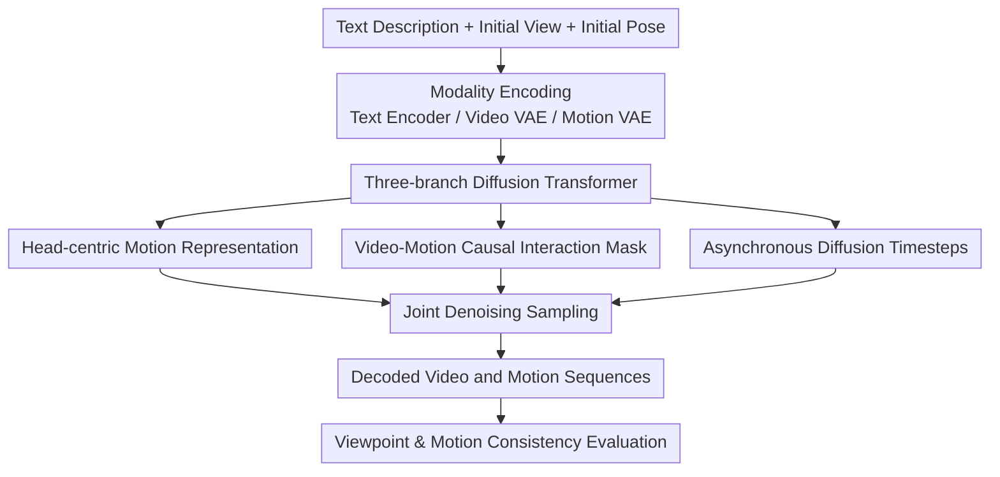

# EgoTwin: Dreaming Body and View in First Person

**Conference**: ICLR 2026  
**OpenReview**: [https://openreview.net/forum?id=QFJkvv3zMi](https://openreview.net/forum?id=QFJkvv3zMi)  
**Code**: https://egotwin.pages.dev/ (Project page; code repository not explicitly public)  
**Area**: Video Generation / Human Motion Generation / Egocentric Generative Modeling  
**Keywords**: First-person video generation, Joint video-motion modeling, Diffusion Transformer, Head-centric representation, Cross-modal temporal consistency

## TL;DR
EgoTwin jointly models "first-person video generation" and "human motion generation" within a single Diffusion Transformer. By utilizing a head-centric motion representation and cross-modal attention with causal constraints, the model ensures that the generated video perspective trajectories and human movements are synchronized in time and aligned geometrically.

## Background & Motivation
**Background**: Major breakthroughs in video generation over the past two years have concentrated on exocentric scenarios, where models generate high-quality, temporally coherent videos based on text or image conditions. Human motion generation has also matured rapidly in the text-to-motion direction, establishing independent paradigms for data representation, VAE compression, and diffusion modeling.

**Limitations of Prior Work**: Egocentric video is not merely a version with a "different camera position." Since the camera is mounted on the wearer's head, visual changes are driven by both head and full-body movements. If only video generation is performed, models tend to produce results where "the lens moves but the bodily logic is unsound"; if only motion generation is performed, there is no guarantee that the movements will correspond to realistic visual observations.

**Key Challenge**: Traditional camera-control video methods rely on preset camera trajectories, but in egocentric scenarios, the trajectory itself is a result to be generated. Simultaneously, common root-centric motion representations embed "head pose" within complex kinematic chains, making it difficult for the video branch to directly extract information most relevant to the perspective.

**Goal**: The authors decompose the problem into two sub-goals that must be satisfied simultaneously: Viewpoint Alignment, where the camera trajectory in the video must match the head trajectory in the motion; and Causal Interplay, where current visual frames influence subsequent actions, and actions in turn alter following frames.

**Key Insight**: Instead of providing the video branch with an "additional camera condition," EgoTwin allows video and motion to constrain each other during the same generation process. By explicitly placing the crucial head state into the motion representation, the model establishes learnable temporal causal relationships between the two modalities at the token level.

**Core Idea**: Utilize "head-centric motion representation + structured cross-modal attention masks + asynchronous diffusion" instead of "loosely coupled fully-connected joint generation" to jointly generate first-person video and human motion as a closed-loop system.

## Method

### Overall Architecture
EgoTwin is a three-branch Diffusion Transformer: the text branch handles semantic conditions, the video branch handles egocentric frame generation, and the motion branch handles human pose sequence generation. The three exchange information via joint attention, but the interaction between video and motion is not fully connected; instead, edges are selectively connected based on "observation-action" temporal causality.

Both training and inference revolve around the "joint distribution." Given an initial pose, an initial first-person observation, and a text instruction, the model simultaneously samples video latents and motion latents. Consequently, camera movement in the video is no longer externally provided but is endogenously determined by the generated motion sequence.

### Key Designs
**1. Head-centric Motion Representation: Explicitly Decoupling Egocentric Information from Implicit Kinematics**

Traditional root-centric representations typically use root angular velocity, translation velocity, and local joint positions/rotations to describe the whole body. While effective for general motion generation, this is unfriendly for joint egocentric generation because the video branch specifically needs to know "how the head moves and turns." In root-centric models, this requires integrating root motion and then propagating through forward kinematics (FK) layers.

EgoTwin switches to a head-centric representation, which directly includes absolute/relative head rotation $(h_r, \dot{h}_r)$ and absolute/relative head position $(h_p, \dot{h}_p)$, with other joint quantities rewritten in the head space. This allows the video branch to directly align "camera perspective changes $\leftrightarrow$ head pose changes," reducing learning difficulty and improving geometric consistency. Ablations prove that cross-modal metrics drop significantly without this modification.

**2. Causal Interaction Mask: Embedding the Observation-Action Closed Loop into the Attention Structure**

Rather than allowing full attention between video and motion tokens, the authors design masks based on forward and inverse dynamics. If video frames are viewed as observations $O_i$ and motion segments as $A_i$, visibility is constructed following the relationships $\{O_i, A_i\} \to O_{i+1}$ and $\{O_i, O_{i+1}\} \to A_i$. Video tokens focus on preceding actions, while motion tokens focus on current and subsequent video changes.

This design directly encodes the closed-loop logic of "what is seen dictates what is done" and "what is done dictates what will be seen." Compared to fully-connected attention, this structured constraint more easily forms frame-by-frame synchronization, particularly in scenarios with strong causality like opening doors or entering rooms.

**3. Asynchronous Diffusion: Allowing Video and Motion to Interact at Different Noise Levels**

EgoTwin samples timesteps $t_v$ and $t_m$ separately for the video and motion branches, feeding them into the joint denoising network for optimization:

$$
\mathcal{L}_{DiT}=\mathbb{E}\left[\lVert \epsilon_v-\epsilon^\theta_v(\cdot)\rVert_2^2 + \lVert \epsilon_m-\epsilon^\theta_m(\cdot)\rVert_2^2\right].
$$

Intuitively, asynchronous diffusion allows the two modalities to exchange information at different "denoising maturities," covering a richer space of cross-modal dependencies. While synchronous diffusion is simpler, it compresses the interactive state space.

**4. Three-stage Training: Perfecting the Motion Branch Before Joint Modeling**

Training is divided into three stages: first, training the Motion VAE; then, text-to-motion pre-training (with the text branch frozen); and finally, joint text-video-motion training. The value of this sequence is that the motion branch is not overwhelmed by the long video token sequences at the start and can align motion embeddings with the pre-trained text-video representation space early on.

### Full Example
Using the prompt "Enter the entertainment room, turn right, and open the door leading to the yard," the generation process can be understood as follows:

1. The initial frame provides the door and room layout, while the text defines the target action sequence.
2. The motion branch generates head and body pose changes for "moving forward + turning right," and the video branch generates the corresponding perspective shift.
3. When the doorknob enters the interactive area in the frame, the motion branch generates hand-lifting and torso adjustments, while the video branch simultaneously shows the visual feedback of the door opening.
4. The new field of view (the yard) after opening the door further constrains subsequent actions, forming a new observation-action cycle.

## Key Experimental Results

### Main Results
The paper compares EgoTwin against the VidMLD baseline on the Nymeria dataset. EgoTwin leads across video quality, motion quality, and video-motion consistency metrics.

| Method | I-FID ↓ | FVD ↓ | CLIP-SIM ↑ | M-FID ↓ | R-Prec ↑ | MM-Dist ↓ | TransErr ↓ | RotErr ↓ | HandScore ↑ |
|------|--------:|------:|-----------:|--------:|---------:|----------:|-----------:|---------:|------------:|
| VidMLD | 157.86 | 1547.28 | 25.58 | 45.09 | 0.47 | 19.12 | 1.28 | 1.53 | 0.36 |
| **Ours (EgoTwin)** | **98.17** | **1033.52** | **27.34** | **41.80** | **0.62** | **15.05** | **0.67** | **0.46** | **0.81** |

Consistency improvements are most significant: TransErr dropped from 1.28 to 0.67, and RotErr from 1.53 to 0.46, indicating the model successfully learned the synchronization between first-person perspective and body motion.

### Ablation Study
Removing Motion Reformulation (MR), the Interaction Mechanism (IM), or Asynchronous Diffusion (AD) results in performance degradation compared to the full model.

| Variant | I-FID ↓ | FVD ↓ | M-FID ↓ | R-Prec ↑ | TransErr ↓ | RotErr ↓ | HandScore ↑ |
|------|--------:|------:|--------:|---------:|-----------:|---------:|------------:|
| w/o MR | 134.27 | 1356.81 | 43.65 | 0.56 | 0.96 | 1.22 | 0.44 |
| w/o IM | 117.54 | 1237.58 | 44.01 | 0.59 | 0.85 | 0.89 | 0.57 |
| w/o AD | 109.73 | 1124.19 | 42.58 | 0.53 | 0.74 | 0.62 | 0.73 |
| **Ours** | **98.17** | **1033.52** | **41.80** | **0.62** | **0.67** | **0.46** | **0.81** |

### Key Findings
- The most significant impact comes from the systematic synergy of "representation + interaction structure + diffusion timing" rather than a single decoder detail.
- Head-centric representation contributes greatly to consistency, highlighting that "head state visibility" is the top priority in egocentric tasks.
- Causal interaction masks significantly improve rotation and hand consistency, suggesting that frame-level relationship modeling is more critical than global semantic alignment.
- Joint modeling also improves single-modality quality, demonstrating cross-modal complementary gains.

## Highlights & Insights
- **Insight 1**: Elevates "first-person video generation" from a pure vision problem to an "observation-action closed-loop generation" problem, which is closer to embodied AI scenarios.
- **Insight 2**: The head-centric motion representation is pragmatic; it reduces the reasoning chain length required for cross-modal alignment, providing high-efficiency modeling.
- **Insight 3**: Interaction masks explicitly embed causal priors into the attention map, preventing the model from having to "blindly learn" temporal constraints from scratch.
- **Insight 4**: Supports multiple sampling modes (T2VM / TM2V / TV2M), indicating strong conditional combination capabilities for future interactive content generation.

## Limitations & Future Work
- Heavy data dependency: Training requires high-quality synchronized text-video-motion data, which is costly to collect.
- Evaluation reliability: Some consistency metrics rely on external estimators (e.g., SLAM), which might introduce errors.
- Short durations: The current focus is on 5-second snippets; long-horizon consistency in multi-stage tasks remains to be verified.
- Future work could integrate physical priors to advance from statistical correlation to explicit physical consistency.

## Related Work & Insights
- **vs CameraCtrl**: The latter treats the camera as a condition; EgoTwin treats it as a generated result endogenously determined by motion.
- **vs text-to-motion (e.g., MLD)**: While MLD excels in motion quality, it does not model synchronized visual observations.
- **vs MM-DiT**: Standard MM-DiT favors global alignment; EgoTwin focuses on structuring cross-modal temporal causality via masks.

## Rating
- **Novelty**: ⭐⭐⭐⭐⭐ First to systematically propose joint generation of egocentric video and human motion with a complete methodology.
- **Experimental Thoroughness**: ⭐⭐⭐⭐☆ Results and ablations are comprehensive, though long-horizon verification could be strengthened.
- **Writing Quality**: ⭐⭐⭐⭐⭐ Problem definitions are clear, and the causal logic of the design is well-articulated.
- **Value**: ⭐⭐⭐⭐⭐ High reference value for egocentric generation and embodied AI data synthesis.

<!-- RELATED:START -->

## Related Papers

- [\[ICLR 2026\] Generative View Stitching](generative_view_stitching.md)
- [\[ICLR 2026\] Anchor Frame Bridging for Coherent First-Last Frame Video Generation](anchor_frame_bridging_for_coherent_first-last_frame_video_generation.md)
- [\[CVPR 2026\] EgoControl: Controllable Egocentric Video Generation via 3D Full-Body Poses](../../CVPR2026/video_generation/egocontrol_controllable_egocentric_video_generation_via_3d_full-body_poses.md)
- [\[ICLR 2026\] Controllable First-Frame-Guided Video Editing via Mask-Aware LoRA Fine-Tuning](controllable_first-frame-guided_video_editing_via_mask-aware_lora_fine-tuning.md)
- [\[CVPR 2026\] ConsID-Gen: View-Consistent and Identity-Preserving Image-to-Video Generation](../../CVPR2026/video_generation/consid-gen_view-consistent_and_identity-preserving_image-to-video_generation.md)

<!-- RELATED:END -->
