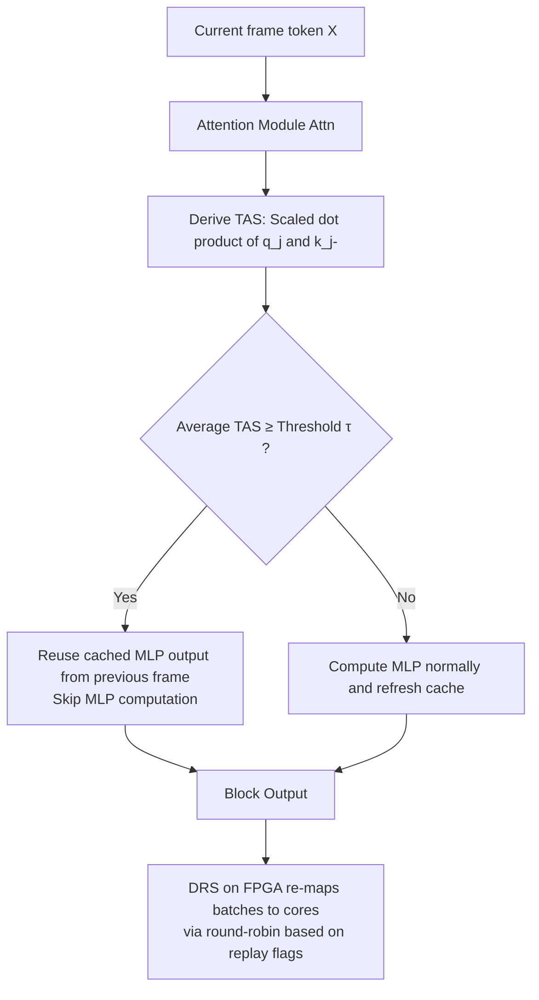

# FastCar: Cache Attentive Replay for Fast Auto-Regressive Video Generation on the Edge

**Conference**: ICLR 2026  
**OpenReview**: [https://openreview.net/forum?id=9f3Nukn6BA](https://openreview.net/forum?id=9f3Nukn6BA)  
**Code**: [https://github.com/shawnricecake/fast-car](https://github.com/shawnricecake/fast-car)  
**Area**: Video Generation / Auto-regressive Generation Acceleration / Hardware-Software Co-design  
**Keywords**: Auto-regressive Video Generation, MLP Reuse, Temporal Redundancy, Temporal Attention Score, FPGA Accelerator, Edge Inference  

## TL;DR
Addressing the phenomenon where the decoding phase of auto-regressive (AR) video generation is dominated by MLP modules and adjacent frames exhibit highly similar MLP outputs, FastCar utilizes the "Temporal Attention Score (TAS)" to determine when to directly reuse cached MLP outputs from the previous frame to skip computations. Accompanied by an FPGA accelerator with dynamic resource scheduling, it achieves over 2.1× decoding acceleration on edge devices with negligible loss in visual quality.

## Background & Motivation
**Background**: Auto-regressive frameworks have shown remarkable performance when migrated from language to vision generation. Token-by-token image AR models often exceed diffusion models in perceptual fidelity and have been further extended to video generation. however, generating temporally coherent video frames involves a much larger number of tokens (set to 8 frames × 256 tokens in this paper) than images, leading to massive decoding overhead that is difficult to deploy on edge platforms like mobile devices or FPGAs with strict energy and memory constraints.

**Limitations of Prior Work**: Previous efficiency-oriented works mostly focused on "spatial redundancy"—using sparse attention (SA) to reduce attention computation or efficient sampling to reduce token counts. These methods assume the bottleneck lies in the attention module, which holds for Diffusion Transformers (where all tokens denoise iteratively at once and attention is the main bottleneck) but not for AR models: **in serial token-by-token AR generation, attention contributes very little, while MLP modules dominate the latency**. Therefore, focusing optimization efforts on attention is largely ineffective for AR video generation.

**Key Challenge**: Videos naturally possess "temporal redundancy"—adjacent frames are highly similar in content—but this redundancy is rarely exploited in AR video generation. The authors identified opportunities through two analyses: (i) the decoding phase is significantly more time-consuming than the pre-filling phase, and MLP modules consistently dominate latency across various sequence lengths; (ii) measurements across all 32 MLP modules reveal high cosine similarity between the outputs of each MLP and the most recent frame, indicating strong temporal redundancy.

**Goal**: To achieve substantial acceleration of AR video generation on the edge by exploiting temporal redundancy to skip massive MLP computations while maintaining visual quality, without requiring model retraining.

**Key Insight**: **Use existing query/key dot products in the attention mechanism to construct TAS as a "similarity signal."** When the TAS between a token and its aligned counterpart in the previous frame exceeds a threshold, the cached MLP output from the previous frame is reused ("Cache Attentive Replay"), skipping the MLP computation for the current token. The authors also provide a theoretical proof that TAS can bound the difference between adjacent frame MLP outputs, providing a mathematical basis for the TAS-based replay decision.

## Method

### Overall Architecture
A video is flattened into a sequence of tokens of length $n = T \cdot N$ ($T$ frames, $N$ tokens per frame), where the alignment relationship satisfies $(t-1, i) = (t, i) - N$. Each Transformer block contains an attention module and an MLP module; FastCar inserts "TAS decision → Replay or Compute" logic within each block. Attention is computed normally (simultaneously yielding TAS); at the MLP stage, if TAS exceeds a threshold, the cached output from the previous frame is reused; otherwise, the MLP is computed normally and the cache is updated. The accompanying FPGA accelerator uses Dynamic Resource Scheduling (DRS) to balance the uneven load caused by "replaying vs. computing MLPs" across different batches onto multiple cores.

### Key Designs

**1. Temporal Attention Score (TAS): A Zero-Cost Reuse Signal.** The foundation of the method is finding a cheap and reliable criterion for whether to reuse. The authors define the TAS for token $j=(t,i)$ by taking the scaled dot product of its query and the key of its aligned token $j^-=(t-1,i)$ from the previous frame: $s_{t,i} = \frac{\langle q_j, k_{j^-}\rangle}{\sqrt{d}}$. Crucially, this dot product is already computed within the attention module during causal decoding, so TAS is obtained "for free" **without introducing extra computation**. For multi-head attention, the mean across heads $\bar{s}_{t,i} = \frac{1}{h}\sum_{m=1}^h s^{(m)}_{t,i}$ is used. Intuitively, a high TAS means the current token is representationally "sticky" to the previous frame's token, suggesting their MLP outputs should be similar.

**2. Cache Attentive Replay: Direct Copying Above Threshold.** In each block, the MLP output of the previous frame's token is cached: $Y_{(t-1,i),:} = \mathrm{MLP}\big((\mathrm{Attn}(X)+X)_{(t-1,i),:}\big)$. The current frame is evaluated token-by-token: if $\bar{s}_{t,i} \ge \tau$, then $Y_{(t,i),:} = Y_{(t-1,i),:}$ (replay); otherwise, normal MLP computation occurs. Formally:
$$Y_{(t,i),:} = \begin{cases} Y_{(t-1,i),:}, & \bar{s}_{t,i} \ge \tau \\ \mathrm{MLP}\big((\mathrm{Attn}(X)+X)_{(t,i),:}\big), & \text{otherwise} \end{cases}$$
The threshold $\tau$ is manually set to trade off between the speedup ratio and visual quality. Since MLP is the latency-dominant factor, selective skipping directly reduces the total computation—experimental results show an 80% replay ratio can save 45% of total operations.

**3. Theoretical Guarantee of TAS-Controlled MLP Divergence.** The authors establish a three-step theorem linking "high TAS" to "safe replay." First, they prove that attention output discrepancy is controlled by TAS: under assumptions like normalized query/key and bounded projection matrices, $\|\mathrm{Attn}(X)_{j,:} - \mathrm{Attn}(X)_{j^-,:}\|_2 \le C\big(\sqrt{1-s_{t,i}} + \gamma M\big)$. Then, using the Lipschitz continuity of MLP, the MLP output discrepancy is bounded by the sum of input and attention discrepancies. The core conclusion: $\|Y_{j,:} - Y_{j^-,:}\|_2 \le C\big(\|X_{j,:}-X_{j^-,:}\|_2 + \sqrt{1-s_{t,i}} + \gamma M\big)$. High TAS combined with input similarity guarantees a small deviation in adjacent frame MLP outputs, theoretically justifying dynamic skipping based on TAS. They also note that TAS only depends on the current layer's local q/k and is independent of model depth, making it a stable, fine-grained, and layer-wise reusable runtime signal.

**4. Dynamic Resource Scheduling (DRS): Balancing Load for FPGA Multi-cores.** FastCar is "data-dependent"—the number of skipped MLPs across different batches is only determined at runtime and is unpredictable. Original multi-core accelerators statically map batches to cores, leading to severe load imbalance; pre-compiling all possible cases would exhaust instruction memory. DRS manages this by maintaining an on-chip mapping table after TAS calculation: a 32-bit Index Register records the state of each batch (0=replay, 1=compute), and 32 Mapping Registers (each $\log_2(\text{num cores})$ bits) decide which core executes which batch. DRS uses round-robin to evenly distribute batches requiring computation. When pre-compiled instructions arrive, DRS checks the Index Register to either discard instructions for replayed batches or dispatch them to the corresponding core based on Mapping Registers. The scheduling overhead is negligible (hundreds to thousands of cycles) compared to execution.

## Key Experimental Results

Experiments used VILA-U, the only available open-source AR video generation model, generating 8-frame 256×256 videos (256 tokens/frame). Quality was evaluated via VBench, and similarity via PSNR/SSIM/LPIPS. Generations ran on A100; latency and energy were measured on a Xilinx Alveo U280 FPGA. As this is a new direction, the primary baseline was the sparse attention method StreamingLLM.

### Main Results (vs. Sparse Attention, Excerpt)

| Method | Replay/Local | PSNR↑ | SSIM↑ | LPIPS↓ | VBench Total↑ | Latency (s)↓ | Efficiency↑ |
|------|------|------|------|------|------|------|------|
| Dense (Baseline) | — | — | — | — | 74.1% | 689.7 (1×) | 1.47 |
| Sparse Attn. | Local 256 | 18.25 | 51.54 | 33.59 | 72.1% | 670.5 (1.02×) | 1.51 |
| Sparse Attn. | Local 16 | 13.30 | 32.02 | 53.75 | 64.5% | 662.7 (1.04×) | 1.53 |
| **Ours** | Replay 20% | 17.94 | 51.01 | 27.57 | 73.2% | 556.8 (1.24×) | 1.82 |
| **Ours** | Replay 50% | 17.85 | 50.11 | 28.08 | 71.5% | 475.3 (1.45×) | 2.13 |
| **Ours** | Replay 80% | 17.71 | 49.01 | 29.50 | 71.5% | 390.7 (1.76×) | 2.59 |

Sparse attention yields negligible speedup (as it only optimizes non-bottleneck attention) and suffers from quality collapse at small local sizes (LPIPS spiking to 50+). FastCar saves 45% computation at 80% replay, achieving 1.76× speedup and 2.59 efficiency with only marginal quality degradation.

### Ablation Study (Combined with Sparse Attention, 87% Replay)

| Method | Replay/Local | PSNR↑ | LPIPS↓ | VBench Total↑ | Latency (s)↓ | Efficiency↑ |
|------|------|------|------|------|------|------|
| Dense | — | — | — | 74.1% | 689.7 (1×) | 1.47 |
| Ours+SA | 87% / 256 | 17.44 | 31.27 | 71.8% | 354.5 (1.95×) | 2.85 |
| Ours+SA | 87% / 16 | 17.27 | 32.37 | 71.6% | 324.3 (2.13×) | 3.12 |

FastCar is orthogonally complementary to sparse attention: the combination restores the visual quality of sparse attention from collapse to 71%+ while achieving over 2.1× speedup, and alleviates the "drifting" problem inherent in sparse attention.

### Key Findings
- **Uniform Thresholding**: Using the same threshold across all layers yielded lower LPIPS and higher VBench scores compared to variable per-layer thresholds at the same total replay ratio, validating the theory that TAS is depth-independent.
- **Threshold Robustness**: When $\tau \le -2.5$, further decreasing $\tau$ significantly increases sparsity/speed without further quality degradation; at $\tau \approx -8$, the replay ratio reaches **87%**, implying only about 13% of MLP modules are strictly necessary.
- **Replay Distribution Structure**: Shallow and deep layers show higher replay rates, while middle layers replay less—suggesting middle layers play a critical role in capturing temporal dynamics and determining generation quality.

## Highlights & Insights
- **Correct Bottleneck Identification**: By overturning the diffusion-based intuition that "attention is the bottleneck," the authors identified MLPs as the dominant latency factor in AR video generation, which is the foundational premise for the method's success.
- **Zero-Cost Signal**: TAS reuses $q \cdot k$ values already computed during causal decoding, obtaining the decision criterion without any added computational overhead.
- **Theoretical Closure**: The three-step theorem links "high TAS → close attention output → close MLP output" into a provable upper bound, ensuring that training-free skipping is mathematically grounded rather than heuristic.
- **Hardware-Software Co-design**: Beyond the algorithm, DRS addresses the real-world challenge of load imbalance in dynamic sparsity on multi-core hardware, providing a complete edge-deployable FPGA solution.
- **Orthogonality**: FastCar targets temporal redundancy while sparse attention targets spatial redundancy. Their combination enhances speed and even fixes the drifting issues of sparse attention.

## Limitations & Future Work
- **Single Model Validation**: Experiments were limited to VILA-U, as it was the only open-source AR video generation model at the time; the generalizability to larger or longer-sequence AR models remains to be verified.
- **Manual Thresholding**: $\tau$ is currently set manually, lacking an adaptive mechanism based on content or scene complexity. Fixed thresholds might lead to excessive replay in volatile motion scenes.
- **Scale Limitations**: Evaluation was conducted on 8-frame, 256×256 videos. While the paper claims benefits for high-resolution long videos, empirical evidence for drifting accumulation in larger scales is still needed.
- **Idealized Theoretical Assumptions**: Theorems rely on assumptions like strict q/k normalization and bounded projection matrices, which have gaps with actual networks. The tightness of the $\gamma M$ offset term in the bound was not explored in detail.

## Related Work & Insights
- **Auto-regressive Vision Generation**: This includes VAR's next-scale prediction and series of works extending AR frameworks to image/video generation, providing the application environment for FastCar.
- **Efficiency Technologies**: Pruning/quantization target parameter redundancy, while sparse attention and efficient sampling target spatial redundancy. FastCar complements these by addressing the neglected dimension of "temporal redundancy."
- **Inspiration**: The paradigm value of this work lies in "analyzing the true bottleneck first, then using existing signals + theoretical guarantees for training-free skips, and finally deploying via hardware-software co-design." This approach can be transferred to other AR tasks (e.g., audio, long sequences) where adjacent steps exhibit high similarity.

## Rating
- **Novelty**: ⭐⭐⭐⭐⭐ First systematic exploitation of temporal redundancy in AR video generation, identifying MLPs as the bottleneck with a zero-cost criterion and theoretical backing.
- **Experimental Thoroughness**: ⭐⭐⭐⭐ Covers main experiments, ablations, combinations with sparse attention, layer distribution, and real FPGA efficiency; however, scale is limited by the single available model and resolution.
- **Writing Quality**: ⭐⭐⭐⭐ Logically clear, with "Analysis → Method → Theory → Hardware → Experiment" forming a cohesive chain.
- **Value**: ⭐⭐⭐⭐⭐ Directly addresses the pain point of deploying AR video generation on the edge; achievement of 2.1× speedup + doubled efficiency with orthogonality to existing methods makes its engineering value prominent.

<!-- RELATED:START -->

## Related Papers

- [\[ICML 2026\] Quant VideoGen: Auto-Regressive Long Video Generation via 2-Bit KV-Cache Quantization](../../ICML2026/video_generation/quant_videogen_auto-regressive_long_video_generation_via_2-bit_kv-cache_quantiza.md)
- [\[CVPR 2026\] Towards Holistic Modeling for Video Frame Interpolation with Auto-regressive Diffusion Transformers](../../CVPR2026/video_generation/towards_holistic_modeling_for_video_frame_interpolation_with_auto-regressive_dif.md)
- [\[NeurIPS 2025\] MagCache: Fast Video Generation with Magnitude-Aware Cache](../../NeurIPS2025/video_generation/magcache_fast_video_generation_with_magnitudeaware_cache.md)
- [\[ICLR 2026\] Flow Caching for Autoregressive Video Generation](flow_caching_for_autoregressive_video_generation.md)
- [\[ICLR 2026\] MoGA: Mixture-of-Groups Attention for End-to-End Long Video Generation](moga_mixture-of-groups_attention_for_end-to-end_long_video_generation.md)

<!-- RELATED:END -->
