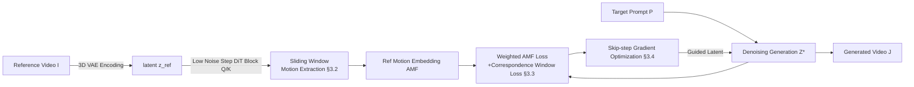

# FastVMT: Eliminating Redundancy in Video Motion Transfer

**Conference**: ICLR 2026  
**OpenReview**: [https://openreview.net/forum?id=ILdBjlgibb](https://openreview.net/forum?id=ILdBjlgibb)  
**Code**: To be confirmed  
**Area**: Video Generation / Motion Transfer  
**Keywords**: Video Motion Transfer, Diffusion Transformer, Training-Free, Attention Redundancy, Gradient Reuse  

## TL;DR
By identifying and eliminating two types of redundancy in training-free video motion transfer pipelines—"motion redundancy" in attention and "gradient redundancy" in optimization—FastVMT utilizes sliding window motion extraction and skip-step gradient optimization to achieve an average 3.43× speedup (up to 14.91×) with almost no loss in fidelity or temporal consistency.

## Background & Motivation
**Background**: Video motion transfer aims to transfer the motion patterns (object movements, camera trajectories) of a reference video to a target video while following text prompts for content generation. Recent methods are generally built on Diffusion Transformer (DiT) backbones. Training-based methods (MotionDirector, DeT, etc.) use dual-path LoRA fine-tuning to decouple motion and appearance, but require re-overfitting for every new reference video. Overfitting a single video can take up to 2 hours on an A100, making it unsuitable for open-domain and real-time scenarios. Training-free methods instead invert the reference video into the DiT embedding space during inference to extract motion features and use gradient guidance between source/target motion embeddings to guide denoising. This bypasses per-video fine-tuning, reducing generation time to approximately 10 minutes.

**Limitations of Prior Work**: Even training-free pipelines suffer from two structural inefficiencies. First, the motion embedding extraction stage follows global token similarity—each token calculates similarity with all tokens in the next frame's attention map, incurring huge overhead. Second, the denoising stage recomputes all gradients at every internal optimization step. Existing acceleration works only optimize at the operator level and do not address these **structural** sources of redundancy.

**Key Challenge**: The general attention mechanism of DiTs does not reflect physical priors of video—inter-frame motion is typically small and locally smooth, meaning corresponding tokens appear in neighborhoods rather than across the whole image. Similarly, gradients along the denoising trajectory change slowly, with high similarity between adjacent optimization steps. Following an "all-compute" implementation repeatedly wastes computation on known redundancies.

**Goal**: Systematically reduce the computational cost of training-free motion transfer without adding training or sacrificing visual fidelity and temporal consistency.

**Key Insight**: **[Motion Redundancy → Local Window]** Constrain attention calculation for motion extraction to spatio-temporal local windows. **[Gradient Redundancy → Skip-step Reuse]** Recompute gradients only at selected optimization steps and reuse the most recently cached gradients for the remaining steps.

## Method

### Overall Architecture
Given an input video $I=[I_1,\dots,I_n]$ and a target content prompt $P$, FastVMT uses the WAN-2.1 DiT video generation model as a base. It operates in three phases: the **inversion phase** extracts reference motion embeddings from attention using a sliding window; the **denoising phase** calculates alignment losses and guides generation using skip-step gradient optimization; meanwhile, a correspondence window loss constrains temporal consistency. These designs correspond to "faster extraction", "more accurate extraction", and "cheaper updates".

### Key Designs

**1. Sliding Window Motion Extraction: Reducing frame-pair matching from $O(F^2)$ to $O(F)$ using locality.** The authors note that motion signals are naturally hidden in the query-key interactions of DiT self-attention—cross-frame related content is captured by attention. They feed reference latents into specific DiT blocks at low denoising steps ($t=0$) to extract Q and K, and partition the spatial dimension into tiles of $(t_h,t_w)$. For each tile, the center is taken as the representative query, and a representative attention map is calculated against all keys of the target frame: $A^{rep}_{ij}=\mathrm{softmax}\big(Q^{(i)}_{rep}(K^{(j)})^T/\sqrt{D_h}\cdot\tau\big)$. This is used to estimate each tile's window center $c^{(ij)}_{uv}=\sum_s A^{rep}_{ij}[s]\cdot\mathrm{pos}(s)$. Based on the observation that the most relevant keys are local due to finite motion speeds, formal AMF calculation is constrained within a temporal window $T_{window}(q_i)=\{q_j: j\in[i,\min(i+s_f,N)]\}$ and a spatial window $S_{window}$. Tile-level window centers are given by $c^{(ij)}_{block}=P_{block}+\arg\max_{(h,w)}(Q^{(i)}_{rep}(K^{(j)})^T)_{h,w}$. This reduces time complexity from $O(F^2)$ to $O(F)$ and only computes relevant keys in local windows. An additional benefit: local constraints correct false correspondences (e.g., matching a dog's nose to the road) that often occur in global matching, thereby improving motion consistency.

**2. Correspondence Window Loss: Ensuring both alignment and temporal stability.** Extraction alone is insufficient; the authors use two losses to constrain generation. The Weighted AMF Loss aligns displacement matrices of reference and generated videos: $L_{AMF}=\frac{1}{|F|}\sum_{(i,j)\in F} w_{|j-i|}\cdot\|\Delta^{ref}_{ij}-\Delta^{gen}_{ij}\|_2^2$, where weights linearly decay with frame distance $w_d=1.0-\alpha\frac{d-1}{s_f-1}$ ($\alpha=0.2$). The Correspondence Window Loss penalizes inconsistencies in key representations within windows between adjacent frames: $L_{window}=\frac{1}{F}\sum_i\frac{1}{P}\sum_p\frac{1}{N_i-1}\sum_t\|\bar K^{(p)}_{i\to j_{t+1}}-\bar K^{(p)}_{i\to j_t}\|_2^2$, smoothing the average keys of the same tile anchored to different target frames. The total loss is $L_{total}=\lambda_{AMF}L_{AMF}+\lambda_{window}L_{window}$ ($\lambda_{AMF}=5$ for alignment, $\lambda_{window}=1$ for temporal balance). Ablations show that removing the correspondence window loss drops motion fidelity from 0.7471 to 0.5942, proving it is key to motion accuracy.

**3. Skip-step Gradient Optimization: Reducing internal optimization gradient computation to ~ $1/\Delta$.** PCA analysis revealed that gradients of adjacent internal optimization steps within the same denoising time step are highly similar ("stable gradient optimization"), analogous to how DDIM replaces stochastic sampling with deterministic sampling in DDPM. A fixed interval $\Delta$ for gradient reuse is introduced: the gradient is backpropagated only if $j\bmod\Delta=0$ (or in full AMF mode); otherwise, the method reuses the last cached gradient. $L_j=\nabla_x L_{total}(x_j)$ is triggered only at selected steps, and other steps use $x_j\cdot g_{cached}$, with the cache updated as $g_{cached}=g_j\ (j\bmod\Delta=0)$. This reduces gradient computation per guidance from $J$ times to approximately $\lceil J/\Delta\rceil$. Testing 1/2/3-step skips showed progressive speedups (284.3s→186.7s→173.9s→160.6s), though 3-step skips caused significant motion fidelity collapse (92.4→71.8), indicating optimization trajectories only remain similar within small intervals. The authors selected a conservative skip setting to maintain quality.

## Key Experimental Results

The base model is the open-source WAN-2.1, with 50 denoising steps, outputting 480×832 resolution at 81 frames. Sliding window AMF guidance is active for the first 20% of outer denoising steps, with 10 internal latent optimization steps (AdamW, learning rate 0.003→0.002 linear decay) per step. Q/K are extracted from the 15th DiT block. The evaluation uses 50 high-quality videos from DAVIS, plus 40 real and 40 generated videos.

### Main Results

| Method | Category | Text Sim.↑ | Motion Fid.↑ | Temp. Cons.↑ | Time(s)↓ | Sub. Cons.↑ | Motion Smooth.↑ |
|------|------|-----------|-------------|-------------|---------|------------|----------------|
| MotionInversion | Training-based | 0.2388 | 0.6515 | 0.9605 | 632.41 | 0.9339 | 0.9532 |
| MotionDirector | Training-based | 0.2336 | 0.4524 | 0.9531 | 806.64 | 0.9173 | 0.9633 |
| DeT | Training-based | 0.2187 | 0.6116 | 0.9818 | 2745.60 | 0.9787 | 0.9598 |
| MOFT | Training-free | 0.2297 | 0.6511 | 0.9797 | 595.81 | 0.9593 | 0.9716 |
| MotionClone | Training-free | 0.2304 | 0.7315 | 0.9722 | 397.05 | 0.9601 | 0.9616 |
| SMM | Training-free | 0.2374 | 0.7353 | 0.9366 | 809.70 | 0.8907 | 0.9702 |
| DiTFlow | Training-free | 0.2091 | 0.4062 | 0.9822 | 626.83 | 0.9557 | 0.9801 |
| **Ours** | Training-free | **0.2422** | **0.7471** | **0.9865** | **184.18** | **0.9809** | **0.9891** |

FastVMT achieves the best or tied-best results across all metrics while being the fastest method: approximately 3.4× faster than DiTFlow, 4.4× faster than SMM, and 14.9× faster than DeT.

### Ablation Study

| Configuration | Text Sim.↑ | Motion Fid.↑ | Temp. Cons.↑ | Time(s)↓ |
|------|-----------|-------------|-------------|---------|
| w/o Sliding Window | 0.2352 | 0.6912 | 0.9654 | 227 |
| w/o Correspondence Loss | 0.2345 | 0.5942 | 0.9762 | 183 |
| w/o Skip-step Optimization | 0.2317 | 0.7044 | 0.9881 | 302 |
| **Full** | **0.2422** | **0.7471** | **0.9865** | **184** |

### Key Findings
- Removing the sliding window not only decreases motion fidelity (0.7471→0.6912) but also increases time from 184s to 227s—local constraints save computation while improving quality.
- The correspondence window loss has the greatest impact on motion fidelity (0.7471→0.5942), yet adds <1% time overhead, making it highly cost-effective.
- Skip-step optimization is the primary source of acceleration: without it, time increases from 184s to 302s while quality remains comparable, validating the effectiveness of gradient reuse.
- Attention-based motion extraction is most accurate in the middle layers (Block 15) of the DiT.

## Highlights & Insights
- **Translating "Physical Priors" into "Computational Constraints"**: Smoothing inter-frame motion maps to local attention windows; slowly changing denoising gradients map to skip-step reuse. Both redundancies are confirmed via visualization (attention correspondence, PCA) before being addressed.
- **Acceleration without Sacrificing Quality**: 3.43× speedup is nearly lossless, and 14.91× speedup still leads in quality. This indicates the method prunes genuine redundancy rather than effective computation—differing from the "efficiency vs. accuracy" trade-off seen in simple quantization or distillation.
- **Unexpected Benefits of Local Constraints**: The sliding window, originally intended for speed, also corrects false global correspondences, thereby improving motion consistency.

## Limitations & Future Work
- The skip-step interval has a hard upper limit: at 3 steps, motion fidelity collapses from 92.4 to 71.8, showing gradient similarity only holds within small intervals. Adaptive skip strategies remain an area for exploration.
- The method is tied to a specific backbone (WAN-2.1), specific DiT blocks (Layer 15), and specific hyperparameters (first 20% steps for guidance, $\lambda_{AMF}=5$). Robustness across backbones/resolutions has not been fully verified.
- Evaluation resolution and frame counts are restricted by baselines (32 frames, 830×480). Performance on longer videos or more intense/multi-subject interactive motions is unknown.
- Parameters such as window size $l$ and time span $s_f$ require manual setting. For very fast or large displacements, larger windows might be needed, posing a risk of failure if the window does not match the motion speed.

## Related Work & Insights
- **Training-based Motion Transfer** (MotionDirector, DreamMotion, DeT): Uses dual-path LoRA to decouple motion and appearance. High quality, but per-video fine-tuning is expensive and non-reusable. FastVMT bypasses this cost via a training-free route.
- **Training-free Motion Transfer** (DiTFlow, MOFT, MotionClone, SMM): DiTFlow introduced Attention Motion Flow (AMF) optimization. FastVMT identifies and eliminates redundancies directly within this framework, representing a paradigm for structural efficiency in existing training-free pipelines.
- **Deterministic Sampling Analogy** (DDPM→DDIM): Skip-step gradient reuse draws on the intuition that adjacent steps are highly similar and can be skipped, effectively transferring this concept from sampling trajectories to optimization trajectories.
- **Inspiration for Future Work**: Explicitly quantifying mismatches between "general architecture vs. task physical priors" as redundancy and eliminating them with lightweight constraints is a universal strategy for training-free efficiency, applicable to other attention-guided controllable generation tasks.

## Rating
- **Novelty**: ⭐⭐⭐⭐ — Instead of a new backbone, it offers a clear path by identifying two types of structural redundancy through local windows and skip-step reuse. The DDIM-to-optimization-trajectory analogy is clever.
- **Experimental Thoroughness**: ⭐⭐⭐⭐ — 7 baselines, including automated metrics, VBench, and user studies, along with full three-module ablations. However, backbones and resolutions are somewhat limited.
- **Writing Quality**: ⭐⭐⭐⭐ — The logic from motivation and observation to method and validation is smooth. Formulas and visualizations (attention, PCA, skip-step trajectories) provide strong support.
- **Value**: ⭐⭐⭐⭐ — Achieving 3.43× nearly lossless and 14.91× leading-quality speedups directly lowers the barrier for training-free motion transfer, offering high practical value for real-time and open-domain content creation.

<!-- RELATED:START -->

## Related Papers

- [\[ICLR 2026\] EffiVMT: Video Motion Transfer via Efficient Spatial-Temporal Decoupled Finetuning](effivmt_video_motion_transfer_via_efficient_spatial-temporal_decoupled_finetunin.md)
- [\[CVPR 2026\] FlowMotion: Training-Free Flow Guidance for Video Motion Transfer](../../CVPR2026/video_generation/flowmotion_training-free_flow_guidance_for_video_motion_transfer.md)
- [\[CVPR 2025\] DiTFlow: Video Motion Transfer with Diffusion Transformers](../../CVPR2025/video_generation/video_motion_transfer_with_diffusion_transformers.md)
- [\[NeurIPS 2025\] DisMo: Disentangled Motion Representations for Open-World Motion Transfer](../../NeurIPS2025/video_generation/dismo_disentangled_motion_representations_for_openworld_moti.md)
- [\[CVPR 2026\] Let Your Image Move with Your Motion! – Implicit Multi-Object Multi-Motion Transfer](../../CVPR2026/video_generation/let_your_image_move_with_your_motion_--_implicit_multi-object_multi-motion_trans.md)

<!-- RELATED:END -->
