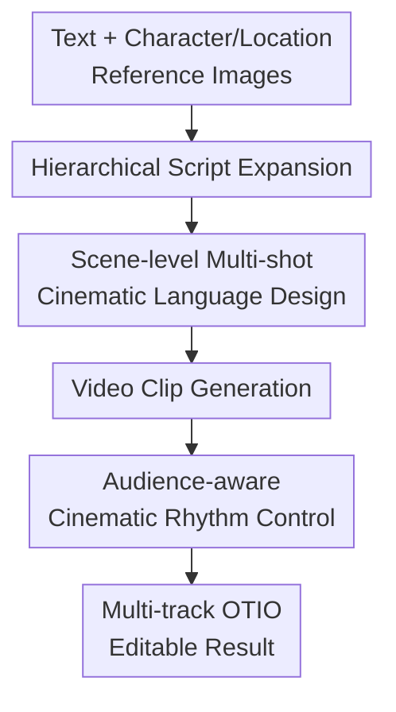

# FilMaster: Bridging Cinematic Principles and Generative AI for Automated Film Generation

**Conference**: ICLR2026  
**OpenReview**: [https://openreview.net/forum?id=ovSDneawKY](https://openreview.net/forum?id=ovSDneawKY)  
**Code**: None  
**Area**: Video Generation  
**Keywords**: Automated Film Generation, Video Generation, Cinematic Language, Scene-level RAG, Audio-visual Rhythm

## TL;DR
FilMaster is an end-to-end system for automatically generating editable films from text and character/scene reference images. It explicitly introduces cinematic language and professional post-production workflows from real films into the generation pipeline, significantly outperforming Anim-Director, MovieAgent, and LTX-Studio in both camera language and cinematic rhythm.

## Background & Motivation
**Background**: Video generation models have become capable of synthesizing increasingly high-quality visuals. Systems such as Sora, HunyuanVideo, WanVideo, Veo, Runway, and MovieGen have pushed the visual quality of single video clips to a high level. Conversely, LLMs/MLLMs are being utilized for script expansion, storyboard planning, multi-agent collaboration, and automated filmmaking, with typical systems including Anim-Director, MovieAgent, FilmAgent, and the commercial LTX-Studio.

**Limitations of Prior Work**: The issue with these systems is not merely that "the visuals are not sharp enough," but rather a gap in professional filmmaking. First, cinematic language is often hallucinated by LLMs from scratch, leading to static camera positions, templated perspectives, or abrupt changes in motion between adjacent shots, which causes a lack of coherent visual narrative within a scene. Second, many systems simply concatenate generated clips with basic voiceovers or sound effects, lacking editing rhythm, audio layering, and audio-visual synchronization, resulting in a sequence of materials rather than a rhythmic film.

**Key Challenge**: The gap between automated video generation and professional film fundamentally stems from the decoupling of "pixel generation capability" and "cinematic principle execution." Video models can generate a single clip based on a prompt but do not understand how multiple shots in a scene should collectively serve a narrative goal. While LLMs can write storyboards, they often produce generalized, flat, or unstable camera plans without reference to real cinematic experience.

**Goal**: The authors aim to build a script-to-screen automated film generation system. Given a text input and optional character/location reference images, the system not only generates video clips but also plans cinematic language, performs rough/fine cuts, designs multi-track audio, and outputs a structured timeline that can be further edited in professional software.

**Key Insight**: FilMaster starts with two real-world principles of the film industry. Cinematic language is not invented by the LLM from scratch but is retrieved and learned from a vast library of real film clips. Cinematic rhythm is not simple splicing but mimics professional post-production workflows involving Rough Cuts, audience feedback, Fine Cuts, and sound design.

**Core Idea**: Utilize "scene-level real film reference retrieval" to guide multi-shot camera planning, and "simulated audience feedback-driven post-coordination" to control editing and multi-track sound, thereby connecting generative video capabilities to a professional production workflow.

## Method
The FilMaster approach consists of two stages: THE Generation Stage, which converts input text and reference images into raw video clips, and the Coordination Stage, which edits these clips into a rhythmic, multi-layered audio film that remains editable. Rather than proposing a new underlying video diffusion model, it introduces a system-level generation framework: upstream LLMs/MLLMs handle script, shot, and post-production decisions, while downstream tools handle video generation, audio retrieval/generation, and timeline encapsulation.

### Overall Architecture
Given text $T$, a set of character references $I_c$, and location references $I_l$, the system first performs coarse-to-fine script expansion using an LLM, expanding a synopsis into a storyboard and then into scenes with specific time, location, characters, visual elements, and narrative objectives. Subsequently, FilMaster performs scene-level cinematic language design to generate shot prompts (including camera movement, shot type, angle, and atmosphere) and calls video models to generate raw clips. Finally, the Coordination Stage produces a Rough Cut, uses an MLLM to simulate target audience feedback to drive structured Fine Cut adjustments and multi-track sound design, and outputs an editable film in OpenTimelineIO format.

Formally, the Generation Stage is denoted as $G$ and the Coordination Stage as $C$. The system first generates a set of raw video clips $V_{clips}=G(T,I_c,I_l)$, then coordinates these into the final film $F_{film}=C(V_{clips})$. The final $F_{film}$ is not a single flattened video file but an OTIO timeline containing video and multiple audio tracks, making it closer to actual post-production assets.

### Key Designs
**1. Scene-level Multi-shot Cinematic Language Design: Planning Shot Groups via Shared Narrative Context**

The critical observation of FilMaster is that cinematic language usually serves a *scene*, rather than an isolated *shot*. Multiple shots within a scene share time, location, characters, and narrative goals; if each shot retrieves references independently, visual incoherence (e.g., jumping from an orbit to a pan to a sudden close-up) occurs.

The authors propose scene-level RAG. For a scene $S$, the system concatenates the original shot prompts $P$, spatio-temporal context $C$, and narrative objective $O$ into a unified query: $q=E(S)=E((P,C,O))$. The same embedding model encodes 440,000 real film clip text descriptions $D_{film}=\{d_i\}_{i=1}^{N}$ into a vector library $V_{db}=\{v_i\mid v_i=E(d_i)\}$. During retrieval, instead of finding references for each shot, a query for the entire scene finds top-$K$ semantically similar film clips, resulting in a reference set $R=\{d_i\mid i\in I\}$. These real references, along with the scene description, are provided to the LLM to generate a group of camera-aware prompts $P_{camera}=\pi_{re-plan}(S,R)$.

This design anchors "cinematic feel" in real snippets rather than vague prompt adjectives and elevates the planning granularity from shot to scene. This ensures the LLM coordinates movements like zoom-in, close-up, and pull-back under a single narrative objective.

**2. Audience-aware Cinematic Rhythm Control: Post-production via Rough Cut, Feedback, and Fine Cut**

FilMaster treats cinematic rhythm as a post-production problem. The system assembles generated clips and placeholder audio into a Rough Cut $T_{rough}$, then defines a target audience persona $A_{target}$ (e.g., "short-drama audience"). An LLM generates a preference profile $P_{audience}$ via search, and an MLLM watches the Rough Cut as a simulated viewer to provide critiques $F_{critique}$ regarding pacing, structure, and audio.

These critiques are converted by another LLM into executable actions $R_{actions}$, covering structure, duration, and audio coherence. The video editing module executes operations $O=\{rearrange, trim, accelerate\}$ on the rough video track to obtain a picture-locked Fine Cut $V_{fine}$. Robustness experiments indicate that separating the review and correction tasks prevents the model from being overwhelmed by multi-objective goals, and the audience perspective provides the necessary drive for refinement.

**3. Multi-scale Audio-visual Synchronization: Designing Sound across Scene, Shot, and Event Scales**

FilMaster decomposes audio into five categories: background ambiance, musical scoring, voice-over, foley, and sound effects, generating or retrieving them based on different time scales. Ambiance and scoring serve scene-level emotion; VO is aligned at the shot-level for narrative synchronization; foley and SFX operate at the intra-shot level, where an MLLM analyzes second-level actions to match specific sounds.

To maintain clarity, the system uses an audio library of 46,826 assets (including 5,877 music tracks) for RAG. Audio tracks undergo loudness, frequency, and dynamic equalization (e.g., maintaining high VO intelligibility while ducking background frequencies that conflict with speech). This ensures sound fits the visual rhythm at the correct scale.

**4. Editable Structured Output: Returning Results to Professional Workflows**

FilMaster outputs the film encapsulated as an OpenTimelineIO (OTIO) timeline. This allows professional creators to continue adjusting shot order, clip duration, and audio mixing in software like DaVinci Resolve. By organizing AI outputs as production assets, FilMaster reduces the friction between research demos and real production workflows.

### Main Results
The paper demonstrates the workflow using the input "The Little Prince and the White Fox encounter a sad rose during a space journey." The system expands this into scenes and uses scene-level RAG to retrieve universe/fantasy references. The LLM creates a camera-aware sequence starting with a wide sweeping shot of space, zooming into the asteroid, and orbiting to capture the Prince's expression. During post-production, a simulated audience points out that a slow opening weakens engagement, triggering a Fine Cut that accelerates the clip to 3 seconds. Sound design adds five tracks including atmospheric "whooshing," voice-overs, and soft music.

### Loss & Training
This paper does not train a new end-to-end video model. The system relies on modular calls to existing tools: GPT-4o for scripts, RAG, and editing; Gemini-2.0-Flash for audience-aware review and sound effects; Kling Elements 1.6 for video generation; and text-embed-3-small for embedding ($K=3$).

The "strategy" involves explicit process constraints: coarse-to-fine script workflows and multi-modal information decoupling in the post-production stage. Decoupling visual perception (captioning) from reasoning (editing) significantly improves the success rate of corrections.

## Key Experimental Results

### Main Results
The authors constructed FilmEval, evaluating 6 dimensions: Narrative and Script, Audiovisuals and Techniques, Aesthetics and Expression, Rhythm and Flow, Emotional and Engagement, Overall Experience (12 sub-metrics). Camera Language (CL) and Cinematic Rhythm (CRh) are derived metrics.

| Method | CL ↑ | CRh ↑ | Description |
|------|------|-------|------|
| Anim-Director | 2.96 | 1.94 | Script design present, lacks camera language and audio |
| Anim-Director† | 3.02 | 2.38 | Same video model, still lacks post-production rhythm |
| MovieAgent | 2.74 | 1.74 | Multi-agent planning, but template-based camera/audio |
| MovieAgent† | 2.55 | 1.98 | Significantly lower than Ours under same video model |
| LTX-Studio* | 3.74 | 3.62 | Commercial system, strong visuals but limited rhythm/sync |
| FilMaster† | 4.50 | 4.32 | Ours; highest in both core dimensions |

| Method | NS ↑| AT ↑ | AE ↑ | RF ↑ | EE ↑ | OE ↑ | CL ↑ | CRh ↑ | Avg ↑ |
|------|------|------|------|------|------|------|------|-------|-------|
| Anim-Director | 1.94 | 2.16 | 1.94 | 2.12 | 2.12 | 2.36 | 2.15 | 2.04 | 2.11 |
| Anim-Director† | 1.94 | 2.35 | 1.44 | 1.94 | 1.84 | 2.20 | 2.16 | 1.85 | 1.95 |
| MovieAgent | 1.57 | 1.63 | 1.70 | 1.70 | 2.20 | 2.27 | 1.66 | 1.83 | 1.84 |
| MovieAgent† | 1.32 | 2.38 | 1.68 | 2.02 | 1.96 | 1.92 | 2.01 | 1.89 | 1.88 |
| LTX-Studio* | 2.28 | 3.04 | 3.22 | 2.90 | 3.16 | 2.96 | 2.80 | 3.05 | 2.92 |
| FilMaster† | 3.70 | 3.80 | 3.80 | 3.73 | 3.93 | 3.87 | 3.76 | 3.82 | 3.79 |

In user studies, FilMaster achieved an average score of 3.79, significantly higher than LTX-Studio (2.92). Human evaluation showed a Gain of 74.17% in camera language and 79.26% in cinematic rhythm.

### Ablation Study
| Configuration | Avg ↑ | Description |
|------|-------|------|
| w/o Camera + Rhythm | 3.75 | Removed camera design and rhythm control |
| w/o Rhythm | 4.17 | Camera language kept, but no audience-aware rhythm control |
| Ours | 4.67 | Full system with scene-level design and rhythm control |

| Configuration | Corrected Ratio ↑ | Success Ratio ↑ | Description |
|------|-------------------|-----------------|------|
| Analysis and Correct | 60% | 50% | Single model for both analysis and correction |
| w/o Audience Perspective | 50% | 50% | Lack of audience view reduces motivation to correct |
| Ours (Full System) | 100% | 100% | Separated review/edit + audience feedback |
| Directly addressing multimodal info | 100% | 0% | Direct multi-modal processing yields unreliable corrections |
| Ours (Separating multimodal info) | 100% | 90% | Captioning followed by reasoning improves decisions |

### Key Findings
- Scene-level RAG ensures shot coherence. Shot-level RAG leads to disjointed jumps (e.g., orbit to pan), whereas scene-level RAG creates complementary motion chains.
- Rhythm modules contribute heavily to scores. Removing Rhythm drops the average from 4.67 to 4.17, confirming that editing and audio sync fundamentally change perception.
- The audience perspective is essential. Without it, the system defaults to a "director's view" where the rough cut is deemed sufficient.
- Multi-modal decoupling is vital for post-production. Converting video to text captions before reasoning improves success rates from 0% to 90%.

## Highlights & Insights
- FilMaster translates cinematic principles into explicit system modules rather than just relying on the keyword "cinematic" in prompts. It provides checkable intermediate products: retrieved references, shot re-plans, and OTIO timelines.
- Scene-level RAG granularity is ideal. It is more localized and easier to match than full-film retrieval but provides better consistency than shot-level retrieval.
- The focus on "editable output" through OTIO allows the system to function as a professional assistant, bridging the gap between research demos and production pipelines.

## Limitations & Future Work
- The system relies on commercial closed-source components (GPT-4o, Gemini, Kling, ElevenLabs), which impacts reproducibility costs and consistency.
- The real film reference library is proprietary, limiting external validation of retrieval quality or potential bias.
- While FilmEval is more realistic than traditional metrics, automatic evaluation via Gemini-1.5-Flash may inherit MLLM aesthetic biases.
- Validation is needed for long-form films where character consistency and long-term narrative arcs become more challenging.

## Related Work & Insights
- **vs Anim-Director**: Anim-Director focuses on script expansion for animation but lacks real-film-driven camera language and multi-track rhythm control.
- **vs MovieAgent**: MovieAgent uses multi-agent planning for scenes, but its camera and audio remain templated compared to FilMaster's RAG-based approach.
- **vs LTX-Studio**: FilMaster emphasizes multi-track audio and audience-aware Fine Cutting, whereas LTX-Studio's commercial output can sometimes feel slow or repetitive in rhythm.

## Rating
- Novelty: ⭐⭐⭐⭐⭐ Integrates cinematic principles, scene-level RAG, and audience-aware editing into a coherent framework.
- Experimental Thoroughness: ⭐⭐⭐⭐☆ Extensive ablation and user studies, though limited by closed-source dependencies.
- Writing Quality: ⭐⭐⭐⭐☆ Clear main narrative; however, component details are somewhat scattered.
- Value: ⭐⭐⭐⭐⭐ Advances the field from "clip generation" to "editable, rhythmic film production."

<!-- RELATED:START -->

## Related Papers

- [\[ICLR 2026\] Anchor Frame Bridging for Coherent First-Last Frame Video Generation](anchor_frame_bridging_for_coherent_first-last_frame_video_generation.md)
- [\[CVPR 2026\] STAGE: Storyboard-Anchored Generation for Cinematic Multi-shot Narrative](../../CVPR2026/video_generation/stage_storyboard-anchored_generation_for_cinematic_multi-shot_narrative.md)
- [\[AAAI 2026\] GenVidBench: A 6-Million Benchmark for AI-Generated Video Detection](../../AAAI2026/video_generation/genvidbench_a_6-million_benchmark_for_ai-generated_video_detection.md)
- [\[CVPR 2026\] CineScene: Implicit 3D as Effective Scene Representation for Cinematic Video Generation](../../CVPR2026/video_generation/cinescene_implicit_3d_as_effective_scene_representation_for_cinematic_video_gene.md)
- [\[CVPR 2026\] HoloCine: Holistic Generation of Cinematic Multi-Shot Long Video Narratives](../../CVPR2026/video_generation/holocine_holistic_generation_of_cinematic_multi-shot_long_video_narratives.md)

<!-- RELATED:END -->
