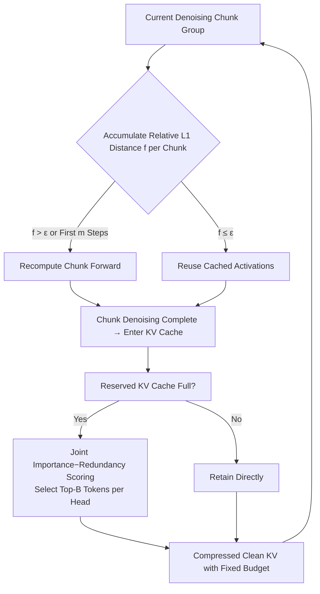

# Flow Caching for Autoregressive Video Generation

**Conference**: ICLR 2026  
**OpenReview**: [https://openreview.net/forum?id=vko4DuhKbh](https://openreview.net/forum?id=vko4DuhKbh)  
**Code**: [https://github.com/mikeallen39/FlowCache](https://github.com/mikeallen39/FlowCache)  
**Area**: Video Generation / Inference Acceleration  
**Keywords**: Autoregressive Video Generation, Feature Caching, KV Cache Compression, Diffusion Transformer, Training-free Acceleration  

## TL;DR
FlowCache identifies that different chunks in autoregressive video generation are in heterogeneous denoising states at the same timestep. Consequently, it replaces "uniform whole-frame caching" with an independent chunkwise adaptive caching strategy, complemented by a joint importance-redundancy KV cache compression. This achieves 2.38× and 6.7× speedups on MAGI-1 and SkyReels-V2, respectively, with near-lossless visual quality.

## Background & Motivation
- **Background**: Autoregressive video models (MAGI-1, SkyReels-V2) segment ultra-long videos into fixed-frame chunks and perform Causal Diffusion-Forcing denoising on each chunk, reducing the complexity of long-video inference from quadratic to linear. This is viewed as a viable path for real-time ultra-long video generation. However, it remains extremely slow at high resolutions—generating 10 seconds of 720×720 video with MAGI-1-4.5B-distill on an A800 requires approximately 32GB VRAM and 50 minutes.
- **Limitations of Prior Work**: Training-free feature caching methods (TeaCache, ToCa, DiCache, etc.) can accelerate traditional DiT diffusion, but they default to the assumption that "denoising levels are consistent across all frames at the same timestep," applying the same reuse/recompute decision to all content. This assumption fails completely in autoregressive models.
- **Key Challenge**: Empirical measurements of the relative L1 distance between adjacent timesteps in MAGI-1/SkyReels-V2 revealed three patterns: (i) the closer to a clean video, the lower the similarity between adjacent steps (reuse is impossible in late-stage denoising); (ii) **different chunks at the same mid-timestep are at different denoising stages, showing massive similarity differences**; (iii) model inputs and sampling outputs remain highly similar throughout. Uniform caching cannot balance "chunks near clean state that must be recomputed" with "chunks still in the noise stage that can be aggressively reused."
- **Goal**: Design the first caching framework specifically for autoregressive video generation that allows each chunk to have an independent caching strategy while controlling the KV cache memory growth during generation.
- **Core Idea**: **[Chunkwise Independent Caching]** Analogize video chunks to tokens in an LLM, independently deciding to compute or reuse based on their respective relative L1 distance trajectories; **[Joint Importance-Redundancy KV Compression]** Retain historical tokens that are both important for current denoising and non-redundant with each other under a fixed memory budget.

## Method

### Overall Architecture
FlowCache is a training-free two-part suite: on the denoising side, **chunkwise adaptive caching** replaces uniform caching, with recomputation vs. reuse decided by accumulating relative L1 distances per chunk; on the memory side, **joint importance-redundancy KV cache compression** compresses denoised clean chunks into a fixed-budget buffer to maintain long-term temporal consistency. The former is theoretically justified by Theorem 1 + Corollary 1, proving that "caching must be separated by chunk," while the latter solves the linear VRAM expansion of the KV cache in autoregressive generation.

### Key Designs

**1. Chunkwise Relative L1 Distance and Monotonicity Theorem: Why Cache Must be Split.** Under the autoregressive setting, the relative L1 distance of the $i$-th chunk at timestep $t$ can be written as a normalized form of the update: $L1_{rel}(X,t,i)=\frac{\lVert X^i_{t-1}-X^i_t\rVert_1}{\lVert X^i_t\rVert_1}=\frac{\lVert v_\theta(X^i_t,t,c)\cdot\Delta t\rVert_1}{\lVert X^i_t\rVert_1}$. The authors' Theorem 1 states: when the model converges to the optimal velocity field of flow matching and the scheduler follows a power law $\sigma(t)=(t/T)^p$, $L1_{rel}$ increases monotonically as denoising progresses—meaning the closer a chunk is to a real video, the less similar adjacent steps become, and the less it should be reused. Corollary 1 further explains that as long as chunk contents are heterogeneous (state norms $\lVert X^i_t\rVert_1\neq\lVert X^j_t\rVert_1$) but update magnitudes are approximately the same, their $L1_{rel}$ at the same $t$ must differ. This elevates the "uniform caching is irrational" observation to a theoretical conclusion.

**2. Chunkwise Adaptive Caching Decision.** Each chunk maintains a recursive cumulative value $f(X,t,i)$ to decide whether to compute or reuse: the first $m$ timesteps are forced to recompute ($f=0$); for other steps, if $f(X,t+1,i)+L1_{rel}(X,t,i)>\epsilon$, recomputation is triggered and $f$ is reset; otherwise, accumulation and reuse continue. The intuition is to compare the "cumulative change since the last recomputation" with a threshold $\epsilon$—chunks near Gaussian noise change slowly and can be reused for multiple steps, while chunks near clean video change rapidly and trigger frequent recomputation. Parameters $m$ (5 for MAGI-1, 4 for SkyReels-V2) protect early denoising quality, and $\epsilon$ distinguishes between slow/fast settings (e.g., MAGI-slow 0.01, MAGI-fast 0.015). The independent trajectory of each chunk is key to simultaneously improving speed and quality compared to uniform strategies like TeaCache.

**3. Joint Importance-Redundancy KV Cache Compression.** In autoregressive video, all denoised clean chunks enter the KV cache for attention by subsequent chunks, causing VRAM to expand linearly. LLM strategies that select top tokens solely by importance (attention scores) fail for video—spatiotemporal redundancy means high-scoring tokens are often nearly identical, causing the cache to be filled with redundant content while losing historical diversity. FlowCache splits a fixed buffer $B_{total}$ into a compressed clean area $B_{budget}$ and a current denoising area $B_{active}$. When full, newly completed chunks are merged and compressed. Scoring considers two terms: Importance $\widetilde{Imp}^{(h)}$ is derived from the attention softmax of current denoising queries on clean keys, averaged across queries, followed by 1D max-pooling; Redundancy $Red^{(h)}_j=\mathrm{softmax}\big(\frac1{L_k}\sum_i S^{(h)}_{ij}\big)$ is the cross-token average of cosine similarities (diagonal zeroed) between $\ell_2$-normalized keys. The final selection score for each head is $Score^{(h)}_j=\lambda\cdot\widetilde{Imp}^{(h)}_j-(1-\lambda)\cdot Red^{(h)}_j$, with the top-B tokens per head retained. This ensures records relevant to current denoising are kept alongside non-redundant history within a fixed budget.

## Key Experimental Results

### Main Results (Inference Efficiency and Quality, A800)

| Model | Method | PFLOPs↓ | Speedup↑ | Latency(s)↓ | VBench↑ | LPIPS↓ | SSIM↑ | PSNR↑ |
|---|---|---|---|---|---|---|---|---|
| MAGI-1 | Vanilla | 306 | 1× | 2873 | 77.06 | - | - | - |
| | TeaCache-fast | 225 | 1.44× | 1998 | 70.11 | 0.816 | 0.114 | 8.94 |
| | **FlowCache-slow** | 161 | 1.86× | 1546 | **78.96** | 0.316 | 0.650 | 22.34 |
| | **FlowCache-fast** | 140 | **2.38×** | 1209 | 77.93 | 0.431 | 0.514 | 19.27 |
| SkyReels-V2 | Vanilla | 113 | 1× | 1540 | 83.84 | - | - | - |
| | TeaCache-fast | 49 | 2.2× | 686 | 80.06 | 0.306 | 0.612 | 18.39 |
| | **FlowCache-slow** | 36 | 5.88× | 262 | 83.12 | 0.123 | 0.789 | 23.74 |
| | **FlowCache-fast** | 28 | **6.7×** | 230 | 83.05 | 0.147 | 0.764 | 22.95 |

### Ablation Study (Fast Setting, Reuse Strategy vs. KV Compression)

| Model | Reuse Strategy | KV Compression | VBench↑ | LPIPS↓ | SSIM↑ | PSNR↑ |
|---|---|---|---|---|---|---|
| MAGI-1 | TeaCache | - | 70.11 | 0.816 | 0.114 | 8.94 |
| | ChunkWise | - | 77.66 | 0.421 | 0.523 | 19.89 |
| | ChunkWise | Enabled | 77.93 | 0.431 | 0.514 | 19.27 |
| SkyReels-V2 | TeaCache | - | 80.06 | 0.306 | 0.612 | 18.39 |
| | ChunkWise | - | 83.12 | 0.123 | 0.789 | 23.74 |
| | ChunkWise | Enabled | 83.01 | 0.157 | 0.743 | 22.61 |

### Key Findings
- **Chunkwise caching is the primary quality driver**: On MAGI-1, TeaCache-fast dropped VBench from 77.50 to 70.11, while chunkwise reuse maintained original levels (77.66), proving uniform caching is the root cause of quality collapse in autoregressive scenarios.
- **KV compression is nearly lossless**: Enabling KV cache compression only marginally affected VBench (MAGI-1 77.66→77.93, SkyReels-V2 83.12→83.01), showing joint importance-redundancy pruning preserves quality under fixed VRAM.
- **Greater gains for complex autoregressive structures**: SkyReels-V2 (with internal block partitioning and non-uniform denoising between blocks) exhibits stronger heterogeneity. FlowCache achieved a 6.7× speedup while outperforming TeaCache's 2.2×, confirming that "stronger heterogeneity makes chunkwise caching more advantageous."

## Highlights & Insights
- Elevates the explanation for "why uniform caching fails for autoregressive video" to a theoretical conclusion (Theorem 1 Monotonicity + Corollary 1 Inter-chunk Inequality), providing a provable basis for independent strategies.
- Clever perspective shift: Analogizing video chunks to LLM tokens allows for the adaptation of LLM KV compression concepts while addressing video-specific spatiotemporal redundancy that renders "pure importance" selection ineffective.
- Training-free and drop-in compatible with existing autoregressive video models. The dual slow/fast settings provide users flexibility between quality and speed.

## Limitations & Future Work
- Hyperparameters like threshold $\epsilon$, protection steps $m$, and mixing coefficient $\lambda$ require manual tuning per model, lacking an adaptive setting mechanism.
- Theorem 1 relies on ideal assumptions like "model convergence to optimal velocity field + power-law scheduling," which may require verification for distilled or non-standard samplers.
- Evaluated only on MAGI-1 and SkyReels-V2; generalizability to other autoregressive paradigms (different window/block partitioning) requires broader validation. Cumulative error in KV compression for ultra-long (multi-minute) videos has not been analyzed in depth.

## Related Work & Insights
- **Feature Caching**: TeaCache (timestep embedding modulation + polynomial fitting), ToCa (token-level redundancy/error sensitivity), DiCache (shallow probe online estimation)—all assume synchronous whole-frame denoising, which this work proves is mismatched for the autoregressive case.
- **KV cache Compression**: H2O (heavy-hitter cumulative attention), SnapKV (observation window pre-selection), D2O (cross-layer dynamic allocation) targets LLMs. R-KV's joint importance and redundancy in inference models served as direct inspiration for the KV compression scoring here.
- Insight: When migrating a uniform acceleration assumption to a new paradigm, empirically measuring distribution differences (e.g., chunkwise relative L1 trajectories) often reveals the breakthrough for "strategy decoupling." Simultaneously, failure modes of the same technology (caching/KV compression) vary by modality, requiring redesigned criteria combined with modality-specific features (spatiotemporal redundancy).

## Rating
- **Novelty**: ⭐⭐⭐⭐ First caching framework for autoregressive video generation; independent chunkwise caching and theoretical monotonicity proofs are clear and sound.
- **Experimental Thoroughness**: ⭐⭐⭐⭐ Covers two representative autoregressive models, slow/fast tiers, and metrics including FLOPs/latency/VBench/LPIPS/SSIM/PSNR. Two-component ablation included; model diversity could be expanded.
- **Writing Quality**: ⭐⭐⭐⭐ Motivations-Observation-Theory-Method chain is coherent. Figures 2 and 3 provide intuitive comparisons of heterogeneity.
- **Value**: ⭐⭐⭐⭐ Training-free, plug-and-play, with 6.7× speedup and near-lossless quality. Highly practical for real-time ultra-long video generation.

<!-- RELATED:START -->

## Related Papers

- [\[ICLR 2026\] BWCache: Accelerating Video Diffusion Transformers through Block-Wise Caching](bwcache_accelerating_video_diffusion_transformers_through_block-wise_caching.md)
- [\[ICLR 2026\] PreciseCache: Precise Feature Caching for Efficient and High-fidelity Video Generation](precisecache_precise_feature_caching_for_efficient_and_high-fidelity_video_gener.md)
- [\[CVPR 2026\] Accelerating Diffusion-based Video Editing via Heterogeneous Caching: Beyond Full Computing at Sampled Denoising Timestep](../../CVPR2026/video_generation/accelerating_diffusion-based_video_editing_via_heterogeneous_caching_beyond_full.md)
- [\[ICLR 2026\] Streaming Autoregressive Video Generation via Diagonal Distillation](streaming_autoregressive_video_generation_via_diagonal_distillation.md)
- [\[CVPR 2026\] Flowception: Temporally Expansive Flow Matching for Video Generation](../../CVPR2026/video_generation/flowception_temporally_expansive_flow_matching_for_video_generation.md)

<!-- RELATED:END -->
