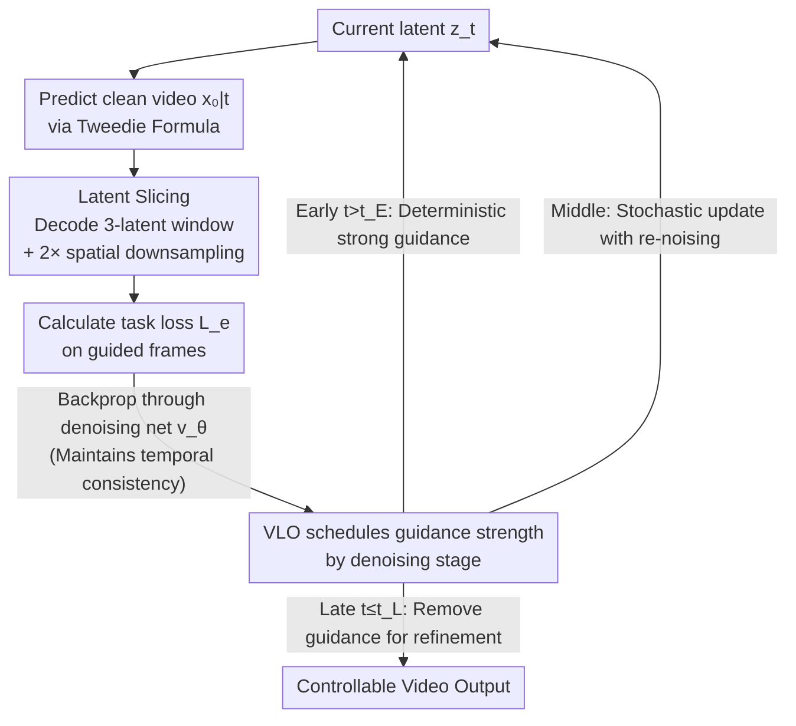

# Frame Guidance: Training-Free Guidance for Frame-Level Control in Video Diffusion Models

**Conference**: ICLR 2026  
**arXiv**: [2506.07177](https://arxiv.org/abs/2506.07177)  
**Code**: [https://frame-guidance-video.github.io/](https://frame-guidance-video.github.io/)  
**Area**: Diffusion Models / Video Generation  
**Keywords**: Training-free guidance, Video diffusion models, Frame-level control, Keyframe generation, Stylized video  

## TL;DR

Frame Guidance is a training-free frame-level guidance method that achieves various controllable video generation tasks, such as keyframe guidance, stylization, and looping videos, without model modification. It utilizes two core components: latent slicing (reducing VRAM by 60×) and Video Latent Optimization (VLO).

## Background & Motivation

**Growing demand for controllable video generation**: As video diffusion model (VDM) quality improves, users increasingly require fine-grained control.

**Training-based methods are uneconomical**: Existing methods usually require fine-tuning large-scale VDMs. As model sizes grow (e.g., Wan 14B), fine-tuning costs become prohibitive.

**Lack of universality in training-free methods**: Existing training-free methods (e.g., CamTrol, MotionClone) are often task-specific and lack a general framework.

**Memory bottleneck of Video CausalVAE**: The causal dependency of CausalVAE requires decoding the entire sequence to reconstruct a single frame, leading to gradient calculation memory exceeding 650GB.

**Inapplicability of existing guidance strategies to video**: Image-domain time-travel tricks tend to wash out guidance signals during the early steps of video generation.

**Key Challenge of balancing dual objectives**: Methods that are simultaneously "model-agnostic + training-free" and "general-purpose multi-task" remain a gap in the field.

## Method

### Overall Architecture

Frame Guidance does not modify any parameters of the pre-trained VDM. Instead, it performs a "guidance correction" at each sampling step: first, it predicts the clean video $x_{0\vert t}$ from the current latent $z_t$ using the Tweedie formula, decodes target frames into pixels, calculates a task loss $\mathcal{L}_e$ for these frames, and backpropagates the gradient to optimize $z_t$ before proceeding to the next denoising step. The core challenges lie in "how to make the gradient computation affordable" and "when to apply guidance"—the former is addressed by Latent Slicing to reduce decoding VRAM, and the latter by Video Latent Optimization (VLO) to concentrate guidance strength in the early stages.

### Key Designs

**1. Latent Slicing: Compressing CausalVAE full-sequence decoding into a local window**

Video guidance is restricted by VRAM: CausalVAE's causal dependency means reconstructing any single frame requires decoding the entire latent sequence, requiring over 650GB VRAM for gradients. The authors observed a counter-intuitive fact: although CausalVAE is designed with a causal structure, perturbing one latent only affects a few adjacent frames, exhibiting significant temporal locality. Thus, to reconstruct the $i$-th frame, one only needs to decode a 3-latent window, reducing VRAM to below $15\times$. Combined with $2\times$ spatial downsampling of latents before VAE loss calculation, the total VRAM required for guidance is reduced by up to **60×**, enabling frame-level guidance on models like Wan-14B (14B parameters) on a single GPU. Downsampling also focuses the guidance signal on semantic structures rather than texture details.

**2. Gradient through the Denoising Network: Controlling the sequence via sparse frames**

Even when calculating loss on only a few sliced frames, updates cannot simply modify those specific frame latents. The guidance gradient must be backpropagated through the denoising network $v_\theta$ to $z_t$. This allows the signal to propagate from guided frames to the entire video, maintaining temporal consistency. If a shortcut update is used (bypassing the network to change pixels or latents directly), the impact is confined to the guided frames, causing temporal discontinuities/flickering at those positions. In short, Latent Slicing reduces "decoding" overhead, but the "network pass" is essential as the transmission path for sparse control.

**3. Video Latent Optimization: Phase-based guidance strength allocation**

Standard image "time-travel tricks" (repeated noise-denoise loops) wash out early guidance signals in video. Since global video layouts are established in the first few denoising steps, early guidance is critical for temporal consistency. VLO segments the sampling trajectory into three stages: Early ($t > t_E$) uses deterministic updates $z_t \leftarrow z_t - \eta \nabla_{z_t} \mathcal{L}_e$ to preserve the signal; Middle ($t_E \geq t > t_L$) uses stochastic updates with re-noising to correct accumulated errors; Late ($t \leq t_L$) removes guidance to let the model refine textures freely. Strong guidance is prioritized during the "layout determination" phase to maintain control without sacrificing image quality.

### Loss & Training

The universality of Frame Guidance stems from using different frame-level losses $\mathcal{L}_e$ within the same framework. Changing the loss changes the task without retraining. Let $x_{0\vert t}^i$ be the current prediction of the $i$-th frame, $\mathcal{I}$ the set of guided frames, and $\Psi$ the corresponding feature encoder (e.g., CSD for style, depth/edge extractors for general conditions):

| Task | Loss Function |
|------|----------|
| Keyframe Guidance | $\mathcal{L}_e = \sum_{i \in \mathcal{I}} \|x_*^i - x_{0\vert t}^i\|_2^2$ |
| Stylization | $\mathcal{L}_e = -\sum_{i \in \mathcal{I}} \cos(\Psi(x_{\text{style}}), \Psi(x_{0\vert t}^i))$ |
| Looping Video | $\mathcal{L}_e = \|x_{0\vert t}^1 - x_{0\vert t}^L\|_2^2$ |
| General Conditions (Depth/Edge) | $\mathcal{L}_e = \sum_{i \in \mathcal{I}} \|\Psi(x_*^i) - \Psi(x_{0\vert t}^i)\|_2^2$ |

## Key Experimental Results

### Keyframe Guidance (DAVIS Dataset)

| Method | Training | FID ↓ | FVD ↓ |
|------|------|-------|-------|
| CogX-I2V | ✓ | 60.36 | 890.1 |
| TRF (Training-free) | ✓ | 62.07 | 923.1 |
| **Ours (CogX, I+F)** | ✓ | 57.62 | 613.4 |
| **Ours (CogX, I+M+F)** | ✓ | 55.60 | 577.1 |
| SVD-Interp (Fine-tuned) | ✗ | 63.89 | 800.3 |
| CogX-Interp (Fine-tuned) | ✗ | 46.59 | 506.0 |

### Pexels Dataset

| Method | FID ↓ | FVD ↓ |
|------|-------|-------|
| CogX-I2V | 74.98 | 1122.6 |
| **Ours (Wan-14B, I+M+F)** | 71.63 | 904.8 |
| **Ours (CogX, I+M+F)** | 68.97 | 989.3 |

**Key Findings**: The training-free Frame Guidance outperforms the training-based SVD-Interp on most metrics and is only slightly trailing behind the specifically fine-tuned CogX-Interp.

## Highlights & Insights

1. **Discovery of CausalVAE temporal locality**: Although designed as causal, it exhibits temporal locality—a finding that makes the 60× VRAM reduction possible.
2. **VLO staged strategy**: Unlike uniform image time-travel, it designs deterministic/stochastic phased optimization tailored for video temporal characteristics.
3. **Model-agnostic**: Effectively works on CogVideoX, LTX-Video, and Wan-14B.
4. **High flexibility**: Supports arbitrary keyframe positions, various conditional signals, and multiple tasks without per-task training.
5. **Sparse frame guidance**: Guiding only a few frames can control the entire video via network gradient propagation.

## Limitations & Future Work

1. Slower inference speed (operates within a 4× overhead of the base model), and guidance steps/learning rates require manual tuning.
2. Keyframe guidance provides visual similarity rather than pixel-perfect alignment.
3. Stylization quality depends on specific style encoders like CSD.
4. For high-dynamic scenes (fast motion, scene cuts), layout determination in early steps may be insufficient.
5. Guidance for other modalities like audio or text remains unexplored.

## Related Work & Insights

- **Universal Guidance (Bansal et al., 2024)**: Foundation for training-free guidance in the image domain; this work extends it to video.
- **TRF (Feng et al., 2024)**: Training-free SVD frame interpolation but lacks universality; Frame Guidance achieves broader tasks through frame-level loss design.
- **CogX-Interp**: A fine-tuning-based keyframe interpolation method with higher accuracy but requires training.
- Insight: The temporal locality of CausalVAE could be exploited by other training-free methods such as editing or inpainting.

## Rating

- Novelty: ⭐⭐⭐⭐ — Latent Slicing and VLO are clever designs specifically for video scenarios.
- Experimental Thoroughness: ⭐⭐⭐⭐ — Validated across multiple models, tasks, and datasets.
- Writing Quality: ⭐⭐⭐⭐⭐ — Clear structure, deep analysis, and excellent visualizations.
- Value: ⭐⭐⭐⭐⭐ — Highly practical in the era of large models; a significant milestone for training-free methods.

<!-- RELATED:START -->

## Related Papers

- [\[CVPR 2026\] FlowMotion: Training-Free Flow Guidance for Video Motion Transfer](../../CVPR2026/video_generation/flowmotion_training-free_flow_guidance_for_video_motion_transfer.md)
- [\[ICLR 2026\] Realtime Video Frame Interpolation Using One-Step Diffusion Sampling](realtime_video_frame_interpolation_using_one-step_diffusion_sampling.md)
- [\[ICLR 2026\] Anchor Frame Bridging for Coherent First-Last Frame Video Generation](anchor_frame_bridging_for_coherent_first-last_frame_video_generation.md)
- [\[CVPR 2026\] Improving Motion in Image-to-Video Models via Adaptive Low-Pass Guidance](../../CVPR2026/video_generation/improving_motion_in_image-to-video_models_via_adaptive_low-pass_guidance.md)
- [\[ICLR 2026\] MAGREF: Masked Guidance for Any-Reference Video Generation with Subject Disentanglement](magref_masked_guidance_for_any-reference_video_generation_with_subject_disentang.md)

<!-- RELATED:END -->
