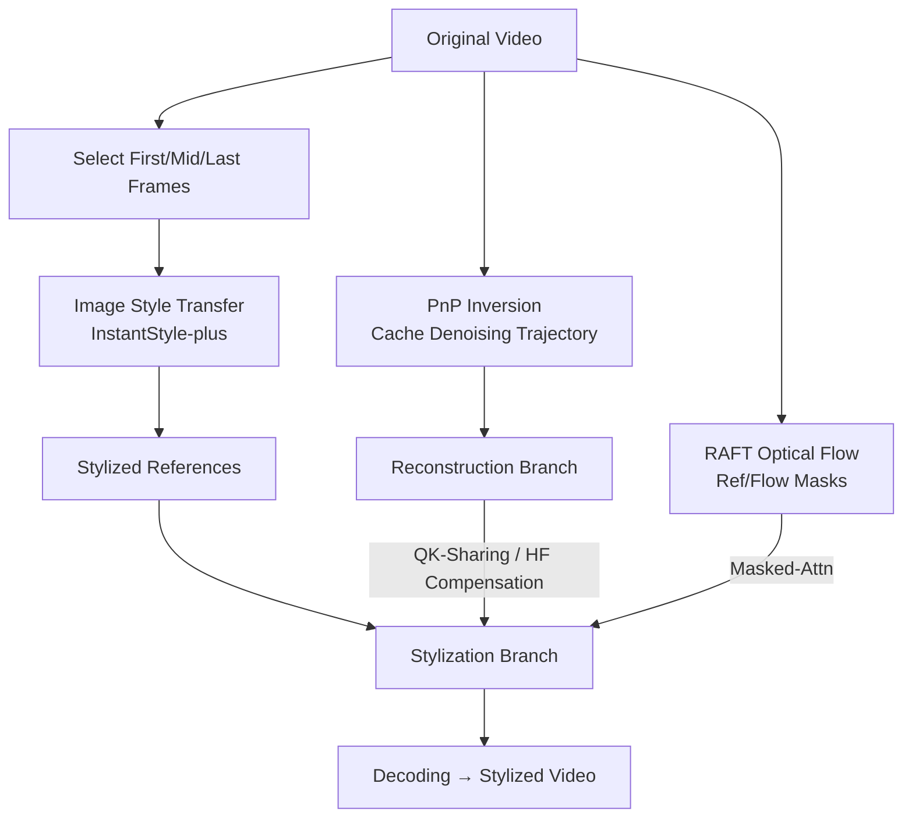

# FreeViS: Training-free Video Stylization with Inconsistent References

**Conference**: ICLR 2026  
**OpenReview**: [https://openreview.net/forum?id=SiYNm21ifi](https://openreview.net/forum?id=SiYNm21ifi)  
**Project Page**: [https://xujiacong.github.io/FreeViS/](https://xujiacong.github.io/FreeViS/)  
**Area**: Video Generation / Video Stylization  
**Keywords**: Video Stylization, Training-free, Diffusion Inversion, I2V Models, Multi-reference Frames, Optical Flow Guidance  

## TL;DR
FreeViS incorporates multiple "mutually inconsistent" stylized reference frames into a pre-trained I2V diffusion model. Using a trio of isolated attention, high-frequency compensation, and optical flow guidance, it solves propagation errors found in single-reference methods under completely training-free conditions, producing video stylization with rich stylistic details and strong temporal consistency.

## Background & Motivation
- **Background**: While image style transfer is mature, video stylization lags significantly. Applying image stylization frame-by-frame leads to severe flickering and temporal inconsistency. Training dedicated video stylization models requires paired "original-stylized" video data, which is nearly impossible to acquire, and full fine-tuning of DiT architectures is computationally expensive.
- **Limitations of Prior Work**: Reference-based editing methods (e.g., AnyV2V) stylize the first frame and then "propagate" it to subsequent frames using a pre-trained I2V model. Since I2V models have not seen stylized frames during training, the first frame is an out-of-distribution input. They fail to correctly parse and propagate stylistic patterns—when subsequent content differs significantly from the first frame, styles fail to transfer, causing obvious **propagation errors**.
- **Key Challenge**: Information from a single reference frame is insufficient to cover an entire video. However, **naively concatenating multiple reference frames** to the noise latent causes severe flickering and stuttering because extra references are encoded independently and lack the dynamic information shared with the main video.
- **Goal**: Introduce multiple reference frames across the entire video without **any training** (relying solely on diffusion inversion) to eliminate propagation errors without introducing flickering or stuttering, achieving high-fidelity style and strong temporal consistency.
- **Core Idea**: **Multiple inconsistent references + Isolated Attention + Frequency Domain Decoupling**. It is observed that in I2V latents, LF controls appearance/color while HF controls layout/motion. Thus, only HF differences are re-injected to constrain structure without polluting stylistic colors. Furthermore, "appearance" and "dynamics" are decoupled from the values of references and reconstructions, injecting shared dynamics into static references to allow inconsistent references to work together.

## Method

### Overall Architecture
FreeViS uses a pre-trained I2V diffusion model as the backbone. Given a style image, an image style transfer model stylizes several selected content frames (first, middle, last) to obtain a set of **mutually inconsistent** reference frames. The entire pipeline follows a dual-branch approach: a **reconstruction branch** and a **stylization branch**, sharing the denoising trajectory and initial noise obtained from inversion. In each DiT block, the reconstruction branch passes query/key/value to the stylization branch. After each denoising step, the high-frequency component of the difference between the target latent and the reconstruction latent is added to the stylized latent, and dynamic cues are injected into the value matrix of the extra references.

### Key Designs

**1. Indirect High-Frequency Compensation (IHC): Correcting structure without moving colors.** PnP inversion typically adds the difference between target and reconstruction latents directly back to both branches, enabling near-perfect reconstruction. However, this strong correction pulls stylized latent information back to the original content, causing colors to revert from the stylized state. Based on the observation that "LF governs appearance/color and HF governs layout/motion," the authors propose injecting only **high-frequency differences** into the stylized latent: first, AdaIN is used on $x_t$ and $x_t^r$ to align color statistics with the stylized latent $x_t^s$, then a spatial FFT is performed, a low-pass filter $H_{LP}$ extracts the high-frequency part, which is added back via iFFT:

$$x_t^s = \lambda \cdot \mathcal{F}^{-1}\big(\mathcal{F}(\mathcal{T}(x_t) - \mathcal{T}(x_t^r)) \cdot (1 - H_{LP})\big) + x_t^s$$

The cutoff frequency is empirically set to 0.2, achieving the best trade-off between style fidelity and content reconstruction; $\lambda$ decays linearly over time steps. The reconstruction branch uses full compensation $x_t^r = \lambda(x_t - x_t^r) + x_t^r$ to recover content. This technique preserves stylized colors and textures while correcting spatial layout and motion in scenes with significant camera movement or large differences between subsequent and initial frames.

**2. Extra Inconsistent References + Isolated Attention (Isolated-Attn): Allowing multiple references to collaborate without conflict.** Existing I2V models support only single references; naive concatenation of multiple references causes flickering. The reconstruction branch uses Isolated-Attn to isolate the influence of auxiliary references $x_R^r$: reconstruction tokens $x^r$ use standard self-attention, while reference tokens $x_R^r$ attend to both reconstruction and reference K/V simultaneously, making references evolve synchronously with denoising to simulate full self-attention behavior:

$$\text{Out}^r = A(Q^r, K^r, V^r) \oplus A(Q_R^r, K^r \oplus K_R^r, V^r \oplus V_R^r)$$

The stylization branch requires full token information exchange, but independently encoded stylized reference values $V_R^s$ lack dynamic information, leading to stuttering. The authors found that dynamic information is shared between the stylized value $V^s$ and the reconstruction value $V^r$. Thus, the dynamic residual is decoupled, and only the dynamic component is injected into $V_R^s$:

$$V_R^s = V_R^s + \xi \cdot (V^s[i_R] - V_R^s) + (1 - \xi) \cdot (V^r[i_R] - V_R^r)$$

$\xi$ increases linearly from 0 to 1 over time steps—relying more on the reconstruction dynamics early on and converging to $V^s[i_R]$ at the end to ensure consistency. Since references are naturally inconsistent and appearances may vary in the same region leading to time-varying artifacts, RAFT optical flow is used to track from the first reference to subsequent ones, constructing a reference mask $M_{Ref}$ (False if a pixel is reachable from preceding references), which masks conflicting regions in attention:

$$\text{Out}_1^s = A_{Masked}(Q^s, K^s \oplus K_R^s, V^s \oplus V_R^s, M_{Ref}) \oplus A(Q_R^s, K^s \oplus K_R^s, V^s \oplus V_R^s)$$

Drawing further inspiration from UNet's forwarding of reconstruction features to editing branches, **QK-Sharing** is implemented: replacing stylization branch Q/K with reconstruction branch Q/K (obtaining $\text{Out}_2^s$), as reconstruction Q/K defines spatio-temporal correspondences across the content video, which is crucial for style propagation and temporal consistency.

**3. Explicit Optical Flow Guidance (EOG): Saving disappearing textures in flat areas.** In cases of large camera or object motion, stylized textures may disappear or vary in flat regions with few prominent features. This stems from inaccurate attention maps between distant frames diffusing to incorrect regions. EOG uses forward and backward optical flow to track pixel correspondences across frames: if pixel $p_{i,j}^s$ in frame $s$ maps to $p_{m,n}^t$ in frame $t$, the flow mask $M_{Flow}$ is set to True (with dilation for error tolerance). Masked attention then constrains attention to consistent regions:

$$\text{Out}_3^s = A_{Masked}(Q^s \oplus Q_R^s, K^s \oplus K_R^s, V^s \oplus V_R^s, M_{Flow} \wedge M_{Ref})$$

The three attention modes are aggregated by weight before entering cross-attention:

$$\text{Out}^s = (1 - \beta - \gamma) \cdot \text{Out}_1^s + \beta \cdot \text{Out}_2^s + \gamma \cdot \text{Out}_3^s$$

where $\gamma$ is non-zero only in the final denoising stages (when the model focuses on local texture refinement). For cross-attention, CLIP features from all reference frames are concatenated and QK-Shared to enhance language alignment injection. Regarding reference selection, since I2V models are often limited to short videos (~81 frames), **first, middle, and last** frames are selected, with each reference token reusing positional embeddings from its corresponding frame to ensure correct spatio-temporal propagation.

## Key Experimental Results

### Main Results: Video Style Transfer (200 online videos + WikiArt style images)

| Method | CSD↑ | ArtFID↓ | FID↓ | LPIPS↓ | SC↑ | MS↑ | FC↓ | HP↑ |
|------|------|---------|------|--------|-----|-----|-----|-----|
| Reference (Anchor) | 0.508 | 31.62 | 20.28 | 0.486 | 0.918 | 0.986 | 0.000 | - |
| TokenFlow | 0.111 | 37.87 | 27.94 | 0.309 | 0.915 | 0.976 | 1.092 | 2.179 |
| VACE | 0.138 | 35.53 | 27.77 | 0.240 | 0.910 | 0.984 | 0.554 | 2.895 |
| I2VEdit | 0.331 | 38.72 | 22.53 | 0.653 | 0.738 | 0.975 | 2.074 | 2.538 |
| AnyV2V | 0.267 | 35.84 | 23.52 | 0.471 | 0.753 | 0.961 | 1.715 | 2.443 |
| AnyV2V* (Comp. Base) | 0.270 | 34.81 | 27.59 | 0.218 | 0.675 | 0.983 | 1.103 | 3.372 |
| **Ours** | **0.448** | **21.62** | 0.479 | **0.898** | 0.978 | 0.641 | **4.113** |

FreeViS far outperforms all baselines in CSD style score (0.448), coming closest to the reference anchor, and achieves the lowest ArtFID (21.62). Style consistency SC (0.898) nearly matches the anchor, and human preference (HP: 4.113) shows a significant lead. VACE/TokenFlow show higher MS/FC because they primarily modify color without generating new textures, and MS/FC are calculated using optical flow models pre-trained on natural videos, which might provide inaccurate estimates for OOD stylized samples.

### Main Results: Stylized T2V Generation (Wan2.1 background + FreeViS stylization)

| Method | CSD↑ | FID↓ | CLIP-Text↑ | DQ↑ | MS↑ | BC↑ | IQ↑ | HP↑ |
|------|------|------|-----------|-----|-----|-----|-----|-----|
| StyleCrafter | 0.515 | 22.62 | 0.211 | 0.368 | 0.965 | 0.951 | 0.578 | 2.83 |
| StyleMaster | 0.221 | 26.04 | 0.243 | 0.123 | 0.985 | 0.945 | 0.667 | 2.55 |
| **Ours+Wan** | 0.437 | 24.63 | **0.264** | **0.509** | 0.941 | **0.691** | **3.97** |

FreeViS+Wan leads in CLIP-Text alignment, dynamic quality DQ, image quality IQ, and human preference, achieving the best trade-off between style fidelity and content alignment (StyleCrafter has strong style but weak dynamics and poor prompt alignment; StyleMaster is the opposite).

### Ablation Study
Components were verified individually: Removing **IHC** leads to inaccurate scene layout reconstruction and structural artifacts (e.g., roof reconstruction errors); removing **Extra References** results in only color shifts in final frames, losing stylized texture details; removing **EOG** causes texture loss in visually homogeneous regions and decreased optical flow consistency. These correspond to layout reconstruction, style consistency, and texture preservation in flat areas, respectively.

### Key Findings
- Spectral Observation: In I2V latents, LF dominates appearance/color, while HF encodes layout/motion—providing the basis for IHC re-injecting only high frequencies.
- Attention Observation: I2V models exhibit auto-causal attention, where the second frame immediately following a reference frame receives high attention throughout, indicating that reference frames indirectly influence all subsequent frames through the second frame. Pixel-level attention in distant frames diffuses to wrong regions, necessitating external constraints (EOG).
- The upper bound of FreeViS stylization is constrained by the image style transfer method used (InstantStyle-plus in this work).

## Highlights & Insights
- **"Inconsistent references" as a feature rather than a flaw**: The title emphasizes *inconsistent references*—the authors do not force consistency between multiple reference frames. Instead, they use optical flow masks and dynamic decoupling to let references complement each other, avoiding the cost of forced alignment.
- **Elegant style/structure separation via frequency decoupling**: Binding "color style" and "layout motion" to LF/HF respectively ensures that structural constraints (HF compensation) do not pull stylized colors back to the original state—a clean, physical-intuition-driven design.
- **Completely training-free**: Relying solely on diffusion inversion and attention engineering, it requires no paired video data or fine-tuning, offering low deployment costs.
- **Dynamic residual injection** resolves the core stuttering issue in multi-reference concatenation, and the time-step scheduling of $\xi$ naturally balances "borrowing dynamics early" with "converging appearance late."

## Limitations & Future Work
- **Style bound limited by image stylization models**: FreeViS itself does not generate new styles; global fidelity is constrained by the upper bound of pre-modules like InstantStyle-plus.
- **Reference count limited by short video windows**: I2V models are generally limited to ~81 frames, allowing for only about three references (first, mid, last); coverage might be insufficient for long videos or drastic content changes.
- **Dependence on optical flow quality**: Both EOG and reference masks rely on RAFT optical flow. Optical flow estimation may be inaccurate on OOD stylized frames (the paper acknowledges that MS/FC metrics may be distorted as a result), requiring dilation for fault tolerance.
- **Numerous hyperparameters**: Parameters like $\lambda$, cutoff frequency 0.2, $\xi$, $\beta$, and $\gamma$ require tuning, and $\gamma$ is only activated late in the process, requiring significant empirical tuning.
- Future work: Adaptive selection of reference frame counts/positions, end-to-end joint stylization instead of depending on external image models, and extension to long videos are natural directions.

## Related Work & Insights
- **Reference-based Video Editing**: AnyV2V and I2VEdit use single-frame propagation. This work directly addresses their propagation error pain point. FreeViS can be seen as an upgraded "multi-reference + isolated attention" version.
- **Video Diffusion Architectures**: The shift from UNet (with separate temporal layers) to DiT full self-attention (Wan, HunyuanVideo). The cross-frame attention analysis and isolated attention in this work are built upon DiT's full attention mechanism.
- **PnP Inversion / Frequency Domain Editing**: Drawing from the discovery in image editing that "HF determines spatial layout" and migrating it to I2V represents an extension of frequency-domain latent manipulation specifically for video.
- **Insight**: Without retraining large models, unlocking new capabilities through "observing the physical semantics of latents (frequency domain, attention patterns) → designing targeted attention/frequency interventions" is a highly cost-effective training-free paradigm, transferable to other video editing tasks (content replacement, inpainting).

## Rating
- **Novelty**: ⭐⭐⭐⭐ — The combination of multi-inconsistent references + frequency decoupling + dynamic residual injection is new and provides insights into solving propagation errors; individual technical points are clever reuses of existing ideas (PnP, AdaIN, optical flow masks).
- **Experimental Thoroughness**: ⭐⭐⭐⭐ — Self-built 200-video dataset covering both style transfer and T2V tasks, comprehensive metrics (CSD/ArtFID/SC/HP), and clear ablations; however, comparisons with some models like StyleMaster V2V (code unavailable) are missing.
- **Writing Quality**: ⭐⭐⭐⭐ — The logic from observation to motivation to method is smooth. Formulas and notation are complete, and the three modules clearly address three pain points. The notation is slightly dense, and the pipeline diagram carries significant information requiring careful reading.
- **Value**: ⭐⭐⭐⭐ — Being training-free with low deployment costs and leading performance makes it highly practical for content creation scenarios; yet limited by the upper bound of the front-end image stylization model.

<!-- RELATED:START -->

## Related Papers

- [\[ICLR 2026\] LightCtrl: Training-free Controllable Video Relighting](lightctrl_training-free_controllable_video_relighting.md)
- [\[CVPR 2026\] DreamStyle: A Unified Framework for Video Stylization](../../CVPR2026/video_generation/dreamstyle_a_unified_framework_for_video_stylization.md)
- [\[ICLR 2026\] Frame Guidance: Training-Free Guidance for Frame-Level Control in Video Diffusion Models](frame_guidance_training-free_guidance_for_frame-level_control_in_video_diffusion.md)
- [\[CVPR 2026\] FlowPortal: Residual-Corrected Flow for Training-Free Video Relighting and Background Replacement](../../CVPR2026/video_generation/flowportal_residual-corrected_flow_for_training-free_video_relighting_and_backgr.md)
- [\[CVPR 2026\] FlowMotion: Training-Free Flow Guidance for Video Motion Transfer](../../CVPR2026/video_generation/flowmotion_training-free_flow_guidance_for_video_motion_transfer.md)

<!-- RELATED:END -->
