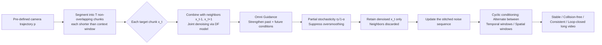

# Generative View Stitching

**Conference**: ICLR 2026  
**OpenReview**: [https://openreview.net/forum?id=fpQpQbFPCU](https://openreview.net/forum?id=fpQpQbFPCU)  
**Code**: [https://andrewsonga.github.io/gvs/](https://andrewsonga.github.io/gvs/) (Project page, including video results)  
**Area**: Video Generation / Camera-guided Long Video / Diffusion Sampling  
**Keywords**: Video Diffusion, Camera-guided, Diffusion Stitching, Diffusion Forcing, Closed-loop Consistency, Training-free Sampling  

## TL;DR
GVS applies "diffusion stitching from robot planning" to video generation: using a training-free parallel sampling algorithm, it enables any Diffusion Forcing video model to generate long videos along pre-defined camera trajectories. By allowing the current frame to "see the future," it avoids collisions, maintains consistency, and enables loop closure.

## Background & Motivation
**Background**: Video diffusion models typically generate 5–10 second clips. Generating longer videos usually relies on "autoregressive (AR) rolling" of short-window models, combined with history guidance and retrieval-augmented techniques to achieve stability over hundreds of frames and consistency with the past, even in real-time interactions.

**Limitations of Prior Work**: AR sampling has a fundamental flaw—it only looks at the past and cannot see the future. When the task is to "capture a long video along a **pre-defined camera trajectory**" (offline scenarios requiring high-level planning, such as one-shot cinematic shots or autonomous driving synthetic data), an AR model may generate a wall first and then be forced by the trajectory to "pass through the wall," causing the frames to become out-of-distribution and the AR process to collapse rapidly due to exposure bias.

**Key Challenge**: To avoid collisions, the generation of the current frame must be **constrained by future camera conditions**; however, existing video models and AR sampling do not provide a mechanism for "conditioning on the future." Existing diffusion stitching methods can generate entire sequences in parallel and theoretically see the future, but they either lack the temporal consistency required for video (StochSync) or require training a custom model with special conditioning paths (CompDiffuser)—an unacceptable cost for video models.

**Goal**: Develop the **first diffusion stitching method for camera-guided video generation** that is training-free, plug-and-play for any existing model, stable, collision-free, frame-consistent, and capable of loop closure.

**Key Insight**: **Core Idea** — The widely used Diffusion Forcing (DF) training framework (where each token is independently noised and the sampling can selectively mask parts of the context with noise) **naturally possesses all the capabilities required for stitching** without any custom architecture. By overlaying **Omni Guidance** (simultaneously strengthening past and future conditions) and a **cyclic conditioning** mechanism for loop closure, training-free stitching can be transformed into stable long-video generation.

## Method

### Overall Architecture
GVS divides the target long video into several **non-overlapping** chunks, each shorter than the context window. It then feeds each target chunk along with its adjacent chunks into the DF model for **joint denoising**—ensuring the target chunk is constrained by both the "past neighbor" and the "future neighbor." Only the denoised target chunk is retained at each step to update the stitched sequence, while the neighbor chunks are discarded. On this parallel sampling skeleton, Omni Guidance is used to correct conditioning strength, partial stochasticity is applied to suppress oversmoothing, and cyclic conditioning is used to achieve loop closure.

### Key Designs

**1. Implementing Training-free Stitching with Diffusion Forcing: Turning "Future Conditions" into Joint Denoising within a Single Sequence.** CompDiffuser formulates the video trajectory distribution as a compositional distribution depending only on temporal neighbors $p_\theta(x|x_{\text{start}},x_{\text{goal}}) \propto \prod_t p_t(x_t|x_{t-1},x_{t+1})$, but it requires training a custom network $\epsilon_\theta(x_t^k,k|x_{t-1}^k,x_{t+1}^k)$ that injects "co-evolving noisy neighbor chunks" as separate conditions via special encoders and AdaLN—this special path is why it cannot be applied to off-the-shelf models. The key insight of GVS is that DF models inherently support "independent noise levels per token and masked contexts," so no separate conditioning path is needed. The target chunk is simply concatenated with neighbors into a sequence $[x_{t-1}^k, x_t^k, x_{t+1}^k]$ for joint denoising. Only the target chunk $x_t^{k-1}$ is used to update the stitched sequence. This "vanilla GVS" implementation is extremely simple and compatible with any DF video model, corresponding to the compositional distribution $p_\theta(x|p) \propto \prod_{t=0}^{T-1} p_t(x_t|x_{t-1},x_{t+1},p_{t-1},p_t,p_{t+1})$.

**2. Omni Guidance: Correcting Weak Conditioning Caused by "Target and Neighbors Being Equally Noisy."** Vanilla GVS exhibits poor consistency because it uses the score of the joint distribution $p(x_{t-1},x_t,x_{t+1})$ rather than the intended conditional distribution $p(x_t|x_{t-1},x_{t+1})$. In AR sampling, the "past context is much cleaner than the target," whereas in stitching, the target chunk and its neighbors are **equally noisy**, leading to weak conditional signals. Omni Guidance, inspired by Inner Guidance, pulls the sampling distribution toward consistency with neighbors and the camera trajectory by introducing two guidance scales: $\gamma_1$ (adherence to camera trajectory) and $\gamma_2$ (consistency with temporal neighbors), which are merged into a single $\gamma$. The score is modified as $\tilde\epsilon_\theta = (1+\gamma)\,\epsilon_\theta(x_{t-1:t+1}^k|p_{t-1:t+1}) - \gamma\,\epsilon_\theta(\varnothing, x_t^k, \varnothing|\varnothing,\varnothing,\varnothing)$. The unconditional term is calculated by "replacing neighbor chunks with pure Gaussian noise and setting their noise levels to maximum"—a capability provided for free by the DF backbone, which can be viewed as a generalization of Fractional History Guidance.

**3. Partial Stochasticity: Balancing "Consistency" and "Oversmoothing."** Prior work StochSync proposed using **maximum stochasticity** $\sigma_k = \sqrt{1-\alpha_{k-1}}$ as an error correction mechanism to enhance consistency. GVS found that while this improves temporal consistency, it "washes out" the image (oversmoothing), leading to loss of detail. Combined with Omni Guidance, GVS can instead use **partial stochasticity** $\sigma_k = \eta\sqrt{1-\alpha_{k-1}}, \eta \in (0,1)$ (practically $\eta=0.9$), ensuring consistency while significantly reducing oversmoothing.

**4. Loop Closure via Cyclic Conditioning: Adding Context Windows for "Spatially Close, Temporally Distant" Chunks.** Theoretically, each stitching step expands the receptive field until it covers the whole sequence (similar to receptive field growth in CNN depth), which should allow zero-shot loop closure. However, practical long generations often fail to "visually return to the origin" because information does not propagate far enough. GVS adds **extra factors** to the compositional distribution: for each target chunk, it denoises an additional set of "temporally distant but spatially close" neighbor windows (spatial windows), **alternating with denoising steps** of the "temporal neighbor windows" (temporal windows). This process is called cyclic conditioning. Consequently, the target chunk is constrained by both temporal and spatial neighbors throughout denoising, successfully achieving loop closure (including drawing Reutersvärd’s "impossible staircase").

## Key Experimental Results

**Setup**: All methods use the same camera-conditioned video model from Song et al. (2025) (a Diffusion-Forcing Transformer trained on RealEstate10K, 8-frame context window). Benchmarks include Panorama / Circle / Straight line / Stairs / Staircase circuit trajectories designed to test length extrapolation, loop closure, and collision avoidance. Metrics: F2FC (Frame-to-Frame Consistency, ↓), LRC (Long-Range/Loop Consistency, ↓), IQ/AQ (VBench Image Quality, ↑), CA (Collision Average, ↓), averaged over 40 generations.

### Main Results (Comparison with Baselines, Excerpt)

| Trajectory | Method | F2FC↓ | LRC↓ | IQ↑ | CA↓ |
|------|------|-------|------|-----|-----|
| Panorama 1-loop | Autoregressive | 0.168 | 0.339 | 0.458 | N/A |
| | StochSync | 0.183 | 0.164 | 0.515 | N/A |
| | **GVS (Ours)** | **0.138** | **0.141** | **0.537** | N/A |
| Circle 1-loop | Autoregressive | 0.220 | 0.411 | 0.432 | 0.625 |
| | StochSync | 0.204 | 0.258 | 0.546 | **0** |
| | **GVS (Ours)** | **0.160** | **0.244** | 0.546 | **0** |
| Straight line | Autoregressive | 0.138 | N/A | 0.456 | 0.325 |
| | StochSync | 0.124 | N/A | 0.544 | **0** |
| | **GVS (Ours)** | **0.080** | N/A | **0.615** | **0** |
| Staircase circuit | Autoregressive | 0.132 | 0.449 | 0.397 | 0.625 |
| | StochSync | 0.179 | 0.221 | 0.563 | **0** |
| | **GVS (Ours)** | **0.129** | **0.176** | **0.607** | **0** |

GVS leads across F2FC, LRC, and CA, while maintaining comparable image quality. Although StochSync also achieves 0 collision rate, it does so through "scene shape-shifting," reflected in its significantly worse F2FC.

### Ablation Study (Omni Guidance × Stochasticity η, Straight line)

| η | w/o Omni Guidance F2FC↓ / IQ↑ | w/ Omni Guidance F2FC↓ / IQ↑ |
|---|------|------|
| 0 | 0.153 / 0.537 | 0.138 / 0.553 |
| 0.5 | 0.124 / 0.499 | 0.110 / 0.556 |
| 0.9 | 0.084 / 0.458 | 0.080 / **0.615** |
| 1.0 | 0.061 / 0.422 | 0.071 / 0.610 |

### Key Findings
- **Stochasticity alone is a double-edged sword**: Without Omni Guidance, increasing η consistently improves F2FC but leads to a sharp decline in IQ/AQ/IS (oversmoothing).
- **Omni Guidance decouples consistency from quality**: Adding it improves consistency across a wide range of η, making the "high consistency + no oversmoothing" sweet spot at η=0.9 usable (IQ increased from 0.458 to 0.615).
- **Loop closure must be explicitly enforced**: Another ablation shows that without cyclic conditioning, LRC remains high (~0.95), indicating that the "theoretical global receptive field" does not automatically ensure loop closure in practice.

## Highlights & Insights
- **Precise identification of the "future condition" gap**: The failure of AR video generation is attributed to "inability to see the future → collision → exposure bias collapse," solved fundamentally via parallel stitching.
- **Training-free & Plug-and-play**: Modifies only the sampling process, making it directly compatible with any DF backbone. Future models with even longer context windows can be further extrapolated with GVS.
- **Transferring tools from robot planning to video**: Successfully migrates diffusion stitching concepts (CompDiffuser/StochSync) to video and identifies the non-trivial observation that DF inherently provides stitching affordances.
- **"Impossible Staircase" demo is compelling**: The ability to close a Penrose staircase loop provides intuitive proof of global consistency and loop closure capability.

## Limitations & Future Work
- **Dependence on DF-style backbones**: The core affordance of the method (independent token noise, masked context) relies on Diffusion Forcing, making it not directly applicable to non-DF trained models.
- **Sampling Cost**: Parallel stitching requires joint denoising of target chunks and neighbors, plus additional spatial windows for cyclic conditioning. The computational/memory overhead is higher than naive AR.
- **Requirement for spatial priors**: Cyclic conditioning relies on knowing "which chunks are spatially close" (based on FOV overlap), which is not directly applicable to open-ended generation without pre-defined trajectories.
- **Quality limited by backbone**: Evaluations were based on a RealEstate10K model with an 8-frame window; performance on more powerful backbones remains to be verified.
- **Future Work**: Integration with longer context models, online planning with 3D priors, or extension to other "future conditions" like goal frames or text scripts.

## Related Work & Insights
- **Diffusion Forcing (Chen et al., 2024)** & **History Guidance / DFoT (Song et al., 2025)**: Direct precursors for the backbone and "past condition guidance." Omni Guidance generalizes Fractional History Guidance.
- **Diffusion Stitching Lineage**: CompDiffuser (custom training required) and StochSync (image/panorama stitching, max stochasticity) are the primary baselines.
- **Inner Guidance (Chefer et al., 2025)**: Omni Guidance adopts its strategy to solve the "conditional signal relying on weights, breaking CFG independence assumptions" issue.
- **Insight**: Before assuming a model requires retraining for a new sampling goal (seeing the future/looping), examine whether the training framework already implies the necessary affordance—training-free sampling modifications can often unlock these capabilities.

## Rating
- **Novelty**: ⭐⭐⭐⭐ First training-free diffusion stitching for camera-guided video; identifying "DF stitching capability" is non-trivial.
- **Experimental Thoroughness**: ⭐⭐⭐⭐ Covers multiple trajectory types, strong baselines, and systematic ablations; however, it lacks analysis of costs and results on larger models.
- **Writing Quality**: ⭐⭐⭐⭐ Clear motivation regarding collisions/exposure bias; method steps are logical and well-illustrated.
- **Value**: ⭐⭐⭐⭐ High practical value for offline high-level planning tasks like cinematic camera movements and autonomous driving data synthesis.

<!-- RELATED:START -->

## Related Papers

- [\[ICLR 2026\] EgoTwin: Dreaming Body and View in First Person](egotwin_dreaming_body_and_view_in_first_person.md)
- [\[ICLR 2026\] Arbitrary Generative Video Interpolation](arbitrary_generative_video_interpolation.md)
- [\[ICLR 2026\] ToonComposer: Streamlining Cartoon Production with Generative Post-Keyframing](tooncomposer_streamlining_cartoon_production_with_generative_post-keyframing.md)
- [\[ICLR 2026\] Light-X: Generative 4D Video Rendering with Camera and Illumination Control](light-x_generative_4d_video_rendering_with_camera_and_illumination_control.md)
- [\[CVPR 2026\] 3D-Aware Implicit Motion Control for View-Adaptive Human Video Generation](../../CVPR2026/video_generation/3d-aware_implicit_motion_control_for_view-adaptive_human_video_generation.md)

<!-- RELATED:END -->
