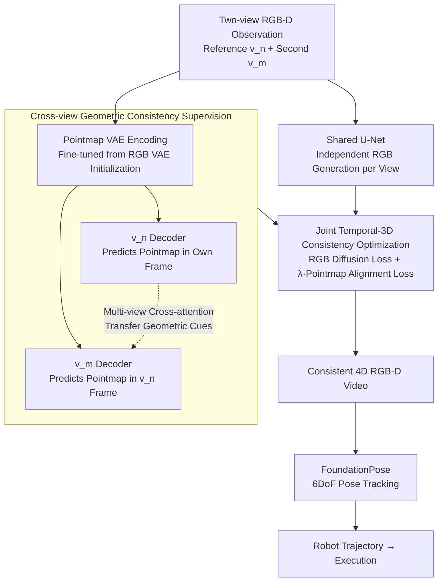

# Geometry-aware 4D Video Generation for Robot Manipulation

**Conference**: ICLR 2026  
**arXiv**: [2507.01099](https://arxiv.org/abs/2507.01099)  
**Code**: [Project Page](https://robot4dgen.github.io/)  
**Area**: Video Generation  
**Keywords**: 4D video generation, robot manipulation, cross-view consistency, pointmap alignment, pose estimation

## TL;DR
This paper proposes a geometry-aware 4D video generation framework that trains video diffusion models via cross-view pointmap alignment supervision. By jointly predicting RGB and pointmaps, the model achieves spatio-temporally consistent multi-view RGB-D videos. It generates consistent videos from new perspectives without requiring camera pose input and recovers robot end-effector trajectories using off-the-shelf 6DoF pose trackers.

## Background & Motivation

1. **Background**: Video generation models (e.g., SVD) are increasingly serving as visual dynamics models for robot planning. Existing methods for extracting robot actions from predicted videos include inverse dynamics models, behavior cloning, and RGB-based pose tracking.
2. **Limitations of Prior Work**: (1) Pixel-space video models excel at short-term motion but lack 3D structural understanding, leading to flickering, deformation, or vanishing objects; (2) 3D-aware methods enforce geometric constraints but are limited to simple static backgrounds and struggle to scale to complex multi-object scenes; (3) Existing methods suffer from severe performance degradation under novel camera viewpoints.
3. **Key Challenge**: Balancing temporal consistency with 3D consistency. Single-view predictions lack geometric localization, while multi-view methods tend to optimize temporal and spatial consistency separately or only handle single objects against white backgrounds.
4. **Goal**: How to generate 4D videos that are both temporally coherent and cross-view 3D consistent to recover robot manipulation trajectories?
5. **Key Insight**: Drawing from the cross-view pointmap alignment concept in DUSt3R, the idea is adapted for video generation tasks by supervising the model to project pointmap predictions from one viewpoint into the coordinate system of another during training.
6. **Core Idea**: Use cross-view pointmap alignment as geometric supervision to train a video diffusion model. This allows the model to learn a shared 3D scene representation, enabling the generation of cross-view consistent 4D videos without requiring camera poses during inference.

## Method

### Overall Architecture
The method extends Stable Video Diffusion (SVD) by enabling the model to simultaneously predict RGB video and pointmap sequences for each viewpoint, binding "moving" pixels and "geometric" 3D structures into the same diffusion process. In the RGB path, each viewpoint is generated independently in its own coordinate system using a shared U-Net. The geometric path is asymmetric: the reference viewpoint $v_n$ predicts its own pointmap $X_t^n$, while the second viewpoint $v_m$ predicts the pointmap $X_t^{m \to n}$ projected into the $v_n$ coordinate system. This cross-view alignment serves as geometric supervision during training, forcing both viewpoints to converge toward a shared 3D scene representation. The pointmap branches use two decoders with independent weights, transmitting geometric cues from the reference view to the second view via cross-attention. Joint optimization of RGB loss and pointmap 3D alignment loss yields cross-view consistent 4D RGB-D videos. These are then processed by an off-the-shelf 6DoF pose tracker (FoundationPose) to recover the robot trajectory for execution.

### Key Designs

**1. Cross-view Geometric Consistency Supervision: Anchoring Views via Pointmap Alignment**

The primary failure of single-view video models is the lack of geometric anchors, causing objects to warp or disappear. This work adapts pointmap alignment—proven in static reconstruction by DUSt3R—as a direct supervision signal for 3D consistency in video generation. The reference view $v_n$ predicts its pointmap $X_t^n$, and the second view $v_m$ predicts $X_t^{m \to n}$ in the $v_n$ frame, both constrained by diffusion losses:

$$\mathcal{L}_{\text{3D-diff}}(t') = \mathbb{E}\|z_{t'}^n(0) - f_\theta(z_{t'}^n(k), k, c^n)\|^2 + \mathbb{E}\|z_{t'}^{m \to n}(0) - f_\theta(z_{t'}^{m \to n}(k), k, c^m)\|^2$$

While training requires camera poses to compute projection ground truth, once trained, the model interiorizes geometric mappings. During inference, it can predict the pointmap of another view in the reference frame using only single-frame RGB-D input, **without requiring camera poses as input**.

**2. Multi-view Cross-attention: Transferring Geometric Cues via Asymmetric Decoders**

While RGB prediction uses a shared U-Net for independent generation, the pointmap prediction is asymmetric because $v_m$ must "see" the geometry of $v_n$ to predict points in that frame. The pointmap decoders are split into two branches with independent weights linked by cross-attention layers. Intermediate features from the $v_n$ decoder are passed to the $v_m$ decoder, allowing $v_m$ to absorb reference geometry. Removing this cross-attention drops Task 1 performance (mIoU) from 0.70 to 0.41.

**3. Joint Temporal-3D Consistency Optimization: Complementing SVD Priors with Pointmap Constraints**

To balance temporal and spatial coherence, both objectives are optimized via a weighted joint loss:

$$\mathcal{L} = \sum_{t'}[\underbrace{\mathcal{L}_{\text{diff}}^n(t') + \mathcal{L}_{\text{diff}}^m(t')}_{\text{RGB Loss}} + \lambda \cdot \underbrace{\mathcal{L}_{\text{3D-diff}}(t')}_{\text{Pointmap Loss}}]$$

With $\lambda=1$, the model inherits strong temporal priors (motion knowledge) from SVD's large-scale pre-training while being strictly constrained by the geometric pointmap supervision.

### Loss & Training
Training utilizes dual-view pairs requiring camera poses for ground truth calculation. The dataset consists of 25 demonstrations × 16 camera views = 400 videos per task. 12 views are used for training, while 4 unseen views are used for testing to ensure the model learns generalized 3D representations.

## Key Experimental Results

### Main Results

| Method | Consistency mIoU↑ | FVD-nn↓ | FVD-mm↓ | AbsRel-nn↓ | δ1-nn↑ |
|--------|------|------|----------|------|------|
| 4D Gaussian | 0.39-0.46 | 1208-1396 | 815-1192 | 0.18-0.33 | 0.43-0.80 |
| SVD | — | 370-977 | 417-743 | — | — |
| SVD w/ MV attn | — | 536-942 | 445-767 | — | — |
| Ours w/o MV attn | 0.26-0.44 | 451-597 | 302-607 | 0.10-0.15 | 0.75-0.89 |
| **Ours** | **0.64-0.70** | **378-491** | **258-561** | **0.03-0.06** | **0.95-0.98** |

### Ablation Study

| Configuration | mIoU↑ | AbsRel↓ | Insights |
|------|---------|------|------|
| Full model | 0.64-0.70 | 0.03-0.06 | Cross-attention + Cross-view supervision |
| w/o MV attention | 0.26-0.44 | 0.10-0.15 | Consistency drops significantly without cross-view attention |
| SVD baseline | — | — | RGB only, lacks 3D supervision |

### Key Findings
- **Cross-view attention** is critical for 3D consistency; its removal reduces mIoU from 0.70 to 0.41.
- **Novel view generalization**: The model maintains high consistency on views unseen during training, indicating a generalized 3D representation.
- **High-quality depth**: Pointmap prediction achievement (AbsRel 0.03-0.06) significantly outperforms 4D Gaussian (0.20+).
- **Inference without poses**: Avoiding pose calibration during deployment is a significant practical advantage.
- **End-to-end loop**: Trajectories recovered via FoundationPose from 4D videos enable successful robot execution.

## Highlights & Insights
- The **"Train with Pose, Infer without Pose"** design is effective as the model interiorizes geometric mappings.
- Successful migration of **DUSt3R concepts** from static reconstruction to 4D video generation.
- Joint RGB + Pointmap prediction provides a more complete 4D representation than depth-only or RGB-only models.
- Closed-loop control is achieved through end-effector pose tracking.

## Limitations & Future Work
- Support is currently limited to two viewpoints.
- Data collection costs (25 demos × 16 views) are high.
- Underlying SVD limitations may restrict fine-grained visual quality.
- Gripper state inference relies on simple distance thresholds, which could be improved.
- Real-world validation remains limited compared to simulation environments.

## Related Work & Insights
- **vs DUSt3R**: Extends cross-view pointmap alignment from static 3D to dynamic 4D video.
- **vs 4D Gaussian**: Achieves tighter joint optimization of time/space versus separate optimization.
- **vs UniPi/SuSIE**: Addresses the lack of 3D consistency in action extraction from video.
- **vs CamAnimate/CameraCtrl**: Eliminates the requirement for camera poses as inference inputs.

## Rating
- Novelty: ⭐⭐⭐⭐ (DUSt3R-to-4D migration + pose-free inference)
- Experimental Thoroughness: ⭐⭐⭐⭐ (3 sim tasks + 4 real tasks, though real-world manipulation is limited)
- Writing Quality: ⭐⭐⭐⭐ (Clear definitions and detailed methodology)
- Value: ⭐⭐⭐⭐ (Practical bridge from 4D video generation to robot control)

<!-- RELATED:START -->

## Related Papers

- [\[ICLR 2026\] Learning Video Generation for Robotic Manipulation with Collaborative Trajectory Control](learning_video_generation_for_robotic_manipulation_with_collaborative_trajectory.md)
- [\[CVPR 2026\] WorldReel: 4D Video Generation with Consistent Geometry and Motion Modeling](../../CVPR2026/video_generation/worldreel_4d_video_generation_with_consistent_geometry_and_motion_modeling.md)
- [\[CVPR 2026\] StereoWorld: Geometry-Aware Monocular-to-Stereo Video Generation](../../CVPR2026/video_generation/stereoworld_geometry-aware_monocular-to-stereo_video_generation.md)
- [\[ICLR 2026\] MIMIC: Mask-Injected Manipulation Video Generation with Interaction Control](mimic_mask-injected_manipulation_video_generation_with_interaction_control.md)
- [\[CVPR 2026\] SeeU: Seeing the Unseen World via 4D Dynamics-aware Generation](../../CVPR2026/video_generation/seeu_seeing_the_unseen_world_via_4d_dynamics-aware_generation.md)

<!-- RELATED:END -->
