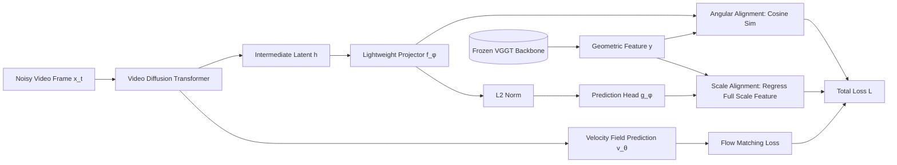

# Geometry Forcing: Marrying Video Diffusion and 3D Representation for Consistent World Modeling

**Conference**: ICLR 2026  
**OpenReview**: [https://openreview.net/forum?id=ULXYZCms41](https://openreview.net/forum?id=ULXYZCms41)  
**Code**: [https://GeometryForcing.github.io](https://GeometryForcing.github.io)  
**Area**: Video Generation / World Models / 3D Representation Alignment  
**Keywords**: Video Diffusion, Representation Alignment, 3D Foundation Models, VGGT, World Models, Geometric Consistency  

## TL;DR
By aligning the intermediate features of a video diffusion model to the geometric representations of the 3D foundation model VGGT (using decoupled angular and scale alignment objectives), the diffusion model trained on pure video data "internalizes" 3D structures. This significantly improves geometric and temporal consistency in long-term video generation and enables the extraction of explicit 3D geometry during inference.

## Background & Motivation
**Background**: Video diffusion models have become the mainstream approach for world models, capable of simulating the world directly from large-scale video data and generating realistic images controlled by camera trajectories or action signals. However, these models essentially model frame distributions only in 2D pixel space.

**Limitations of Prior Work**: Videos are 2D projections of a dynamic 3D world, a fundamental property ignored by pure pixel-based modeling. The authors conducted a probing experiment: by freezing a pretrained video diffusion model (DFoT) and training a DPT depth prediction head on its intermediate features, they found that these features **could barely reconstruct any meaningful geometric structure**. This suggests that relying solely on raw video data does not allow the model to implicitly learn 3D information, leading to geometric drift, error accumulation in autoregressive long-term generation, and an inability to return to the initial perspective after a 360° rotation.

**Key Challenge**: The most direct way to supplement 3D information is to model RGB and geometry (e.g., point maps) jointly end-to-end. However, this heavily relies on scarce 3D annotations, undermining the scalability and generalization of video data. Injecting geometric priors **without introducing explicit 3D supervision or changing the video training paradigm** is the core difficulty.

**Goal**: To enable video diffusion models to naturally internalize 3D representations during training, preserving the scalability of pure video training while gaining geometric consistency.

**Core Idea**: Inspired by REPA (Representation Alignment) in image diffusion, the authors propose **Geometry Forcing**. This involves aligning the intermediate latent states of the diffusion model with the geometric features of the pretrained **3D foundation model VGGT**. Structural supervision at the representation level replaces explicit 3D labels, and alignment is decoupled into two objectives—**angular (direction)** and **scale**—to stabilize training.

## Method

### Overall Architecture
Geometry Forcing is built upon an autoregressive video diffusion model (Flow Matching + Transformer backbone, per-frame independent noise). During training, the latent state $h$ of a specific intermediate layer is mapped via a lightweight projector and aligned with the geometric features $y$ output by the VGGT backbone. Alignment is achieved through two complementary losses optimized alongside the original Flow Matching loss. VGGT serves only as a frozen "geometric teacher" providing supervision signals and is not required during inference. However, the aligned features can be used by a geometry head to derive explicit depth or point clouds.

### Key Designs

**1. Angular Alignment: Aligning "Geometric Direction" first.** The intermediate features $y \in \mathbb{R}^{L\times N\times P\times D}$ (layers × frames × patches × dimension) of the VGGT backbone retain both local and global information for each frame and are sufficient to reconstruct various explicit geometries. The authors use a lightweight projector $f_\phi$ to map the diffusion latent $h\in\mathbb{R}^{N\times P'\times D'}$ to the shape of $y$, then maximize point-wise cosine similarity at the frame and patch levels:

$$\mathcal{L}_{\text{Angular}} = -\frac{1}{LNP}\sum_{\ell=1}^{L}\sum_{n=1}^{N}\sum_{p=1}^{P} \cos\big(y_{\ell,n,p},\, f_\phi(h_{n,p})\big)$$

Since the VGGT backbone includes cross-frame attention, global consistency is already implicit in $y$. Therefore, no additional cross-frame constraints are enforced in the loss; alignment is performed per frame and per patch.

**2. Scale Alignment: Restoring "Magnitude Information" while avoiding collapse.** Angular alignment only considers direction and discards feature magnitude, which also encodes geometric information. Directly using MSE to supervise the magnitude of $h$ and $y$ causes optimization instability and model collapse due to inherent scale differences (MSE caused FVD to jump to 1648 in ablations). The authors decouple magnitude supervision: the projected features are first normalized to unit length $\hat{h}=f_\phi(h)/\|f_\phi(h)\|_2$, and then another lightweight prediction head $g_\phi$ regresses the **full-scale target features** from the normalized input:

$$\mathcal{L}_{\text{Scale}} = \frac{1}{LNP}\sum_{\ell=1}^{L}\sum_{n=1}^{N}\sum_{p=1}^{P} \big\|\, g_\phi(\hat{h}_{\ell,n,p}) - y_{\ell,n,p}\,\big\|_2^2$$

This prevents the diffusion features' own magnitudes from being forcibly distorted (avoiding downstream layer collapse) while scale information is learned through an independent head.

**3. Joint Training Objectives and "Free" Explicit Geometry.** The total loss adds geometric alignment as a regularization term to the original diffusion loss: $\mathcal{L} = \mathcal{L}_{\text{FM}} + \lambda_{\text{Angular}}\mathcal{L}_{\text{Angular}} + \lambda_{\text{Scale}}\mathcal{L}_{\text{Scale}}$ (experiments use $\lambda_{\text{Angular}}=0.5, \lambda_{\text{Scale}}=0.05$). This design requires no 3D labels and can be applied to any autoregressive video diffusion model. A side benefit is that since intermediate features are aligned with VGGT features, a geometry head can **derive explicit 3D geometry** from them during inference, unifying video and 4D generation and providing an interpretable "structured memory" for long-term modeling.

**4. Mid-layer Alignment Position.** Ablations (Fig. 3) show that aligning the **middle layers** of the diffusion model yields the most significant improvements in video quality. Features that are too shallow lack sufficient geometric information, while features that are too deep are too close to the generation head, causing constraints to interfere with generation.

## Key Experimental Results
Two tasks: **Camera-conditioned** generation on RealEstate10K (applied to DFoT) and **Action-conditioned** generation on Minecraft (applied to NFD). In addition to standard metrics like FVD/LPIPS/SSIM/PSNR, RPE (Reprojection Error) and RVE (Revisit Error) are used to measure 3D consistency.

### Main Results (RealEstate10K, 256-frame Long-term Generation)

| Method | FVD↓ | LPIPS↓ | SSIM↑ | PSNR↑ | RPE↓ |
|---|---|---|---|---|---|
| Cosmos* | 934 | 0.68 | 0.20 | 10.25 | – |
| DFoT (baseline) | 364 | 0.55 | 0.36 | 11.40 | 0.3575 |
| REPA | 297 | 0.54 | 0.36 | 11.51 | 0.3337 |
| VideoREPA | 455 | 0.56 | 0.35 | 11.50 | 0.3823 |
| **Geometry Forcing** | **243** | **0.51** | **0.38** | 11.87 | 0.3337 |
| **GF + REPA** | **237** | 0.51 | 0.37 | **12.10** | **0.3264** |

In a 16-frame short-term setting, GF reduced FVD from 252 (DFoT) to 193, and GF+REPA further to 179, outperforming REPA (221) and VideoREPA (210). In the action-conditioned task (Minecraft), adding GF to NFD reduced FVD from 216 to 205, verifying generalization to out-of-domain distributions.

### Ablation Study

| Ablation Dimension | Setting | FVD-256↓ |
|---|---|---|
| Alignment Target | Baseline | 364 |
| | DINOv2 (Semantic) | 297 |
| | VGGT (Geometric) | 243 |
| | VGGT + DINOv2 | 237 |
| Alignment Loss | Angular only | 253 |
| | Angular + Scale | 243 |
| | MSE (Naive) | 1648 |
| Geometry Injection | Explicit (ControlNet on rendered maps) | 280 |
| | Implicit Internalization (GF) | 243 |

### Key Findings
- **Geometric Alignment > Semantic Alignment**: Aligning to VGGT (243) is significantly better than DINOv2 (297), proving geometric priors are more beneficial for consistency than 2D semantics; they are orthogonal and can be combined to reach 237.
- **MSE Collapses, Decoupling Stabilizes**: Direct MSE caused FVD to explode to 1648, while angular+scale decoupling converged to 243, validating the Scale Alignment design.
- **Internalization > Explicit Conditioning**: Using the same VGGT features, rendering them as images for ControlNet (280) is inferior to direct feature alignment (243)—internal alignment provides stronger structural supervision.
- **Mitigating Exposure Bias**: In long-term generation, GF's FVD is significantly lower than the baseline after 100 frames, and it successfully returns to the initial perspective after a 360° rotation, which DFoT/REPA/VideoREPA fail to do.

## Highlights & Insights
- **Diagnosis-driven Methodology**: The use of "frozen features + DPT probes" empirically proves the lack of 3D representation in pure video diffusion, making the motivation for "supplementing geometry" very solid.
- **Generalizing REPA from Semantics to Geometry**: REPA uses DINOv2 for semantic alignment; this paper switches to VGGT for geometric alignment and notes their orthogonality—a clean paradigm shift.
- **Angular/Scale Decoupling as the Technical Core**: Identifying that "direct MSE collapses due to scale differences" and bypassing it with normalization + independent scale prediction is key to the method's success.
- **Training as Regulation, Inference as Geometry**: GF acts as a regularization term without changing the backbone or requiring 3D labels; it is plug-and-play for DFoT/NFD and enables explicit 3D inference as a byproduct.

## Limitations & Future Work
- **Dependency on 3D Foundation Model Quality**: Geometric supervision comes entirely from VGGT. Errors in VGGT’s estimates on dynamic, non-rigid, or extreme domains (e.g., the distribution gap between Minecraft and the real world) will propagate.
- **Small Training Scale**: Experiments were validated on small-scale fine-tuning (2000–2500 steps, 8×A100). Effectiveness in large-scale pre-training from scratch remains to be seen.
- **Geometric Memory Implementation**: While the paper emphasizes "explicit geometry → structured memory → long-term world modeling," the actual based memory mechanism is left for future work.
- **Hyperparameter Sensitivity**: $\lambda_{\text{Angular}}/\lambda_{\text{Scale}}$ and the alignment layer position require tuning; robustness across different architectures is not fully discussed.

## Related Work & Insights
- **REPA / VideoREPA**: Ancestors of the representation alignment approach for accelerating diffusion training; this paper swaps the semantic target for a geometric one.
- **Diffusion Forcing / Self Forcing**: Address per-frame noise and exposure bias in autoregressive video diffusion. These are orthogonal to GF; they modify the training paradigm, while GF modifies the representation structure.
- **VGGT and 3D Foundation Models**: Feed-forward models for camera pose/depth/point clouds. They serve as the supervision source, suggesting that "distilling priors from foundation models" is a general way to inject domain knowledge.
- **Joint RGB+Point Map Modeling**: An alternative route for explicit geometry. GF avoids the need for 3D labels through implicit alignment, offering better scalability.
- **Insight**: When a generative model lacks a specific structural capability, "aligning with the intermediate features of a frozen foundation model that possesses that structure" is a low-cost, scalable, and plug-and-play path. Decoupling direction and scale during alignment is a practical trick to avoid feature scale conflicts.

## Rating
- **Novelty**: ⭐⭐⭐⭐ — While transferring REPA to the geometric domain isn't revolutionary, the combination of "angular/scale decoupling" and "diagnostic probes + inference-time geometry extraction" offers clear increments and insights.
- **Experimental Thoroughness**: ⭐⭐⭐⭐ — Two tasks/backbones, multiple metrics including RPE/RVE, and user studies. Ablations cover targets/losses/injection/layers, though scale is limited.
- **Writing Quality**: ⭐⭐⭐⭐⭐ — Motivation is framed by probing experiments, methodology is clear, and the narrative is complete and readable.
- **Value**: ⭐⭐⭐⭐ — Plug-and-play, no 3D labels required, significant improvement for long-term consistency. Great potential for world models and 4D generation.

<!-- RELATED:START -->

## Related Papers

- [\[ICLR 2026\] Vid2World: Crafting Video Diffusion Models to Interactive World Models](vid2world_crafting_video_diffusion_models_to_interactive_world_models.md)
- [\[CVPR 2026\] WorldReel: 4D Video Generation with Consistent Geometry and Motion Modeling](../../CVPR2026/video_generation/worldreel_4d_video_generation_with_consistent_geometry_and_motion_modeling.md)
- [\[CVPR 2025\] World-Consistent Video Diffusion with Explicit 3D Modeling](../../CVPR2025/video_generation/world-consistent_video_diffusion_with_explicit_3d_modeling.md)
- [\[ICLR 2026\] NeRV-Diffusion: Diffuse Implicit Neural Representation for Video Synthesis](nerv-diffusion_diffuse_implicit_neural_representation_for_video_synthesis.md)
- [\[ICLR 2026\] MoAlign: Motion-Centric Representation Alignment for Video Diffusion Models](moalign_motion-centric_representation_alignment_for_video_diffusion_models.md)

<!-- RELATED:END -->
